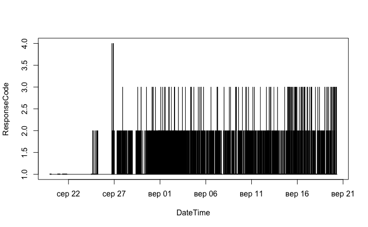
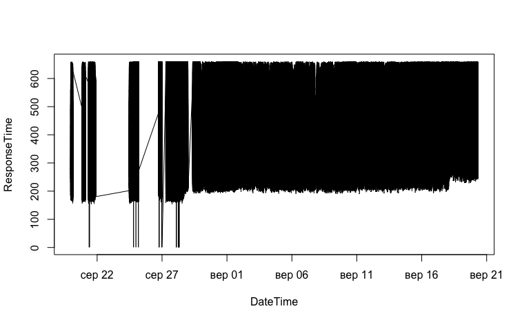
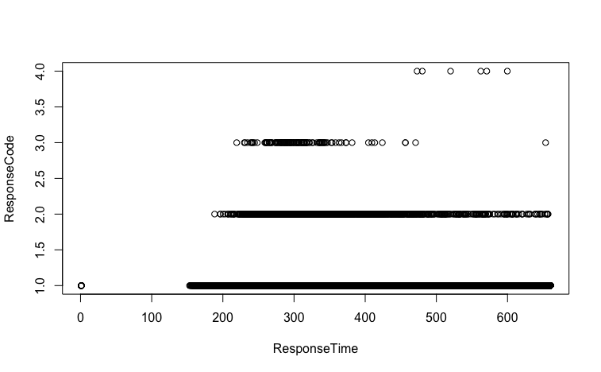
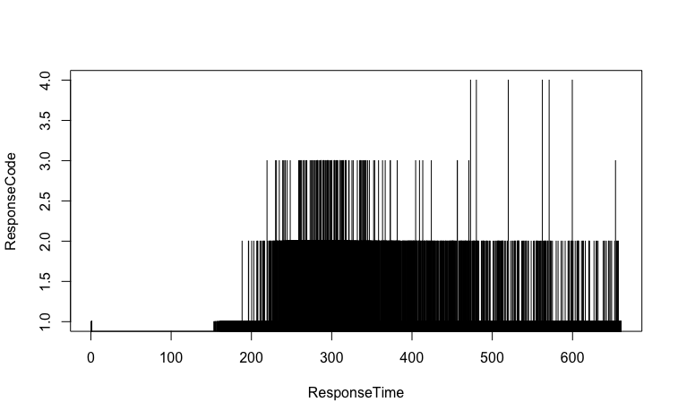

## Набір данних
Набір данних складається з логів сервера що містять час запиту, 
айпі адресу та user Agent користувача та час відповіді сервера.

З даного набору даних можна отримати досить багато корисною інформації, 
наприклад можна отримати інформацію про велику 
затримку в відповіді сервера чи визначити середню кількість запитів яку 
робить користувач за час перебування на сайті. Також з данних даних ми можемо 
визначити хто з користувачів займається надмірним споживанням інформації (парсингом) 


1. Написати R script для завантаження даних в R.
    ```R
    f <- read.csv('ind.csv');
    ```
    ```cmd
    > head(f);
      USER_AGENT RESONSE_CODE            IP           DATE_TIME RESPONSE_TIME
    1          1            1 141.8.142.149 2018-08-19 22:55:21        679.06
    2          2            1  31.131.20.33 2018-08-19 22:55:30        788.00
    3          2            1  31.131.20.33 2018-08-19 22:55:38       1200.41
    4          3            1 66.249.66.152 2018-08-19 22:55:54        561.54
    5          4            1 66.249.66.150 2018-08-19 22:55:59        185.18
    6          3            1 66.249.66.150 2018-08-19 22:56:09        557.30
    ```    
2. Створити Code Book для даних.
    ```
    USER_AGENT
        user agent
            1	Mozilla/5.0 (compatible; YandexBot/3.0; +http://yandex.com/bots)
            2	Empty User Agent value
            3	Mozilla/5.0 (compatible; Googlebot/2.1; +http://www.google.com/bot.html)
            4	Mozilla/5.0 AppleWebKit/537.36 (KHTML, like Gecko; compatible; Googlebot/2.1; +http://www.google.com/bot.html) Safari/537.36
            5	Mozilla/5.0 (compatible; AhrefsBot/5.2; +http://ahrefs.com/robot/)
            6	Mozilla/5.0 (Windows NT 10.0; Win64; x64) AppleWebKit/537.36 (KHTML, like Gecko) Chrome/68.0.3440.106 Safari/537.36
            7	Mozilla/5.0 (iPhone; CPU iPhone OS 11_4_1 like Mac OS X) AppleWebKit/605.1.15 (KHTML, like Gecko) Version/11.0 Mobile/15E148 Safari/604.1
            8	Mozilla/5.0 (compatible; bingbot/2.0; +http://www.bing.com/bingbot.htm)
            9	Mozilla/5.0 (Windows NT 6.1) AppleWebKit/537.36 (KHTML, like Gecko) Chrome/67.0.3396.87 Safari/537.36 OPR/54.0.2952.64
            10	Mozilla/5.0 (Linux; Android 6.0.1; Nexus 5X Build/MMB29P) AppleWebKit/537.36 (KHTML, like Gecko) Chrome/41.0.2272.96 Mobile Safari/537.36 (compatible; Googlebot/2.1; +http://www.google.com/bot.html)
            11	Mozilla/5.0 (Macintosh; Intel Mac OS X 10_14_0) AppleWebKit/537.36 (KHTML, like Gecko) Chrome/68.0.3440.106 Safari/537.36
            12	Mozilla/5.0 (Linux; U; Android 6.0; zh-CN; MZ-m3 note Build/MRA58K) AppleWebKit/537.36 (KHTML, like Gecko) Version/4.0 Chrome/40.0.2214.89 MZBrowser/7.1.110-2018072414 UWS/2.11.0.33 Mobile Safari/537.36
            13	Mozilla/5.0 (compatible; MSIE 9.0; Windows NT 6.1; WOW64; Trident/5.0)
            14	Mozilla/5.0 (Macintosh; Intel Mac OS X 10_11_4) AppleWebKit/537.36 (KHTML, like Gecko) QtWebEngine/5.6.0 Chrome/45.0.2454.101 Safari/537.36
            15	Mozilla/5.0 (Linux; Android 7.1.1; Lenovo TB-8504X Build/NMF26F) AppleWebKit/537.36 (KHTML, like Gecko) Chrome/68.0.3440.91 Safari/537.36
            16	Mozilla/5.0 (iPhone; CPU iPhone OS 11_4_1 like Mac OS X) AppleWebKit/604.1.34 (KHTML, like Gecko) CriOS/68.0.3440.83 Mobile/15G77 Safari/604.1
            17	Mozilla/5.0 (Linux; U; Android 6.0.1; ru-ru; Redmi 3S Build/MMB29M) AppleWebKit/537.36 (KHTML, like Gecko) Version/4.0 Chrome/61.0.3163.128 Mobile Safari/537.36 XiaoMi/MiuiBrowser/9.8.3
            18	Mozilla/5.0 (Windows NT 6.1; rv:55.0) Gecko/20100101 Firefox/55.0
            19	Mozilla/5.0 (Windows NT 6.1; WOW64; rv:56.0) Gecko/20100101 Firefox/56.0
            20	Mozilla/5.0 (Windows NT 6.1; WOW64; rv:56.0) Gecko/20100101 Firefox/56.0
            21	Mozilla/5.0 (Windows NT 6.1; WOW64; rv:56.0) Gecko/20100101 Firefox/56.0
            22	Mozilla/5.0 (Windows NT 6.1; WOW64; rv:56.0) Gecko/20100101 Firefox/56.0
            23	Mozilla/5.0 (Windows NT 6.1; WOW64; rv:56.0) Gecko/20100101 Firefox/56.0
            24	Mozilla/5.0 (Windows NT 6.1; WOW64; rv:56.0) Gecko/20100101 Firefox/56.0
            25	Mozilla/5.0 (compatible; YandexMetrika/2.0; +http://yandex.com/bots yabs01)
            26	Mozilla/5.0 (iPhone; CPU iPhone OS 9_3_2 like Mac OS X) AppleWebKit/601.1.46 (KHTML, like Gecko) Version/9.0 Mobile/13F69 Safari/601.1
            27	Mozilla/5.0 (Linux; Android 7.0; F3115 Build/33.3.A.1.97) AppleWebKit/537.36 (KHTML, like Gecko) Chrome/68.0.3440.91 Mobile Safari/537.36
            28	Mozilla/5.0 (compatible; Linux x86_64; Mail.RU_Bot/2.0; +http://go.mail.ru/help/robots)
            29	Mozilla/5.0 (Linux; Android 6.0.1; Redmi 4 Build/MMB29M) AppleWebKit/537.36 (KHTML, like Gecko) Chrome/67.0.3396.87 Mobile Safari/537.36
            30	Mozilla/5.0 (Windows NT 6.3; WOW64; rv:41.0) Gecko/20100101 Firefox/41.0
            31	Mozilla/5.0 (iPhone; CPU iPhone OS 8_1 like Mac OS X) AppleWebKit/600.1.4 (KHTML, like Gecko) Version/8.0 Mobile/12B411 Safari/600.1.4 (compatible; YandexMobileBot/3.0; +http://yandex.com/bots)
            32	Mozilla/5.0 (Linux; Android 6.0; PMT3131_3G Build/MRA58K) AppleWebKit/537.36 (KHTML, like Gecko) Chrome/68.0.3440.91 Safari/537.36
            33	Mozilla/5.0 (compatible; SemrushBot/2~bl; +http://www.semrush.com/bot.html)
            34	Mozilla/5.0 (iPhone; CPU iPhone OS 7_0 like Mac OS X) AppleWebKit/537.51.1 (KHTML, like Gecko) Version/7.0 Mobile/11A465 Safari/9537.53 (compatible; bingbot/2.0; +http://www.bing.com/bingbot.htm)
            35	Mozilla/5.0 (iPhone; CPU iPhone OS 11_4 like Mac OS X) AppleWebKit/605.1.15 (KHTML, like Gecko) Version/11.0 Mobile/15E148 Safari/604.1
            36	facebookexternalhit/1.1 (+http://www.facebook.com/externalhit_uatext.php)
            37	Mozilla/5.0 (Windows NT 10.0; Win64; x64) AppleWebKit/537.36 (KHTML, like Gecko) Chrome/64.0.3282.140 Safari/537.36 Edge/17.17134
            38	Mozilla/5.0 (Linux; Android 6.0; Redmi Note 4 Build/MRA58K) AppleWebKit/537.36 (KHTML, like Gecko) Chrome/68.0.3440.91 Mobile Safari/537.36
            39	Mozilla/5.0 (Windows; U; Windows NT 5.1; ru-RU; rv:1.8.1.13) Gecko/20080311 Firefox/2.0.0.13
            40	Mozilla/5.0 (Windows NT 10.0; Win64; x64) AppleWebKit/537.36 (KHTML, like Gecko) Chrome/67.0.3500.0 Iron Safari/537.36
            41	Mozilla/5.0 (iPad; CPU OS 11_4_1 like Mac OS X) AppleWebKit/605.1.15 (KHTML, like Gecko) Version/11.0 Mobile/15E148 Safari/604.1
            42	Mozilla/5.0 (iPhone; CPU iPhone OS 7_0 like Mac OS X) AppleWebKit/537.51.1 (KHTML, like Gecko) Version/7.0 Mobile/11A465 Safari/9537.53 BingPreview/1.0b
            43	Mozilla/5.0 (Windows NT 6.1; WOW64) AppleWebKit/534+ (KHTML, like Gecko) BingPreview/1.0b
            44	Mozilla/5.0 (iPhone; CPU iPhone OS 11_1_1 like Mac OS X) AppleWebKit/604.3.5 (KHTML, like Gecko) Version/11.0 Mobile/15B150 Safari/604.1
            45	Mozilla/5.0 (Windows NT 8.1; Win64; rv:31.0) Gecko/20100101 Firefox/31.0
            46	Mozilla/5.0 (compatible; DotBot/1.1; http://www.opensiteexplorer.org/dotbot, help@moz.com)
            47	Mozilla/5.0 (Macintosh; Intel Mac OS X 10.11; rv:50.0) Gecko/20100101 Firefox/50.0
            48	Mozilla/5.0 (Macintosh; Intel Mac OS X 10_11_6) AppleWebKit/537.36 (KHTML, like Gecko) Chrome/55.0.2883.95 Safari/537.36
            49	Mozilla/5.0 (Windows NT 10.0; Win64; x64; rv:61.0) Gecko/20100101 Firefox/61.0
            50	Mozilla/5.0 (Windows NT 10.0; WOW64) AppleWebKit/537.36 (KHTML, like Gecko) Chrome/67.0.3396.87 Safari/537.36 OPR/54.0.2952.64 (Edition Campaign 34)
            51	Mozilla/5.0 (Windows NT 10.0; Win64; x64) AppleWebKit/537.36 (KHTML, like Gecko) Chrome/67.0.3396.87 Safari/537.36 OPR/54.0.2952.64
            52	Mozilla/5.0 (Macintosh; Intel Mac OS X 10_13_6) AppleWebKit/605.1.15 (KHTML, like Gecko)
            53	"Mozilla/5.0 (iPhone; CPU iPhone OS 11_0 like Mac OS X) AppleWebKit/604.1.38 (KHTML, like Gecko) Version/11.0 Mobile/15A372 Safari/604.1"
            54	Mozilla/5.0 (iPhone; CPU iPhone OS 10_3_3 like Mac OS X) AppleWebKit/603.3.8 (KHTML, like Gecko) Version/10.0 Mobile/14G60 Safari/602.1
            55	Mozilla/5.0 (Linux; Android 7.0; X20 Build/NRD90M) AppleWebKit/537.36 (KHTML, like Gecko) Chrome/68.0.3440.91 Mobile Safari/537.36
            56	Mozilla/5.0 (Linux; Android 7.0; PRA-LA1 Build/HUAWEIPRA-LA1) AppleWebKit/537.36 (KHTML, like Gecko) Chrome/68.0.3440.91 Mobile Safari/537.36
            57	Mozilla/5.0 (Windows NT 6.1; Win64; x64) AppleWebKit/537.36 (KHTML, like Gecko) Chrome/67.0.3396.87 Safari/537.36 OPR/54.0.2952.71
            58	Mozilla/5.0 (Macintosh; Intel Mac OS X 10_6_8) AppleWebKit/537.36 (KHTML, like Gecko) Chrome/49.0.2623.112 Safari/537.36
            59	Mozilla/5.0 (iPhone; CPU iPhone OS 10_3_1 like Mac OS X) AppleWebKit/603.1.30 (KHTML, like Gecko) Version/10.0 Mobile/14E304 Safari/602.1
            60	Mozilla/5.0 (Windows NT 6.1; Win64; x64; rv:61.0) Gecko/20100101 Firefox/61.0
            61	Mozilla/5.0 (iPhone; CPU iPhone OS 11_4_1 like Mac OS X) AppleWebKit/604.1.34 (KHTML, like Gecko) GSA/56.0.208290612 Mobile/15G77 Safari/604.1
            62	Mozilla/5.0 (Linux; Android 7.1.2; Redmi 4A Build/N2G47H) AppleWebKit/537.36 (KHTML, like Gecko) Chrome/68.0.3440.91 Mobile Safari/537.36
            63	Mozilla/5.0 (Linux; Android 7.0; FRD-L09 Build/HUAWEIFRD-L09) AppleWebKit/537.36 (KHTML, like Gecko) Chrome/68.0.3440.91 Mobile Safari/537.36
            64	Mozilla/5.0 (Linux; Android 7.1.2; Redmi 5 Plus Build/N2G47H) AppleWebKit/537.36 (KHTML, like Gecko) Chrome/68.0.3440.91 Mobile Safari/537.36
            65	Mozilla/5.0 (Linux; Android 6.0.1; MotoG3 Build/MPIS24.107-55-2-17) AppleWebKit/537.36 (KHTML, like Gecko) Chrome/66.0.3359.158 Mobile Safari/537.36
            66	Mozilla/5.0 (Linux; Android 6.0; Lenovo K50a40 Build/MRA58K) AppleWebKit/537.36 (KHTML, like Gecko) Chrome/68.0.3440.91 Mobile Safari/537.36
            67	Mozilla/5.0 (Linux; Android 7.0; SM-G610F Build/NRD90M) AppleWebKit/537.36 (KHTML, like Gecko) Chrome/67.0.3396.87 Mobile Safari/537.36
            68	Mozilla/5.0 (Linux; Android 7.0; AGS-L09 Build/HUAWEIAGS-L09) AppleWebKit/537.36 (KHTML, like Gecko) Chrome/66.0.3359.158 Safari/537.36 OPR/47.1.2249.129326
            69	Mozilla/5.0 (Linux; Android 7.0; Redmi Note 4 Build/NRD90M) AppleWebKit/537.36 (KHTML, like Gecko) Chrome/68.0.3440.91 Mobile Safari/537.36
            70	Mozilla/5.0 (Windows NT 6.3; Win64; x64) AppleWebKit/537.36 (KHTML, like Gecko) Chrome/68.0.3440.106 Safari/537.36
            71	Mozilla/5.0 (Linux; Android 6.0; MEIZU_M5 Build/MRA58K) AppleWebKit/537.36 (KHTML, like Gecko) Chrome/68.0.3440.91 Mobile Safari/537.36
            72	Mozilla/5.0 (Windows NT 6.1; WOW64; rv:40.0) Gecko/20100101 Firefox/40.1
            73	Mozilla/5.0 (Linux; U; Android 6.0; zh-CN; MZ-PRO 6 Build/MRA58K) AppleWebKit/537.36 (KHTML, like Gecko) Version/4.0 Chrome/40.0.2214.89 MZBrowser/7.1.110-2018072414 UWS/2.11.0.33 Mobile Safari/537.36
            74	Mozilla/5.0 (Windows NT 10.0; WOW64; Trident/7.0; Touch; rv:11.0) like Gecko
            75	Mozilla/5.0 (Linux; U; Android 5.1.1; en-US; SM-J320H Build/LMY47V) AppleWebKit/537.36 (KHTML, like Gecko) Version/4.0 Chrome/57.0.2987.108 UCBrowser/12.5.0.1109 Mobile Safari/537.36
            76	Mozilla/5.0 (Windows NT 6.1; WOW64; Trident/7.0; rv:11.0) like Gecko
            77	Mozilla/5.0 (Macintosh; Intel Mac OS X 10_12_6) AppleWebKit/537.36 (KHTML, like Gecko) Chrome/68.0.3440.106 Safari/537.36
            78	Mozilla/5.0 (Linux; Android 6.0.1; E2312 Build/26.3.B.1.33) AppleWebKit/537.36 (KHTML, like Gecko) Chrome/61.0.3163.98 Mobile Safari/537.36
            79	Mozilla/5.0 (Linux; Android 5.1; m3 note Build/LMY47I) AppleWebKit/537.36 (KHTML, like Gecko) Chrome/68.0.3440.70 Mobile Safari/537.36
            80	CCBot/2.0 (https://commoncrawl.org/faq/)
            81	Mozilla/5.0 (Macintosh; Intel Mac OS X 10_14_0) AppleWebKit/537.36 (KHTML, like Gecko) Chrome/67.0.3396.99 Safari/537.36
            82	Mozilla/5.0 (Macintosh; Intel Mac OS X 10_13_6) AppleWebKit/537.36 (KHTML, like Gecko) Chrome/68.0.3440.106 Safari/537.36
            83	Mozilla/5.0 (Macintosh; Intel Mac OS X 10_11_6) AppleWebKit/605.1.15 (KHTML, like Gecko) Version/11.1.2 Safari/605.1.15
            84	Mozilla/5.0 (iPhone; CPU iPhone OS 11_3 like Mac OS X) AppleWebKit/605.1.15 (KHTML, like Gecko) Version/11.0 Mobile/15E148 Safari/604.1
            85	Mozilla/5.0 (Linux; Android 4.4.2; Lenovo S850 Build/KOT49H) AppleWebKit/537.36 (KHTML, like Gecko) Chrome/67.0.3396.87 Mobile Safari/537.36
            86	Mozilla/5.0 (Windows NT 5.1) AppleWebKit/537.36 (KHTML, like Gecko) Chrome/44.0.2403.157 Safari/537.36
            87	Mozilla/5.0 (iPhone; CPU iPhone OS 9_3_5 like Mac OS X) AppleWebKit/601.1.46 (KHTML, like Gecko) Version/9.0 Mobile/13G36 Safari/601.1
            88	Mozilla/5.0 (Linux; Android 8.0.0; SAMSUNG SM-G960F Build/R16NW) AppleWebKit/537.36 (KHTML, like Gecko) SamsungBrowser/7.2 Chrome/59.0.3071.125 Mobile Safari/537.36
            89	Mozilla/5.0 (Macintosh; Intel Mac OS X 10_12_6) AppleWebKit/537.36 (KHTML, like Gecko) Chrome/61.0.3163.100 Safari/537.36
            90	Mozilla/5.0 (Windows NT 6.1) AppleWebKit/537.36 (KHTML, like Gecko) Chrome/66.0.3359.181 Safari/537.36
            91	Mozilla/5.0 (X11; Linux x86_64) AppleWebKit/537.11 (KHTML, like Gecko) Chrome/23.0.1271.64 Safari/537.11
            92	Mozilla/5.0 (X11; Linux x86_64) AppleWebKit/537.36 (KHTML, like Gecko) Chrome/49.0.2623.75 Safari/537.36 Google Favicon
            93	Opera/9.80 (Android; Opera Mini/29.0.2254/111.19; U; uk) Presto/2.12.423 Version/12.16
            94	MT6735_TD/V1 Linux/3.18.19+ Android/6.0 Release/03.03.2015 Browser/AppleWebKit537.36 Chrome/39.0.0.0 Mobile Safari/537.36 System/Android 6.0;
            95	Mozilla/5.0 (Macintosh; Intel Mac OS X 10_10_5) AppleWebKit/537.36 (KHTML, like Gecko) Chrome/45.0.2454.101 Safari/537.36
            96	Mozilla/5.0 (Macintosh; Intel Mac OS X 10_13_6) AppleWebKit/605.1.15 (KHTML, like Gecko) Version/11.1.2 Safari/605.1.15
            97	Mozilla/5.0 (Linux; Android 7.0; SAMSUNG SM-J330F Build/NRD90M) AppleWebKit/537.36 (KHTML, like Gecko) SamsungBrowser/7.2 Chrome/59.0.3071.125 Mobile Safari/537.36
            98	Mozilla/5.0 (Macintosh; Intel Mac OS X 10_14) AppleWebKit/605.1.15 (KHTML, like Gecko) Version/12.0 Safari/605.1.15
            99	Mozilla/5.0 (Linux; U; Android 6.0; zh-CN; MZ-M5 Note Build/MRA58K) AppleWebKit/537.36 (KHTML, like Gecko) Version/4.0 Chrome/40.0.2214.89 MZBrowser/7.1.110-2018072414 UWS/2.11.0.33 Mobile Safari/537.36
            100	Mozilla/5.0 (Windows NT 6.1) AppleWebKit/537.36 (KHTML, like Gecko) Chrome/67.0.3396.79 Safari/537.36
            101	Mozilla/5.0 (iPhone; CPU iPhone OS 11_4_1 like Mac OS X) AppleWebKit/604.1.34 (KHTML, like Gecko) GSA/54.0.204505792 Mobile/15G77 Safari/604.1
            102	Mozilla/5.0 (Windows NT 10.0; WOW64) AppleWebKit/537.36 (KHTML, like Gecko) Chrome/61.0.3163.69 Freeu/61.0.3163.69 MRCHROME SOC Safari/537.36
            103	Mozilla/5.0 (Windows NT 6.1; Win64; x64) AppleWebKit/537.36 (KHTML, like Gecko) Chrome/68.0.3440.106 Safari/537.36
            104	Mozilla/5.0 (Linux; Android 5.1.1; Lenovo A6020a40 Build/LMY47V) AppleWebKit/537.36 (KHTML, like Gecko) Chrome/68.0.3440.91 Mobile Safari/537.36
            105	Mozilla/5.0 (Linux; Android 7.0; SAMSUNG SM-G570F Build/NRD90M) AppleWebKit/537.36 (KHTML, like Gecko) SamsungBrowser/7.2 Chrome/59.0.3071.125 Mobile Safari/537.36
            106	Mozilla/5.0 (Macintosh; Intel Mac OS X 10_13_5) AppleWebKit/537.36 (KHTML, like Gecko) Chrome/68.0.3440.106 Safari/537.36
            107	Mozilla/5.0 (Windows NT 6.1) AppleWebKit/537.36 (KHTML, like Gecko) Chrome/68.0.3440.106 Safari/537.36
            108	Mozilla/5.0 (Linux; Android 5.0.2; Lenovo Vibe Z2 Build/LRX22G) AppleWebKit/537.36 (KHTML, like Gecko) Chrome/67.0.3396.103 YaBrowser/18.7.0.823.00 Mobile Safari/537.36
            109	Mozilla/5.0 (Windows NT 6.1; Win64; x64) AppleWebKit/537.36 (KHTML, like Gecko) Chrome/67.0.3396.99 Safari/537.36
            110	Mozilla/5.0 (Linux; Android 5.0.2; HTC One Build/LRX22G) AppleWebKit/537.36 (KHTML, like Gecko) Chrome/68.0.3440.91 Mobile Safari/537.36
            111	Mozilla/5.0 (Windows NT 6.2) AppleWebKit/537.36 (KHTML, like Gecko) Chrome/68.0.3440.106 Safari/537.36
            112	TelegramBot (like TwitterBot)
            113	Mozilla/5.0 (Windows NT 6.3; WOW64) AppleWebKit/537.36 (KHTML, like Gecko) Chrome/67.0.3396.87 Safari/537.36 OPR/54.0.2952.71
            114	Mozilla/5.0 (Linux x86_64; rv:52.0) Gecko/20100101 Firefox/52.0
            115	Mozilla/5.0 (iPhone; CPU iPhone OS 11_2 like Mac OS X) AppleWebKit/604.4.7 (KHTML, like Gecko) Version/11.0 Mobile/15C114 Safari/604.1
            116	Mozilla/5.0 (Linux; Android 6.0; FS454 Build/MRA58K) AppleWebKit/537.36 (KHTML, like Gecko) Chrome/50.0.2661.89 Mobile Safari/537.36
            117	Mozilla/5.0 (Linux; Android 8.0.0; G8142 Build/47.1.A.12.235) AppleWebKit/537.36 (KHTML, like Gecko) Chrome/68.0.3440.91 Mobile Safari/537.36
            118	Mozilla/5.0 (Windows NT 5.1) AppleWebKit/537.36 (KHTML, like Gecko) Chrome/49.0.2623.112 Safari/537.36
            119	Mozilla/5.0 (Macintosh; Intel Mac OS X 10_11_6) AppleWebKit/537.36 (KHTML, like Gecko) Chrome/68.0.3440.106 Safari/537.36
            120	Mozilla/5.0 (Linux; Android 8.0.0; MI 6 Build/OPR1.170623.027) AppleWebKit/537.36 (KHTML, like Gecko) Chrome/68.0.3440.91 Mobile Safari/537.36
            121	Mozilla/5.0 (Linux; Android 7.1.2; Redmi 4X Build/N2G47H) AppleWebKit/537.36 (KHTML, like Gecko) Chrome/67.0.3396.87 Mobile Safari/537.36
            122	Mozilla/5.0 (Windows NT 10.0; WOW64) AppleWebKit/537.36 (KHTML, like Gecko) Chrome/67.0.3396.103 YaBrowser/18.7.0.2695 Yowser/2.5 Safari/537.36
            123	Mozilla/5.0 (Linux; Android 7.0; SLA-L22 Build/HUAWEISLA-L22) AppleWebKit/537.36 (KHTML, like Gecko) Chrome/65.0.3325.109 Mobile Safari/537.36
            124	Mozilla/5.0 (X11; Linux x86_64; rv:38.0) Gecko/20100101 Firefox/38.0
            125	Mozilla/5.0 (Linux; Android 4.4.4; Lenovo P70-A Build/KOT49H) AppleWebKit/537.36 (KHTML, like Gecko) Chrome/68.0.3440.91 Mobile Safari/537.36
            126	Mozilla/5.0 (iPhone; CPU iPhone OS 11_2_1 like Mac OS X) AppleWebKit/604.4.7 (KHTML, like Gecko) Version/11.0 Mobile/15C153 Safari/604.1
            127	Mozilla/5.0 (Windows NT 6.1; Win64; x64) AppleWebKit/537.36 (KHTML, like Gecko) Chrome/67.0.3396.87 Safari/537.36 OPR/54.0.2952.64
            128	Mozilla/5.0 (Windows NT 6.3; WOW64) AppleWebKit/537.36 (KHTML, like Gecko) Chrome/46.0.2490.71 Safari/537.36
            129	Mozilla/5.0 (compatible; MSIE 10.0; Windows NT 5.1; Trident/6.0)
            130	Mozilla/5.0 (Windows NT 10.0; WOW64) AppleWebKit/537.36 (KHTML, like Gecko) Chrome/53.0.2785.116 Safari/537.36
            131	Mozilla/5.0 (Windows NT 10.0; Win64; x64) AppleWebKit/537.36 (KHTML, like Gecko) Chrome/61.0.3163.71 Safari/537.36
            132	Mozilla/5.0 (Linux; Android 7.1.2; Redmi 4X Build/N2G47H) AppleWebKit/537.36 (KHTML, like Gecko) Chrome/66.0.3359.158 Mobile Safari/537.36
            133	Mozilla/5.0 (Windows NT 10.0; Win64; x64) AppleWebKit/537.36 (KHTML, like Gecko) Chrome/67.0.3396.87 Safari/537.36 OPR/54.0.2952.71
            134	Mozilla/5.0 (Windows NT 10.0; Win64; x64) AppleWebKit/537.36 (KHTML, like Gecko) Chrome/61.0.3163.100 Safari/537.36
            135	Mozilla/5.0 (Linux; U; Android 4.4.2; ru-ru; SM-T311 Build/KOT49H) AppleWebKit/534.30 (KHTML, like Gecko) Version/4.0 Safari/534.30
            136	Mozilla/5.0 (Windows NT 10.0; Win64; x64) AppleWebKit/537.36 (KHTML, like Gecko) Chrome/68.0.3440.106 Safari/537.36 OPR/55.0.2994.37
            137	Mozilla/5.0 (Linux; Android 4.2.2; C2305 Build/16.0.B.2.16) AppleWebKit/537.36 (KHTML, like Gecko) Chrome/52.0.2743.98 Mobile Safari/537.36
            138	Mozilla/5.0 (Linux; Android 8.0.0; LLD-AL10 Build/HONORLLD-AL10) AppleWebKit/537.36 (KHTML, like Gecko) Chrome/68.0.3440.91 Mobile Safari/537.36
            139	Mozilla/5.0 (Linux; U; Android 6.0.1; en-us; Redmi 4 Build/MMB29M) AppleWebKit/537.36 (KHTML, like Gecko) Version/4.0 Chrome/53.0.2785.146 Mobile Safari/537.36 XiaoMi/MiuiBrowser/9.5.6
            140	Mozilla/5.0 (Macintosh; Intel Mac OS X 10_12_6) AppleWebKit/537.36 (KHTML, like Gecko) Chrome/68.0.3440.84 Safari/537.36
            141	Mozilla/5.0 (Linux; Android 6.0; LG-H818 Build/MRA58K) AppleWebKit/537.36 (KHTML, like Gecko) Chrome/67.0.3396.68 Mobile Safari/537.36
            142	Mozilla/5.0 (Macintosh; Intel Mac OS X 10_8_5) AppleWebKit/600.6.3 (KHTML, like Gecko) Version/6.2.6 Safari/537.85.15
            143	Mozilla/5.0 (X11; Linux x86_64) AppleWebKit/537.36 (KHTML, like Gecko) Ubuntu Chromium/68.0.3440.75 Chrome/68.0.3440.75 Safari/537.36
            144	Mozilla/5.0 (Macintosh; Intel Mac OS X 10_13_5) AppleWebKit/605.1.15 (KHTML, like Gecko) Version/11.1.1 Safari/605.1.15
            145	Mozilla/5.0 (Macintosh; Intel Mac OS X 10_13_5) AppleWebKit/605.1.15 (KHTML, like Gecko) Version/11.1.1 Safari/605.1.15
            146	Mozilla/5.0 (Macintosh; Intel Mac OS X 10_13_5) AppleWebKit/605.1.15 (KHTML, like Gecko) Version/11.1.1 Safari/605.1.15
            147	Mozilla/5.0 (Macintosh; Intel Mac OS X 10_13_5) AppleWebKit/605.1.15 (KHTML, like Gecko) Version/11.1.1 Safari/605.1.15
            148	Mozilla/5.0 (Macintosh; Intel Mac OS X 10_13_5) AppleWebKit/605.1.15 (KHTML, like Gecko) Version/11.1.1 Safari/605.1.15
            149	Mozilla/5.0 (Macintosh; Intel Mac OS X 10_13_5) AppleWebKit/605.1.15 (KHTML, like Gecko) Version/11.1.1 Safari/605.1.15
            150	Mozilla/5.0 (Linux; Android 5.1; HUAWEI TIT-U02 Build/HUAWEITIT-U02) AppleWebKit/537.36 (KHTML, like Gecko) Chrome/67.0.3396.68 Mobile Safari/537.36
            151	Mozilla/5.0 (Linux; Android 5.1; HUAWEI TIT-U02 Build/HUAWEITIT-U02) AppleWebKit/537.36 (KHTML, like Gecko) Chrome/67.0.3396.68 Mobile Safari/537.36
            152	Mozilla/5.0 (Linux; Android 5.1; HUAWEI TIT-U02 Build/HUAWEITIT-U02) AppleWebKit/537.36 (KHTML, like Gecko) Chrome/67.0.3396.68 Mobile Safari/537.36
            153	Mozilla/5.0 (Linux; Android 5.1; HUAWEI TIT-U02 Build/HUAWEITIT-U02) AppleWebKit/537.36 (KHTML, like Gecko) Chrome/67.0.3396.68 Mobile Safari/537.36
            154	Mozilla/5.0 (Linux; Android 5.1; HUAWEI TIT-U02 Build/HUAWEITIT-U02) AppleWebKit/537.36 (KHTML, like Gecko) Chrome/67.0.3396.68 Mobile Safari/537.36
            155	Mozilla/5.0 (Linux; Android 6.0; U20 Build/MRA58K) AppleWebKit/537.36 (KHTML, like Gecko) Chrome/68.0.3440.91 Mobile Safari/537.36
            156	Mozilla/5.0 (Linux; Android 6.0; U20 Build/MRA58K) AppleWebKit/537.36 (KHTML, like Gecko) Chrome/68.0.3440.91 Mobile Safari/537.36
            157	Mozilla/5.0 (Linux; Android 6.0; U20 Build/MRA58K) AppleWebKit/537.36 (KHTML, like Gecko) Chrome/68.0.3440.91 Mobile Safari/537.36
            158	Mozilla/5.0 (Linux; Android 6.0; U20 Build/MRA58K) AppleWebKit/537.36 (KHTML, like Gecko) Chrome/68.0.3440.91 Mobile Safari/537.36
            159	Mozilla/5.0 (compatible; YandexMetrika/2.0; +http://yandex.com/bots)
            160	Mozilla/5.0 (Android 5.0.2; Mobile; rv:61.0) Gecko/61.0 Firefox/61.0
            161	Mozilla/5.0 (iPad; CPU OS 11_4_1 like Mac OS X) AppleWebKit/604.1.34 (KHTML, like Gecko) CriOS/68.0.3440.83 Mobile/15G77 Safari/604.1
            162	Mozilla/5.0 (iPad; CPU OS 5_1 like Mac OS X) AppleWebKit/534.46 (KHTML, like Gecko) Version/5.1 Mobile/9B176 Safari/7534.48.3
            163	Mozilla/5.0 (iPhone; CPU iPhone OS 11_3_1 like Mac OS X) AppleWebKit/604.1.34 (KHTML, like Gecko) GSA/56.0.208290612 Mobile/15E302 Safari/604.1
            164	Mozilla/5.0 (Linux; Android 6.0; MI 5 Build/MRA58K) AppleWebKit/537.36 (KHTML, like Gecko) Chrome/66.0.3359.158 Mobile Safari/537.36 OPR/47.1.2249.129326
            165	Mozilla/5.0 (Windows NT 6.1; WOW64) AppleWebKit/537.36 (KHTML, like Gecko) Chrome/67.0.3396.87 Safari/537.36 OPR/54.0.2952.71
            166	Mozilla/5.0 (Linux; Android 4.4.4; ru-ru; SAMSUNG GT-I9300I Build/KTU84P) AppleWebKit/537.36 (KHTML, like Gecko) Version/1.5 Chrome/28.0.1500.94 Mobile Safari/537.36
            167	Mozilla/5.0 (compatible; linkdexbot/2.2; +http://www.linkdex.com/bots/)
            168	Mozilla/5.0 (Linux; Android 8.1.0; Redmi Note 5 Build/OPM1.171019.011) AppleWebKit/537.36 (KHTML, like Gecko) Chrome/68.0.3440.85 Mobile Safari/537.36
            169	Mozilla/5.0 (Windows NT 10.0; Win64; x64; rv:56.0) Gecko/20100101 Firefox/56.0
            170	Mozilla/5.0 (Linux; Android 7.1.1; MI MAX 2 Build/NMF26F) AppleWebKit/537.36 (KHTML, like Gecko) Chrome/66.0.3359.126 Mobile Safari/537.36
            171	Mozilla/5.0 (Windows NT 6.1; WOW64) SkypeUriPreview Preview/0.5
            172	Mozilla/5.0 (Macintosh; Intel Mac OS X 10_12_6) AppleWebKit/603.3.8 (KHTML, like Gecko) Version/10.1.2 Safari/603.3.8
            173	Mozilla/5.0 (Linux; Android 7.0; SAMSUNG SM-J730FM Build/NRD90M) AppleWebKit/537.36 (KHTML, like Gecko) SamsungBrowser/7.2 Chrome/59.0.3071.125 Mobile Safari/537.36
            174	Mozilla/5.0 (Linux; Android 8.0.0; LG-H870DS Build/OPR1.170623.032) AppleWebKit/537.36 (KHTML, like Gecko) Chrome/68.0.3440.91 Mobile Safari/537.36
            175	Mozilla/5.0 (Linux; Android 8.1.0; Build/OPM1.171019.011) AppleWebKit/537.36 (KHTML, like Gecko) SamsungBrowser/7.2 Chrome/59.0.3071.125 Mobile Safari/537.36
            176	Mozilla/5.0 (Linux; Android 8.1.0; Build/OPM1.171019.011) AppleWebKit/537.36 (KHTML, like Gecko) SamsungBrowser/7.2 Chrome/59.0.3071.125 Mobile Safari/537.36
            177	Mozilla/5.0 (Linux; Android 8.1.0; Build/OPM1.171019.011) AppleWebKit/537.36 (KHTML, like Gecko) SamsungBrowser/7.2 Chrome/59.0.3071.125 Mobile Safari/537.36
            178	Mozilla/5.0 (Linux; Android 8.1.0; Build/OPM1.171019.011) AppleWebKit/537.36 (KHTML, like Gecko) SamsungBrowser/7.2 Chrome/59.0.3071.125 Mobile Safari/537.36
            179	Mozilla/5.0 (Linux; Android 8.1.0; Build/OPM1.171019.011) AppleWebKit/537.36 (KHTML, like Gecko) SamsungBrowser/7.2 Chrome/59.0.3071.125 Mobile Safari/537.36
            180	Mozilla/5.0 (Linux; Android 5.0.2; LG-V490 Build/LRX22G) AppleWebKit/537.36 (KHTML, like Gecko) Version/4.0 Chrome/34.0.1847.118 Safari/537.36
            181	Mozilla/5.0 (Linux; Android 6.0.1; MotoG3 Build/MPIS24.107-55-2-17) AppleWebKit/537.36 (KHTML, like Gecko) Chrome/67.0.3396.103 YaBrowser/18.7.0.817.00 Mobile Safari/537.36
            182	Mozilla/5.0 (X11; CrOS x86_64 10575.58.0) AppleWebKit/537.36 (KHTML, like Gecko) Chrome/67.0.3396.99 Safari/537.36
            183	Mozilla/5.0 (iPhone; CPU iPhone OS 12_0 like Mac OS X) AppleWebKit/605.1.15 (KHTML, like Gecko) Version/12.0 Mobile/15E148 Safari/604.1
            184	Mozilla/5.0 (X11; Linux x86_64) AppleWebKit/537.36 (KHTML, like Gecko; Google Web Preview) Chrome/41.0.2272.118 Safari/537.36
            185	Mozilla/5.0 (Linux; Android 7.0; SM-A510F Build/NRD90M) AppleWebKit/537.36 (KHTML, like Gecko) Chrome/67.0.3396.87 Mobile Safari/537.36
            186	Mozilla/5.0 (Linux; Android 7.0; SM-J530FM Build/NRD90M) AppleWebKit/537.36 (KHTML, like Gecko) Chrome/68.0.3440.91 Mobile Safari/537.36
            187	Mozilla/5.0 (Linux; U; Android 6.0; zh-CN; MZ-M5s Build/MRA58K) AppleWebKit/537.36 (KHTML, like Gecko) Version/4.0 Chrome/40.0.2214.89 MZBrowser/7.1.110-2018072414 UWS/2.11.0.33 Mobile Safari/537.36
            188	Mozilla/5.0 (iPhone; CPU iPhone OS 11_2_6 like Mac OS X) AppleWebKit/604.5.6 (KHTML, like Gecko) Version/11.0 Mobile/15D100 Safari/604.1
            189	Mozilla/5.0 (Macintosh; Intel Mac OS X 10.13; rv:61.0) Gecko/20100101 Firefox/61.0
            190	Mozilla/5.0 (Windows NT 6.1; Win64; x64) AppleWebKit/537.36 (KHTML, like Gecko) Chrome/68.0.3440.84 Safari/537.36
            191	Mozilla/5.0 (Linux; Android 7.1.2; M6 Note Build/N2G47H) AppleWebKit/537.36 (KHTML, like Gecko) Chrome/68.0.3440.91 Mobile Safari/537.36
            192	Mozilla/5.0 (Windows NT 10.0) AppleWebKit/537.36 (KHTML, like Gecko) Chrome/68.0.3440.106 Safari/537.36
            193	Mozilla/4.0 (compatible; MSIE 8.0; Windows NT 6.1; WOW64; Trident/4.0; SLCC2; .NET CLR 2.0.50727; .NET CLR 3.5.30729; .NET CLR 3.0.30729; Media Center PC 6.0)
            194	Mozilla/5.0 (Windows NT 6.3) AppleWebKit/537.36 (KHTML, like Gecko) Chrome/67.0.3396.103 YaBrowser/18.7.0.2695 Yowser/2.5 Safari/537.36
            195	Mozilla/5.0 (Macintosh; Intel Mac OS X 10_10_1) AppleWebKit/600.2.5 (KHTML, like Gecko) Version/8.0.2 Safari/600.2.5 (Applebot/0.1; +http://www.apple.com/go/applebot)
            196	Mozilla/5.0 (Windows NT 6.1; Win64; x64) AppleWebKit/537.36 (KHTML, like Gecko) Chrome/65.0.3325.162 Safari/537.36
            197	Mozilla/5.0 (Linux; Android 4.4.4; Lenovo K30-T Build/KTU84P) AppleWebKit/537.36 (KHTML, like Gecko) Chrome/67.0.3396.103 YaBrowser/18.7.0.823.00 Mobile Safari/537.36
            198	Mozilla/5.0 (Windows NT 6.1) AppleWebKit/537.36 (KHTML, like Gecko) Chrome/53.0.2785.21 Safari/537.36
            199	Mozilla/5.0 (Windows NT 6.1; Trident/7.0; rv:11.0) like Gecko
            200	Mozilla/5.0 (Linux; Android 8.0.0; SM-A730F Build/R16NW) AppleWebKit/537.36 (KHTML, like Gecko) Chrome/68.0.3440.91 Mobile Safari/537.36
            201	Mozilla/5.0 (Linux; Android 7.1.1; Moto E (4) Plus Build/NCRS26.58-44-3) AppleWebKit/537.36 (KHTML, like Gecko) Chrome/66.0.3359.126 Mobile Safari/537.36
            202	Mozilla/5.0 (Linux; Android 7.1.2; Redmi 5 Build/N2G47H) AppleWebKit/537.36 (KHTML, like Gecko) Chrome/68.0.3440.91 Mobile Safari/537.36
            203	Mozilla/5.0 (Macintosh; Intel Mac OS X 10_11_6) AppleWebKit/604.5.6 (KHTML, like Gecko) Version/11.0.3 Safari/604.5.6
            204	Mozilla/5.0 (Linux; Android 4.4.2; Lenovo K910L Build/KOT49H) AppleWebKit/537.36 (KHTML, like Gecko) Chrome/68.0.3440.91 Mobile Safari/537.36
            205	Mozilla/5.0 (Windows NT 10.0; WOW64) AppleWebKit/537.36 (KHTML, like Gecko) Chrome/52.0.2768.47 Safari/537.36
            206	Mozilla/5.0 (Windows NT 6.1) AppleWebKit/537.36 (KHTML, like Gecko) Chrome/65.0.3325.181 YaBrowser/18.4.1.871 Yowser/2.5 Safari/537.36
            207	Mozilla/5.0 (iPhone; CPU iPhone OS 11_2_2 like Mac OS X) AppleWebKit/604.4.7 (KHTML, like Gecko) Version/11.0 Mobile/15C202 Safari/604.1
            208	Mozilla/5.0 (Windows NT 6.1; WOW64; rv:38.0) Gecko/20100101 Firefox/38.0
            209	Mozilla/5.0 (Windows NT 10.0; Win64; x64; rv:57.0) Gecko/20100101 Firefox/57.0
            210	Mozilla/5.0 (Linux; Android 7.1.1; SM-J510H Build/NMF26X) AppleWebKit/537.36 (KHTML, like Gecko) Chrome/68.0.3440.91 Mobile Safari/537.36
            211	Mozilla/5.0 (Linux; Android 6.0.1; SGP521 Build/23.5.A.1.291) AppleWebKit/537.36 (KHTML, like Gecko) Chrome/68.0.3440.91 Safari/537.36
            212	Mozilla/5.0 (Macintosh; Intel Mac OS X 10_13_4) AppleWebKit/605.1.15 (KHTML, like Gecko)
            213	Mozilla/5.0 (Linux; U; Android 6.0; zh-CN; MZ-U10 Build/MRA58K) AppleWebKit/537.36 (KHTML, like Gecko) Version/4.0 Chrome/40.0.2214.89 MZBrowser/7.1.110-2018072414 UWS/2.11.0.33 Mobile Safari/537.36
            214	Mozilla/5.0 (Windows NT 6.1; WOW64) AppleWebKit/537.36 (KHTML, like Gecko) Chrome/67.0.3396.103 YaBrowser/18.7.0.2695 Yowser/2.5 Safari/537.36
            215	Mozilla/5.0 (Windows NT 6.1) AppleWebKit/537.36 (KHTML, like Gecko) Chrome/68.0.3440.106 Safari/537.36 OPR/55.0.2994.37
            216	Mozilla/5.0 (Windows NT 10.0; WOW64) AppleWebKit/537.36 (KHTML, like Gecko) Chrome/68.0.3440.106 Safari/537.36 OPR/55.0.2994.44
            217	Mozilla/5.0 (Windows NT 6.1; Win64; x64) AppleWebKit/537.36 (KHTML, like Gecko) Chrome/40.0.2214.85 Safari/537.36
            218	Mozilla/5.0 (Linux; Android 4.4.2; SM-G355H Build/KOT49H) AppleWebKit/537.36 (KHTML, like Gecko) Chrome/68.0.3440.91 Mobile Safari/537.36
            219	Mozilla/5.0 (X11; Linux x86_64) AppleWebKit/537.36 (KHTML, like Gecko) Chrome/61.0.3163.100 Safari/537.36
            220	Mozilla/5.0 (iPhone; CPU iPhone OS 11_4_1 like Mac OS X) AppleWebKit/605.1.15 (KHTML, like Gecko) Mobile/15G77 [FBAN/FBIOS;FBDV/iPhone6,1;FBMD/iPhone;FBSN/iOS;FBSV/11.4.1;FBSS/2;FBCR/Kyivstar;FBID/phone;FBLC/ru_RU;FBOP/5;FBRV/121675074]
            221	Mozilla/5.0 (Windows NT 10.0; WOW64) AppleWebKit/537.36 (KHTML, like Gecko) Chrome/68.0.3440.106 Safari/537.36
            222	Mozilla/5.0 (iPad; CPU OS 11_4 like Mac OS X) AppleWebKit/605.1.15 (KHTML, like Gecko) Version/11.0 Mobile/15E148 Safari/604.1
            223	Mozilla/5.0 (Macintosh; Intel Mac OS X 10_13_4) AppleWebKit/605.1.15 (KHTML, like Gecko) Version/11.1 Safari/605.1.15
            224	Mozilla/5.0 (iPhone; CPU iPhone OS 12_0 like Mac OS X) AppleWebKit/604.1.34 (KHTML, like Gecko) CriOS/68.0.3440.83 Mobile/16A5362a Safari/604.1
            225	Mozilla/5.0 (X11; Linux x86_64) AppleWebKit/537.36 (KHTML, like Gecko) Chrome/65.0.3325.181 Safari/537.36
            226	Mozilla/5.0 (Linux; Android 8.0.0; SAMSUNG SM-J600F Build/R16NW) AppleWebKit/537.36 (KHTML, like Gecko) SamsungBrowser/7.2 Chrome/59.0.3071.125 Mobile Safari/537.36
            227	Mozilla/5.0 (Windows NT 6.1; Win64; x64; rv:55.0) Gecko/20100101 Firefox/55.0
            228	Mozilla/5.0 (Macintosh; Intel Mac OS X 10_13_2) AppleWebKit/604.4.7 (KHTML, like Gecko) Version/11.0.2 Safari/604.4.7
            229	Mozilla/5.0 (Linux; Android 7.0; MEIZU M6 Build/NRD90M) AppleWebKit/537.36 (KHTML, like Gecko) Chrome/68.0.3440.91 Mobile Safari/537.36
            230	Mozilla/5.0 (Windows NT 6.1; Win64; x64; rv:25.0) Gecko/20100101 Firefox/29.0
            231	Mozilla/5.0 (Macintosh; Intel Mac OS X 10_12_6) AppleWebKit/605.1.15 (KHTML, like Gecko) Version/11.1.1 Safari/605.1.15
            232	Mozilla/5.0 (Windows NT 6.1; Win64; x64; Trident/7.0; rv:11.0) like Gecko
            233	Mozilla/5.0 (compatible; Baiduspider/2.0; +http://www.baidu.com/search/spider.html)
            234	Mozilla/5.0 (Windows NT 6.1; WOW64) AppleWebKit/537.36 (KHTML, like Gecko) Chrome/67.0.3396.87 Safari/537.36 OPR/54.0.2952.64
            235	Mozilla/5.0 (Windows NT 6.1; WOW64) AppleWebKit/537.36 (KHTML, like Gecko) Chrome/67.0.3396.87 Safari/537.36 OPR/54.0.2952.64
            236	Mozilla/5.0 (Linux; Android 8.0.0; SM-A320F Build/R16NW) AppleWebKit/537.36 (KHTML, like Gecko) Chrome/68.0.3440.91 Mobile Safari/537.36
            237	Mozilla/5.0 (Linux; U; Android 6.0; zh-CN; MZ-M3s Build/MRA58K) AppleWebKit/537.36 (KHTML, like Gecko) Version/4.0 Chrome/40.0.2214.89 MZBrowser/7.1.110-2018072414 UWS/2.11.0.33 Mobile Safari/537.36
            238	Mozilla/5.0 (iPhone; CPU iPhone OS 12_0 like Mac OS X) AppleWebKit/604.1.34 (KHTML, like Gecko) CriOS/68.0.3440.83 Mobile/16A5364a Safari/604.1
            239	Mozilla/5.0 (Linux; Android 4.2.2; SM-T111 Build/JDQ39) AppleWebKit/537.36 (KHTML, like Gecko) Chrome/68.0.3440.91 Safari/537.36
            240	Mozilla/5.0 (iPhone; CPU iPhone OS 11_4_1 like Mac OS X) AppleWebKit/605.1.15 (KHTML, like Gecko) FxiOS/12.2b11231 Mobile/15G77 Safari/605.1.15
            241	Mozilla/5.0 (iPad; CPU OS 12_0 like Mac OS X) AppleWebKit/604.1.34 (KHTML, like Gecko) CriOS/68.0.3440.83 Mobile/16A5362a Safari/604.1
            242	Mozilla/5.0 (Linux; Android 8.0.0; SM-N950F Build/R16NW) AppleWebKit/537.36 (KHTML, like Gecko) Chrome/68.0.3440.91 Mobile Safari/537.36
            243	Mozilla/5.0 (Linux; Android 5.1; m3 note Build/LMY47I) AppleWebKit/537.36 (KHTML, like Gecko) Chrome/65.0.3325.109 Mobile Safari/537.36
            244	Mozilla/5.0 (compatible; MSIE 10.0; Windows NT 6.2; WOW64; Trident/6.0; Touch; MAARJS)
            245	Mozilla/5.0 (Linux; Android 7.0; SM-G570F Build/NRD90M) AppleWebKit/537.36 (KHTML, like Gecko) Chrome/68.0.3440.91 Mobile Safari/537.36
            246	Mozilla/5.0 (Macintosh; Intel Mac OS X 10_11_6) AppleWebKit/605.1.15 (KHTML, like Gecko) Version/11.1.1 Safari/605.1.15
            247	Mozilla/5.0 (Linux; Android 8.0.0; SM-G950F Build/R16NW) AppleWebKit/537.36 (KHTML, like Gecko) Chrome/68.0.3440.91 Mobile Safari/537.36
            248	Mozilla/5.0 (Linux; Android 4.1.2; GT-I8190N Build/JZO54K) AppleWebKit/537.36 (KHTML, like Gecko) Chrome/68.0.3440.91 Mobile Safari/537.36
            249	Mozilla/5.0 (Linux; Android 5.1.1; SM-J105H Build/LMY47V) AppleWebKit/537.36 (KHTML, like Gecko) Chrome/55.0.2883.91 Mobile Safari/537.36
            250	Mozilla/5.0 (Macintosh; Intel Mac OS X 10_10_1) AppleWebKit/537.36 (KHTML, like Gecko) Chrome/53.0.2799.18 Safari/537.36
            251	Googlebot-Image/1.0
            252	Mozilla/5.0 (Linux; U; Android 7.0; en-US; Redmi Note 4 Build/NRD90M) AppleWebKit/537.36 (KHTML, like Gecko) Version/4.0 Chrome/57.0.2987.108 UCBrowser/12.8.8.1140 Mobile Safari/537.36
            253	Mozilla/5.0 (iPhone; CPU iPhone OS 11_4_1 like Mac OS X) AppleWebKit/605.1.15 (KHTML, like Gecko) Mobile/15G77
            254	Mozilla/5.0 (Linux; Android 6.0; PSP3512DUO Build/MRA58K) AppleWebKit/537.36 (KHTML, like Gecko) Chrome/66.0.3359.158 Mobile Safari/537.36
            255	Mozilla/5.0 (Linux; Android 7.0; SAMSUNG SM-A710F Build/NRD90M) AppleWebKit/537.36 (KHTML, like Gecko) SamsungBrowser/7.2 Chrome/59.0.3071.125 Mobile Safari/537.36
            256	Mozilla/5.0 (Windows NT 6.1) AppleWebKit/537.36 (KHTML, like Gecko) Chrome/52.0.2743.116 Safari/537.36
            257	Mozilla/5.0 (Linux; Android 6.0.1; Redmi 3S Build/MMB29M) AppleWebKit/537.36 (KHTML, like Gecko) Chrome/68.0.3440.91 Mobile Safari/537.36
            258	curl/7.29.0
            259	Mozilla/5.0 (Linux; Android 4.4.2; K010 Build/KOT49H) AppleWebKit/537.36 (KHTML, like Gecko) Chrome/66.0.3359.158 Safari/537.36 OPR/47.2.2249.130418
            260	Mozilla/5.0 (Windows NT 6.3; rv:61.0) Gecko/20100101 Firefox/61.0
            261	Mozilla/5.0 (Linux; Android 8.1.0; Mi A1 Build/OPM1.171019.026) AppleWebKit/537.36 (KHTML, like Gecko) Chrome/66.0.3359.126 Mobile Safari/537.36
            262	Mozilla/4.0 (compatible; MSIE 7.0; Windows NT 5.1; Trident/4.0; .NET CLR 1.1.4322; .NET CLR 1.0.3705; .NET CLR 2.0.50727; .NET CLR 3.0.04506.648; .NET CLR 3.5.21022; .NET CLR 3.0.4506.2152; .NET CLR 3.5.30729)
            263	Mozilla/5.0 (Linux; Android 5.0.2; Lenovo S60-a Build/LRX22G) AppleWebKit/537.36 (KHTML, like Gecko) Chrome/67.0.3396.87 Mobile Safari/537.36
            264	Mozilla/5.0 (X11; Linux i686) AppleWebKit/536.11 (KHTML, like Gecko) Chrome/20.0.1132.47 Safari/536.11
            265	Mozilla/5.0 (Windows NT 10.0; WOW64; Trident/7.0; rv:11.0) like Gecko
            266	Mozilla/5.0 (Macintosh; Intel Mac OS X 10_11_6) AppleWebKit/605.1.15 (KHTML, like Gecko)
            267	Safari/11605.3.8.1 CFNetwork/760.9 Darwin/15.6.0 (x86_64)
            268	Mozilla/5.0 (iPhone; CPU iPhone OS 11_2_5 like Mac OS X) AppleWebKit/604.5.6 (KHTML, like Gecko) Version/11.0 Mobile/15D60 Safari/604.1
            269	Mozilla/5.0 (compatible; MSIE 9.0; Windows NT 6.0; Trident/5.0;  Trident/5.0)
            270	Mozilla/5.0 (compatible; DuckDuckGo-Favicons-Bot/1.0; +http://duckduckgo.com)
            271	Mozilla/5.0 (Linux; Android 8.0.0; SM-G935F Build/R16NW) AppleWebKit/537.36 (KHTML, like Gecko) Chrome/68.0.3440.91 Mobile Safari/537.36
            272	Mozilla/5.0 (Linux; Android 6.0.1; SM-N910H Build/MMB29K) AppleWebKit/537.36 (KHTML, like Gecko) Chrome/68.0.3440.91 Mobile Safari/537.36
            273	Mozilla/5.0 (compatible; ExtLinksBot/1.5; +https://extlinks.com/Bot.html)
            274	Mozilla/5.0 (Windows NT 6.1; rv:57.0) Gecko/20100101 Firefox/57.0
            275	Mozilla/5.0 (Windows NT 6.1; WOW64; rv:45.0) Gecko/20100101 Firefox/45.0
            276	Mozilla/5.0 (iPad; CPU OS 10_3_3 like Mac OS X) AppleWebKit/603.3.8 (KHTML, like Gecko) Version/10.0 Mobile/14G60 Safari/602.1
            277	Mozilla/5.0 (iPad; CPU OS 11_4_1 like Mac OS X) AppleWebKit/605.1.15 (KHTML, like Gecko) Mobile/15G77 [FBAN/FBIOS;FBDV/iPad7,3;FBMD/iPad;FBSN/iOS;FBSV/11.4.1;FBSS/2;FBCR/;FBID/tablet;FBLC/ru_RU;FBOP/5;FBRV/0]
            278	Opera/9.80 (Android; Opera Mini/36.1.2254/111.24; U; ru) Presto/2.12.423 Version/12.16
            279	Mozilla/5.0 (Windows NT 6.1; rv:61.0) Gecko/20100101 Firefox/61.0
            280	Mozilla/5.0 (Linux; Android 4.4.2; IQ4413_Quad Build/KOT49H) AppleWebKit/537.36 (KHTML, like Gecko) Version/4.0 Chrome/30.0.0.0 Mobile Safari/537.36
            281	Mozilla/5.0 (Linux; Android 6.0.1; Redmi 4A Build/MMB29M) AppleWebKit/537.36 (KHTML, like Gecko) Chrome/67.0.3396.87 Mobile Safari/537.36
            282	Mozilla/5.0 (Windows NT 10.0) AppleWebKit/537.36 (KHTML, like Gecko) Chrome/67.0.3396.87 Safari/537.36 OPR/54.0.2952.64
            283	AdsBot-Google-Mobile-Apps
            284	Mozilla/5.0 (Windows NT 6.1; Win64; x64) AppleWebKit/537.36 (KHTML, like Gecko) Chrome/60.0.3112.90 Safari/537.36
            285	Mozilla/5.0 (Windows; U; MSIE 7.0; Windows NT 6.0; en-US)
            286	Mozilla/5.0 (Macintosh; Intel Mac OS X 10.11; rv:45.0) Gecko/20100101 Firefox/45.0
            287	Mozilla/5.0 (Macintosh; Intel Mac OS X 10_13_3) AppleWebKit/537.36 (KHTML, like Gecko) Chrome/68.0.3440.106 Safari/537.36
            288	Mozilla/5.0 (Macintosh; Intel Mac OS X 10_7_4) AppleWebKit/537.36 (KHTML, like Gecko) Chrome/49.0.2623.112 Safari/537.36
            289	teracent-feed-processing
            290	Mozilla/5.0 (Linux; Android 6.0.1; Redmi 3S Build/MMB29M) AppleWebKit/537.36 (KHTML, like Gecko) Chrome/63.0.3239.111 Mobile Safari/537.36
            291	Mozilla/5.0 (Macintosh; Intel Mac OS X 10_13_5) AppleWebKit/537.36 (KHTML, like Gecko) Chrome/67.0.3396.99 Safari/537.36
            292	Mozilla/5.0 (Macintosh; Intel Mac OS X 10_13_2) AppleWebKit/537.36 (KHTML, like Gecko) Chrome/67.0.3396.99 Safari/537.36
            293	Mozilla/5.0 (Linux; Android 8.0.0; SM-J600FN Build/R16NW; wv) AppleWebKit/537.36 (KHTML, like Gecko) Version/4.0 Chrome/68.0.3440.91 Mobile Safari/537.36 Instagram 59.0.0.23.76 Android (26/8.0.0; 320dpi; 720x1384; samsung; SM-J600FN; j6lte; samsungexynos78
            294	Mozilla/5.0 (Linux; Android 8.0.0; SM-J600FN Build/R16NW; wv) AppleWebKit/537.36 (KHTML, like Gecko) Version/4.0 Chrome/68.0.3440.91 Mobile Safari/537.36 Instagram 59.0.0.23.76 Android (26/8.0.0; 320dpi; 720x1384; samsung; SM-J600FN; j6lte; samsungexynos78
            295	Mozilla/5.0 (Windows NT 6.1; WOW64) AppleWebKit/537.36 (KHTML, like Gecko) Chrome/68.0.3440.106 Safari/537.36
            296	Safari/13605.1.33.1.4 CFNetwork/897.15 Darwin/17.5.0 (x86_64)
            297	Mozilla/5.0 (Windows NT 10.0; Win64; x64) AppleWebKit/537.36 (KHTML, like Gecko) Chrome/67.0.3396.87 Safari/537.36 OPR/54.0.2952.60
            298	Mozilla/5.0 (Windows NT 6.1) AppleWebKit/537.36 (KHTML, like Gecko) Chrome/53.0.2785.116 Safari/537.36 OPR/40.0.2308.81 (Edition Yx)
            299	Mozilla/5.0 (Windows NT 10.0; Win64; x64) AppleWebKit/537.36 (KHTML, like Gecko) Chrome/65.0.3325.181 Safari/537.36
            300	Mozilla/5.0 (Windows NT 10.0; WOW64) AppleWebKit/537.36 (KHTML, like Gecko) Chrome/67.0.3396.103 YaBrowser/18.7.1.855 Yowser/2.5 Safari/537.36
            301	Mozilla/5.0 (Windows NT 10.0; Win64; x64) AppleWebKit/537.36 (KHTML, like Gecko) Chrome/67.0.3396.87 Safari/537.36 OPR/54.0.2952.71 (Edition Campaign 34)
            302	Mozilla/5.0 (compatible; MSIE 10.0; Windows NT 6.1; Trident/6.0; MASPJS)
            303	Mozilla/5.0 (compatible; MSIE 10.0; Windows NT 6.2; Trident/6.0; MATMJS)
            304	Mozilla/5.0 (Windows NT 6.1; WOW64; rv:61.0) Gecko/20100101 Firefox/61.0
            305	Mozilla/5.0 (Linux; Android 5.1; HUAWEI LUA-U22 Build/HUAWEILUA-U22) AppleWebKit/537.36 (KHTML, like Gecko) Chrome/60.0.3112.116 Mobile Safari/537.36
            306	Mozilla/5.0 (Linux; Android 5.1; M3s Build/LMY47I) AppleWebKit/537.36 (KHTML, like Gecko) Chrome/68.0.3440.91 Mobile Safari/537.36
            307	Mozilla/5.0 (Linux; U; Android 5.1.1; ru-ru; Mi-4c Build/LMY47V) AppleWebKit/537.36 (KHTML, like Gecko) Version/4.0 Chrome/46.0.2490.85 Mobile Safari/537.36 XiaoMi/MiuiBrowser/2.1.1
            308	Mozilla/5.0 (Linux; Android 4.2.1; en-us; Nexus 5 Build/JOP40D) AppleWebKit/535.19 (KHTML, like Gecko; googleweblight) Chrome/38.0.1025.166 Mobile Safari/535.19
            309	Mozilla/5.0 (Linux; Android 4.2.1; en-us; Nexus 5 Build/JOP40D) AppleWebKit/535.19 (KHTML, like Gecko; googleweblight) Chrome/38.0.1025.166 Mobile Safari/535.19
            310	Mozilla/5.0 (Linux; Android 4.2.1; en-us; Nexus 5 Build/JOP40D) AppleWebKit/535.19 (KHTML, like Gecko; googleweblight) Chrome/38.0.1025.166 Mobile Safari/535.19
            311	Mozilla/5.0 (iPad; CPU OS 9_3_5 like Mac OS X) AppleWebKit/601.1.46 (KHTML, like Gecko) Version/9.0 Mobile/13G36 Safari/601.1
            312	Mozilla/5.0 (iPad; CPU OS 9_3_5 like Mac OS X) AppleWebKit/601.1.46 (KHTML, like Gecko) Version/9.0 Mobile/13G36 Safari/601.1
            313	Mozilla/5.0 (iPad; CPU OS 9_3_5 like Mac OS X) AppleWebKit/601.1.46 (KHTML, like Gecko) Version/9.0 Mobile/13G36 Safari/601.1
            314	Mozilla/5.0 (iPad; CPU OS 9_3_5 like Mac OS X) AppleWebKit/601.1.46 (KHTML, like Gecko) Version/9.0 Mobile/13G36 Safari/601.1
            315	Opera/9.80 (Android; Opera Mini/6.5.27049/28.2766; U; ru) Presto/2.8.119 Version/11.10
            316	Mozilla/5.0 (Linux; Android 5.0.1; S3T10IN3G Build/LRX21M) AppleWebKit/537.36 (KHTML, like Gecko) Chrome/55.0.2883.91 Safari/537.36
            317	Mozilla/5.0 (Linux; Android 5.1.1; Redmi 3 Build/LMY47V) AppleWebKit/537.36 (KHTML, like Gecko) Chrome/68.0.3440.85 Mobile Safari/537.36
            318	Mozilla/5.0 (Linux; Android 7.0; SM-A510F Build/NRD90M) AppleWebKit/537.36 (KHTML, like Gecko) Chrome/68.0.3440.91 Mobile Safari/537.36
            319	Mozilla/5.0 (iPhone; CPU iPhone OS 11_4_1 like Mac OS X) AppleWebKit/605.1.15 (KHTML, like Gecko) Mobile/15G77 [FBAN/FBIOS;FBDV/iPhone8,1;FBMD/iPhone;FBSN/iOS;FBSV/11.4.1;FBSS/2;FBCR/Beeline;FBID/phone;FBLC/ru_RU;FBOP/5;FBRV/121845328]
            320	Opera/9.80 (Windows NT 6.2) Presto/2.12.388 Version/12.18
            321	Mozilla/5.0 (Macintosh; Intel Mac OS X 10_12_6) AppleWebKit/605.1.15 (KHTML, like Gecko) Version/11.1.2 Safari/605.1.15
            322	Mozilla/5.0 (Windows NT 5.1; rv:52.0) Gecko/20100101 Firefox/52.0
            323	Mozilla/5.0 (Windows NT 6.1; WOW64) AppleWebKit/537.36 (KHTML, like Gecko) Chrome/43.0.2357.134 Safari/537.36
            324	Mozilla/5.0 (Linux; Android 7.1.2; Redmi 4X Build/N2G47H) AppleWebKit/537.36 (KHTML, like Gecko) Chrome/68.0.3440.91 Mobile Safari/537.36
            325	Mozilla/5.0 (Windows NT 6.2) AppleWebKit/537.36 (KHTML, like Gecko) Chrome/53.0.2785.21 Safari/537.36
            326	Mozilla/5.0 (Windows NT 6.1; rv:38.0) Gecko/20100101 Firefox/38.0
            327	Mozilla/5.0 (iPad; CPU OS 11_4 like Mac OS X) AppleWebKit/604.1.34 (KHTML, like Gecko) CriOS/68.0.3440.83 Mobile/15F79 Safari/604.1
            328	Mozilla/5.0 (Windows NT 6.1; WOW64) AppleWebKit/537.36 (KHTML, like Gecko) Chrome/67.0.3396.103 YaBrowser/18.7.1.855 Yowser/2.5 Safari/537.36
            329	Mozilla/5.0 (X11; U; OpenBSD i386; en-US; rv:1.8.0.7) Gecko/20060920 Firefox/52.0.1
            330	Mozilla/5.0 (X11; Linux x86_64) AppleWebKit/537.36 (KHTML, like Gecko) Chrome/68.0.3440.106 Safari/537.36
            331	Mozilla/5.0 (Linux; Android 7.0; Moto G (5) Plus Build/NPNS25.137-93-4) AppleWebKit/537.36 (KHTML, like Gecko) Chrome/68.0.3440.91 Mobile Safari/537.36
            332	Mozilla/5.0 (Linux; Android 7.0; Moto G (5) Plus Build/NPNS25.137-93-4) AppleWebKit/537.36 (KHTML, like Gecko) Chrome/68.0.3440.91 Mobile Safari/537.36
            333	Mozilla/5.0 (Linux; Android 8.0.0; SAMSUNG SM-A520F Build/R16NW) AppleWebKit/537.36 (KHTML, like Gecko) SamsungBrowser/7.2 Chrome/59.0.3071.125 Mobile Safari/537.36
            334	Mozilla/5.0 (Macintosh; Intel Mac OS X 10.13; rv:52.0) Gecko/20100101 Firefox/52.0
            335	Mozilla/5.0 (Windows NT 6.1; WOW64; rv:35.0) Gecko/20100101 Firefox/35.0
            336	Mozilla/5.0 (X11; Linux x86_64) AppleWebKit/537.36 (KHTML, like Gecko) Chrome/68.0.3440.91 Safari/537.36
            337	Mozilla/5.0 (Linux; Android 4.4.2; GT-N7100 Build/KOT49H) AppleWebKit/537.36 (KHTML, like Gecko) Chrome/68.0.3440.91 Mobile Safari/537.36
            338	Mozilla/5.0 (Linux; Android 6.0.1; SM-A500H Build/MMB29M) AppleWebKit/537.36 (KHTML, like Gecko) Chrome/67.0.3396.87 Mobile Safari/537.36
            339	Mozilla/5.0 (Linux; U; Android 7.1.1; en-US; MX6 Build/NMF26O) AppleWebKit/537.36 (KHTML, like Gecko) Version/4.0 Chrome/57.0.2987.108 UCBrowser/12.8.5.1121 Mobile Safari/537.36
            340	Mozilla/5.0 (Linux; Android 8.0.0; LLD-L31 Build/HONORLLD-L31) AppleWebKit/537.36 (KHTML, like Gecko) Chrome/68.0.3440.91 Mobile Safari/537.36
            341	Mozilla/5.0 (Linux; Android 7.0; Moto G (4) Build/NPJS25.93-14-15) AppleWebKit/537.36 (KHTML, like Gecko) Chrome/68.0.3440.91 Mobile Safari/537.36
            342	Mozilla/5.0 (iPhone; CPU iPhone OS 10_3 like Mac OS X) AppleWebKit/603.1.30 (KHTML, like Gecko) Version/10.0 Mobile/14E277 Safari/602.1
            343	Mozilla/5.0 (Windows NT 6.2; WOW64; rv:15.0) Gecko/20120910144328 Firefox/15.0.2
            344	Mozilla/5.0 (Linux; Android 6.0.1; Redmi Note 3 Build/MMB29M) AppleWebKit/537.36 (KHTML, like Gecko) Chrome/68.0.3440.91 Mobile Safari/537.36
            345	Safari/14606.1.36.1.6 CFNetwork/974.1 Darwin/18.0.0 (x86_64)
            346	Mozilla/5.0 (iPhone; CPU iPhone OS 11_3_1 like Mac OS X) AppleWebKit/604.1.34 (KHTML, like Gecko) CriOS/68.0.3440.83 Mobile/15E302 Safari/604.1
            347	Mozilla/5.0 (Linux; Android 7.1.1; ZTE A2017 Build/NMF26V) AppleWebKit/537.36 (KHTML, like Gecko) Chrome/68.0.3440.91 Mobile Safari/537.36
            348	Mozilla/5.0 (Macintosh; Intel Mac OS X 10_13_6) AppleWebKit/537.36 (KHTML, like Gecko) Chrome/67.0.3396.87 Safari/537.36 OPR/54.0.2952.71
            349	Mozilla/5.0 (iPad; CPU OS 5_1_1 like Mac OS X) AppleWebKit/534.46 (KHTML, like Gecko) Version/5.1 Mobile/9B206 Safari/7534.48.3
            350	Mozilla/5.0 (Linux; Android 4.2.2; Lenovo A7600-F Build/JDQ39) AppleWebKit/537.36 (KHTML, like Gecko) Chrome/67.0.3396.87 Safari/537.36
            351	Mozilla/5.0 (Macintosh; Intel Mac OS X 10_12_1) AppleWebKit/537.36 (KHTML, like Gecko) Chrome/68.0.3440.106 Safari/537.36
            352	Mozilla/5.0 (Windows NT 6.1; WOW64) AppleWebKit/537.36 (KHTML, like Gecko) Chrome/44.0.2403.157 Safari/537.36 OPR/31.0.1889.230
            353	Mozilla/5.0 (Windows NT 6.3; WOW64; Trident/7.0; ASJB; rv:11.0) like Gecko
            354	Mozilla/5.0 (Linux; Android 7.0; Philips S386 Build/NRD90M) AppleWebKit/537.36 (KHTML, like Gecko) Chrome/68.0.3440.91 Mobile Safari/537.36
            355	Mozilla/5.0 (iPhone; CPU iPhone OS 11_0_3 like Mac OS X) AppleWebKit/604.1.38 (KHTML, like Gecko) Version/11.0 Mobile/15A432 Safari/604.1
            356	Mozilla/5.0 (Windows NT 6.1; Win64; x64) AppleWebKit/537.36 (KHTML, like Gecko) Chrome/68.0.3440.106 Safari/537.36 OPR/55.0.2994.44
            357	Mozilla/5.0 (Linux; Android 8.0.0; LDN-L21 Build/HUAWEILDN-L21) AppleWebKit/537.36 (KHTML, like Gecko) Chrome/65.0.3325.109 Mobile Safari/537.36
            358	Mozilla/5.0 (Linux; Android 7.1.1; MI MAX 2 Build/NMF26F) AppleWebKit/537.36 (KHTML, like Gecko) Chrome/67.0.3396.103 YaBrowser/18.7.0.823.00 Mobile Safari/537.36
            359	Mozilla/5.0 (Linux; Android 4.4.4; Lenovo TAB 2 A10-70L Build/KTU84P) AppleWebKit/537.36 (KHTML, like Gecko) Chrome/68.0.3440.91 Safari/537.36
            360	Mozilla/5.0 (Linux; Android 6.0.1; SM-A310F Build/MMB29K) AppleWebKit/537.36 (KHTML, like Gecko) Chrome/66.0.3359.158 Mobile Safari/537.36 OPR/47.1.2249.129326
            361	Mozilla/5.0 (Linux; Android 6.0; M5s Build/MRA58K) AppleWebKit/537.36 (KHTML, like Gecko) Chrome/68.0.3440.91 Mobile Safari/537.36
            362	Mozilla/5.0 (compatible; Linux x86_64; Mail.RU_Bot/Img/2.0; +http://go.mail.ru/help/robots)
            363	Mozilla/5.0 (X11; Ubuntu; Linux x86_64; rv:47.0) Gecko/20100101 Firefox/47.0
            364	Mozilla/5.0 (Windows NT 6.1; Win64; x64) AppleWebKit/537.36 (KHTML, like Gecko) Chrome/52.0.2743.116 Safari/537.36
            365	Mozilla/5.0 (X11; Datanyze; Linux x86_64) AppleWebKit/537.36 (KHTML, like Gecko) Chrome/65.0.3325.181 Safari/537.36
            366	Mozilla/5.0 (Linux; Android 6.0.1; SAMSUNG SM-G570F Build/MMB29K) AppleWebKit/537.36 (KHTML, like Gecko) SamsungBrowser/7.4 Chrome/59.0.3071.125 Mobile Safari/537.36
            367	Mozilla/5.0 (iPhone; CPU iPhone OS 11_4 like Mac OS X) AppleWebKit/605.1.15 (KHTML, like Gecko) Mobile/15F79 [FBAN/FBIOS;FBDV/iPhone9,3;FBMD/iPhone;FBSN/iOS;FBSV/11.4;FBSS/2;FBCR/Carrier;FBID/phone;FBLC/ru_RU;FBOP/5;FBRV/122191364]
            368	Mozilla/5.0 (Macintosh; Intel Mac OS X 10.10; rv:59.0) Gecko/20100101 Firefox/59.0
            369	Mozilla/5.0 (Mobile; Windows Phone 8.1; Android 4.0; ARM; Trident/7.0; Touch; rv:11.0; IEMobile/11.0; Microsoft; Lumia 535 Dual SIM) like iPhone OS 7_0_3 Mac OS X AppleWebKit/537 (KHTML, like Gecko) Mobile Safari/537
            370	Mozilla/5.0 (X11; U; SunOS sun4u; en-US; rv:1.8.1) Gecko/20061228 Firefox/52.7.0
            371	Mozilla/5.0 (Linux; Android 6.0.1; SM-J500H Build/MMB29M) AppleWebKit/537.36 (KHTML, like Gecko) Chrome/67.0.3396.87 Mobile Safari/537.36
            372	Mozilla/5.0 (Linux; Android 8.1.0; TA-1004 Build/OPR1.170623.026) AppleWebKit/537.36 (KHTML, like Gecko) Chrome/68.0.3440.91 Mobile Safari/537.36
            373	Mozilla/5.0 (Linux; Android 6.0.1; HTC One_E8 dual sim Build/MMB29M) AppleWebKit/537.36 (KHTML, like Gecko) Chrome/68.0.3440.91 Mobile Safari/537.36
            374	Mozilla/5.0 (Linux; Android 5.0.2; Redmi Note 3 Build/LRX22G) AppleWebKit/537.36 (KHTML, like Gecko) Chrome/68.0.3440.91 Mobile Safari/537.36
            375	Mozilla/5.0 (Linux; Android 5.0.2; Redmi Note 3 Build/LRX22G) AppleWebKit/537.36 (KHTML, like Gecko) Chrome/68.0.3440.91 Mobile Safari/537.36
            376	Mozilla/5.0 (Linux; Android 8.1.0; Redmi Note 5 Build/OPM1.171019.011) AppleWebKit/537.36 (KHTML, like Gecko) Chrome/66.0.3359.126 Mobile Safari/537.36
            377	Mozilla/5.0 (Linux; Android 8.1.0; Redmi Note 5 Build/OPM1.171019.011) AppleWebKit/537.36 (KHTML, like Gecko) Chrome/66.0.3359.126 Mobile Safari/537.36
            378	Mozilla/5.0 (Linux; Android 8.1.0; Redmi Note 5 Build/OPM1.171019.011) AppleWebKit/537.36 (KHTML, like Gecko) Chrome/66.0.3359.126 Mobile Safari/537.36
            379	Mozilla/5.0 (Linux; Android 8.1.0; Redmi Note 5 Build/OPM1.171019.011) AppleWebKit/537.36 (KHTML, like Gecko) Chrome/66.0.3359.126 Mobile Safari/537.36
            380	Mozilla/5.0 (Windows NT 10.0; Win64; x64) AppleWebKit/537.36 (KHTML, like Gecko) Chrome/51.0.2704.79 Safari/537.36 Edge/14.14393
            381	Mozilla/5.0 (Windows NT 10.0; Win64; x64) AppleWebKit/537.36 (KHTML, like Gecko) Chrome/51.0.2704.79 Safari/537.36 Edge/14.14393
            382	Mozilla/5.0 (Windows NT 10.0; Win64; x64) AppleWebKit/537.36 (KHTML, like Gecko) Chrome/51.0.2704.79 Safari/537.36 Edge/14.14393
            383	Mozilla/5.0 (Windows NT 10.0; Win64; x64) AppleWebKit/537.36 (KHTML, like Gecko) Chrome/51.0.2704.79 Safari/537.36 Edge/14.14393
            384	Mozilla/5.0 (Windows NT 10.0; Win64; x64) AppleWebKit/537.36 (KHTML, like Gecko) Chrome/51.0.2704.79 Safari/537.36 Edge/14.14393
            385	Mozilla/5.0 (Windows NT 10.0; Win64; x64) AppleWebKit/537.36 (KHTML, like Gecko) Chrome/51.0.2704.79 Safari/537.36 Edge/14.14393
            386	Mozilla/5.0 (Linux; Android 6.0; M5 Note Build/MRA58K) AppleWebKit/537.36 (KHTML, like Gecko) Chrome/58.0.3029.83 Mobile Safari/537.36
            387	Mozilla/5.0 (Linux; Android 6.0; M5 Note Build/MRA58K) AppleWebKit/537.36 (KHTML, like Gecko) Chrome/58.0.3029.83 Mobile Safari/537.36
            388	Mozilla/5.0 (Linux; Android 6.0; M5 Note Build/MRA58K) AppleWebKit/537.36 (KHTML, like Gecko) Chrome/58.0.3029.83 Mobile Safari/537.36
            389	Mozilla/5.0 (iPhone; CPU iPhone OS 10_2 like Mac OS X) AppleWebKit/602.3.12 (KHTML, like Gecko) Version/10.0 Mobile/14C92 Safari/602.1
            390	Mozilla/5.0 (iPhone; CPU iPhone OS 10_2 like Mac OS X) AppleWebKit/602.3.12 (KHTML, like Gecko) Version/10.0 Mobile/14C92 Safari/602.1
            391	Mozilla/5.0 (iPhone; CPU iPhone OS 10_2 like Mac OS X) AppleWebKit/602.3.12 (KHTML, like Gecko) Version/10.0 Mobile/14C92 Safari/602.1
            392	Mozilla/5.0 (iPhone; CPU iPhone OS 10_2 like Mac OS X) AppleWebKit/602.3.12 (KHTML, like Gecko) Version/10.0 Mobile/14C92 Safari/602.1
            393	Mozilla/5.0 (Windows NT 6.1; rv:42.0) Gecko/20100101 Firefox/42.0
            394	Mozilla/5.0 (Windows NT 6.1; rv:42.0) Gecko/20100101 Firefox/42.0
            395	Mozilla/5.0 (Windows NT 6.1; rv:42.0) Gecko/20100101 Firefox/42.0
            396	Mozilla/5.0 (Windows NT 6.1; rv:42.0) Gecko/20100101 Firefox/42.0
            397	Mozilla/5.0 (Windows NT 6.1; rv:42.0) Gecko/20100101 Firefox/42.0
            398	Mozilla/5.0 (Windows NT 6.1; rv:42.0) Gecko/20100101 Firefox/42.0
            399	Mozilla/5.0 (Linux; U; Android 6.0; zh-CN; MZ-m2 Build/MRA58K) AppleWebKit/537.36 (KHTML, like Gecko) Version/4.0 Chrome/40.0.2214.89 MZBrowser/7.1.110-2018072414 UWS/2.11.0.33 Mobile Safari/537.36
            400	Mozilla/5.0 (Linux; U; Android 6.0; zh-CN; MZ-m2 Build/MRA58K) AppleWebKit/537.36 (KHTML, like Gecko) Version/4.0 Chrome/40.0.2214.89 MZBrowser/7.1.110-2018072414 UWS/2.11.0.33 Mobile Safari/537.36
            401	Mozilla/5.0 (Linux; U; Android 6.0; zh-CN; MZ-m2 Build/MRA58K) AppleWebKit/537.36 (KHTML, like Gecko) Version/4.0 Chrome/40.0.2214.89 MZBrowser/7.1.110-2018072414 UWS/2.11.0.33 Mobile Safari/537.36
            402	Mozilla/5.0 (Windows NT 6.2; WOW64) AppleWebKit/537.36 (KHTML, like Gecko) Chrome/65.0.3325.181 YaBrowser/18.4.1.871 Yowser/2.5 Safari/537.36
            403	Mozilla/5.0 (Windows NT 6.2; WOW64) AppleWebKit/537.36 (KHTML, like Gecko) Chrome/65.0.3325.181 YaBrowser/18.4.1.871 Yowser/2.5 Safari/537.36
            404	Mozilla/5.0 (Windows NT 6.2; WOW64) AppleWebKit/537.36 (KHTML, like Gecko) Chrome/65.0.3325.181 YaBrowser/18.4.1.871 Yowser/2.5 Safari/537.36
            405	Mozilla/5.0 (Windows NT 6.2; WOW64) AppleWebKit/537.36 (KHTML, like Gecko) Chrome/65.0.3325.181 YaBrowser/18.4.1.871 Yowser/2.5 Safari/537.36
            406	Mozilla/5.0 (Windows NT 5.1) AppleWebKit/537.36 (KHTML, like Gecko) Chrome/49.0.2623.112 Safari/537.36 OPR/36.0.2130.80
            407	Mozilla/5.0 (Windows NT 5.1) AppleWebKit/537.36 (KHTML, like Gecko) Chrome/49.0.2623.112 Safari/537.36 OPR/36.0.2130.80
            408	Mozilla/5.0 (Windows NT 5.1) AppleWebKit/537.36 (KHTML, like Gecko) Chrome/49.0.2623.112 Safari/537.36 OPR/36.0.2130.80
            409	Mozilla/5.0 (Windows NT 5.1) AppleWebKit/537.36 (KHTML, like Gecko) Chrome/49.0.2623.112 Safari/537.36 OPR/36.0.2130.80
            410	Mozilla/5.0 (Windows NT 5.1) AppleWebKit/537.36 (KHTML, like Gecko) Chrome/49.0.2623.112 Safari/537.36 OPR/36.0.2130.80
            411	Mozilla/5.0 (Windows NT 5.1) AppleWebKit/537.36 (KHTML, like Gecko) Chrome/49.0.2623.112 Safari/537.36 OPR/36.0.2130.80
            412	Mozilla/5.0 (iPhone; CPU iPhone OS 11_1_1 like Mac OS X) AppleWebKit/604.1.34 (KHTML, like Gecko) GSA/56.0.208290612 Mobile/15B150 Safari/604.1
            413	Mozilla/5.0 (iPhone; CPU iPhone OS 11_1_1 like Mac OS X) AppleWebKit/604.1.34 (KHTML, like Gecko) GSA/56.0.208290612 Mobile/15B150 Safari/604.1
            414	Mozilla/5.0 (iPhone; CPU iPhone OS 11_1_1 like Mac OS X) AppleWebKit/604.1.34 (KHTML, like Gecko) GSA/56.0.208290612 Mobile/15B150 Safari/604.1
            415	Mozilla/5.0 (iPhone; CPU iPhone OS 11_1_1 like Mac OS X) AppleWebKit/604.1.34 (KHTML, like Gecko) GSA/56.0.208290612 Mobile/15B150 Safari/604.1
            416	Mozilla/5.0 (iPhone; CPU iPhone OS 11_1_1 like Mac OS X) AppleWebKit/604.1.34 (KHTML, like Gecko) GSA/56.0.208290612 Mobile/15B150 Safari/604.1
            417	Mozilla/5.0 (iPhone; CPU iPhone OS 11_1_1 like Mac OS X) AppleWebKit/604.1.34 (KHTML, like Gecko) GSA/56.0.208290612 Mobile/15B150 Safari/604.1
            418	Mozilla/5.0 (iPhone; CPU iPhone OS 11_1_1 like Mac OS X) AppleWebKit/604.1.34 (KHTML, like Gecko) GSA/56.0.208290612 Mobile/15B150 Safari/604.1
            419	Mozilla/5.0 (iPhone; CPU iPhone OS 11_1_1 like Mac OS X) AppleWebKit/604.1.34 (KHTML, like Gecko) GSA/56.0.208290612 Mobile/15B150 Safari/604.1
            420	Mozilla/5.0 (iPhone; CPU iPhone OS 11_1_1 like Mac OS X) AppleWebKit/604.1.34 (KHTML, like Gecko) GSA/56.0.208290612 Mobile/15B150 Safari/604.1
            421	Mozilla/5.0 (iPhone; CPU iPhone OS 11_1_1 like Mac OS X) AppleWebKit/604.1.34 (KHTML, like Gecko) GSA/56.0.208290612 Mobile/15B150 Safari/604.1
            422	Mozilla/5.0 (iPhone; CPU iPhone OS 11_1_1 like Mac OS X) AppleWebKit/604.1.34 (KHTML, like Gecko) GSA/56.0.208290612 Mobile/15B150 Safari/604.1
            423	Mozilla/5.0 (iPhone; CPU iPhone OS 11_1_1 like Mac OS X) AppleWebKit/604.1.34 (KHTML, like Gecko) GSA/56.0.208290612 Mobile/15B150 Safari/604.1
            424	Mozilla/5.0 (iPhone; CPU iPhone OS 11_1_1 like Mac OS X) AppleWebKit/604.1.34 (KHTML, like Gecko) GSA/56.0.208290612 Mobile/15B150 Safari/604.1
            425	Mozilla/5.0 (iPhone; CPU iPhone OS 11_1_1 like Mac OS X) AppleWebKit/604.1.34 (KHTML, like Gecko) GSA/56.0.208290612 Mobile/15B150 Safari/604.1
            426	Mozilla/5.0 (iPhone; CPU iPhone OS 11_1_1 like Mac OS X) AppleWebKit/604.1.34 (KHTML, like Gecko) GSA/56.0.208290612 Mobile/15B150 Safari/604.1
            427	Mozilla/5.0 (iPhone; CPU iPhone OS 11_1_1 like Mac OS X) AppleWebKit/604.1.34 (KHTML, like Gecko) GSA/56.0.208290612 Mobile/15B150 Safari/604.1
            428	Mozilla/5.0 (iPhone; CPU iPhone OS 11_1_1 like Mac OS X) AppleWebKit/604.1.34 (KHTML, like Gecko) GSA/56.0.208290612 Mobile/15B150 Safari/604.1
            429	Mozilla/5.0 (iPhone; CPU iPhone OS 11_1_1 like Mac OS X) AppleWebKit/604.1.34 (KHTML, like Gecko) GSA/56.0.208290612 Mobile/15B150 Safari/604.1
            430	Mozilla/5.0 (iPhone; CPU iPhone OS 11_1_1 like Mac OS X) AppleWebKit/604.1.34 (KHTML, like Gecko) GSA/56.0.208290612 Mobile/15B150 Safari/604.1
            431	Mozilla/5.0 (iPhone; CPU iPhone OS 11_1_1 like Mac OS X) AppleWebKit/604.1.34 (KHTML, like Gecko) GSA/56.0.208290612 Mobile/15B150 Safari/604.1
            432	Mozilla/5.0 (iPhone; CPU iPhone OS 11_1_1 like Mac OS X) AppleWebKit/604.1.34 (KHTML, like Gecko) GSA/56.0.208290612 Mobile/15B150 Safari/604.1
            433	Mozilla/5.0 (iPhone; CPU iPhone OS 11_1_1 like Mac OS X) AppleWebKit/604.1.34 (KHTML, like Gecko) GSA/56.0.208290612 Mobile/15B150 Safari/604.1
            434	Mozilla/5.0 (iPhone; CPU iPhone OS 11_1_1 like Mac OS X) AppleWebKit/604.1.34 (KHTML, like Gecko) GSA/56.0.208290612 Mobile/15B150 Safari/604.1
            435	Mozilla/5.0 (iPhone; CPU iPhone OS 11_1_1 like Mac OS X) AppleWebKit/604.1.34 (KHTML, like Gecko) GSA/56.0.208290612 Mobile/15B150 Safari/604.1
            436	Mozilla/5.0 (iPhone; CPU iPhone OS 11_1_1 like Mac OS X) AppleWebKit/604.1.34 (KHTML, like Gecko) GSA/56.0.208290612 Mobile/15B150 Safari/604.1
            437	Mozilla/5.0 (iPhone; CPU iPhone OS 11_1_1 like Mac OS X) AppleWebKit/604.1.34 (KHTML, like Gecko) GSA/56.0.208290612 Mobile/15B150 Safari/604.1
            438	Mozilla/5.0 (iPhone; CPU iPhone OS 11_1_1 like Mac OS X) AppleWebKit/604.1.34 (KHTML, like Gecko) GSA/56.0.208290612 Mobile/15B150 Safari/604.1
            439	Mozilla/5.0 (iPhone; CPU iPhone OS 11_1_1 like Mac OS X) AppleWebKit/604.1.34 (KHTML, like Gecko) GSA/56.0.208290612 Mobile/15B150 Safari/604.1
            440	Mozilla/5.0 (iPhone; CPU iPhone OS 11_1_1 like Mac OS X) AppleWebKit/604.1.34 (KHTML, like Gecko) GSA/56.0.208290612 Mobile/15B150 Safari/604.1
            441	Mozilla/5.0 (iPhone; CPU iPhone OS 11_1_1 like Mac OS X) AppleWebKit/604.1.34 (KHTML, like Gecko) GSA/56.0.208290612 Mobile/15B150 Safari/604.1
            442	Mozilla/5.0 (Linux; Android 6.0.1; SM-G900H Build/MMB29K) AppleWebKit/537.36 (KHTML, like Gecko) Chrome/67.0.3396.87 Mobile Safari/537.36
            443	Mozilla/5.0 (Linux; Android 6.0.1; SM-G900H Build/MMB29K) AppleWebKit/537.36 (KHTML, like Gecko) Chrome/67.0.3396.87 Mobile Safari/537.36
            444	Mozilla/5.0 (Linux; Android 6.0.1; SM-G900H Build/MMB29K) AppleWebKit/537.36 (KHTML, like Gecko) Chrome/67.0.3396.87 Mobile Safari/537.36
            445	Mozilla/5.0 (Linux; Android 6.0.1; SM-G900H Build/MMB29K) AppleWebKit/537.36 (KHTML, like Gecko) Chrome/67.0.3396.87 Mobile Safari/537.36
            446	Mozilla/5.0 (Linux; Android 6.0.1; SM-G900H Build/MMB29K) AppleWebKit/537.36 (KHTML, like Gecko) Chrome/67.0.3396.87 Mobile Safari/537.36
            447	Mozilla/5.0 (Linux; Android 6.0.1; SM-G900H Build/MMB29K) AppleWebKit/537.36 (KHTML, like Gecko) Chrome/67.0.3396.87 Mobile Safari/537.36
            448	Mozilla/5.0 (Linux; Android 6.0.1; SM-G900H Build/MMB29K) AppleWebKit/537.36 (KHTML, like Gecko) Chrome/67.0.3396.87 Mobile Safari/537.36
            449	Mozilla/5.0 (Linux; Android 6.0.1; SM-G900H Build/MMB29K) AppleWebKit/537.36 (KHTML, like Gecko) Chrome/67.0.3396.87 Mobile Safari/537.36
            450	Mozilla/5.0 (Linux; Android 8.1.0; Redmi S2 Build/OPM1.171019.011) AppleWebKit/537.36 (KHTML, like Gecko) Chrome/68.0.3440.91 Mobile Safari/537.36
            451	Mozilla/5.0 (Linux; Android 6.0.1; SM-J500H Build/MMB29M) AppleWebKit/537.36 (KHTML, like Gecko) Chrome/55.0.2883.91 Mobile Safari/537.36
            452	Mozilla/5.0 (Linux; Android 7.1.2; Redmi 5 Plus Build/N2G47H; wv) AppleWebKit/537.36 (KHTML, like Gecko) Version/4.0 Chrome/68.0.3440.91 Mobile Safari/537.36 [FB_IAB/FB4A;FBAV/186.0.0.48.81;]
            453	Mozilla/5.0 (Macintosh; Intel Mac OS X 10_10_5) AppleWebKit/537.36 (KHTML, like Gecko) Chrome/68.0.3440.106 Safari/537.36
            454	Mozilla/5.0 (Macintosh; Intel Mac OS X 10_10_5) AppleWebKit/537.36 (KHTML, like Gecko) Chrome/68.0.3440.106 Safari/537.36
            455	Mozilla/5.0 (Macintosh; Intel Mac OS X 10_10_5) AppleWebKit/537.36 (KHTML, like Gecko) Chrome/68.0.3440.106 Safari/537.36
            456	Mozilla/5.0 (Macintosh; Intel Mac OS X 10_10_5) AppleWebKit/537.36 (KHTML, like Gecko) Chrome/68.0.3440.106 Safari/537.36
            457	Mozilla/5.0 (Macintosh; Intel Mac OS X 10_10_5) AppleWebKit/537.36 (KHTML, like Gecko) Chrome/68.0.3440.106 Safari/537.36
            458	Mozilla/5.0 (iPad; CPU OS 11_4_1 like Mac OS X) AppleWebKit/604.1.34 (KHTML, like Gecko) GSA/56.0.208290612 Mobile/15G77 Safari/604.1
            459	Mozilla/5.0 (iPad; CPU OS 11_4_1 like Mac OS X) AppleWebKit/604.1.34 (KHTML, like Gecko) GSA/56.0.208290612 Mobile/15G77 Safari/604.1
            460	Mozilla/5.0 (iPad; CPU OS 11_4_1 like Mac OS X) AppleWebKit/604.1.34 (KHTML, like Gecko) GSA/56.0.208290612 Mobile/15G77 Safari/604.1
            461	Mozilla/5.0 (iPad; CPU OS 11_4_1 like Mac OS X) AppleWebKit/604.1.34 (KHTML, like Gecko) GSA/56.0.208290612 Mobile/15G77 Safari/604.1
            462	Mozilla/5.0 (Linux; Android 7.1.1; SGP771 Build/32.4.A.1.54) AppleWebKit/537.36 (KHTML, like Gecko) Chrome/68.0.3440.91 Safari/537.36
            463	Mozilla/5.0 (Linux; Android 7.1.1; SGP771 Build/32.4.A.1.54) AppleWebKit/537.36 (KHTML, like Gecko) Chrome/68.0.3440.91 Safari/537.36
            464	Mozilla/5.0 (Linux; Android 6.0.1; SM-J500H Build/MMB29M) AppleWebKit/537.36 (KHTML, like Gecko) Chrome/68.0.3440.91 Mobile Safari/537.36
            465	Mozilla/5.0 (Windows NT 6.2; WOW64) AppleWebKit/537.36 (KHTML, like Gecko) Chrome/52.0.2743.116 YaBrowser/16.9.1.1192 Yowser/2.5 Safari/537.36
            466	Mozilla/5.0 (Linux; Android 7.0; CUBOT KING KONG Build/NRD90M) AppleWebKit/537.36 (KHTML, like Gecko) Chrome/65.0.3325.109 Mobile Safari/537.36
            467	Mozilla/5.0 (Macintosh; Intel Mac OS X 10_11_6) AppleWebKit/537.36 (KHTML, like Gecko) Chrome/53.0.2785.116 Safari/537.36
            468	Mozilla/5.0 (Macintosh; Intel Mac OS X 10_11_6) AppleWebKit/537.36 (KHTML, like Gecko) Chrome/53.0.2785.116 Safari/537.36
            469	Mozilla/5.0 (Linux; U; Android 4.2.2; ru-ru; GT-P5100 Build/JDQ39) AppleWebKit/534.30 (KHTML, like Gecko) Version/4.0 Safari/534.30
            470	Mozilla/5.0 (Linux; U; Android 4.2.2; ru-ru; GT-P5100 Build/JDQ39) AppleWebKit/534.30 (KHTML, like Gecko) Version/4.0 Safari/534.30
            471	Mozilla/5.0 (Linux; U; Android 4.2.2; ru-ru; GT-P5100 Build/JDQ39) AppleWebKit/534.30 (KHTML, like Gecko) Version/4.0 Safari/534.30
            472	Mozilla/5.0 (Linux; U; Android 4.2.2; ru-ru; GT-P5100 Build/JDQ39) AppleWebKit/534.30 (KHTML, like Gecko) Version/4.0 Safari/534.30
            473	Mozilla/5.0 (Linux; U; Android 4.2.2; ru-ru; GT-P5100 Build/JDQ39) AppleWebKit/534.30 (KHTML, like Gecko) Version/4.0 Safari/534.30
            474	Mozilla/5.0 (Linux; Android 8.0.0; SM-A600FN Build/R16NW) AppleWebKit/537.36 (KHTML, like Gecko) Chrome/66.0.3359.126 Mobile Safari/537.36
            475	Mozilla/5.0 (Linux; Android 8.0.0; SM-A600FN Build/R16NW) AppleWebKit/537.36 (KHTML, like Gecko) Chrome/66.0.3359.126 Mobile Safari/537.36
            476	Mozilla/5.0 (Linux; Android 8.0.0; SM-A600FN Build/R16NW) AppleWebKit/537.36 (KHTML, like Gecko) Chrome/66.0.3359.126 Mobile Safari/537.36
            477	Mozilla/5.0 (Linux; Android 8.0.0; SM-A600FN Build/R16NW) AppleWebKit/537.36 (KHTML, like Gecko) Chrome/66.0.3359.126 Mobile Safari/537.36
            478	Mozilla/5.0 (Linux; Android 8.0.0; SM-A600FN Build/R16NW) AppleWebKit/537.36 (KHTML, like Gecko) Chrome/66.0.3359.126 Mobile Safari/537.36
            479	Mozilla/5.0 (Windows NT 6.1; rv:52.0) Gecko/20100101 Firefox/52.0
            480	Mozilla/5.0 (Windows NT 6.1; rv:52.0) Gecko/20100101 Firefox/52.0
            481	Mozilla/5.0 (Windows NT 6.1; rv:52.0) Gecko/20100101 Firefox/52.0
            482	Mozilla/5.0 (Windows NT 6.1; rv:52.0) Gecko/20100101 Firefox/52.0
            483	Mozilla/5.0 (Windows NT 6.1; rv:52.0) Gecko/20100101 Firefox/52.0
            484	Mozilla/5.0 (Windows NT 6.1; rv:52.0) Gecko/20100101 Firefox/52.0
            485	Mozilla/5.0 (Windows NT 6.1; rv:52.0) Gecko/20100101 Firefox/52.0
            486	Mozilla/5.0 (Windows NT 6.1; rv:52.0) Gecko/20100101 Firefox/52.0
            487	Mozilla/5.0 (Windows NT 6.1; rv:52.0) Gecko/20100101 Firefox/52.0
            488	Mozilla/5.0 (Windows NT 6.1; rv:52.0) Gecko/20100101 Firefox/52.0
            489	Mozilla/5.0 (Linux; Android 6.0.1; SAMSUNG SM-J700H Build/MMB29K) AppleWebKit/537.36 (KHTML, like Gecko) SamsungBrowser/7.2 Chrome/59.0.3071.125 Mobile Safari/537.36
            490	Mozilla/5.0 (Linux; Android 6.0.1; SAMSUNG SM-J700H Build/MMB29K) AppleWebKit/537.36 (KHTML, like Gecko) SamsungBrowser/7.2 Chrome/59.0.3071.125 Mobile Safari/537.36
            491	Mozilla/5.0 (Windows NT 5.1; rv:24.0) Gecko/20100101 Firefox/24.0
            492	Mozilla/5.0 (Linux; Android 6.0.1; SAMSUNG SM-J700H Build/MMB29K) AppleWebKit/537.36 (KHTML, like Gecko) SamsungBrowser/7.2 Chrome/59.0.3071.125 Mobile Safari/537.36
            493	Mozilla/5.0 (Linux; Android 6.0.1; SAMSUNG SM-J700H Build/MMB29K) AppleWebKit/537.36 (KHTML, like Gecko) SamsungBrowser/7.2 Chrome/59.0.3071.125 Mobile Safari/537.36
            494	Mozilla/5.0 (Windows NT 5.1; rv:24.0) Gecko/20100101 Firefox/24.0
            495	Mozilla/5.0 (Windows NT 5.1; rv:24.0) Gecko/20100101 Firefox/24.0
            496	Mozilla/5.0 (Linux; Android 6.0; HTC One_M8 dual sim Build/MRA58K) AppleWebKit/537.36 (KHTML, like Gecko) Chrome/68.0.3440.91 Mobile Safari/537.36
            497	Mozilla/5.0 (Linux; Android 6.0; HTC One_M8 dual sim Build/MRA58K) AppleWebKit/537.36 (KHTML, like Gecko) Chrome/68.0.3440.91 Mobile Safari/537.36
            498	Mozilla/5.0 (Linux; Android 6.0; HTC One_M8 dual sim Build/MRA58K) AppleWebKit/537.36 (KHTML, like Gecko) Chrome/68.0.3440.91 Mobile Safari/537.36
            499	Mozilla/5.0 (Linux; Android 6.0; HTC One_M8 dual sim Build/MRA58K) AppleWebKit/537.36 (KHTML, like Gecko) Chrome/68.0.3440.91 Mobile Safari/537.36
            500	Mozilla/5.0 (Macintosh; Intel Mac OS X 10_12_6) AppleWebKit/605.1.15 (KHTML, like Gecko)
            501	Safari/12605.3.8.1 CFNetwork/811.9 Darwin/16.7.0 (x86_64)
            502	Mozilla/5.0 (Linux; Android 6.0.1; SAMSUNG-SM-G920A Build/MMB29K) AppleWebKit/537.36 (KHTML, like Gecko) Chrome/68.0.3440.91 Mobile Safari/537.36
            503	Mozilla/5.0 (Windows NT 10.0; Win64; x64) AppleWebKit/537.36 (KHTML, like Gecko) Chrome/66.0.3359.181 Safari/537.36
            504	Mozilla/5.0 (Linux; U; Android 7.0; uk-ua; Redmi Note 4 Build/NRD90M) AppleWebKit/537.36 (KHTML, like Gecko) Version/4.0 Chrome/61.0.3163.128 Mobile Safari/537.36 XiaoMi/MiuiBrowser/9.8.4
            505	Mozilla/5.0 (compatible; YaK/1.0; http://linkfluence.com/; bot@linkfluence.com)
            506	Mozilla/5.0 (Windows NT 6.3; Win64; x64; rv:61.0) Gecko/20100101 Firefox/61.0
            507	Mozilla/5.0 (iPhone; CPU iPhone OS 11_4_1 like Mac OS X) AppleWebKit/605.1.15 (KHTML, like Gecko) Mobile/15G77 Instagram 60.0.0.12.77 (iPhone10,2; iOS 11_4_1; en_UA; ru; scale=2.61; gamut=wide; 1080x1920)
            508	Mozilla/5.0 (Windows NT 6.1) AppleWebKit/537.36 (KHTML, like Gecko) Chrome/67.0.3396.103 YaBrowser/18.7.0.2695 Yowser/2.5 Safari/537.36
            509	Mozilla/5.0 (Linux; Android 8.0.0; SM-A600FN Build/R16NW) AppleWebKit/537.36 (KHTML, like Gecko) Chrome/68.0.3440.91 Mobile Safari/537.36
            510	Mozilla/5.0 (Windows NT 6.1) AppleWebKit/537.36 (KHTML, like Gecko) Chrome/67.0.3396.87 Safari/537.36 OPR/54.0.2952.71
            511	Mozilla/5.0 (iPad; CPU OS 11_1_1 like Mac OS X) AppleWebKit/604.3.5 (KHTML, like Gecko) Version/11.0 Mobile/15B150 Safari/604.1
            512	Mozilla/5.0 (iPhone; CPU iPhone OS 11_4_1 like Mac OS X) AppleWebKit/605.1.15 (KHTML, like Gecko) Mobile/15G77 [FBAN/FBIOS;FBDV/iPhone9,4;FBMD/iPhone;FBSN/iOS;FBSV/11.4.1;FBSS/3;FBCR/Kyivstar;FBID/phone;FBLC/ru_RU;FBOP/5;FBRV/122166081]
            513	Mozilla/5.0 (Macintosh; Intel Mac OS X 10_12_6) AppleWebKit/604.1.38 (KHTML, like Gecko) Version/11.0 Safari/604.1.38
            514	Mozilla/5.0 (Linux; Android 7.1.2; Redmi 4X Build/N2G47H; wv) AppleWebKit/537.36 (KHTML, like Gecko) Version/4.0 Chrome/68.0.3440.91 Mobile Safari/537.36 [FB_IAB/FB4A;FBAV/186.0.0.48.81;]
            515	Safari/13605.3.8 CFNetwork/902.1 Darwin/17.7.0 (x86_64)
            516	Mozilla/5.0 (iPad; CPU OS 11_2_6 like Mac OS X) AppleWebKit/604.5.6 (KHTML, like Gecko) Version/11.0 Mobile/15D100 Safari/604.1
            517	Mozilla/5.0 (Linux; Android 7.0; SAMSUNG-SM-G891A Build/NRD90M) AppleWebKit/537.36 (KHTML, like Gecko) Chrome/68.0.3440.91 Mobile Safari/537.36
            518	Mozilla/5.0 (Linux; Android 6.0; A502_Aurum Build/MRA58K) AppleWebKit/537.36 (KHTML, like Gecko) Chrome/68.0.3440.91 Mobile Safari/537.36
            519	Mozilla/5.0 (Linux; Android 4.4.2; SM-G355H Build/KOT49H) AppleWebKit/537.36 (KHTML, like Gecko) Chrome/67.0.3396.87 Mobile Safari/537.36
            520	Mozilla/5.0 (Linux; Android 6.0.1; SM-G920P Build/MMB29K) AppleWebKit/537.36 (KHTML, like Gecko) Chrome/68.0.3440.91 Mobile Safari/537.36
            521	Mozilla/5.0 (X11; Linux x86_64) AppleWebKit/537.36 (KHTML, like Gecko) Chrome/68.0.3440.75 Safari/537.36
            522	Mozilla/5.0 (Windows NT 6.3; Win64; x64) AppleWebKit/537.36 (KHTML, like Gecko) Chrome/68.0.3440.106 Safari/537.36 OPR/55.0.2994.44
            523	Mozilla/5.0 (X11; Linux x86_64) AppleWebKit/534.24 (KHTML, like Gecko) Chrome/11.0.696.34 Safari/534.24
            524	Mozilla/5.0 (Windows; U; Windows NT 6.0; en-GB; rv:1.8.1.20) Gecko/20081217 Firefox/52.4.0
            525	Mozilla/5.0 (Macintosh; Intel Mac OS X 10_8_2) AppleWebKit/537.36 (KHTML, like Gecko) Chrome/50.0.2696.78 Safari/537.36
            526	Mozilla/5.0 (iPad; CPU OS 10_3_2 like Mac OS X) AppleWebKit/603.2.4 (KHTML, like Gecko) Version/10.0 Mobile/14F89 Safari/602.1
            527	Mozilla/5.0 (iPhone; CPU iPhone OS 11_4_1 like Mac OS X) AppleWebKit/605.1.15 (KHTML, like Gecko) Mobile/15G77 Instagram 60.0.0.12.77 (iPhone10,6; iOS 11_4_1; ru_UA; ru-UA; scale=3.00; gamut=wide; 1125x2436)
            528	Mozilla/5.0 (iPhone; CPU iPhone OS 11_4_1 like Mac OS X) AppleWebKit/605.1.15 (KHTML, like Gecko) Mobile/15G77 Instagram 60.0.0.12.77 (iPhone10,6; iOS 11_4_1; ru_UA; ru-UA; scale=3.00; gamut=wide; 1125x2436)
            529	Mozilla/5.0 (compatible; MSIE 9.0; Windows NT 6.1; Trident/5.0)
            530	Mozilla/5.0 (Macintosh; Intel Mac OS X 10_13_5) AppleWebKit/605.1.15 (KHTML, like Gecko)
            531	Safari/13605.2.8 CFNetwork/901.1 Darwin/17.6.0 (x86_64)
            532	Mozilla/5.0 (Windows NT 10.0; WOW64) AppleWebKit/537.36 (KHTML, like Gecko) Chrome/67.0.3396.87 Safari/537.36 OPR/54.0.2952.64
            533	Mozilla/5.0 (iPhone; CPU iPhone OS 10_3_3 like Mac OS X) AppleWebKit/602.1.50 (KHTML, like Gecko) CriOS/56.0.2924.79 Mobile/14G60 Safari/602.1
            534	Mozilla/5.0 (Linux; Android 5.1.1; SM-J120H Build/LMY47V; wv) AppleWebKit/537.36 (KHTML, like Gecko) Version/4.0 Chrome/55.0.2883.91 Mobile Safari/537.36
            535	Mozilla/5.0 (Windows NT 10.0; Win64; x64) AppleWebKit/537.36 (KHTML, like Gecko) Chrome/68.0.3550.0 Iron Safari/537.36
            536	Mozilla/5.0 (Linux; Android 5.1.1; SM-J320H Build/LMY47V) AppleWebKit/537.36 (KHTML, like Gecko) Chrome/68.0.3440.91 Mobile Safari/537.36
            537	Mozilla/5.0 (Windows NT 6.1; WOW64) AppleWebKit/537.36 (KHTML, like Gecko) Chrome/52.0.2743.116 YaBrowser/16.9.1.1192 Safari/537.36
            538	Mozilla/5.0 (Windows NT 10.0; ARM; Lumia 532 Dual SIM) AppleWebKit/537.36 (KHTML, like Gecko) Chrome/51.0.2704.79 Safari/537.36 Edge/14.14393
            539	Mozilla/5.0 (Linux; Android 6.0; MZ-M5c Build/MRA58K) AppleWebKit/537.36 (KHTML, like Gecko) Version/4.0 Chrome/45.0.2454.94 Mobile Safari/537.36
            540	Mozilla/5.0 (Windows NT 6.1; WOW64; Trident/7.0; SLCC2; .NET CLR 2.0.50727; .NET CLR 3.5.30729; .NET CLR 3.0.30729; Media Center PC 6.0; InfoPath.2; .NET4.0C; .NET4.0E; Zune 4.7; EIE10;RURUMSN; rv:11.0) like Gecko
            541	Mozilla/5.0 (Linux; Android 8.0.0; FIG-LX1 Build/HUAWEIFIG-LX1) AppleWebKit/537.36 (KHTML, like Gecko) Chrome/62.0.3202.94 YaBrowser/17.11.0.465.00 Mobile Safari/537.36
            542	Mozilla/5.0 (Linux; Android 5.1; m2 note Build/LMY47D; wv) AppleWebKit/537.36 (KHTML, like Gecko) Version/4.0 Chrome/44.0.2403.147 Mobile Safari/537.36
            543	Mozilla/5.0 (Linux; Android 8.1.0; Mi A1 Build/OPM1.171019.026) AppleWebKit/537.36 (KHTML, like Gecko) Chrome/68.0.3440.91 Mobile Safari/537.36
            544	Mozilla/5.0 (Linux; Android 4.4.4; SM-J100H Build/KTU84P) AppleWebKit/537.36 (KHTML, like Gecko) Chrome/67.0.3396.81 Mobile Safari/537.36
            545	Mozilla/5.0 (Windows NT 6.1; WOW64) AppleWebKit/537.36 (KHTML, like Gecko) Chrome/68.0.3440.106 Safari/537.36 OPR/55.0.2994.44
            546	Mozilla/5.0 (Linux; U; Android 7.1.2; ru-ru; Redmi 5 Build/N2G47H) AppleWebKit/537.36 (KHTML, like Gecko) Version/4.0 Chrome/61.0.3163.128 Mobile Safari/537.36 XiaoMi/MiuiBrowser/9.8.4
            547	Mozilla/5.0 (Windows NT 10.0; Win64; x64) AppleWebKit/537.36 (KHTML, like Gecko) Chrome/68.0.3440.106 Safari/537.36 OPR/55.0.2994.44
            548	Mozilla/5.0 (Windows NT 10.0; Win64; x64; rv:52.0) Gecko/20100101 Firefox/52.0
            549	Mozilla/5.0 (X11; Linux x86_64) AppleWebKit/537.36 (KHTML, like Gecko) Chrome/60.0.3112.50 Safari/537.36
            550	Mozilla/5.0 (X11; Linux x86_64) AppleWebKit/534.34 (KHTML, like Gecko) Qt/4.8.2
            551	Mozilla/5.0 (Macintosh; Intel Mac OS X 10_12_6) AppleWebKit/605.1.15 (KHTML, like Gecko) Version/11.1 Safari/605.1.15
            552	Mozilla/5.0 (iPad; CPU OS 6_1_3 like Mac OS X) AppleWebKit/536.26 (KHTML, like Gecko) Version/6.0 Mobile/10B329 Safari/8536.25
            553	Mozilla/5.0 (Macintosh; Intel Mac OS X 10_10_5) AppleWebKit/600.8.9 (KHTML, like Gecko) Version/10.1.2 Safari/603.3.8
            554	Mozilla/5.0 (Macintosh; Intel Mac OS X 10_13_6) AppleWebKit/537.36 (KHTML, like Gecko) Chrome/67.0.3396.99 Safari/537.36
            555	Mozilla/5.0 (Linux; U; Android 4.4.2; ru-us; HTC0P3P7 Build/KOT49H) AppleWebKit/534.30 (KHTML, like Gecko) Version/4.0 Mobile Safari/534.30
            556	Mozilla/5.0 (iPhone; CPU iPhone OS 11_0 like Mac OS X) AppleWebKit/604.1.38 (KHTML, like Gecko) Version/11.0 Mobile/15A372 Safari/604.1
            557	Mozilla/5.0 (Linux; Android 5.0.2; Lenovo A6010 Build/LRX22G) AppleWebKit/537.36 (KHTML, like Gecko) Chrome/58.0.3029.83 Mobile Safari/537.36
            558	Mozilla/5.0 (Windows NT 10.0; Win64; x64) AppleWebKit/537.36 (KHTML, like Gecko) Chrome/58.0.3029.110 Safari/537.36 Edge/16.16299
            559	Mozilla/5.0 (Linux; U; Android 6.0; zh-CN; MZ-U20 Build/MRA58K) AppleWebKit/537.36 (KHTML, like Gecko) Version/4.0 Chrome/40.0.2214.89 MZBrowser/7.1.110-2018072414 UWS/2.11.0.33 Mobile Safari/537.36
            560	Mozilla/5.0 (Linux; Android 6.0; E5633 Build/30.2.B.1.21; wv) AppleWebKit/537.36 (KHTML, like Gecko) Version/4.0 Chrome/67.0.3396.87 Mobile Safari/537.36 [FB_IAB/FB4A;FBAV/181.0.0.36.82;]
            561	Mozilla/5.0 (Linux; Android 8.0.0; SM-G9650 Build/R16NW) AppleWebKit/537.36 (KHTML, like Gecko) Chrome/68.0.3440.91 Mobile Safari/537.36
            562	Mozilla/5.0 (Linux; Android 5.0.2; LG-LS980 Build/LRX22G) AppleWebKit/537.36 (KHTML, like Gecko) Chrome/66.0.3359.158 Mobile Safari/537.36 OPR/47.1.2249.129326
            563	Mozilla/5.0 (Linux; Android 4.2.2; Galaxy Nexus Build/JOP40D) AppleWebKit/537.36 (KHTML, like Gecko) Chrome/67.0.3396.87 Mobile Safari/537.36
            564	Mozilla/5.0 (Linux; Android 4.2.2; Galaxy Nexus Build/JOP40D) AppleWebKit/537.36 (KHTML, like Gecko) Chrome/67.0.3396.87 Mobile Safari/537.36
            565	Mozilla/5.0 (Linux; Android 6.0.1; Lenovo YT3-X50M Build/MMB29M) AppleWebKit/537.36 (KHTML, like Gecko) Chrome/67.0.3396.103 YaBrowser/18.7.0.823.01 Safari/537.36
            566	Mozilla/5.0 (Linux; Android 6.0.1; Lenovo YT3-X50M Build/MMB29M) AppleWebKit/537.36 (KHTML, like Gecko) Chrome/67.0.3396.103 YaBrowser/18.7.0.823.01 Safari/537.36
            567	Mozilla/5.0 (Linux; Android 6.0.1; Lenovo YT3-X50M Build/MMB29M) AppleWebKit/537.36 (KHTML, like Gecko) Chrome/67.0.3396.103 YaBrowser/18.7.0.823.01 Safari/537.36
            568	Mozilla/5.0 (iPhone; CPU iPhone OS 11_4_1 like Mac OS X) AppleWebKit/604.1.34 (KHTML, like Gecko) Version/11.0 YaBrowser/18.9.1.241.10 Mobile/15G77 Safari/604.1
            569	Mozilla/5.0 (Linux; Android 5.1.1; SM-T280 Build/LMY47V) AppleWebKit/537.36 (KHTML, like Gecko) Chrome/68.0.3440.91 Safari/537.36
            570	Mozilla/5.0 (Macintosh; Intel Mac OS X 10.10; rv:47.0) Gecko/20100101 Firefox/47.0
            571	Mozilla/5.0 (Linux; Android 7.1.1; E6633 Build/32.4.A.1.54) AppleWebKit/537.36 (KHTML, like Gecko) Chrome/68.0.3440.91 Mobile Safari/537.36
            572	Mozilla/5.0 (Linux; Android 7.1.1; E6633 Build/32.4.A.1.54) AppleWebKit/537.36 (KHTML, like Gecko) Chrome/68.0.3440.91 Mobile Safari/537.36
            573	Mozilla/5.0 (Linux; Android 7.1.1; E6633 Build/32.4.A.1.54) AppleWebKit/537.36 (KHTML, like Gecko) Chrome/68.0.3440.91 Mobile Safari/537.36
            574	Mozilla/5.0 (Linux; Android 7.1.1; E6633 Build/32.4.A.1.54) AppleWebKit/537.36 (KHTML, like Gecko) Chrome/68.0.3440.91 Mobile Safari/537.36
            575	Mozilla/5.0 (iPhone; CPU iPhone OS 12_0 like Mac OS X) AppleWebKit/604.1.34 (KHTML, like Gecko) GSA/56.0.208290612 Mobile/16A5365b Safari/604.1
            576	Mozilla/5.0 (iPhone; CPU iPhone OS 12_0 like Mac OS X) AppleWebKit/604.1.34 (KHTML, like Gecko) GSA/56.0.208290612 Mobile/16A5365b Safari/604.1
            577	Mozilla/5.0 (iPhone; CPU iPhone OS 12_0 like Mac OS X) AppleWebKit/604.1.34 (KHTML, like Gecko) GSA/56.0.208290612 Mobile/16A5365b Safari/604.1
            578	Mozilla/5.0 (iPhone; CPU iPhone OS 12_0 like Mac OS X) AppleWebKit/604.1.34 (KHTML, like Gecko) GSA/56.0.208290612 Mobile/16A5365b Safari/604.1
            579	Mozilla/5.0 (Linux; Android 7.0; SM-C7010 Build/NRD90M) AppleWebKit/537.36 (KHTML, like Gecko) Chrome/68.0.3440.91 Mobile Safari/537.36
            580	Mozilla/5.0 (Linux; Android 5.1; Lenovo P1ma40 Build/LMY47D) AppleWebKit/537.36 (KHTML, like Gecko) Chrome/68.0.3440.91 Mobile Safari/537.36
            581	Mozilla/5.0 (Linux; Android 5.0.2; LG-D410 Build/LRX22G.A1439780618) AppleWebKit/537.36 (KHTML, like Gecko) Chrome/68.0.3440.85 Mobile Safari/537.36
            582	Mozilla/5.0 (Linux; Android 5.0.2; LG-D410 Build/LRX22G.A1439780618) AppleWebKit/537.36 (KHTML, like Gecko) Chrome/68.0.3440.85 Mobile Safari/537.36
            583	Mozilla/5.0 (Linux; Android 5.0.2; LG-D410 Build/LRX22G.A1439780618) AppleWebKit/537.36 (KHTML, like Gecko) Chrome/68.0.3440.85 Mobile Safari/537.36
            584	Mozilla/5.0 (Linux; Android 5.0.2; LG-D410 Build/LRX22G.A1439780618) AppleWebKit/537.36 (KHTML, like Gecko) Chrome/68.0.3440.85 Mobile Safari/537.36
            585	Mozilla/5.0 (Linux; Android 5.0.2; LG-D410 Build/LRX22G.A1439780618) AppleWebKit/537.36 (KHTML, like Gecko) Chrome/68.0.3440.85 Mobile Safari/537.36
            586	Mozilla/5.0 (Linux; Android 5.1; HUAWEI CUN-U29 Build/HUAWEICUN-U29) AppleWebKit/537.36 (KHTML, like Gecko) Chrome/68.0.3440.91 Mobile Safari/537.36
            587	Mozilla/5.0 (Linux; Android 5.1; HUAWEI CUN-U29 Build/HUAWEICUN-U29) AppleWebKit/537.36 (KHTML, like Gecko) Chrome/68.0.3440.91 Mobile Safari/537.36
            588	Mozilla/5.0 (Linux; Android 5.1; HUAWEI CUN-U29 Build/HUAWEICUN-U29) AppleWebKit/537.36 (KHTML, like Gecko) Chrome/68.0.3440.91 Mobile Safari/537.36
            589	Mozilla/5.0 (Linux; Android 5.1; HUAWEI CUN-U29 Build/HUAWEICUN-U29) AppleWebKit/537.36 (KHTML, like Gecko) Chrome/68.0.3440.91 Mobile Safari/537.36
            590	Mozilla/5.0 (Linux; Android 5.1; HUAWEI CUN-U29 Build/HUAWEICUN-U29) AppleWebKit/537.36 (KHTML, like Gecko) Chrome/68.0.3440.91 Mobile Safari/537.36
            591	Mozilla/5.0 (Linux; Android 8.1.0; Redmi Note 5 Build/OPM1.171019.011) AppleWebKit/537.36 (KHTML, like Gecko) Chrome/64.0.3282.137 Mobile Safari/537.36
            592	Mozilla/5.0 (iPhone; CPU iPhone OS 11_1_2 like Mac OS X) AppleWebKit/604.3.5 (KHTML, like Gecko) Version/11.0 Mobile/15B202 Safari/604.1
            593	Mozilla/5.0 (Linux; Android 5.1.1; SM-J320H Build/LMY47V) AppleWebKit/537.36 (KHTML, like Gecko) Chrome/66.0.3359.158 Mobile Safari/537.36
            594	Mozilla/5.0 (Linux; Android 8.0.0; SM-G955F Build/R16NW) AppleWebKit/537.36 (KHTML, like Gecko) Chrome/68.0.3440.91 Mobile Safari/537.36
            595	Mozilla/5.0 (Linux; Android 7.0; SM-T825 Build/NRD90M) AppleWebKit/537.36 (KHTML, like Gecko) Chrome/68.0.3440.91 Safari/537.36
            596	Mozilla/5.0 (iPhone; CPU iPhone OS 11_3 like Mac OS X) AppleWebKit/605.1.15 (KHTML, like Gecko) Mobile/15E302 [FBAN/FBIOS;FBAV/183.0.0.41.81;FBBV/119182652;FBDV/iPhone9,3;FBMD/iPhone;FBSN/iOS;FBSV/11.3.1;FBSS/2;FBCR/Carrier;FBID/phone;FBLC/ru_RU;FBOP/5;FBR
            597	Mozilla/5.0 (Windows NT 6.2; WOW64; x64) AppleWebKit/531.80.33 (KHTML, like Gecko) Chrome/56.3.9224.4596 Safari/534.41 OPR/44.5.0047.5319
            598	Mozilla/5.0 (Macintosh; Intel Mac OS X 10_35_88) AppleWebKit/532.94.47 (KHTML, like Gecko) Chrome/57.4.0633.5906 Safari/534.55 Edge/34.60842
            599	Mozilla/5.0 (Windows; U; Win 9x 4.90; SG; rv:1.9.2.4) Gecko/20101104 Netscape/9.1.0285
            600	Mozilla/5.0 (Linux; Android 5.0.1; SAMSUNG GT-I9500 Build/LRX22C) AppleWebKit/537.36 (KHTML, like Gecko) SamsungBrowser/6.4 Chrome/56.0.2924.87 Mobile Safari/537.36
            601	Mozilla/5.0 (Linux; Android 5.0.1; SAMSUNG GT-I9500 Build/LRX22C) AppleWebKit/537.36 (KHTML, like Gecko) SamsungBrowser/6.4 Chrome/56.0.2924.87 Mobile Safari/537.36
            602	Mozilla/5.0 (Linux; Android 5.0.1; SAMSUNG GT-I9500 Build/LRX22C) AppleWebKit/537.36 (KHTML, like Gecko) SamsungBrowser/6.4 Chrome/56.0.2924.87 Mobile Safari/537.36
            603	Mozilla/5.0 (Linux; Android 5.0.1; SAMSUNG GT-I9500 Build/LRX22C) AppleWebKit/537.36 (KHTML, like Gecko) SamsungBrowser/6.4 Chrome/56.0.2924.87 Mobile Safari/537.36
            604	Mozilla/4.0 (compatible; MSIE 8.0; Windows NT 5.1; Trident/4.0)
            605	Mozilla/5.0 (Linux; U; Android 7.1.2; ru-ru; Redmi 4X Build/N2G47H) AppleWebKit/537.36 (KHTML, like Gecko) Version/4.0 Chrome/61.0.3163.128 Mobile Safari/537.36 XiaoMi/MiuiBrowser/9.8.4
            606	Mozilla/5.0 (Linux; Android 7.0; SM-G950F Build/NRD90M) AppleWebKit/537.36 (KHTML, like Gecko) Chrome/68.0.3440.91 Mobile Safari/537.36
            607	Mozilla/5.0 (Linux; Android 7.0; SM-G950F Build/NRD90M) AppleWebKit/537.36 (KHTML, like Gecko) Chrome/68.0.3440.91 Mobile Safari/537.36
            608	Mozilla/5.0 (Windows NT 10.0; Win64; x64) AppleWebKit/537.36 (KHTML, like Gecko) Chrome/67.0.3396.99 Safari/537.36
            609	Mozilla/5.0 (Linux; Android 6.0.1; SM-J500H Build/MMB29M) AppleWebKit/537.36 (KHTML, like Gecko) Chrome/68.0.3440.70 Mobile Safari/537.36
            610	Mozilla/5.0 (Linux; Android 6.0.1; SM-J500H Build/MMB29M) AppleWebKit/537.36 (KHTML, like Gecko) Chrome/68.0.3440.70 Mobile Safari/537.36
            611	Mozilla/5.0 (Linux; Android 6.0.1; SM-J500H Build/MMB29M) AppleWebKit/537.36 (KHTML, like Gecko) Chrome/68.0.3440.70 Mobile Safari/537.36
            612	Mozilla/5.0 (Linux; Android 6.0.1; SM-J500H Build/MMB29M) AppleWebKit/537.36 (KHTML, like Gecko) Chrome/68.0.3440.70 Mobile Safari/537.36
            613	Mozilla/5.0 (Linux; Android 6.0.1; SM-J500H Build/MMB29M) AppleWebKit/537.36 (KHTML, like Gecko) Chrome/68.0.3440.70 Mobile Safari/537.36
            614	Mozilla/5.0 (Linux; Android 6.0; Lenovo TAB 2 A10-70L Build/MRA58K) AppleWebKit/537.36 (KHTML, like Gecko) Chrome/67.0.3396.87 Safari/537.36
            615	Mozilla/5.0 (Linux; Android 6.0; Lenovo TAB 2 A10-70L Build/MRA58K) AppleWebKit/537.36 (KHTML, like Gecko) Chrome/67.0.3396.87 Safari/537.36
            616	Mozilla/5.0 (Linux; Android 6.0; Lenovo TAB 2 A10-70L Build/MRA58K) AppleWebKit/537.36 (KHTML, like Gecko) Chrome/67.0.3396.87 Safari/537.36
            617	Mozilla/5.0 (Linux; Android 6.0; Lenovo TAB 2 A10-70L Build/MRA58K) AppleWebKit/537.36 (KHTML, like Gecko) Chrome/67.0.3396.87 Safari/537.36
            618	Mozilla/5.0 (Linux; Android 6.0; Lenovo TAB 2 A10-70L Build/MRA58K) AppleWebKit/537.36 (KHTML, like Gecko) Chrome/67.0.3396.87 Safari/537.36
            619	Mozilla/5.0 (Linux; Android 6.0; Lenovo TAB 2 A10-70L Build/MRA58K) AppleWebKit/537.36 (KHTML, like Gecko) Chrome/67.0.3396.87 Safari/537.36
            620	Mozilla/5.0 (Linux; Android 6.0; Lenovo TAB 2 A10-70L Build/MRA58K) AppleWebKit/537.36 (KHTML, like Gecko) Chrome/67.0.3396.87 Safari/537.36
            621	Mozilla/5.0 (Linux; Android 4.4.4; SM-T561 Build/KTU84P) AppleWebKit/537.36 (KHTML, like Gecko) Chrome/68.0.3440.91 Safari/537.36
            622	Mozilla/5.0 (Linux; Android 4.4.4; SM-T561 Build/KTU84P) AppleWebKit/537.36 (KHTML, like Gecko) Chrome/68.0.3440.91 Safari/537.36
            623	Mozilla/5.0 (Linux; Android 4.4.4; SM-T561 Build/KTU84P) AppleWebKit/537.36 (KHTML, like Gecko) Chrome/68.0.3440.91 Safari/537.36
            624	Mozilla/5.0 (Linux; Android 4.4.4; SM-T561 Build/KTU84P) AppleWebKit/537.36 (KHTML, like Gecko) Chrome/68.0.3440.91 Safari/537.36
            625	Mozilla/5.0 (Macintosh; Intel Mac OS X 10_13_4) AppleWebKit/537.36 (KHTML, like Gecko) Chrome/68.0.3440.106 Safari/537.36
            626	Mozilla/5.0 (Macintosh; Intel Mac OS X 10_13_4) AppleWebKit/537.36 (KHTML, like Gecko) Chrome/68.0.3440.106 Safari/537.36
            627	Mozilla/5.0 (Macintosh; Intel Mac OS X 10_13_4) AppleWebKit/537.36 (KHTML, like Gecko) Chrome/68.0.3440.106 Safari/537.36
            628	Mozilla/5.0 (Macintosh; Intel Mac OS X 10_13_4) AppleWebKit/537.36 (KHTML, like Gecko) Chrome/68.0.3440.106 Safari/537.36
            629	Mozilla/5.0 (Macintosh; Intel Mac OS X 10_13_4) AppleWebKit/537.36 (KHTML, like Gecko) Chrome/68.0.3440.106 Safari/537.36
            630	Mozilla/5.0 (compatible; SpiderLing (a SPIDER for LINGustic research); +http://nlp.fi.muni.cz/projects/biwec/)
            631	Mozilla/5.0 (Linux; U; Android 4.1.1; ru-ru; HUAWEI G510-0200 Build/HuaweiG510-0200) AppleWebKit/534.30 (KHTML, like Gecko) Version/4.0 Mobile Safari/534.30
            632	Mozilla/5.0 (Linux; U; Android 4.1.1; ru-ru; HUAWEI G510-0200 Build/HuaweiG510-0200) AppleWebKit/534.30 (KHTML, like Gecko) Version/4.0 Mobile Safari/534.30
            633	Mozilla/5.0 (Linux; U; Android 4.1.1; ru-ru; HUAWEI G510-0200 Build/HuaweiG510-0200) AppleWebKit/534.30 (KHTML, like Gecko) Version/4.0 Mobile Safari/534.30
            634	Mozilla/5.0 (Macintosh; Intel Mac OS X 10_11_6) AppleWebKit/604.5.6 (KHTML, like Gecko)
            635	Safari/11604.5.6.1.1 CFNetwork/760.8 Darwin/15.6.0 (x86_64)
            636	Safari/11604.5.6.1.1 CFNetwork/760.8 Darwin/15.6.0 (x86_64)
            637	Safari/11604.5.6.1.1 CFNetwork/760.8 Darwin/15.6.0 (x86_64)
            638	Safari/11604.5.6.1.1 CFNetwork/760.8 Darwin/15.6.0 (x86_64)
            639	Mozilla/5.0 (X11; Linux x86_64) AppleWebKit/537.36 (KHTML, like Gecko) Chrome/59.0.3071.115 Safari/537.36
            640	Mozilla/5.0 (X11; Linux x86_64) AppleWebKit/537.36 (KHTML, like Gecko) Chrome/59.0.3071.115 Safari/537.36
            641	Mozilla/5.0 (X11; Linux x86_64) AppleWebKit/537.36 (KHTML, like Gecko) Chrome/59.0.3071.115 Safari/537.36
            642	Mozilla/5.0 (Linux; Android 8.0.0; VTR-L29 Build/HUAWEIVTR-L29) AppleWebKit/537.36 (KHTML, like Gecko) Chrome/68.0.3440.91 Mobile Safari/537.36
            643	Mozilla/5.0 (compatible; SeznamBot/3.2; +http://napoveda.seznam.cz/en/seznambot-intro/)
            644	Mozilla/5.0 (Windows NT 6.1; Win64; x64; rv:60.0) Gecko/20100101 Firefox/60.0
            645	Mozilla/5.0 (Linux; U; Android 7.0; ru-ru; Redmi Note 4 Build/NRD90M) AppleWebKit/537.36 (KHTML, like Gecko) Version/4.0 Chrome/61.0.3163.128 Mobile Safari/537.36 XiaoMi/MiuiBrowser/9.8.4
            646	Mozilla/5.0 (Windows NT 8.1; Win64; rv:40.1) Gecko/20100101 Firefox/40.1
            647	Mozilla/5.0 (Windows NT 7.1; Win64; rv:43.1) Gecko/20100101 Firefox/43.1
            648	Mozilla/5.0 (Linux; Android 7.1.2; SM-G900FD Build/NJH47F) AppleWebKit/537.36 (KHTML, like Gecko) Chrome/68.0.3440.91 Mobile Safari/537.36
            649	Mozilla/5.0 (Linux; Android 8.0.0; SAMSUNG SM-A720F Build/R16NW) AppleWebKit/537.36 (KHTML, like Gecko) SamsungBrowser/7.2 Chrome/59.0.3071.125 Mobile Safari/537.36
            650	Mozilla/5.0 (Windows NT 10.0; WOW64) AppleWebKit/537.36 (KHTML, like Gecko) Chrome/62.0.3202.94 YaBrowser/17.11.0.2191 Yowser/2.5 Safari/537.36
            651	Mozilla/5.0 (Linux; Android 4.4.2; CHC-U01 Build/HuaweiCHC-U01) AppleWebKit/537.36 (KHTML, like Gecko) Chrome/59.0.3071.125 Mobile Safari/537.36
            652	Mozilla/5.0 (Linux; Android 7.1.1; MX6 Build/NMF26O; wv) AppleWebKit/537.36 (KHTML, like Gecko) Version/4.0 Chrome/51.0.2074.203 Mobile Safari/537.36
            653	Mozilla/5.0 (Linux; Android 6.0.1; SM-J700H Build/MMB29K) AppleWebKit/537.36 (KHTML, like Gecko) Chrome/68.0.3440.91 Mobile Safari/537.36
            654	Mozilla/5.0 (Linux; Android 7.1.1; E6683 Build/32.4.A.1.54) AppleWebKit/537.36 (KHTML, like Gecko) Chrome/68.0.3440.91 Mobile Safari/537.36
            655	Mozilla/5.0 (Windows NT 10.0; WOW64) AppleWebKit/537.36 (KHTML, like Gecko) Chrome/52.2743.82 Safari/537.36 OPR/39.0.2256.43
            656	Mozilla/5.0 (iPhone; CPU iPhone OS 11_2_1 like Mac OS X) AppleWebKit/604.1.34 (KHTML, like Gecko) GSA/56.0.208290612 Mobile/15C153 Safari/604.1
            657	Mozilla/5.0 (Linux; U; Android 6.0; zh-CN; MZ-U20 Build/MRA58K) AppleWebKit/537.36 (KHTML, like Gecko) Version/4.0 Chrome/40.0.2214.89 MZBrowser/6.9.710-2018040314 UWS/2.11.0.33 Mobile Safari/537.36
            658	Mozilla/5.0 (Macintosh; Intel Mac OS X 10_11_6) AppleWebKit/601.7.7 (KHTML, like Gecko) Version/9.1.2 Safari/601.7.7
            659	Mozilla/5.0 (iPad; CPU OS 11_2_5 like Mac OS X) AppleWebKit/604.5.6 (KHTML, like Gecko) Version/11.0 Mobile/15D60 Safari/604.1
            660	Mozilla/5.0 (iPhone; CPU iPhone OS 10_3_3 like Mac OS X) AppleWebKit/603.3.8 (KHTML, like Gecko) OPiOS/16.0.12.122038 Mobile/14G60 Safari/9537.53
            661	Mozilla/5.0 (Windows NT 10.0) AppleWebKit/537.36 (KHTML, like Gecko) Chrome/67.0.3396.87 Safari/537.36 OPR/54.0.2952.71
            662	Mozilla/5.0 (iPhone; CPU iPhone OS 10_2_1 like Mac OS X) AppleWebKit/602.4.6 (KHTML, like Gecko) Version/10.0 Mobile/14D27 Safari/602.1
            663	Mozilla/5.0 (Macintosh; Intel Mac OS X 10_9_5) AppleWebKit/601.7.8 (KHTML, like Gecko) Version/9.1.3 Safari/537.86.7
            664	Mozilla/5.0 (Linux; Android 7.0; M5 Note Build/NRD90M) AppleWebKit/537.36 (KHTML, like Gecko) Chrome/67.0.3396.87 Mobile Safari/537.36
            665	Mozilla/5.0 (iPhone; CPU iPhone OS 10_3_2 like Mac OS X) AppleWebKit/603.2.4 (KHTML, like Gecko) Version/10.0 Mobile/14F89 Safari/602.1
            666	Mozilla/5.0 (Windows NT 6.3) AppleWebKit/537.36 (KHTML, like Gecko) Chrome/53.0.2785.143 Safari/537.36
            667	Mozilla/5.0 (X11; U; Linux i686; pt-BR; rv:1.9.0.15) Gecko/2009102815 Ubuntu/9.04 (jaunty) Firefox/3.0.15
            668	Mozilla/5.0 (X11; Linux x86_64) AppleWebKit/537.36 (KHTML, like Gecko) Ubuntu Chromium/68.0.3440.106 Chrome/68.0.3440.106 Safari/537.36
            669	Mozilla/5.0 (Linux; Android 5.1.1; Lenovo A2020a40 Build/LMY47V) AppleWebKit/537.36 (KHTML, like Gecko) Chrome/68.0.3440.91 Mobile Safari/537.36
            670	Mozilla/4.0 (compatible; MSIE 8.0; Windows NT 6.1; WOW64; Trident/4.0; SLCC2; .NET CLR 2.0.50727; .NET CLR 3.5.30729; .NET CLR 3.0.30729; Media Center PC 6.0; .NET4.0C; .NET4.0E; InfoPath.2)
            671	Mozilla/5.0 (Linux; Android 4.4.2; ASUS_T00J Build/KVT49L) AppleWebKit/537.36 (KHTML, like Gecko) Chrome/67.0.3396.68 Mobile Safari/537.36
            672	Mozilla/5.0 (Linux; Android 7.0; TRT-LX1 Build/HUAWEITRT-LX1; wv) AppleWebKit/537.36 (KHTML, like Gecko) Version/4.0 Chrome/68.0.3440.91 Mobile Safari/537.36 Instagram 60.0.0.16.79 Android (24/7.0; 320dpi; 720x1208; HUAWEI; TRT-LX1; HWTRT-Q; qcom; uk_UA; 1
            673	Mozilla/5.0 (iPhone; CPU iPhone OS 11_4_1 like Mac OS X) AppleWebKit/605.1.15 (KHTML, like Gecko) Mobile/15G77 [FBAN/FBIOS;FBDV/iPhone9,4;FBMD/iPhone;FBSN/iOS;FBSV/11.4.1;FBSS/3;FBCR/Carrier;FBID/phone;FBLC/ru_RU;FBOP/5;FBRV/122421347]
            674	Mozilla/5.0 (Linux; Android 8.0.0; MI 5 Build/OPR1.170623.032) AppleWebKit/537.36 (KHTML, like Gecko) Chrome/68.0.3440.91 Mobile Safari/537.36
            675	Mozilla/5.0 (Windows Phone 10.0; Android 6.0.1; Microsoft; Lumia 640 XL Dual SIM) AppleWebKit/537.36 (KHTML, like Gecko) Chrome/52.0.2743.116 Mobile Safari/537.36 Edge/15.15063
            676	Mozilla/5.0 (Linux; Android 8.0.0; SM-A520F Build/R16NW; wv) AppleWebKit/537.36 (KHTML, like Gecko) Version/4.0 Chrome/68.0.3440.91 Mobile Safari/537.36 [FB_IAB/FB4A;FBAV/187.0.0.43.81;]
            677	Mozilla/5.0 (Windows NT 6.3; WOW64) AppleWebKit/537.36 (KHTML, like Gecko) Chrome/56.0.2924.92 Safari/537.36 42885
            678	Opera/9.80 (X11; Linux x86_64; U; fr) Presto/2.9.168 Version/11.50
            679	Mozilla/5.0 (iPhone; CPU iPhone OS 10_1_1 like Mac OS X) AppleWebKit/602.2.14 (KHTML, like Gecko) Version/10.0 Mobile/14B100 Safari/602.1
            680	Opera/9.80 (Android; Opera Mini/35.0.2254/113.82; U; ru) Presto/2.12.423 Version/12.16
            681	Mozilla/5.0 (Windows NT 6.1) AppleWebKit/537.36 (KHTML, like Gecko) Chrome/67.0.3396.99 Safari/537.36
            682	Mozilla/5.0 (Linux; Android 6.0.1; LG-K220 Build/MXB48T) AppleWebKit/537.36 (KHTML, like Gecko) Chrome/68.0.3440.91 Mobile Safari/537.36
            683	Mozilla/5.0 (iPhone; CPU iPhone OS 7_1_2 like Mac OS X) AppleWebKit/537.51.2 (KHTML, like Gecko) Version/7.0 Mobile/11D257 Safari/9537.53
            684	Mozilla/5.0 (Linux; Android 6.0; PRO 6 Build/MRA58K) AppleWebKit/537.36 (KHTML, like Gecko) Chrome/68.0.3440.70 Mobile Safari/537.36
            685	Mozilla/5.0 (Windows NT 10.0; WOW64; rv:47.0) Gecko/20100101 Firefox/47.0
            686	Opera/9.80 (Android; Opera Mini/20.0.2254/113.82; U; uk) Presto/2.12.423 Version/12.16
            687	Mozilla/5.0 (Linux; Android 7.0; M5 Note Build/NRD90M; wv) AppleWebKit/537.36 (KHTML, like Gecko) Version/4.0 Chrome/51.0.2074.203 Mobile Safari/537.36 Instagram 52.0.0.8.83 Android (24/7.0; 480dpi; 1080x1920; Meizu; M5 Note; M5Note; mt6755; ru_RU; 1159948
            688	Opera/9.80 (Macintosh; Intel Mac OS X 10.6.8; U; de) Presto/2.9.168 Version/11.52
            689	Mozilla/5.0 (Windows NT 6.1; Win64; x64) AppleWebKit/537.36 (KHTML, like Gecko) Chrome/70.0.3534.4 Safari/537.36
            690	Mozilla/4.0 (compatible; MSIE 8.0; Windows NT 6.1; WOW64; Trident/4.0; SLCC2; .NET CLR 2.0.50727; .NET CLR 3.5.30729; .NET CLR 3.0.30729; Media Center PC 6.0; .NET4.0C; .NET4.0E)
            691	Mozilla/5.0 (Linux; Android 4.4.2; ru-ru; Lenovo X2-TO Build/KOT49H) AppleWebKit/537.36 (KHTML, like Gecko) Version/4.0 Chrome/30.0.0.0 Mobile Safari/537.36
            692	Mozilla/5.0 (Linux; Android 6.0; BLL-L22 Build/HUAWEIBLL-L22) AppleWebKit/537.36 (KHTML, like Gecko) Chrome/67.0.3396.87 Mobile Safari/537.36
            693	Mozilla/5.0 (Linux; Android 7.0; Redmi Note 4 Build/NRD90M) AppleWebKit/537.36 (KHTML, like Gecko) Chrome/67.0.3396.87 Mobile Safari/537.36
            694	Mozilla/5.0 (Linux; Android 7.0; ZTE BLADE A520 Build/NRD90M; wv) AppleWebKit/537.36 (KHTML, like Gecko) Version/4.0 Chrome/68.0.3440.91 Mobile Safari/537.36 Instagram 60.1.0.17.79 Android (24/7.0; 320dpi; 720x1280; ZTE; ZTE BLADE A520; P637F10; mt6735; ru
            695	Mozilla/5.0 (iPhone; CPU iPhone OS 11_4_1 like Mac OS X) AppleWebKit/605.1.15 (KHTML, like Gecko) FxiOS/1.6.4b18.08.14.13 Mobile/15G77 Safari/605.1.15 _id/000007
            696	Mozilla/5.0 (Linux; Android 8.0.0; Mi A1 Build/OPR1.170623.026) AppleWebKit/537.36 (KHTML, like Gecko) Chrome/68.0.3440.91 Mobile Safari/537.36
            697	Mozilla/5.0 (Linux; U; Android 6.0.1; ru-ru; Redmi 4 Build/MMB29M) AppleWebKit/537.36 (KHTML, like Gecko) Version/4.0 Chrome/46.0.2490.85 Mobile Safari/537.36 XiaoMi/MiuiBrowser/8.1.4
            698	Mozilla/5.0 (Linux; Android 5.1; HUAWEI CUN-U29 Build/HUAWEICUN-U29) AppleWebKit/537.36 (KHTML, like Gecko) Chrome/66.0.3359.158 Mobile Safari/537.36
            699	Mozilla/5.0 (iPhone; CPU iPhone OS 10_3_3 like Mac OS X) AppleWebKit/603.3.8 (KHTML, like Gecko) Mobile/14G60 [FBAN/FBIOS;FBDV/iPhone6,2;FBMD/iPhone;FBSN/iOS;FBSV/10.3.3;FBSS/2;FBCR/lifecell;FBID/phone;FBLC/ru_RU;FBOP/5;FBRV/122421347]
            700	Mozilla/5.0 (Macintosh; Intel Mac OS X 10.9; rv:47.0) Gecko/20100101 Firefox/47.0
            701	Mozilla/5.0 (Linux; Android 6.0.1; SM-G900V Build/MMB29M) AppleWebKit/537.36 (KHTML, like Gecko) Chrome/67.0.3396.87 Mobile Safari/537.36
            702	Mozilla/5.0 (iPhone; CPU iPhone OS 11_4_1 like Mac OS X) AppleWebKit/605.1.15 (KHTML, like Gecko) Mobile/15G77 [FBAN/FBIOS;FBDV/iPhone7,2;FBMD/iPhone;FBSN/iOS;FBSV/11.4.1;FBSS/2;FBCR/Carrier;FBID/phone;FBLC/ru_RU;FBOP/5;FBRV/122421347]
            703	Mozilla/5.0 (X11; Ubuntu; Linux x86_64; rv:39.0) Gecko/20100101 Firefox/39.0
            704	Mozilla/5.0 (Linux; Android 7.0; SM-G570F Build/NRD90M; wv) AppleWebKit/537.36 (KHTML, like Gecko) Version/4.0 Chrome/64.0.3282.137 Mobile Safari/537.36
            705	Mozilla/5.0 (Windows NT 6.1; WOW64) AppleWebKit/537.17 (KHTML, like Gecko) Chrome/24.0.1312.60 Safari/537.17
            706	Mozilla/5.0 (Linux; U; Android 6.0.1; ru-ru; Redmi Note 3 Build/MMB29M) AppleWebKit/537.36 (KHTML, like Gecko) Version/4.0 Chrome/61.0.3163.128 Mobile Safari/537.36 XiaoMi/MiuiBrowser/9.8.4
            707	Mozilla/5.0 (Linux; Android 5.0.1; GT-I9500 Build/LRX22C) AppleWebKit/537.36 (KHTML, like Gecko) Chrome/68.0.3440.70 Mobile Safari/537.36
            708	Mozilla/5.0 (Linux; Android 6.0.1; A0001 Build/MOB31K) AppleWebKit/537.36 (KHTML, like Gecko) Chrome/68.0.3440.91 Mobile Safari/537.36
            709	Mozilla/5.0 (Windows NT 6.3; Win64; x64) AppleWebKit/537.36 (KHTML, like Gecko) Chrome/53.0.2785.21 Safari/537.36
            710	Mozilla/5.0 (Linux; U; Android 7.1.2; ru-ru; Redmi 5 Plus Build/N2G47H) AppleWebKit/537.36 (KHTML, like Gecko) Version/4.0 Chrome/61.0.3163.128 Mobile Safari/537.36 XiaoMi/MiuiBrowser/9.6.9
            711	Mozilla/5.0 (Linux; Android 6.0.1; Redmi Note 3 Build/MMB29M) AppleWebKit/537.36 (KHTML, like Gecko) Chrome/67.0.3396.68 Mobile Safari/537.36
            712	Mozilla/5.0 (iPhone; CPU iPhone OS 11_2 like Mac OS X) AppleWebKit/604.1.34 (KHTML, like Gecko) GSA/56.0.208290612 Mobile/15C114 Safari/604.1
            713	Mozilla/5.0 (Linux; Android 8.0.0; SAMSUNG SM-A730F Build/R16NW) AppleWebKit/537.36 (KHTML, like Gecko) SamsungBrowser/7.2 Chrome/59.0.3071.125 Mobile Safari/537.36
            714	Mozilla/5.0 (Linux; Android 6.0; S10 Build/MRA58K) AppleWebKit/537.36 (KHTML, like Gecko) Chrome/68.0.3440.91 Mobile Safari/537.36
            715	Mozilla/5.0 (Linux; Android 7.1.2; Mi A1 Build/N2G47H) AppleWebKit/537.36 (KHTML, like Gecko) Chrome/63.0.3239.111 Mobile Safari/537.36
            716	Mozilla/5.0 (Linux; Android 5.1; Lenovo P1ma40 Build/LMY47D) AppleWebKit/537.36 (KHTML, like Gecko) Chrome/54.0.2840.85 Mobile Safari/537.36
            717	Mozilla/5.0 (Windows NT 6.3; WOW64; rv:35.0) Gecko/20100101 Firefox/35.0
            718	Mozilla/5.0 (X11; Ubuntu; Linux x86_64) AppleWebKit/537.36 (KHTML, like Gecko) Chrome/60.0.3112.101 Safari/537.36
            719	Mozilla/5.0 (Linux; Android 8.0.0; ANE-LX1 Build/HUAWEIANE-LX1) AppleWebKit/537.36 (KHTML, like Gecko) Chrome/67.0.3396.81 Mobile Safari/537.36
            720	Mozilla/5.0 (iPhone; CPU iPhone OS 11_2_5 like Mac OS X) AppleWebKit/604.1.34 (KHTML, like Gecko) CriOS/68.0.3440.83 Mobile/15D60 Safari/604.1
            721	Mozilla/5.0 (X11; Linux i686) AppleWebKit/537.31 (KHTML, like Gecko) Chrome/26.0.1410.43 Safari/537.31
            722	Mozilla/5.0 (Linux; Android 6.0.1; SAMSUNG SM-J510FN Build/MMB29M) AppleWebKit/537.36 (KHTML, like Gecko) SamsungBrowser/4.0 Chrome/44.0.2403.133 Mobile Safari/537.36
            723	Mozilla/5.0 (iPad; CPU OS 9_3_5 like Mac OS X) AppleWebKit/601.1.46 (KHTML, like Gecko) GSA/41.0.178428663 Mobile/13G36 Safari/601.1
            724	Mozilla/5.0 (Linux; Android 6.0; Nexus 5 Build/MRA58N) AppleWebKit/537.36 (KHTML, like Gecko) Chrome/68.0.3440.106 Mobile Safari/537.36
            725	Mozilla/5.0 (Windows NT 5.1; rv:50.0) Gecko/20100101 Firefox/50.0
            726	Mozilla/5.0 (Windows NT 10.0; WOW64; rv:55.0) Gecko/20100101 Firefox/55.0
            727	Mozilla/5.0 (compatible; PR-CY.RU; + https://a.pr-cy.ru)
            728	Mozilla/5.0 (Linux; Android 6.0.1; Nexus 5X Build/MMB29P) AppleWebKit/537.36 (KHTML, like Gecko; Google Page Speed Insights) Chrome/41.0.2272.118 Mobile Safari/537.36
            729	Mozilla/5.0 (X11; Linux x86_64) AppleWebKit/537.36 (KHTML, like Gecko; Google Page Speed Insights) Chrome/41.0.2272.118 Safari/537.36
            730	Validator.nu/LV
            731	Mozilla/5.0 (X11; Ubuntu; Linux x86_32; rv:22.0) Gecko/20100101 Firefox/22.0
            732	Mozilla/5.0 (Windows NT 6.1; WOW64) AppleWebKit/537.36 (KHTML, like Gecko) Chrome/67.0.3396.99 Safari/537.36
            733	Mozilla/5.0 (X11; Linux x86_64) AppleWebKit/537.36(KHTML, like Gecko) Chrome/69.0.3464.0 Safari/537.36 Chrome-Lighthouse
            734	Mozilla/5.0 (Linux; Android 6.0.1; Nexus 5 Build/MRA58N) AppleWebKit/537.36(KHTML, like Gecko) Chrome/69.0.3464.0 Mobile Safari/537.36 Chrome-Lighthouse
            735	Mozilla/5.0 (Linux; Android 6.0.1; SM-J500FN Build/MMB29M) AppleWebKit/537.36 (KHTML, like Gecko) Chrome/55.0.2883.91 Mobile Safari/537.36
            736	Mozilla/5.0 (Linux; Android 5.1; PRO 5 Build/LMY47D) AppleWebKit/537.36 (KHTML, like Gecko) Chrome/68.0.3440.85 Mobile Safari/537.36
            737	Mozilla/5.0 (Windows NT 6.1) AppleWebKit/537.36 (KHTML, like Gecko) Chrome/68.0.3440.106 Safari/537.36 OPR/55.0.2994.44
            738	Miralinks Robot
            739	Mozilla/5.0 (Windows NT 5.1) AppleWebKit/537.36 (KHTML, like Gecko) Chrome/45.0.2454.99 Safari/537.36
            740	Mozilla/5.0 (Linux; Android 8.0.0; SAMSUNG SM-G930F Build/R16NW) AppleWebKit/537.36 (KHTML, like Gecko) SamsungBrowser/7.2 Chrome/59.0.3071.125 Mobile Safari/537.36
            741	Mozilla/5.0 (Windows NT 6.3; WOW64; Trident/7.0; rv:11.0) like Gecko
            742	Mozilla/5.0 (Linux; Android 6.0.1; SM-J500H Build/MMB29M) AppleWebKit/537.36 (KHTML, like Gecko) Chrome/66.0.3359.158 Mobile Safari/537.36
            743	Mozilla/5.0 (compatible; vkShare; +http://vk.com/dev/Share)
            744	Mozilla/5.0 (Windows NT 6.1; WOW64; rv:50.0) Gecko/20100101 Firefox/50.0
            745	Mozilla/5.0 (Macintosh; Intel Mac OS X 10_9_0) AppleWebKit/537.36 (KHTML, like Gecko) Chrome/49.0.2641.35 Safari/537.36
            746	Mozilla/5.0 (Windows NT 6.1; WOW64) AppleWebKit/537.36 (KHTML, like Gecko) Chrome/50.0.2661.102 Safari/537.36
            747	Mozilla/5.0 (Windows NT 5.1; rv:32.0) Gecko/20100101 Firefox/32.0
            748	Mozilla/5.0 (Windows NT 10.0; Win64; x64) AppleWebKit/537.36 (KHTML, like Gecko) Chrome/70.0.3510.2 Safari/537.36 OPR/57.0.3058.0 (Edition developer)
            749	Mozilla/5.0 (iPhone; CPU iPhone OS 11_4 like Mac OS X) AppleWebKit/604.1.34 (KHTML, like Gecko) GSA/56.0.208290612 Mobile/15F79 Safari/604.1
            750	Mozilla/5.0 (Linux; Android 5.1.1; SM-J320H Build/LMY47V) AppleWebKit/537.36 (KHTML, like Gecko) Chrome/55.0.2883.91 Mobile Safari/537.36
            751	Mozilla/5.0 (Linux; Android 7.0; TRT-LX1 Build/HUAWEITRT-LX1) AppleWebKit/537.36 (KHTML, like Gecko) Chrome/67.0.3396.87 Mobile Safari/537.36
            752	Mozilla/5.0 (iPad; CPU OS 10_3_3 like Mac OS X) AppleWebKit/602.1.50 (KHTML, like Gecko) GSA/40.1.177082287 Mobile/14G60 Safari/602.1
            753	Mozilla/5.0 (iPhone; CPU iPhone OS 11_4 like Mac OS X) AppleWebKit/603.1.30 (KHTML, like Gecko) CriOS/59.0.3071.102 Mobile/15F79 Safari/602.1
            754	Mozilla/5.0 (Windows NT 6.1; WOW64) AppleWebKit/537.36 (KHTML, like Gecko) Chrome/66.0.3359.117 Safari/537.36
            755	Mozilla/5.0 (iPhone; CPU iPhone OS 8_4 like Mac OS X) AppleWebKit/600.1.4 (KHTML, like Gecko) Version/8.0 Mobile/12H143 Safari/600.1.4
            756	Mozilla/5.0 (Windows NT 10.0; WOW64) AppleWebKit/537.36 (KHTML, like Gecko) Chrome/61.0.3163.100 YaBrowser/17.10.1.1204 Yowser/2.5 Safari/537.36
            757	Mozilla/5.0 (Windows; U; Windows NT 6.1; rv:2.2) Gecko/20110201
            758	Mozilla/6.0 (Windows NT 6.2; WOW64; rv:16.0.1) Gecko/20121011 Firefox/16.0.1
            759	Opera/9.80 (Windows NT 6.0) Presto/2.12.388 Version/12.14
            760	Mozilla/5.0 (Macintosh; Intel Mac OS X 10_8_2) AppleWebKit/537.17 (KHTML, like Gecko) Chrome/24.0.1309.0 Safari/537.17
            761	Mozilla/5.0 (Macintosh; U; PPC Mac OS X Mach-O; en-US; rv:1.8.1.7pre) Gecko/20070815 Firefox/2.0.0.6 Navigator/9.0b3
            762	Mozilla/4.0 (compatible; MSIE 8.0; Windows NT 6.2; Trident/4.0; SLCC2; .NET CLR 2.0.50727; .NET CLR 3.5.30729; .NET CLR 3.0.30729; Media Center PC 6.0)
            763	Mozilla/5.0 (X11; Ubuntu; Linux i686; rv:15.0) Gecko/20100101 Firefox/15.0.1
            764	Mozilla/5.0 (X11; U; Linux i686; en-US; rv:1.8.1.12) Gecko/20080219 Firefox/2.0.0.12 Navigator/9.0.0.6
            765	Mozilla/5.0 (Linux; Android 6.0; Lenovo A7000-a Build/MRA58K) AppleWebKit/537.36 (KHTML, like Gecko) Chrome/65.0.3325.109 Mobile Safari/537.36
            766	Mozilla/5.0 (Linux; Android 7.0; Redmi Note 4 Build/NRD90M) AppleWebKit/537.36 (KHTML, like Gecko) Chrome/68.0.3440.85 Mobile Safari/537.36
            767	Mozilla/5.0 (Linux; Android 4.4.2; IQ4511 Octa Build/KOT49H) AppleWebKit/537.36 (KHTML, like Gecko) Chrome/68.0.3440.91 Mobile Safari/537.36
            768	Mozilla/5.0 (iPhone; CPU iPhone OS 12_0 like Mac OS X) AppleWebKit/604.1.34 (KHTML, like Gecko) GSA/56.0.208290612 Mobile/16A5366a Safari/604.1
            769	Mozilla/5.0 (iPhone; CPU iPhone OS 10_3_2 like Mac OS X) AppleWebKit/603.1.30 (KHTML, like Gecko) GSA/56.0.208290612 Mobile/14F89 Safari/602.1
            770	Mozilla/5.0 (Linux; Android 5.1.1; KYOCERA-E6560 Build/LMY47V) AppleWebKit/537.36 (KHTML, like Gecko) Chrome/67.0.3396.87 Mobile Safari/537.36
            771	Mozilla/5.0 (Linux; Android 6.0; 758 Build/MRA58K) AppleWebKit/537.36 (KHTML, like Gecko) Chrome/68.0.3440.91 Safari/537.36
            772	Mozilla/5.0 (Linux; Android 7.0; SAMSUNG SM-G920F Build/NRD90M) AppleWebKit/537.36 (KHTML, like Gecko) SamsungBrowser/7.4 Chrome/59.0.3071.125 Mobile Safari/537.36
            773	Mozilla/5.0 (Linux; Android 5.1; HUAWEI LUA-U22 Build/HUAWEILUA-U22) AppleWebKit/537.36 (KHTML, like Gecko) Chrome/49.0.2623.91 Mobile Safari/537.36
            774	Mozilla/5.0 (Linux; U; Android 6.0; zh-CN; MZ-MX6 Build/MRA58K) AppleWebKit/537.36 (KHTML, like Gecko) Version/4.0 Chrome/40.0.2214.89 MZBrowser/7.1.110-2018072414 UWS/2.11.0.33 Mobile Safari/537.36
            775	Mozilla/5.0 (Windows NT 6.1; WOW64; rv:48.0) Gecko/20100101 Firefox/48.0
            776	Mozilla/5.0 (iPad; CPU OS 9_2_1 like Mac OS X) AppleWebKit/601.1.46 (KHTML, like Gecko) Version/9.0 Mobile/13D20 Safari/601.1
            777	Mozilla/5.0 (Windows NT 6.3; WOW64) AppleWebKit/537.36 (KHTML, like Gecko) Chrome/51.0.2706.80 Safari/537.36
            778	Mozilla/5.0 (Linux; Android 5.0; ASUS_Z00AD Build/LRX21V) AppleWebKit/537.36 (KHTML, like Gecko) Chrome/68.0.3440.91 Mobile Safari/537.36
            779	Mozilla/5.0 (Linux; U; Android 8.1.0; ru-ru; Redmi Note 5 Build/OPM1.171019.011) AppleWebKit/537.36 (KHTML, like Gecko) Version/4.0 Chrome/61.0.3163.128 Mobile Safari/537.36 XiaoMi/MiuiBrowser/9.8.4
            780	Mozilla/5.0 (Linux; Android 7.0; SM-A310F Build/NRD90M) AppleWebKit/537.36 (KHTML, like Gecko) Chrome/68.0.3440.91 Mobile Safari/537.36
            781	Mozilla/5.0 (iPad; CPU OS 11_0_3 like Mac OS X) AppleWebKit/604.1.34 (KHTML, like Gecko) CriOS/62.0.3202.70 Mobile/15A432 Safari/604.1
            782	Mozilla/5.0 (Linux; Android 6.0; H60-L04 Build/HDH60-L04) AppleWebKit/537.36 (KHTML, like Gecko) Chrome/67.0.3396.87 Mobile Safari/537.36
            783	Mozilla/5.0 (Linux; Android 5.1; Lenovo K50-t5 Build/LMY47D) AppleWebKit/537.36 (KHTML, like Gecko) Chrome/67.0.3396.103 YaBrowser/18.7.0.823.00 Mobile Safari/537.36
            784	Mozilla/5.0 (Windows NT 10.0; WOW64; rv:60.0) Gecko/20100101 Firefox/60.0
            785	Mozilla/5.0 (Linux; Android 8.0.0; SM-N950F Build/R16NW) AppleWebKit/537.36 (KHTML, like Gecko) Chrome/66.0.3359.126 Mobile Safari/537.36
            786	Mozilla/5.0 (Macintosh; Intel Mac OS X 10_10_1) AppleWebKit/600.1.25 (KHTML, like Gecko) Version/8.0 Safari/600.1.25
            787	Mozilla/5.0 (Windows NT 10.0; Win64; x64) AppleWebKit/537.36 (KHTML, like Gecko) Chrome/42.0.2311.135 Safari/537.36 Edge/12.10240
            788	Mozilla/5.0 (Linux; Android 7.0; SAMSUNG SM-J701F Build/NRD90M) AppleWebKit/537.36 (KHTML, like Gecko) SamsungBrowser/5.2 Chrome/51.0.2704.106 Mobile Safari/537.36
            789	Mozilla/5.0 (Macintosh; Intel Mac OS X 10.7; rv:48.0) Gecko/20100101 Firefox/48.0
            790	Mozilla/5.0 (Mobile; Windows Phone 8.1; Android 4.0; ARM; Trident/7.0; Touch; rv:11.0; IEMobile/11.0; Microsoft; Lumia 430 Dual SIM) like iPhone OS 7_0_3 Mac OS X AppleWebKit/537 (KHTML, like Gecko) Mobile Safari/537
            791	Mozilla/5.0 (iPhone; CPU iPhone OS 11_1 like Mac OS X) AppleWebKit/604.3.5 (KHTML, like Gecko) Version/11.0 Mobile/15B93 Safari/604.1
            792	Xenu Link Sleuth/1.3.9 beta
            793	Gigabot
            794	Mozilla/5.0 (Linux; Android 4.4.2; ImPad 6115M Build/KOT49H) AppleWebKit/537.36 (KHTML, like Gecko) Version/4.0 Chrome/30.0.0.0 Safari/537.36
            795	Mozilla/5.0 (Linux; Android 5.1; U63YR Build/LMY47I) AppleWebKit/537.36 (KHTML, like Gecko) Chrome/66.0.3359.158 Safari/537.36
            796	Mozilla/5.0 (Linux; Android 7.1.1; SM-T355 Build/NMF26X) AppleWebKit/537.36 (KHTML, like Gecko) Chrome/68.0.3440.91 Safari/537.36
            797	Mozilla/5.0 (X11; Linux x86_64) AppleWebKit/537.36 (KHTML, like Gecko) Chrome/68.0.3440.106 Safari/537.36 OPR/55.0.2994.44
            798	Mozilla/5.0 (Windows NT 6.1; Win64; x64) AppleWebKit/537.36 (KHTML, like Gecko) Chrome/62.0.3202.89 Safari/537.36 OPR/49.0.2725.47
            799	Mozilla/5.0 (Linux; Android 8.0.0; SAMSUNG SM-G950F Build/R16NW) AppleWebKit/537.36 (KHTML, like Gecko) SamsungBrowser/7.2 Chrome/59.0.3071.125 Mobile Safari/537.36
            800	Mozilla/5.0 (SMART-TV; LINUX; Tizen 3.0) AppleWebKit/538.1 (KHTML, like Gecko) Version/3.0 TV Safari/538.1
            801	Mozilla/5.0 (Windows NT 6.1) AppleWebKit/537.36 (KHTML, like Gecko) Chrome/62.0.3202.89 Safari/537.36 OPR/49.0.2725.47
            802	Mozilla/5.0 (Windows NT 6.1; Win64; x64) AppleWebKit/537.36 (KHTML, like Gecko) Chrome/68.0.3440.106 Safari/537.36 OPR/55.0.2994.37
            803	Mozilla/5.0 (Windows NT 6.1; Win64; x64) AppleWebKit/537.36 (KHTML, like Gecko) Chrome/67.0.3396.79 Safari/537.36
            804	Mozilla/5.0 (Linux; Android 5.1.1; SM-G920F Build/LMY47X) AppleWebKit/537.36 (KHTML, like Gecko) Chrome/47.0.2526.83 Mobile
            805	Mozilla/5.0 (Linux; Android 4.0.3; HTC PH39100 Build/IML74K) AppleWebKit/535.19 (KHTML, like Gecko) Chrome/18.0.1025.166 Mobile Safari/535.19
            806	Mozilla/5.0 (Linux; Android 4.4.4; SM-T239 Build/KTU84P) AppleWebKit/537.36 (KHTML, like Gecko) Chrome/40.0.2214.109 Safari/537.36
            807	Mozilla/5.0 (Linux; Android 8.1.0; Redmi Note 5 Build/OPM1.171019.011) AppleWebKit/537.36 (KHTML, like Gecko) Chrome/68.0.3440.91 Mobile Safari/537.36
            808	Mozilla/5.0 (X11; Linux x86_64; rv:10.0) Gecko/20150101 Firefox/47.0 (Chrome)
            809	Mozilla/5.0 (Windows NT 6.1; WOW64; rv:54.0) Gecko/20100101 Firefox/54.0
            810	Mozilla/5.0 (iPhone; CPU iPhone OS 11_4 like Mac OS X) AppleWebKit/604.1.34 (KHTML, like Gecko) CriOS/68.0.3440.83 Mobile/15F79 Safari/604.1
            811	Mozilla/5.0 (X11; Linux x86_64) AppleWebKit/537.36 (KHTML, like Gecko) Chrome/67.0.3396.87 Safari/537.36
            812	Mozilla/5.0 (Linux; Android 7.0; SAMSUNG SM-G920F Build/NRD90M) AppleWebKit/537.36 (KHTML, like Gecko) SamsungBrowser/7.2 Chrome/59.0.3071.125 Mobile Safari/537.36
            813	Sogou web spider/4.0(+http://www.sogou.com/docs/help/webmasters.htm#07)
            814	Mozilla/5.0 (Linux; Android 6.0.1; A0001 Build/MHC19Q) AppleWebKit/537.36 (KHTML, like Gecko) Chrome/68.0.3440.91 Mobile Safari/537.36
            815	Mozilla/5.0 (Windows NT 6.1) AppleWebKit/537.36 (KHTML, like Gecko) Chrome/68.0.3440.106 Safari/537.36 OPR/55.0.2994.44 (Edition Yx)
            816	Mozilla/5.0 (iPad; CPU OS 12_0 like Mac OS X) AppleWebKit/605.1.15 (KHTML, like Gecko) Version/12.0 Mobile/15E148 Safari/604.1
            817	Mozilla/5.0 (Linux; Android 5.1; Philips_S326 Build/LMY47D) AppleWebKit/537.36 (KHTML, like Gecko) Chrome/68.0.3440.91 Mobile Safari/537.36
            818	Mozilla/5.0 (Windows NT 6.1; WOW64) AppleWebKit/537.36 (KHTML, like Gecko) Chrome/58.0.3029.110 Safari/537.36
            819	Mozilla/5.0 (Linux; Android 8.1.0; Redmi 5 Plus Build/OPM1.171019.019) AppleWebKit/537.36 (KHTML, like Gecko) Chrome/68.0.3440.91 Mobile Safari/537.36
            820	Mozilla/5.0 (Macintosh; Intel Mac OS X 10_13_0) AppleWebKit/537.36 (KHTML, like Gecko) Chrome/68.0.3440.106 Safari/537.36
            821	Mozilla/5.0 (Windows NT 6.3; Win64; x64) AppleWebKit/537.36 (KHTML, like Gecko) Chrome/67.0.3396.99 Safari/537.36
            822	Mozilla/5.0 (Macintosh; Intel Mac OS X 10_13_3) AppleWebKit/604.5.6 (KHTML, like Gecko) Version/11.0.3 Safari/604.5.6
            823	Mozilla/5.0 (Linux; Android 7.0; SM-T585 Build/NRD90M) AppleWebKit/537.36 (KHTML, like Gecko) Chrome/65.0.3325.109 Safari/537.36
            824	Mozilla/5.0 (iPad; CPU OS 11_3 like Mac OS X) AppleWebKit/605.1.15 (KHTML, like Gecko) Version/11.0 Mobile/15E148 Safari/604.1
            825	Mozilla/5.0 (Linux; Android 5.0.2; LG-D722 Build/LRX22G.A1525656093) AppleWebKit/537.36 (KHTML, like Gecko) Chrome/67.0.3396.87 Mobile Safari/537.36
            826	Mozilla/5.0 (Linux; Android 7.0; Meizu M6s Build/NRD90M) AppleWebKit/537.36 (KHTML, like Gecko) Chrome/68.0.3440.91 Mobile Safari/537.36
            827	Mozilla/5.0 (Windows NT 10.0; WOW64) AppleWebKit/537.36 (KHTML, like Gecko) Chrome/67.0.3396.79 Safari/537.36
            828	Mozilla/5.0 (iPhone; CPU iPhone OS 11_2_1 like Mac OS X) AppleWebKit/604.1.34 (KHTML, like Gecko) CriOS/68.0.3440.83 Mobile/15C153 Safari/604.1
            829	Mozilla/5.0 (Macintosh; Intel Mac OS X 10_13_3) AppleWebKit/537.36 (KHTML, like Gecko) Chrome/64.0.3282.167 Safari/537.36
            830	Mozilla/5.0 (Windows NT 6.3; WOW64; rv:47.0) Gecko/20100101 Firefox/47.0
            831	Mozilla/5.0 (iPhone; CPU iPhone OS 11_4_1 like Mac OS X) AppleWebKit/605.1.15 (KHTML, like Gecko) OPiOS/16.0.12.122038 Mobile/15G77 Safari/9537.53
            832	Mozilla/5.0 (Linux; Android 6.0.1; Nexus 7 Build/MOB30X) AppleWebKit/537.36 (KHTML, like Gecko) Chrome/68.0.3440.91 Safari/537.36
            833	Mozilla/5.0 (iPad; CPU OS 10_1_1 like Mac OS X) AppleWebKit/602.1.50 (KHTML, like Gecko) CriOS/68.0.3440.83 Mobile/14B100 Safari/602.1
            834	Mozilla/5.0 (Windows; U; Windows NT 5.1; en-US; rv:x.x.x) Gecko/20041107 Firefox/x.x
            835	Mozilla/5.0 (Linux; Android 6.0; Lenovo K10a40 Build/MRA58K) AppleWebKit/537.36 (KHTML, like Gecko) Chrome/68.0.3440.91 Mobile Safari/537.36
            836	Mozilla/5.0 (Linux; Android 4.4.2; Micromax A79 Build/KOT49H) AppleWebKit/537.36 (KHTML, like Gecko) Chrome/68.0.3440.85 Mobile Safari/537.36
            837	Mozilla/5.0 (compatible; evc-batch/2.0)
            838	Mozilla/5.0 (Macintosh; Intel Mac OS X 10_13_6) AppleWebKit/537.36 (KHTML, like Gecko) Chrome/68.0.3440.106 Safari/537.36 OPR/55.0.2994.44
            839	Mozilla/5.0 (Linux; Android 8.0.0; SM-A520F Build/R16NW) AppleWebKit/537.36 (KHTML, like Gecko) Chrome/68.0.3440.91 Mobile Safari/537.36
            840	InetURL:/1.0
            841	Mozilla/5.0 (Windows NT 5.1; rv:2.0b8) Gecko/20100101 Firefox/4.0b8
            842	Mozilla/5.0 (X11; Linux x86_64) AppleWebKit/537.36 (KHTML, like Gecko) HeadlessChrome/69.0.3452.0 Safari/537.36
            843	Mozilla/5.0 (X11; Ubuntu; Linux i686 on x86_64) AppleWebKit/537.36 (KHTML, like Gecko) Chrome/53.0.2837.64 Safari/537.36
            844	Mozilla/5.0 (X11; Ubuntu; Linux x86_64; rv:50.0) Gecko/20100101 Firefox/50.0
            845	Mozilla/5.0 (X11; Linux x86_64) AppleWebKit/537.36 (KHTML, like Gecko) Chrome/67.0.3396.62 Safari/537.36
            846	Mozilla/5.0 (Macintosh; Intel Mac OS X 10_8_5) AppleWebKit/537.36 (KHTML, like Gecko) Chrome/49.0.2623.112 Safari/537.36
            847	e.ventures Investment Crawler (eventures.vc)
            848	Mozilla/5.0 (Linux; Android 5.1; MX5 Build/LMY47I) AppleWebKit/537.36 (KHTML, like Gecko) Chrome/61.0.3163.141 Mobile Safari/537.36 OPR/45.1.2246.125351
            849	Wget/1.12 (linux-gnu)
            850	Mozilla/5.0 (Linux; Android 8.0.0; RNE-L21 Build/HUAWEIRNE-L21) AppleWebKit/537.36 (KHTML, like Gecko) Chrome/68.0.3440.91 Mobile Safari/537.36
            851	Mozilla/5.0 (X11; Linux i686) AppleWebKit/537.36 (KHTML, like Gecko) Ubuntu Chromium/65.0.3325.181 Chrome/65.0.3325.181 Safari/537.36
            852	Mozilla/5.0 (Macintosh; Intel Mac OS X 10_12_6) AppleWebKit/604.4.7 (KHTML, like Gecko) Version/11.0.2 Safari/604.4.7
            853	Safari/14606.1.36.1.9 CFNetwork/974.1 Darwin/18.0.0 (x86_64)
            854	Mozilla/5.0 (Linux; Android 4.4.2; HTC Desire 620G dual sim Build/KOT49H) AppleWebKit/537.36 (KHTML, like Gecko) Chrome/66.0.3359.158 Mobile Safari/537.36 OPR/47.1.2249.129326
            855	WordPress/4.8.5; http://nlbkazan.com
            856	Mozilla/5.0 (Linux; Android 6.0; PRO 6 Build/MRA58K) AppleWebKit/537.36 (KHTML, like Gecko) Chrome/68.0.3440.91 Mobile Safari/537.36
            857	Mozilla/5.0 (Linux; Android 5.1; Archos 55 Platinum Build/LMY47D) AppleWebKit/537.36 (KHTML, like Gecko) Chrome/68.0.3440.91 Mobile Safari/537.36
            858	Mozilla/5.0 (Linux; Android 4.2.2; HTC Desire 310 Build/JDQ39) AppleWebKit/537.36 (KHTML, like Gecko) Chrome/31.0.1650.59 Mobile Safari/537.36
            859	Mozilla/5.0 (compatible; tracemyfile/1.0)
            860	Mozilla/5.0 (Windows NT 10.0; Win64; x64) AppleWebKit/537.36 (KHTML, like Gecko) Chrome/66.0.3359.117 Safari/537.36
            861	Mozilla/5.0 (Windows NT 6.1; Win64; x64) AppleWebKit/537.36 (KHTML, like Gecko) Chrome/67.0.3500.0 Iron Safari/537.36
            862	Mozilla/5.0 (Windows NT 5.1; rv:47.0) Gecko/20100101 Firefox/47.0
            863	Mozilla/5.0 (iPhone; CPU iPhone OS 11_4_1 like Mac OS X) AppleWebKit/605.1.15 (KHTML, like Gecko) Mobile/15G77 Instagram 60.0.0.12.77 (iPhone8,1; iOS 11_4_1; uk_UA; uk-UA; scale=2.00; gamut=normal; 750x1334)
            864	Slackbot-LinkExpanding 1.0 (+https://api.slack.com/robots)
            865	Wget/1.14 (linux-gnu)
            866	Mozilla/5.0 (Linux; Android 7.0; M5 Note Build/NRD90M) AppleWebKit/537.36 (KHTML, like Gecko) Chrome/66.0.3359.126 Mobile Safari/537.36
            867	Mozilla/5.0 (Macintosh; Intel Mac OS X 10_12_4) AppleWebKit/537.36 (KHTML, like Gecko) Chrome/68.0.3440.106 Safari/537.36
            868	Mozilla/5.0 (Windows NT 10.0; WOW64; rv:56.0) Gecko/20100101 Firefox/56.0
            869	Mozilla/5.0 (Linux; Android 7.0; MI MAX Build/NRD90M) AppleWebKit/537.36 (KHTML, like Gecko) Chrome/68.0.3440.91 Mobile Safari/537.36
            870	Mozilla/5.0 (Windows NT 6.1; WOW64; rv:52.0) Gecko/20100101 Firefox/52.0
            871	Mozilla/5.0 (Windows NT 6.1; Win64; x64) AppleWebKit/537.36 (KHTML, like Gecko) Chrome/67.0.3396.87 Safari/537.36
            872	Mozilla/5.0 (Macintosh; Intel Mac OS X 10_11_6) AppleWebKit/605.1.15 (KHTML, like Gecko) Version/11.1 Safari/605.1.15
            873	Mozilla/5.0 (iPhone; CPU iPhone OS 10_2_1 like Mac OS X) AppleWebKit/602.4.6 (KHTML, like Gecko) Mobile/14D27 [FBAN/MessengerForiOS;FBDV/iPhone9,3;FBMD/iPhone;FBSN/iOS;FBSV/10.2.1;FBSS/2;FBCR/lifecell;FBID/phone;FBLC/ru_RU;FBOP/5;FBRV/0]
            874	Mozilla/5.0 (iPhone; CPU iPhone OS 11_4_1 like Mac OS X) AppleWebKit/605.1.15 (KHTML, like Gecko) Mobile/15G77 [FBAN/MessengerForiOS;FBDV/iPhone10,2;FBMD/iPhone;FBSN/iOS;FBSV/11.4.1;FBSS/3;FBCR/AIS;FBID/phone;FBLC/ru_RU;FBOP/5;FBRV/0]
            875	Mozilla/5.0 zgrab/0.x
            876	Mozilla/5.0 (Linux; Android 4.4.4; GT-I9060I Build/KTU84P) AppleWebKit/537.36 (KHTML, like Gecko) Chrome/68.0.3440.91 Mobile Safari/537.36
            877	Mozilla/5.0 (X11; Linux x86_64; rv:61.0) Gecko/20100101 Firefox/61.0
            878	Mozilla/5.0 (Linux; Android 5.1.1; A37fw Build/LMY47V) AppleWebKit/537.36 (KHTML, like Gecko) Chrome/50.0.2661.94 Mobile Safari/537.36 OPR/37.0.2192.110129
            879	Mozilla/5.0 (Linux; Android 8.0.0; SM-G960F Build/R16NW) AppleWebKit/537.36 (KHTML, like Gecko) Chrome/68.0.3440.91 Mobile Safari/537.36
            880	Mozilla/5.0 (Windows NT 5.1) Gecko/20100101 Firefox/7.0.1
            881	Mozilla/5.0 (Windows NT 5.1; U; en) Opera 8.01
            882	Mozilla/5.0 (Linux; Android 8.0.0; XT1650 Build/OCLS27.76-69-6) AppleWebKit/537.36 (KHTML, like Gecko) Chrome/68.0.3440.91 Mobile Safari/537.36
            883	Mozilla/5.0 (Windows NT 6.1; rv:29.0) Gecko/20100101 Firefox/29.0
            884	Mozilla/5.0 (X11; U; Linux x86_64; en-US) AppleWebKit/540.0 (KHTML,like Gecko) Chrome/9.1.0.0 Safari/540.0
            885	Mozilla/5.0 (Windows NT 6.3) AppleWebKit/537.36 (KHTML, like Gecko) Chrome/51.0.2704.106 YaBrowser/16.7.1.20632 (beta) Yowser/2.5 Safari/537.36
            886	Mozilla/5.0 (Windows NT 10.0; Win64; x64) AppleWebKit/537.36 (KHTML, like Gecko) Chrome/52.0.2743.116 Safari/537.36 Edge/15.15063
            887	Mozilla/5.0 (Linux; Android 4.4.2; Lenovo A536 Build/KOT49H) AppleWebKit/537.36 (KHTML, like Gecko) Chrome/68.0.3440.91 Mobile Safari/537.36
            888	Mozilla/5.0 (Windows NT 10.0; Win64; x64) AppleWebKit/537.36 (KHTML, like Gecko) Chrome/62.0.3202.94 Safari/537.36 OPR/49.0.2725.64
            889	Mozilla/5.0 (Linux; Android 7.0; X60L Build/NRD90M) AppleWebKit/537.36 (KHTML, like Gecko) Chrome/68.0.3440.91 Mobile Safari/537.36
            890	Mozilla/5.0 (Windows NT 6.1; WOW64) AppleWebKit/537.36 (KHTML, like Gecko) Chrome/60.0.3112.113 UBrowser/7.0.69.1021 Safari/537.36
            891	Mozilla/5.0 (Macintosh; Intel Mac OS X 10_13_1) AppleWebKit/537.36 (KHTML, like Gecko) Chrome/68.0.3440.106 Safari/537.36
            892	Mozilla/5.0 (Macintosh; Intel Mac OS X 10_8_2) AppleWebKit/537.36 (KHTML, like Gecko) Chrome/49.0.2651.14 Safari/537.36
            893	Mozilla/5.0 (Windows NT 6.1) AppleWebKit/537.36 (KHTML like Gecko) Chrome/28.0.1500.95 YaBrowser/13.10.1500.8299 Safari/537.36
            894	Mozilla/5.0 (Macintosh; Intel Mac OS X 10_12_1) AppleWebKit/602.2.14 (KHTML, like Gecko) Version/10.0.1 Safari/602.2.14
            895	Mozilla/5.0 (Windows NT 5.1; rv:11.0) Gecko Firefox/11.0 (via ggpht.com GoogleImageProxy)
            896	Mozilla/5.0 (Macintosh; Intel Mac OS X 10_12_5) AppleWebKit/603.2.4 (KHTML, like Gecko) Version/10.1.1 Safari/603.2.4
            897	Mozilla/5.0 (Macintosh; Intel Mac OS X 10_13_6) AppleWebKit/537.36 (KHTML, like Gecko) Chrome/67.0.3396.87 Safari/537.36 OPR/54.0.2952.64
            898	Mozilla/5.0 (compatible; MSIE 10.0; Windows NT 6.1; WOW64; Trident/6.0; MDDCJS)
            899	Mozilla/5.0 (iPad; CPU OS 7_0_4 like Mac OS X) AppleWebKit/537.51.1 (KHTML, like Gecko) Version/7.0 Mobile/11B554a Safari/9537.53
            900	Mozilla/5.0 (X11; Ubuntu; Linux x86_64; rv:61.0) Gecko/20100101 Firefox/61.0
            901	Mozilla/5.0 (Linux; Android 8.0.0; SAMSUNG SM-N950F Build/R16NW) AppleWebKit/537.36 (KHTML, like Gecko) SamsungBrowser/7.4 Chrome/59.0.3071.125 Mobile Safari/537.36
            902	Mozilla/5.0 (Windows NT 6.1; WOW64) AppleWebKit/537.4 (KHTML, like Gecko) Chrome/22.0.1229.94 Safari/537.4
            903	Mozilla/5.0 (Macintosh; U; Intel Mac OS X 10.6; en-US; rv:1.9.2.13; ) Gecko/20101203
            904	Mozilla/5.0 (Windows; U; Windows NT 5.1; ru; rv:1.9.0.1) Gecko/2008070208
            905	Mozilla/5.0 (X11; Linux x86_64; rv:15.0) Gecko/20100101 Firefox/15.0.1
            906	Mozilla/5.0 (Windows NT 10.0; Win64; x64; Trident/7.0; rv:11.0) like Gecko
            907	GuzzleHttp/6.3.3 curl/7.58.0 PHP/7.2.3-1ubuntu1
            908	Mozilla/5.0 (Windows NT 10.0; Win64; x64) AppleWebKit/537.36 (KHTML, like Gecko) Chrome/67.0.3396.87 Safari/537.36
            909	Mozilla/5.0 (Windows NT 5.1; rv:6.0.2) Gecko/20100101 Firefox/6.0.2
            910	Mozilla/5.0 (Linux; U; Android 8.1.0; ru-ru; Redmi 5 Plus Build/OPM1.171019.019) AppleWebKit/537.36 (KHTML, like Gecko) Version/4.0 Chrome/61.0.3163.128 Mobile Safari/537.36 XiaoMi/MiuiBrowser/9.8.4
            911	Mozilla/5.0 (Linux; Android 7.1.2; Redmi 4X Build/N2G47H; wv) AppleWebKit/537.36 (KHTML, like Gecko) Version/4.0 Chrome/65.0.3325.109 Mobile Safari/537.36 YandexSearch/7.63 YandexSearchBrowser/7.63
            912	Mozilla/5.0 (Linux; U; Android 7.1.2; ru-ru; Redmi 4X Build/N2G47H) AppleWebKit/537.36 (KHTML, like Gecko) Version/4.0 Chrome/61.0.3163.128 Mobile Safari/537.36 XiaoMi/MiuiBrowser/9.7.3
            913	Mozilla/5.0 (Windows NT 6.1) AppleWebKit/537.36 (KHTML, like Gecko) Chrome/41.0.2228.0 Safari/537.36
            914	Mozilla/5.0 (X11; Linux i686 on x86_64) AppleWebKit/537.36 (KHTML, like Gecko) Chrome/51.0.2705.56 Safari/537.36
            915	Mozilla/5.0 (Linux; Android 4.4.2; CO7850 Build/KOT49H) AppleWebKit/537.36 (KHTML, like Gecko) Version/4.0 Chrome/30.0.0.0 Safari/537.36
            916	Mozilla/5.0 (Windows NT 6.2; Win64; x64) AppleWebKit/537.36 (KHTML, like Gecko) Chrome/53.0.2785.21 Safari/537.36
            917	Mozilla/5.0 (Linux; Android 7.0; SM-J330F Build/NRD90M; wv) AppleWebKit/537.36 (KHTML, like Gecko) Version/4.0 Chrome/68.0.3440.91 Mobile Safari/537.36 [FB_IAB/FB4A;FBAV/187.0.0.43.81;]
            918	Mozilla/5.0 (Windows NT 5.1; rv:49.0) Gecko/20100101 Firefox/49.0
            919	Mozilla/5.0 (Windows NT 6.3; Win64; x64) AppleWebKit/537.36 (KHTML, like Gecko) Chrome/57.0.2987.133 Safari/537.36
            920	Mozilla/5.0 (Windows NT 6.1; WOW64) AppleWebKit/537.36 (KHTML, like Gecko) Chrome/37.0.2062.124 Safari/537.36
            921	Mozilla/5.0 (Mobile; Windows Phone 8.1; Android 4.0; ARM; Trident/7.0; Touch; rv:11.0; IEMobile/11.0; NOKIA; Lumia 820) like iPhone OS 7_0_3 Mac OS X AppleWebKit/537 (KHTML, like Gecko) Mobile Safari/537
            922	Mozilla/5.0 (Linux; Android 6.0.1; LEX727 Build/WEXNAOP5802101261S) AppleWebKit/537.36 (KHTML, like Gecko) Chrome/62.0.3202.94 YaBrowser/17.11.0.526.00 Mobile Safari/537.36
            923	Mozilla/5.0 (Linux; Android 5.0; SM-G900H Build/LRX21T) AppleWebKit/537.36 (KHTML, like Gecko) Chrome/62.0.3202.84 Mobile Safari/537.36
            924	Mozilla/5.0 (Windows NT 6.3) AppleWebKit/537.36 (KHTML, like Gecko) Chrome/68.0.3440.106 Safari/537.36
            925	Mozilla/5.0 (Windows NT 6.1; WOW64) AppleWebKit/537.36 (KHTML, like Gecko) Chrome/53.0.2785.116 Safari/537.36 OPR/40.0.2308.81 (Edition Yx)
            926	Mozilla/5.0 (Linux; U; Android 7.1.2; uk-ua; Redmi 4X Build/N2G47H) AppleWebKit/537.36 (KHTML, like Gecko) Version/4.0 Chrome/61.0.3163.128 Mobile Safari/537.36 XiaoMi/MiuiBrowser/9.8.4
            927	Mozilla/5.0 (Windows NT 10.0; Win64; x64) AppleWebKit/537.36 (KHTML, like Gecko) Chrome/53.0.2785.143 Safari/537.36
            928	Mozilla/5.0 (Windows; U; Windows NT 5.0; de-DE; rv:1.7.6) Gecko/20050321 Firefox/51.0.1
            929	Mozilla/5.0 (Linux; Android 5.1; m2 Build/LMY47D) AppleWebKit/537.36 (KHTML, like Gecko) Chrome/68.0.3440.91 Mobile Safari/537.36
            930	Mozilla/5.0 (iPhone; CPU iPhone OS 11_4_1 like Mac OS X) AppleWebKit/605.1.15 (KHTML, like Gecko) Mobile/15G77 [FBAN/FBIOS;FBDV/iPhone6,1;FBMD/iPhone;FBSN/iOS;FBSV/11.4.1;FBSS/2;FBCR/lifecell;FBID/phone;FBLC/ru_RU;FBOP/5;FBRV/123000711]
            931	Mozilla/5.0 (Linux; Android 6.0; F3311 Build/37.0.A.2.248) AppleWebKit/537.36 (KHTML, like Gecko) Chrome/68.0.3440.91 Mobile Safari/537.36
            932	Mozilla/5.0 (Linux; Android 5.0.1; GT-I9500 Build/LRX22C) AppleWebKit/537.36 (KHTML, like Gecko) Chrome/68.0.3440.91 Mobile Safari/537.36
            933	Mozilla/5.0 (Windows NT 4.0; rv:40.0) Gecko/20100101 Firefox/40.0
            934	Mozilla/5.0 (Linux; Android 8.0.0; SM-J330F Build/R16NW) AppleWebKit/537.36 (KHTML, like Gecko) Chrome/68.0.3440.91 Mobile Safari/537.36
            935	Mozilla/5.0 (Linux; Android 7.0; HUAWEI CAN-L11 Build/HUAWEICAN-L11) AppleWebKit/537.36 (KHTML, like Gecko) Chrome/68.0.3440.91 Mobile Safari/537.36
            936	Mozilla/5.0 (Linux; Android 4.4.2; X-treme PQ23 Build/KOT49H; uk-ua) AppleWebKit/537.36 (KHTML, like Gecko) Chrome/63.0.3239.111 Mobile Safari/537.36 Puffin/7.5.2.20531AP
            937	Mozilla/5.0 (Linux; Android 5.0; Lenovo X2-EU Build/LRX21M) AppleWebKit/537.36 (KHTML, like Gecko) Chrome/39.0.2171.93 Mobile Safari/537.36
            938	Mozilla/5.0 (Linux; Android 8.0; SM-G9650 Build/R16NW) AppleWebKit/537.36 (KHTML, like Gecko) Chrome/50.0.2653.0 Mobile Safari/537.36
            939	Mozilla/5.0 (Linux; Android 7.0; HT50 Build/NRD90M) AppleWebKit/537.36 (KHTML, like Gecko) Chrome/68.0.3440.91 Mobile Safari/537.36
            940	Mozilla/5.0 (Linux; Android 4.4.2; Lenovo S820 Build/KOT49H) AppleWebKit/537.36 (KHTML, like Gecko) Chrome/68.0.3440.91 Mobile Safari/537.36
            941	Mozilla/5.0 (Windows NT 10.0; WOW64) AppleWebKit/537.36 (KHTML, like Gecko) Chrome/68.0.3440.106 Safari/537.36 OPR/55.0.2994.44 (Edition 360-1)
            942	Mozilla/5.0 (Linux; Android 6.0; M8 Pro Build/MRA58K) AppleWebKit/537.36 (KHTML, like Gecko) Chrome/63.0.3239.132 YaBrowser/18.1.2.70.00 Mobile Safari/537.36
            943	Mozilla/5.0 (Macintosh; Intel Mac OS X 10_13_2) AppleWebKit/537.36 (KHTML, like Gecko) Chrome/68.0.3440.106 Safari/537.36
            944	Mozilla/5.0 (Linux; Android 6.0; M5s Build/MRA58K; wv) AppleWebKit/537.36 (KHTML, like Gecko) Version/4.0 Chrome/44.0.2403.131 Mobile Safari/537.36
            945	Mozilla/5.0 (iPad; CPU OS 9_3_5 like Mac OS X) AppleWebKit/601.1.46 (KHTML, like Gecko) GSA/42.0.183854831 Mobile/13G36 Safari/601.1
            946	Mozilla/5.0 (Windows NT 6.1; Win64; x64) AppleWebKit/537.36 (KHTML, like Gecko) Chrome/62.0.3202.94 Safari/537.36
            947	Mozilla/5.0 (Linux; Android 5.1; HUAWEI CUN-U29 Build/HUAWEICUN-U29; wv) AppleWebKit/537.36 (KHTML, like Gecko) Version/4.0 Chrome/68.0.3440.91 Mobile Safari/537.36 [FB_IAB/FB4A;FBAV/187.0.0.43.81;]
            948	Mozilla/5.0 (Windows NT 6.3; WOW64) AppleWebKit/537.36 (KHTML, like Gecko) Chrome/64.0.3282.189 Safari/537.36 Vivaldi/1.95.1077.60
            949	Mozilla/5.0 (Linux; Android 5.1; HUAWEI TIT-U02 Build/HUAWEITIT-U02) AppleWebKit/537.36 (KHTML, like Gecko) Chrome/68.0.3440.91 Mobile Safari/537.36
            950	Mozilla/5.0 (Windows NT 5.1) AppleWebKit/537.36 (KHTML, like Gecko) Chrome/57.0.2987.137 YaBrowser/17.4.1.955 Yowser/2.5 Safari/537.36
            951	Mozilla/5.0 (Windows NT 10.0; Win64; x64) AppleWebKit/537.36 (KHTML, like Gecko) Chrome/65.0.3325.162 Safari/537.36
            952	Mozilla/5.0 (Windows NT 5.1; rv:33.0) Gecko/20100101 Firefox/40.0
            953	Mozilla/5.0 (Linux; Android 8.1.0; Redmi 5 Plus Build/OPM1.171019.019) AppleWebKit/537.36 (KHTML, like Gecko) Chrome/67.0.3396.87 Mobile Safari/537.36
            954	Mozilla/5.0 (Linux; Android 8.0.0; SM-G930F Build/R16NW) AppleWebKit/537.36 (KHTML, like Gecko) Chrome/68.0.3440.91 Mobile Safari/537.36
            955	Mozilla/5.0 (Linux; Android 8.1.0; ONEPLUS A5010 Build/OPM1.171019.011) AppleWebKit/537.36 (KHTML, like Gecko) Chrome/68.0.3440.91 Mobile Safari/537.36
            956	Mozilla/5.0 (Windows NT 10.0; WOW64; rv:39.0) Gecko/20100101 Firefox/39.0
            957	Mozilla/5.0 (iPhone; CPU iPhone OS 9_3_5 like Mac OS X) AppleWebKit/601.1.46 (KHTML, like Gecko) Mobile/13G36 [FBAN/FBIOS;FBAV/153.0.0.53.87;FBBV/84268146;FBDV/iPhone4,1;FBMD/iPhone;FBSN/iPhone OS;FBSV/9.3.5;FBSS/2;FBCR/Kyivstar;FBID/phone;FBLC/ru_RU;FBOP/
            958	Mozilla/5.0 (Windows NT 6.0; Win64; rv:35.0) Gecko/20100101 Firefox/35.0
            959	Mozilla/5.0 zgrab/0.x (compatible; Researchscan/t12ca; +http://researchscan.comsys.rwth-aachen.de)
            960	Ruby
            961	Mozilla/5.0 (Windows NT 6.0; rv:30.0) Gecko/20100101 Firefox/30.0
            962	Mozilla/5.0 (Windows NT 6.2) AppleWebKit/537.36 (KHTML, like Gecko) Chrome/50.0.2661.93 Safari/537.36
            963	Mozilla/5.0 (Linux; Android 7.1.2; MI 5X Build/N2G47H; wv) AppleWebKit/537.36 (KHTML, like Gecko) Version/4.0 Chrome/64.0.3282.137 Mobile Safari/537.36
            964	Mozilla/5.0 (iPhone; CPU iPhone OS 10_3_3 like Mac OS X; ru) AppleWebKit/537.51.1 (KHTML, like Gecko) Mobile/14G60 UCBrowser/11.3.2.1094 Mobile
            965	Mozilla/4.0 (compatible; MSIE 8.0; Windows NT 6.1; Trident/4.0; SLCC2; .NET CLR 2.0.50727; .NET CLR 3.5.30729; .NET CLR 3.0.30729; Media Center PC 6.0; InfoPath.2)
            966	Mozilla/5.0 (Windows NT 6.3; WOW64) AppleWebKit/537.36 (KHTML, like Gecko) Chrome/68.0.3440.106 Safari/537.36
            967	Opera/9.80 (J2ME/MIDP; Opera Mini/4.2.13057/113.82; U; ru) Presto/2.12.423 Version/12.16
            968	Mozilla/5.0 (Windows NT 6.1; rv:50.0) Gecko/20100101 Firefox/50.0
            969	Mozilla/5.0 (Linux; Android 8.0.0; SM-G965F Build/R16NW) AppleWebKit/537.36 (KHTML, like Gecko) Chrome/66.0.3359.158 Mobile Safari/537.36 OPR/47.1.2249.129326
            970	Mozilla/5.0 (Macintosh; Intel Mac OS X 10_13_2) AppleWebKit/537.36 (KHTML, like Gecko) Chrome/68.0.3440.84 Safari/537.36
            971	Mozilla/5.0 (Linux; Android 5.1) AppleWebKit/537.36 (KHTML, like Gecko) Version/4.0 Chrome/40.0.2214.114 Mobile Safari/537.36
            972	Mozilla/5.0 (compatible; MSIE 10.0; Windows NT 6.1; Trident/6.0; Touch; ASU2JS)
            973	Mozilla/5.0 (Windows NT 6.1) AppleWebKit/537.36 (KHTML, like Gecko) Chrome/58.0.3029.110 YaBrowser/17.6.0.1368 (beta) Yowser/2.5 Safari/537.36
            974	Mozilla/5.0 (compatible; Qwantify/2.4w; +https://www.qwant.com/)/2.4w
            975	Mozilla/5.0 (Linux; Android 5.0; P001 Build/LRX21M) AppleWebKit/537.36 (KHTML, like Gecko) Chrome/68.0.3440.91 Safari/537.36
            976	Mozilla/5.0 (Windows NT 6.2; Win64; x64) AppleWebKit/537.36 (KHTML, like Gecko) Chrome/68.0.3440.106 Safari/537.36
            977	Mozilla/5.0 (X11; Ubuntu; Linux i686; rv:24.0) Gecko/20100101 Firefox/24.0
            978	TurnitinBot (https://turnitin.com/robot/crawlerinfo.html)
            979	Mozilla/5.0 (Windows NT 6.1; rv:45.0) Gecko/20100101 Firefox/45.0
            980	Mozilla/5.0 (Linux; Android 6.0.1; SAMSUNG SM-J500H Build/MMB29M) AppleWebKit/537.36 (KHTML, like Gecko) SamsungBrowser/6.4 Chrome/56.0.2924.87 Mobile Safari/537.36
            981	Mozilla/5.0 (Windows NT 6.1; WOW64) AppleWebKit/537.36 (KHTML, like Gecko) Chrome/68.0.3440.106 Safari/537.36 OPR/55.0.2994.44 (Edition Rambler)
            982	Mozilla/5.0 (Macintosh; Intel Mac OS X 10_12_6) AppleWebKit/537.36 (KHTML, like Gecko) Chrome/66.0.3359.181 YaBrowser/18.6.1.768 Yowser/2.5 Safari/537.36
            983	Mozilla/5.0 (Windows NT 10.0; Win64; x64) AppleWebKit/537.36 (KHTML, like Gecko) Chrome/69.0.3497.81 Safari/537.36
            984	Mozilla/5.0 (Linux; Android 4.2.2; IdeaTab S6000-H Build/JDQ39) AppleWebKit/537.36 (KHTML, like Gecko) Chrome/68.0.3440.91 Safari/537.36
            985	Opera/9.80 (J2ME/MIDP; Opera Mini/4.5.33867/113.82; U; ru) Presto/2.12.423 Version/12.16
            986	Mozilla/5.0 (Windows NT 10.0; WOW64; rv:53.0) Gecko/20100101 Firefox/53.0
            987	Mozilla/5.0 (Windows NT 10.0; WOW64) AppleWebKit/537.36 (KHTML, like Gecko) Chrome/67.0.3396.103 YaBrowser/18.7.1.920 Yowser/2.5 Safari/537.36
            988	Mozilla/5.0 (Windows NT 6.1; Win64; x64) AppleWebKit/537.36 (KHTML, like Gecko) Chrome/69.0.3497.81 Safari/537.36
            989	Mozilla/5.0 (Windows NT 6.1) AppleWebKit/537.36 (KHTML, like Gecko) Chrome/69.0.3497.81 Safari/537.36
            990	Mozilla/5.0 (Linux; Android 6.0; M5s Build/MRA58K; wv) AppleWebKit/537.36 (KHTML, like Gecko) Version/4.0 Chrome/44.0.2403.147 Mobile Safari/537.36
            991	Mozilla/5.0 (iPhone; CPU iPhone OS 11_4 like Mac OS X) AppleWebKit/605.1.15 (KHTML, like Gecko) Mobile/15F79 Instagram 60.0.0.12.77 (iPhone8,4; iOS 11_4; ru_UA; ru-UA; scale=2.00; gamut=normal; 640x1136)
            992	Mozilla/5.0 (Linux; Android 7.1.2; Redmi 5A Build/N2G47H) AppleWebKit/537.36 (KHTML, like Gecko) Chrome/61.0.3163.98 Mobile Safari/537.36
            993	Mozilla/5.0 (Linux; Android 5.0.2; Lenovo S90-A Build/LRX22G) AppleWebKit/537.36 (KHTML, like Gecko) Chrome/68.0.3440.91 Mobile Safari/537.36
            994	Mozilla/5.0 (iPhone; CPU iPhone OS 11_3 like Mac OS X) AppleWebKit/605.1.15 (KHTML, like Gecko) Mobile/15E216 [FBAN/FBIOS;FBAV/183.0.0.41.81;FBBV/119182652;FBDV/iPhone6,2;FBMD/iPhone;FBSN/iOS;FBSV/11.3;FBSS/2;FBCR/lifecell;FBID/phone;FBLC/ru_RU;FBOP/5;FBRV
            995	Mozilla/5.0 (Linux; Android 8.0.0; SM-A720F Build/R16NW) AppleWebKit/537.36 (KHTML, like Gecko) Chrome/68.0.3440.91 Mobile Safari/537.36
            996	Mozilla/5.0 (Linux; Android 7.0; SM-T815 Build/NRD90M) AppleWebKit/537.36 (KHTML, like Gecko) Chrome/67.0.3396.103 YaBrowser/18.7.1.575.01 Safari/537.36
            997	Mozilla/5.0 (Linux; Android 5.0.2; SM-P901 Build/LRX22G) AppleWebKit/537.36 (KHTML, like Gecko) Chrome/68.0.3440.91 Safari/537.36
            998	Mozilla/5.0 (Windows NT 10.0; WOW64) AppleWebKit/537.36 (KHTML, like Gecko) Chrome/54.0.2810.1 Safari/537.36
            999	Mozilla/5.0 (Linux; Android 8.0.0; SAMSUNG SM-G930F Build/R16NW) AppleWebKit/537.36 (KHTML, like Gecko) SamsungBrowser/7.4 Chrome/59.0.3071.125 Mobile Safari/537.36
            1000	Mozilla/5.0 (Windows NT 6.1; WOW64) AppleWebKit/537.36 (KHTML, like Gecko) Chrome/61.0.3163.100 YaBrowser/17.10.1.1204 Yowser/2.5 Safari/537.36
            1001	Mozilla/5.0 (Macintosh; Intel Mac OS X 10_13_6) AppleWebKit/537.36 (KHTML, like Gecko) Chrome/69.0.3497.81 Safari/537.36
            1002	Mozilla/5.0 (Linux; Android 4.3; GT-I9300 Build/JSS15J) AppleWebKit/537.36 (KHTML, like Gecko) Chrome/68.0.3440.91 Mobile Safari/537.36
            1003	Mozilla/5.0 (Windows NT 6.3; WOW64) AppleWebKit/537.36 (KHTML, like Gecko) Chrome/66.0.3359.181 YaBrowser/18.6.1.770 Yowser/2.5 Safari/537.36
            1004	Mozilla/5.0 (Linux; Android 7.0; SM-J330F Build/NRD90M) AppleWebKit/537.36 (KHTML, like Gecko) Chrome/64.0.3282.137 Mobile Safari/537.36
            1005	Mozilla/5.0 (Windows NT 6.1) AppleWebKit/537.36 (KHTML, like Gecko) Chrome/58.0.3029.110 Safari/537.36
            1006	Opera/9.80 (J2ME/MIDP; Opera Mini/6.5.26955/28.2794; U; ru) Presto/2.8.119 Version/11.10
            1007	Mozilla/5.0 (Linux; U; Android 2.3.6; ru-ru; GT-I8160 Build/GINGERBREAD) AppleWebKit/533.1 (KHTML, like Gecko) Version/4.0 Mobile Safari/533.1
            1008	Mozilla/5.0 (iPhone; CPU iPhone OS 12_0 like Mac OS X) AppleWebKit/605.1.15 (KHTML, like Gecko) Mobile/16A5366a [FBAN/FBIOS;FBDV/iPhone8,1;FBMD/iPhone;FBSN/iOS;FBSV/12.0;FBSS/2;FBCR/Kyivstar;FBID/phone;FBLC/en_US;FBOP/5;FBRV/123083603]
            1009	Mozilla/5.0 (Windows NT 10.0; WOW64) AppleWebKit/537.36 (KHTML, like Gecko) Chrome/62.0.3202.94 Safari/537.36
            1010	Mozilla/5.0 (iPad; CPU OS 9_3_5 like Mac OS X) AppleWebKit/601.1 (KHTML, like Gecko) CriOS/63.0.3239.73 Mobile/13G36 Safari/601.1.46
            1011	Mozilla/5.0 (Linux; Android 7.0.0; PRO 6 Plus Build/NRD90M) AppleWebKit/537.36 (KHTML, like Gecko) Chrome/68.0.3440.91 Mobile Safari/537.36
            1012	Mozilla/5.0 (Linux; Android 6.0.1; SAMSUNG SM-J700H Build/MMB29K) AppleWebKit/537.36 (KHTML, like Gecko) SamsungBrowser/7.4 Chrome/59.0.3071.125 Mobile Safari/537.36
            1013	Mozilla/5.0 (Linux; Android 8.0.0; SAMSUNG SM-A720F Build/R16NW) AppleWebKit/537.36 (KHTML, like Gecko) SamsungBrowser/7.4 Chrome/59.0.3071.125 Mobile Safari/537.36
            1014	Mozilla/5.0 (Linux; Android 7.0; SM-G925L Build/NRD90M) AppleWebKit/537.36 (KHTML, like Gecko) Chrome/68.0.3440.91 Mobile Safari/537.36
            1015	Mozilla/5.0 (iPhone; CPU iPhone OS 10_3_3 like Mac OS X) AppleWebKit/603.1.30 (KHTML, like Gecko) GSA/56.0.208290612 Mobile/14G60 Safari/602.1
            1016	Mozilla/5.0 (Linux; Android 5.0.2; PSP3504DUO Build/LRX22L) AppleWebKit/537.36 (KHTML, like Gecko) Chrome/68.0.3440.91 Mobile Safari/537.36
            1017	Opera/9.80 (Android; Opera Mini/35.3.2254/113.82; U; ru) Presto/2.12.423 Version/12.16
            1018	Mozilla/5.0 (Linux; Android 6.0.1; Redmi 4 Build/MMB29M) AppleWebKit/537.36 (KHTML, like Gecko) Chrome/68.0.3440.91 Mobile Safari/537.36
            1019	Mozilla/5.0 (Windows NT 5.1) AppleWebKit/537.36 (KHTML, like Gecko) Chrome/37.0.2062.120 Safari/537.36
            1020	Mozilla/5.0 (iPhone; CPU iPhone OS 11_4 like Mac OS X) AppleWebKit/605.1.15 (KHTML, like Gecko) Mobile/15F79 [FBAN/FBIOS;FBAV/175.0.0.47.102;FBBV/112197024;FBDV/iPhone9,3;FBMD/iPhone;FBSN/iOS;FBSV/11.4;FBSS/2;FBCR/lifecell;FBID/phone;FBLC/ru_RU;FBOP/5;FBRV
            1021	Mozilla/5.0 (Linux; Android 4.4.2; SM-T320 Build/KOT49H) AppleWebKit/537.36 (KHTML, like Gecko) Chrome/68.0.3440.91 Safari/537.36
            1022	Mozilla/5.0 (iPad; CPU OS 10_3_1 like Mac OS X) AppleWebKit/603.1.30 (KHTML, like Gecko) OPiOS/16.0.12.122038 Mobile/14E304 Safari/9537.53
            1023	Mozilla/5.0 (Windows NT 10.0; WOW64) AppleWebKit/537.36 (KHTML, like Gecko) Chrome/63.0.3239.132 YaBrowser/18.2.1.57 Yowser/2.5 Safari/537.36
            1024	Mozilla/5.0 (Linux; Android 6.0) AppleWebKit/537.36 (KHTML, like Gecko) Version/4.0 Focus/5.2 Chrome/67.0.3396.87 Mobile Safari/537.36
            1025	Mozilla/5.0 (Windows NT 6.1; WOW64; rv:24.0) Gecko/20100101 Firefox/24.0
            1026	Mozilla/5.0 (iPhone; CPU iPhone OS 11_4_1 like Mac OS X) AppleWebKit/605.1.15 (KHTML, like Gecko) Mobile/15G77 Instagram 61.0.0.10.86 (iPhone9,3; iOS 11_4_1; ru_UA; ru-UA; scale=2.00; gamut=wide; 750x1334)
            1027	Mozilla/5.0 (Linux; Android 8.0.0; SM-G960U Build/R16NW) AppleWebKit/537.36 (KHTML, like Gecko) Chrome/67.0.3396.87 Mobile Safari/537.36
            1028	Mozilla/5.0 (Windows NT 6.2; rv:50.0) Gecko/20100101 Firefox/50.0
            1029	Mozilla/5.0 (compatible; MSIE 10.0; Windows NT 6.2; Trident/6.0; MASBJS)
            1030	Mozilla/5.0 (Windows NT 6.3; WOW64) AppleWebKit/537.36 (KHTML, like Gecko) Chrome/67.0.3396.103 YaBrowser/18.7.0.2695 Yowser/2.5 Safari/537.36
            1031	Mozilla/5.0 (Windows NT 10.0) AppleWebKit/537.36 (KHTML, like Gecko) Chrome/67.0.3396.103 YaBrowser/18.7.1.855 Yowser/2.5 Safari/537.36
            1032	Mozilla/5.0 (Linux; Android 4.4.4; Lenovo P70-A Build/KOT49H) AppleWebKit/537.36 (KHTML, like Gecko) Version/4.0 Chrome/33.0.0.0 Mobile Safari/537.36
            1033	Mozilla/5.0 (Windows NT 6.3; Win64; x64) AppleWebKit/537.36 (KHTML, like Gecko) Chrome/58.0.3029.110 Safari/537.36 OPR/45.0.2552.898
            1034	Mozilla/4.0 (compatible; MSIE 6.0; Windows NT 5.1; SV1)
            1035	Mozilla/5.0 (Linux; Android 7.0; PRO 7 Build/NRD90M) AppleWebKit/537.36 (KHTML, like Gecko) Chrome/68.0.3440.91 Mobile Safari/537.36
            1036	Mozilla/5.0 (Linux; Android 5.0.2; Lenovo K50-t5 Build/LRX22G) AppleWebKit/537.36 (KHTML, like Gecko) Chrome/67.0.3396.87 Mobile Safari/537.36
            1037	Mozilla/5.0 (Macintosh; Intel Mac OS X 10_11_1) AppleWebKit/601.2.4 (KHTML, like Gecko) Version/9.0.1 Safari/601.2.4 facebookexternalhit/1.1 Facebot Twitterbot/1.0
            1038	Mozilla/5.0 (iPhone; CPU iPhone OS 11_3_1 like Mac OS X) AppleWebKit/604.1.34 (KHTML, like Gecko) GSA/57.0.209471814 Mobile/15E302 Safari/604.1
            1039	Mozilla/5.0 (Windows NT 6.1) AppleWebKit/537.36 (KHTML, like Gecko) Chrome/66.0.3359.139 Safari/537.36
            1040	Mozilla/5.0 (Linux; Android 6.0; M650 Build/MRA58K; wv) AppleWebKit/537.36 (KHTML, like Gecko) Version/4.0 Chrome/49.0.2623.105 Mobile Safari/537.36
            1041	Microsoft Office Excel 2014
            1042	Mozilla/4.0 (compatible; MSIE 7.0; Windows NT 10.0; WOW64; Trident/8.0; .NET4.0C; .NET4.0E; .NET CLR 2.0.50727; .NET CLR 3.0.30729; .NET CLR 3.5.30729; ms-office)
            1043	Mozilla/4.0 (compatible; MSIE 7.0; Windows NT 10.0; WOW64; Trident/7.0; .NET4.0C; .NET4.0E; .NET CLR 2.0.50727; .NET CLR 3.0.30729; .NET CLR 3.5.30729; ms-office)
            1044	Mozilla/5.0 (Windows NT 6.2; Win64; x64; rv:62.0) Gecko/20100101 Firefox/62.0
            1045	Mozilla/5.0 (Macintosh; Intel Mac OS X 10_9_5) AppleWebKit/537.36 (KHTML, like Gecko) Chrome/67.0.3396.87 Safari/537.36
            1046	Mozilla/5.0 (Linux; Android 8.0.0; Mi MIX 2 Build/OPR1.170623.027) AppleWebKit/537.36 (KHTML, like Gecko) Chrome/68.0.3440.91 Mobile Safari/537.36
            1047	Mozilla/5.0 (X11; CrOS x86_64 10718.88.2) AppleWebKit/537.36 (KHTML, like Gecko) Chrome/68.0.3440.118 Safari/537.36
            1048	Screaming Frog SEO Spider/9.4
            1049	Mozilla/5.0 (iPhone; CPU iPhone OS 11_2_6 like Mac OS X) AppleWebKit/604.1.34 (KHTML, like Gecko) GSA/57.0.209471814 Mobile/15D100 Safari/604.1
            1050	Mozilla/5.0 (iPhone; CPU iPhone OS 11_4 like Mac OS X) AppleWebKit/605.1.15 (KHTML, like Gecko) Mobile/15F79 [FBAN/FBIOS;FBDV/iPhone7,2;FBMD/iPhone;FBSN/iOS;FBSV/11.4;FBSS/2;FBCR/lifecell;FBID/phone;FBLC/ru_RU;FBOP/5;FBRV/0]
            1051	Mozilla/5.0 (Linux; Android 8.1.0; Mi A1 Build/OPM1.171019.026) AppleWebKit/537.36 (KHTML, like Gecko) Chrome/67.0.3396.68 Mobile Safari/537.36
            1052	Mozilla/5.0 (Windows NT 6.3; WOW64; rv:49.0) Gecko/20100101 Firefox/49.0
            1053	Mozilla/5.0 (Windows NT 10.0; WOW64) AppleWebKit/537.36 (KHTML, like Gecko) Chrome/66.0.3359.181 YaBrowser/18.6.1.770 Yowser/2.5 Safari/537.36
            1054	Mozilla/5.0 (Windows NT 10.0; WOW64; rv:52.0) Gecko/20100101 Firefox/52.0
            1055	WhatsApp/2.18.81 i
            1056	Mozilla/5.0 (Linux; Android 8.0.0; BND-L21 Build/HONORBND-L21) AppleWebKit/537.36 (KHTML, like Gecko) Chrome/68.0.3440.91 Mobile Safari/537.36
            1057	Mozilla/5.0 (iPhone; CPU iPhone OS 11_3_1 like Mac OS X) AppleWebKit/600.1.4 (KHTML, like Gecko) GSA/5.0.41735 Mobile/15E302 Safari/600.1.4
            1058	Mozilla/5.0 (Windows NT 6.1; WOW64) AppleWebKit/537.36 (KHTML, like Gecko) Chrome/58.0.3014.0 Safari/537.36
            1059	Mozilla/5.0 (Linux; Android 6.0.1; NX549J Build/MMB29M) AppleWebKit/537.36 (KHTML, like Gecko) Chrome/66.0.3359.158 Mobile Safari/537.36 OPR/47.1.2249.129326
            1060	Mozilla/5.0 (Linux; Android 7.1.1; SAMSUNG SM-T385 Build/NMF26X) AppleWebKit/537.36 (KHTML, like Gecko) SamsungBrowser/7.4 Chrome/59.0.3071.125 Mobile Safari/537.36
            1061	Mozilla/5.0 (Windows NT 6.3; Win64; x64) AppleWebKit/537.36 (KHTML, like Gecko) Chrome/67.0.3386.1 Safari/537.36 OPR/54.0.2934.0 (Edition developer)
            1062	Mozilla/5.0 (Linux; Android 5.1.1; D5303 Build/19.4.A.0.182) AppleWebKit/537.36 (KHTML, like Gecko) Chrome/67.0.3396.87 Mobile Safari/537.36
            1063	Mozilla/5.0 (Linux; U; Android 6.0; zh-CN; MZ-m2 note Build/MRA58K) AppleWebKit/537.36 (KHTML, like Gecko) Version/4.0 Chrome/40.0.2214.89 MZBrowser/7.1.110-2018072414 UWS/2.11.0.33 Mobile Safari/537.36
            1064	Mozilla/5.0 (Linux; Android 5.0.2; Lenovo A6010 Build/LRX22G) AppleWebKit/537.36 (KHTML, like Gecko) Chrome/57.0.2987.132 Mobile Safari/537.36
            1065	Mozilla/5.0 (Linux; U; Android 6.0.1; ru-ru; Redmi 3S Build/MMB29M) AppleWebKit/537.36 (KHTML, like Gecko) Version/4.0 Chrome/61.0.3163.128 Mobile Safari/537.36 XiaoMi/MiuiBrowser/9.8.4
            1066	Mozilla/5.0 (Linux; U; Android 8.0.0; ru-ru; MI 6 Build/OPR1.170623.027) AppleWebKit/537.36 (KHTML, like Gecko) Version/4.0 Chrome/61.0.3163.128 Mobile Safari/537.36 XiaoMi/MiuiBrowser/9.8.4
            1067	Mozilla/5.0 (X11; Linux x86_64) AppleWebKit/537.36 (KHTML, like Gecko) Chrome/69.0.3497.81 Safari/537.36
            1068	Mozilla/5.0 (iPhone; CPU iPhone OS 11_4_1 like Mac OS X) AppleWebKit/602.1.50 (KHTML, like Gecko) GSA/29.0.159059490 Mobile/15G77 Safari/602.1
            1069	Mozilla/5.0 (Windows NT 6.1) AppleWebKit/537.36 (KHTML, like Gecko) Chrome/51.0.2704.84 Safari/537.36
            1070	Mozilla/5.0 (Windows NT 10.0; Win64; x64) AppleWebKit/537.36 (KHTML, like Gecko) Chrome/64.0.3282.119 Safari/537.36
            1071	Mozilla/5.0 (Windows NT 10.0; Win64; x64) AppleWebKit/537.36 (KHTML, like Gecko) Chrome/66.0.3359.170 Safari/537.36 OPR/53.0.2907.99
            1072	Mozilla/5.0 (Windows NT 10.0; WOW64) AppleWebKit/537.36 (KHTML, like Gecko) Chrome/64.0.3282.186 YaBrowser/18.3.1.1232 Yowser/2.5 Safari/537.36
            1073	Opera/9.80 (Android; Opera Mini/36.2.2254/113.82; U; ru) Presto/2.12.423 Version/12.16
            1074	Mozilla/5.0 (iPhone; CPU iPhone OS 10_3_3 like Mac OS X) AppleWebKit/603.3.8 (KHTML, like Gecko) Mobile/14G60 [FBAN/FBIOS;FBDV/iPhone5,4;FBMD/iPhone;FBSN/iOS;FBSV/10.3.3;FBSS/2;FBCR/Kyivstar;FBID/phone;FBLC/ru_RU;FBOP/5;FBRV/123214033]
            1075	Mozilla/5.0 (iPhone; CPU iPhone OS 11_4 like Mac OS X) AppleWebKit/604.1.34 (KHTML, like Gecko) CriOS/69.0.3497.71 Mobile/15E148 Safari/604.1
            1076	Mozilla/5.0 (Linux; Android 4.2.2; Lenovo S898t+ Build/JDQ39) AppleWebKit/537.36 (KHTML, like Gecko) Chrome/68.0.3440.91 Mobile Safari/537.36
            1077	Mozilla/5.0 (Linux; Android 4.4.2; GT-I9505 Build/KOT49H) AppleWebKit/537.36 (KHTML, like Gecko) Chrome/55.0.2883.91 Mobile Safari/537.36
            1078	Mozilla/5.0 (Linux; Android 6.0.1; SAMSUNG SM-A500H Build/MMB29M) AppleWebKit/537.36 (KHTML, like Gecko) SamsungBrowser/7.2 Chrome/59.0.3071.125 Mobile Safari/537.36
            1079	Mozilla/5.0 (Linux; Android 7.0; F3212 Build/36.1.A.1.86) AppleWebKit/537.36 (KHTML, like Gecko) Chrome/68.0.3440.91 Mobile Safari/537.36
            1080	Mozilla/5.0 (Linux; Android 4.4.2; HTC Desire 820G dual sim Build/KOT49H) AppleWebKit/537.36 (KHTML, like Gecko) Chrome/68.0.3440.91 Mobile Safari/537.36
            1081	Mozilla/5.0 (Linux; U; Android 2.3.6; ru-ru; GT-I9001 Build/GINGERBREAD) AppleWebKit/533.1 (KHTML, like Gecko) Version/4.0 Mobile Safari/533.1
            1082	Mozilla/5.0 (Linux; Android 5.1.1; SM-J120H Build/LMY47V) AppleWebKit/537.36 (KHTML, like Gecko) Chrome/67.0.3396.87 Mobile Safari/537.36
            1083	Mozilla/5.0 (Linux; Android 6.0.1; ONE A2001 Build/MMB29M) AppleWebKit/537.36 (KHTML, like Gecko) Chrome/69.0.3497.76 Mobile Safari/537.36
            1084	Mozilla/5.0 (iPhone; CPU iPhone OS 11_0_2 like Mac OS X) AppleWebKit/604.1.38 (KHTML, like Gecko) Version/11.0 Mobile/15A421 Safari/604.1
            1085	Mozilla/5.0 (Linux; Android 7.1.2; Redmi 4A Build/N2G47H) AppleWebKit/537.36 (KHTML, like Gecko) Chrome/64.0.3282.137 Mobile Safari/537.36
            1086	Mozilla/5.0 (Linux; Android 5.1.1; SAMSUNG SM-J320H Build/LMY47V) AppleWebKit/537.36 (KHTML, like Gecko) SamsungBrowser/3.5 Chrome/38.0.2125.102 Mobile Safari/537.36
            1087	Mozilla/5.0 (Linux; U; Android 4.1.1; ru-ua; HTC_Desire_400_dual_sim Build/JRO03H) AppleWebKit/534.30 (KHTML, like Gecko) Version/4.0 Mobile Safari/534.30
            1088	Mozilla/5.0 (Linux; Android 7.0; K10000 Pro Build/NRD90M) AppleWebKit/537.36 (KHTML, like Gecko) Chrome/69.0.3497.76 Mobile Safari/537.36
            1089	Mozilla/5.0 (Windows NT 6.2; Win64; x64) AppleWebKit/537.36 (KHTML, like Gecko) Chrome/68.0.3440.106 Safari/537.36 OPR/55.0.2994.44
            1090	Mozilla/5.0 (Windows NT 6.1; WOW64) AppleWebKit/537.36 (KHTML like Gecko) Chrome/39.0.2171.99 Safari/537.36
            1091	Opera/9.80 (Windows NT 5.1) Presto/2.12.388 Version/12.17
            1092	Mozilla/5.0 (Windows NT 6.3; Win64; x64) AppleWebKit/537.36 (KHTML, like Gecko) Chrome/66.0.3359.181 Safari/537.36
            1093	Mozilla/5.0 (Linux; Android 6.0; EVA-L09 Build/HUAWEIEVA-L09) AppleWebKit/537.36 (KHTML, like Gecko) Chrome/68.0.3440.91 Mobile Safari/537.36
            1094	Mozilla/5.0 (Windows NT 10.0; WOW64) AppleWebKit/537.36 (KHTML, like Gecko) Chrome/40.0.2214.111 Safari/537.36
            1095	Mozilla/5.0 (Linux; Android 8.0.0; SM-G965F Build/R16NW) AppleWebKit/537.36 (KHTML, like Gecko) Chrome/69.0.3497.76 Mobile Safari/537.36
            1096	Mozilla/5.0 (Linux; Android 5.1.1; SM-J320H Build/LMY47V) AppleWebKit/537.36 (KHTML, like Gecko) Chrome/62.0.3202.84 Mobile Safari/537.36
            1097	Mozilla/5.0 (Windows NT 6.1; rv:62.0) Gecko/20100101 Firefox/62.0
            1098	Mozilla/5.0 (Macintosh; Intel Mac OS X 10_12_3) AppleWebKit/537.36 (KHTML, like Gecko) Chrome/68.0.3440.106 Safari/537.36
            1099	Mozilla/5.0 (Linux; Android 5.1; m2 note Build/LMY47D) AppleWebKit/537.36 (KHTML, like Gecko) Chrome/65.0.3325.109 Mobile Safari/537.36
            1100	Mozilla/5.0 (Linux; Android 6.0; Redmi Pro Build/MRA58K) AppleWebKit/537.36 (KHTML, like Gecko) Chrome/68.0.3440.91 Mobile Safari/537.36
            1101	SE Ranking Gentle bot
            1102	Mozilla/5.0 (Macintosh; Intel Mac OS X 10_11_6) AppleWebKit/601.7.8 (KHTML, like Gecko) Version/9.1.3 Safari/601.7.8
            1103	Mozilla/5.0 (Linux; Android 7.0; MI MAX Build/NRD90M) AppleWebKit/537.36 (KHTML, like Gecko) Chrome/66.0.3359.158 Mobile Safari/537.36 OPR/47.1.2249.129326
            1104	Mozilla/5.0 (iPhone; CPU iPhone OS 10_0_2 like Mac OS X) AppleWebKit/600.1.4 (KHTML, like Gecko) GSA/6.0.51363 Mobile/14A456 Safari/600.1.4
            1105	Mozilla/5.0 (Macintosh; Intel Mac OS X 10_10) AppleWebKit/600.1.25 (KHTML, like Gecko) Version/8.0 Safari/600.1.25
            1106	Mozilla/5.0 (iPhone; CPU iPhone OS 9_2_1 like Mac OS X) AppleWebKit/601.1.46 (KHTML, like Gecko) Version/9.0 Mobile/13D15 Safari/601.1
            1107	Mozilla/5.0 (Linux; Android 6.0; i5030 Build/MRA58K) AppleWebKit/537.36 (KHTML, like Gecko) Chrome/49.0.2623.110 Mobile Safari/537.36 OPR/36.2.2126.102826
            1108	Mozilla/5.0 (Linux; Android 6.0.1; SM-G570F Build/MMB29K) AppleWebKit/537.36 (KHTML, like Gecko) Chrome/68.0.3440.91 Mobile Safari/537.36
            1109	Mozilla/5.0 (Linux; Android 4.1.2; SM-T211 Build/JZO54K) AppleWebKit/537.36 (KHTML, like Gecko) Chrome/68.0.3440.91 Safari/537.36
            1110	Mozilla/5.0 (Linux; Android 7.1.2; Redmi 5A Build/N2G47H) AppleWebKit/537.36 (KHTML, like Gecko) Chrome/68.0.3440.91 Mobile Safari/537.36
            1111	Mozilla/5.0 (Linux; Android 7.1.2; Redmi 4A Build/N2G47H) AppleWebKit/537.36 (KHTML, like Gecko) Chrome/67.0.3396.87 Mobile Safari/537.36
            1112	Mozilla/5.0 (Linux; Android 6.0.1; SM-G532F Build/MMB29T) AppleWebKit/537.36 (KHTML, like Gecko) Chrome/67.0.3396.87 Mobile Safari/537.36
            1113	Mozilla/5.0 (Windows NT 6.3; Win64; x64) AppleWebKit/537.36 (KHTML, like Gecko) Chrome/69.0.3497.81 Safari/537.36
            1114	Mozilla/5.0 (Linux; Android 8.0.0; VKY-AL00 Build/HUAWEIVKY-AL00) AppleWebKit/537.36 (KHTML, like Gecko) Chrome/68.0.3440.91 Mobile Safari/537.36
            1115	Mozilla/5.0 (Linux; Android 8.0.0; G8232 Build/41.3.A.2.157) AppleWebKit/537.36 (KHTML, like Gecko) Chrome/66.0.3359.126 Mobile Safari/537.36
            1116	Mozilla/5.0 (Windows NT 6.1; rv:51.0) Gecko/20100101 Firefox/51.0
            1117	Mozilla/5.0 (Linux; Android 6.0; X5 Build/MRA58K; wv) AppleWebKit/537.36 (KHTML, like Gecko) Version/4.0 Chrome/49.0.2623.105 Mobile Safari/537.36
            1118	Mozilla/5.0 (X11; Ubuntu; Linux i686; rv:61.0) Gecko/20100101 Firefox/61.0
            1119	Mozilla/5.0 (Linux; Android 8.1.0; Nokia 1 Build/O11019) AppleWebKit/537.36 (KHTML, like Gecko) Chrome/67.0.3396.87 Mobile Safari/537.36
            1120	Mozilla/5.0 (Linux; Android 7.1.2; Redmi Note 5A Build/N2G47H) AppleWebKit/537.36 (KHTML, like Gecko) Chrome/68.0.3440.91 Mobile Safari/537.36
            1121	Mozilla/5.0 (Linux; Android 5.1; HUAWEI CUN-U29 Build/HUAWEICUN-U29; wv) AppleWebKit/537.36 (KHTML, like Gecko) Version/4.0 Chrome/68.0.3440.91 Mobile Safari/537.36 [FB_IAB/FB4A;FBAV/188.0.0.44.81;]
            1122	Mozilla/5.0 (Macintosh; Intel Mac OS X 10_13_6) AppleWebKit/605.1.15 (KHTML, like Gecko) Version/12.0 Safari/605.1.15
            1123	Mozilla/5.0 (iPhone; CPU iPhone OS 11_4 like Mac OS X) AppleWebKit/605.1.15 (KHTML, like Gecko) Mobile/15F79 Instagram 61.0.0.10.86 (iPhone9,3; iOS 11_4; ru_UA; ru-UA; scale=2.00; gamut=wide; 750x1334)
            1124	Mozilla/5.0 (Windows NT 6.1; Win64; x64; rv:62.0) Gecko/20100101 Firefox/62.0
            1125	Mozilla/5.0 (Windows NT 6.3; Win64; x64; rv:58.0) Gecko/20100101 Firefox/58.0
            1126	Mozilla/5.0 (compatible; MSIE 9.0; Windows NT 6.1; Trident/5.0;  Trident/5.0)
            1127	Mozilla/5.0 (Linux; Android 8.0.0; SM-N950F Build/R16NW) AppleWebKit/537.36 (KHTML, like Gecko) Chrome/69.0.3497.86 Mobile Safari/537.36
            1128	Mozilla/5.0 (Linux; Android 4.1.2; C1905 Build/15.1.C.2.8) AppleWebKit/537.36 (KHTML, like Gecko) Chrome/68.0.3440.91 Mobile Safari/537.36
            1129	Mozilla/5.0 (Linux; Android 4.4.2; GT-N8000 Build/KOT49H) AppleWebKit/537.36 (KHTML, like Gecko) Chrome/68.0.3440.91 Safari/537.36
            1130	Mozilla/5.0 (Windows NT 10.0; Win64; x64; rv:62.0) Gecko/20100101 Firefox/62.0
            1131	Mozilla/5.0 (Linux; Android 7.0; SAMSUNG SM-J730FM Build/NRD90M) AppleWebKit/537.36 (KHTML, like Gecko) SamsungBrowser/7.4 Chrome/59.0.3071.125 Mobile Safari/537.36
            1132	Mozilla/5.0 (Windows NT 6.1; WOW64) AppleWebKit/537.36 (KHTML, like Gecko) Chrome/68.0.3440.106 Safari/537.36 OPR/55.0.2994.56
            1133	Mozilla/5.0 (Linux; Android 5.1; ZTE BLADE L0510 Build/LMY47I) AppleWebKit/537.36 (KHTML, like Gecko) Chrome/66.0.3359.126 Mobile Safari/537.36
            1134	Mozilla/5.0 (Linux; U; Android 5.1; uk-ua; MI PAD 2 Build/LMY47I) AppleWebKit/537.36 (KHTML, like Gecko) Version/4.0 Chrome/46.0.2490.85 Mobile Safari/537.36 XiaoMi/MiuiBrowser/8.2.15.1
            1135	Mozilla/5.0 (Linux; Android 7.1.2; Redmi 4X Build/N2G47H) AppleWebKit/537.36 (KHTML, like Gecko) Chrome/69.0.3497.86 Mobile Safari/537.36
            1136	Mozilla/5.0 (Linux; Android 4.4.2; HUAWEI Y541-U02 Build/HUAWEIY541-U02) AppleWebKit/537.36 (KHTML, like Gecko) Chrome/40.0.2214.109 Mobile Safari/537.36
            1137	Mozilla/5.0 (Linux; U; Android 7.1.2; en-US; Mi A1 Build/N2G47H) AppleWebKit/537.36 (KHTML, like Gecko) Version/4.0 Chrome/57.0.2987.108 UCBrowser/12.0.0.1088 Mobile Safari/537.36
            1138	Mozilla/5.0 (Linux; Android 8.1.0; Build/OPM1.171019.011) AppleWebKit/537.36 (KHTML, like Gecko) SamsungBrowser/7.4 Chrome/59.0.3071.125 Mobile Safari/537.36
            1139	Mozilla/5.0 (Linux; Android 6.0.1; SM-J700H Build/MMB29K) AppleWebKit/537.36 (KHTML, like Gecko) Chrome/63.0.3239.111 Mobile Safari/537.36
            1140	Mozilla/5.0 (Linux; Android 4.4.2; Lenovo S660 Build/KOT49H) AppleWebKit/537.36 (KHTML, like Gecko) Chrome/68.0.3440.91 Mobile Safari/537.36
            1141	Mozilla/4.0 (compatible; MSIE 6.0; Windows NT 5.1; en) Opera 8.50
            1142	Mozilla/5.0 (Linux; Android 7.1.2; Redmi 5 Plus Build/N2G47H) AppleWebKit/537.36 (KHTML, like Gecko) Chrome/69.0.3497.86 Mobile Safari/537.36
            1143	Mozilla/5.0 (Linux; Android 4.4.2; T1-701u Build/HuaweiMediaPad) AppleWebKit/537.36 (KHTML, like Gecko) Chrome/69.0.3497.86 Safari/537.36
            1144	Mozilla/5.0 (Linux; Android 7.0; DLI-L42 Build/HONORDLI-L42) AppleWebKit/537.36 (KHTML, like Gecko) Chrome/68.0.3440.91 Mobile Safari/537.36
            1145	Mozilla/5.0 (Linux; Android 6.0.1; SM-T800 Build/MMB29K) AppleWebKit/537.36 (KHTML, like Gecko) Chrome/68.0.3440.91 Safari/537.36
            1146	Mozilla/5.0 (Linux; Android 7.0; Meizu M6s Build/NRD90M) AppleWebKit/537.36 (KHTML, like Gecko) Chrome/69.0.3497.76 Mobile Safari/537.36
            1147	Mozilla/5.0 (Windows NT 10.0; Win64; x64) AppleWebKit/537.36 (KHTML, like Gecko) Chrome/70.0.3521.2 Safari/537.36 OPR/57.0.3065.0 (Edition developer)
            1148	Mozilla/5.0 (Linux; Android 8.1.0; Redmi Note 5 Build/OPM1.171019.011) AppleWebKit/537.36 (KHTML, like Gecko) Chrome/69.0.3497.86 Mobile Safari/537.36
            1149	Mozilla/5.0 (Linux; Android 8.0.0; SM-G965F Build/R16NW) AppleWebKit/537.36 (KHTML, like Gecko) Chrome/68.0.3440.91 Mobile Safari/537.36
            1150	Mozilla/5.0 (Linux; Android 7.1.1; SM-J510H Build/NMF26X) AppleWebKit/537.36 (KHTML, like Gecko) Chrome/61.0.3163.98 Mobile Safari/537.36
            1151	Mozilla/5.0 (Linux; Android 6.0.1; Redmi 4 Build/MMB29M) AppleWebKit/537.36 (KHTML, like Gecko) Chrome/66.0.3359.158 Mobile Safari/537.36 OPR/47.1.2249.129326
            1152	Mozilla/5.0 (X11; Ubuntu; Linux i686; rv:57.0) Gecko/20100101 Firefox/57.0
            1153	Mozilla/5.0 (Windows NT 5.1) AppleWebKit/537.36 (KHTML, like Gecko) Chrome/49.0.2623.110 Safari/537.36 OPR/36.0.2130.65
            1154	Mozilla/5.0 (Linux; Android 7.0; Redmi Note 4 Build/NRD90M) AppleWebKit/537.36 (KHTML, like Gecko) Chrome/69.0.3497.86 Mobile Safari/537.36
            1155	Mozilla/5.0 (Linux; Android 7.0; SM-G935F Build/NRD90M) AppleWebKit/537.36 (KHTML, like Gecko) Chrome/68.0.3440.91 Mobile Safari/537.36
            1156	Mozilla/5.0 (Linux; Android 5.0.2; LG-D724 Build/LRX22G) AppleWebKit/537.36 (KHTML, like Gecko) Version/4.0 Chrome/34.0.1847.118 Mobile Safari/537.36
            1157	Mozilla/5.0 (Macintosh; Intel Mac OS X 10_12_6) AppleWebKit/537.36 (KHTML, like Gecko) Chrome/67.0.3396.99 Safari/537.36
            1158	Mozilla/5.0 (Linux; Android 8.1.0; Sunny3 Mini Build/OPM2.171019.012) AppleWebKit/537.36 (KHTML, like Gecko) Chrome/65.0.3325.109 Mobile Safari/537.36
            1159	Mozilla/5.0 (iPad; CPU OS 11_4_1 like Mac OS X) AppleWebKit/604.1.34 (KHTML, like Gecko) GSA/57.0.209471814 Mobile/15G77 Safari/604.1
            1160	Mozilla/5.0 (Linux; Android 8.0.0; SM-G960U1 Build/R16NW) AppleWebKit/537.36 (KHTML, like Gecko) Chrome/68.0.3440.91 Mobile Safari/537.36
            1161	Mozilla/5.0 (Windows NT 6.0) AppleWebKit/537.36 (KHTML, like Gecko) Chrome/44.0.2403.89 Safari/537.36
            1162	Mozilla/5.0 (Windows NT 5.2; WOW64; rv:39.0) Gecko/20100101 Firefox/39.0
            1163	Mozilla/5.0 (Windows NT 5.1) AppleWebKit/537.36 (KHTML, like Gecko) Maxthon/4.4.6.1000 Chrome/30.0.1599.101 Safari/537.36
            1164	Mozilla/5.0 (Linux; Android 7.0; SM-J710F Build/NRD90M) AppleWebKit/537.36 (KHTML, like Gecko) Chrome/68.0.3440.91 Mobile Safari/537.36
            1165	Mozilla/5.0 (Linux; Android 6.0; Lenovo PB2-650M Build/MRA58K) AppleWebKit/537.36 (KHTML, like Gecko) Chrome/69.0.3497.86 Mobile Safari/537.36
            1166	Mozilla/5.0 (Linux; Android 4.4.2; Sony Xperia Z3 Build/KOT49H) AppleWebKit/537.36 (KHTML, like Gecko) Chrome/67.0.3396.87 Mobile Safari/537.36
            1167	Mozilla/5.0 (Linux; Android 7.0; SLA-L22 Build/HUAWEISLA-L22) AppleWebKit/537.36 (KHTML, like Gecko) Chrome/68.0.3440.91 Mobile Safari/537.36
            1168	Opera/9.80 (J2ME/MIDP; Opera Mini/4.2.18154/113.82; U; ru) Presto/2.12.423 Version/12.16
            1169	Mozilla/5.0 (Windows; U; Windows NT 5.1; en-US; rv:1.8.1b2) Gecko/20060821 Firefox/51.0
            1170	Mozilla/5.0 (Windows NT 10.0; Win64; x64) AppleWebKit/537.36 (KHTML, like Gecko) Chrome/68.0.3440.106 Safari/537.36 OPR/55.0.2994.56
            1171	Mozilla/5.0 (iPad; CPU OS 11_2_5 like Mac OS X) AppleWebKit/604.1.34 (KHTML, like Gecko) CriOS/68.0.3440.83 Mobile/15D60 Safari/604.1
            1172	Mozilla/5.0 (Linux; Android 4.4.2; GT-I9192 Build/KOT49H) AppleWebKit/537.36 (KHTML, like Gecko) Chrome/68.0.3440.91 Mobile Safari/537.36
            1173	Mozilla/5.0 (Windows NT 10.0) AppleWebKit/537.36 (KHTML, like Gecko) Chrome/66.0.3359.181 Safari/537.36
            1174	Mozilla/5.0 (Linux; Android 8.1.0; Mi A1 Build/OPM1.171019.026; wv) AppleWebKit/537.36 (KHTML, like Gecko) Version/4.0 Chrome/68.0.3440.91 Mobile Safari/537.36 [FB_IAB/FB4A;FBAV/188.0.0.44.81;]
            1175	Mozilla/5.0 (Windows NT 6.1; Win64; x64) AppleWebKit/537.36 (KHTML, like Gecko) Chrome/68.0.3440.106 Safari/537.36 OPR/55.0.2994.44 (Edition Campaign 34)
            1176	Mozilla/5.0 (iPad; CPU OS 9_3_5 like Mac OS X) AppleWebKit/601.1.46 (KHTML, like Gecko) Mobile/13G36
            1177	Mozilla/5.0 (Linux; Android 4.2.2; ru-ru; SAMSUNG GT-I9152 Build/JDQ39) AppleWebKit/535.19 (KHTML, like Gecko) Version/1.0 Chrome/18.0.1025.308 Mobile Safari/535.19
            1178	Mozilla/5.0 (Linux; Android 7.0; F3112 Build/33.3.A.1.97) AppleWebKit/537.36 (KHTML, like Gecko) Chrome/68.0.3440.91 Mobile Safari/537.36
            1179	Mozilla/5.0 (iPhone; CPU iPhone OS 11_4_1 like Mac OS X) AppleWebKit/604.1.34 (KHTML, like Gecko) GSA/57.0.209471814 Mobile/15G77 Safari/604.1
            1180	Mozilla/5.0 (Linux; Android 8.0.0; G3112 Build/48.1.A.2.21) AppleWebKit/537.36 (KHTML, like Gecko) Chrome/68.0.3440.91 Mobile Safari/537.36
            1181	Mozilla/5.0 (Linux; Android 8.0.0; SAMSUNG SM-G950F Build/R16NW) AppleWebKit/537.36 (KHTML, like Gecko) SamsungBrowser/7.4 Chrome/59.0.3071.125 Mobile Safari/537.36
            1182	Mozilla/5.0 (Linux; Android 8.1.0; Android SDK built for x86 Build/OSM2.171116.002) AppleWebKit/537.36 (KHTML, like Gecko) Chrome/61.0.3163.98 Mobile Safari/537.36
            1183	Mozilla/5.0 (Linux; Android 7.0; Meizu M6s Build/NRD90M) AppleWebKit/537.36 (KHTML, like Gecko) Chrome/64.0.3282.137 Mobile Safari/537.36
            1184	Mozilla/5.0 (Linux; Android 5.0.2; Lenovo A6000 Build/LRX22G) AppleWebKit/537.36 (KHTML, like Gecko) Chrome/51.0.2704.81 Mobile Safari/537.36
            1185	Mozilla/5.0 (Linux; Android 5.1; m3 note Build/LMY47I) AppleWebKit/537.36 (KHTML, like Gecko) Chrome/68.0.3440.91 Mobile Safari/537.36
            1186	Mozilla/5.0 (Linux; Android 8.1.0; ONEPLUS A5000 Build/OPM1.171019.011) AppleWebKit/537.36 (KHTML, like Gecko) Chrome/68.0.3440.91 Mobile Safari/537.36
            1187	Mozilla/5.0 (Linux; U) AppleWebKit/537.4 (KHTML, like Gecko) Chrome/22.0.1229.79 Safari/537.4
            1188	Mozilla/5.0 (Windows NT 6.1; WOW64) AppleWebKit/537.36 (KHTML, like Gecko) Chrome/66.0.3359.170 Safari/537.36 OPR/53.0.2907.68
            1189	Mozilla/5.0 (Linux; Android 8.0.0; SM-N950F Build/R16NW) AppleWebKit/537.36 (KHTML, like Gecko) Chrome/67.0.3396.87 Mobile Safari/537.36
            1190	Mozilla/5.0 (Linux; Android 7.0; Redmi Note 4 Build/NRD90M; wv) AppleWebKit/537.36 (KHTML, like Gecko) Version/4.0 Chrome/65.0.3325.109 Mobile Safari/537.36
            1191	Mozilla/5.0 (Android 5.1; Mobile; rv:61.0) Gecko/61.0 Firefox/61.0
            1192	Mozilla/5.0 (Linux; Android 4.4.2; HUAWEI P7-L10 Build/HuaweiP7-L10) AppleWebKit/537.36 (KHTML, like Gecko) Chrome/68.0.3440.91 Mobile Safari/537.36
            1193	Mozilla/5.0 (Linux; Android 7.0; M6T Build/NRD90M) AppleWebKit/537.36 (KHTML, like Gecko) Chrome/68.0.3440.91 Mobile Safari/537.36
            1194	Mozilla/5.0 (Windows NT 6.1; WOW64) AppleWebKit/537.36 (KHTML, like Gecko) Chrome/34.0.1847.137 Safari/537.36
            1195	Mozilla/5.0 (Windows NT 5.1; rv:35.0) Gecko/20100101 Firefox/35.0
            1196	Mozilla/5.0 (Linux; Android 6.0; M5s Build/MRA58K) AppleWebKit/537.36 (KHTML, like Gecko) Chrome/66.0.3359.158 Mobile Safari/537.36 OPR/47.1.2249.129326
            1197	Opera/9.80 (Android; Opera Mini/6.5.27049/28.2725; U; ru) Presto/2.8.119 Version/11.10
            1198	Opera/9.80 (J2ME/MIDP; Opera Mini/5.1.22296/28.2794; U; ru) Presto/2.8.119 Version/11.10
            1199	Mozilla/5.0 (Linux; Android 4.4.2; PocketBook SURFpad 4 L Build/KOT49H) AppleWebKit/537.36 (KHTML, like Gecko) Chrome/47.0.2526.83 Safari/537.36
            1200	Mozilla/5.0 (Linux; Android 8.0.0; VTR-L29 Build/HUAWEIVTR-L29; wv) AppleWebKit/537.36 (KHTML, like Gecko) Version/4.0 Chrome/69.0.3497.86 Mobile Safari/537.36 [FB_IAB/FB4A;FBAV/188.0.0.44.81;]
            1201	Mozilla/5.0 (Linux; Android 6.0; MYA-U29 Build/HUAWEIMYA-U29) AppleWebKit/537.36 (KHTML, like Gecko) Chrome/68.0.3440.91 Mobile Safari/537.36
            1202	Mozilla/5.0 (Linux; Android 4.2.2; PMP7380D3G_QUAD Build/JDQ39) AppleWebKit/537.36 (KHTML, like Gecko) Chrome/31.0.1650.57 Safari/537.36 OPR/18.0.1290.67495
            1203	Mozilla/5.0 (compatible; NetcraftSurveyAgent/1.0; +info@netcraft.com)
            1204	Mozilla/5.0 (Linux; Android 8.1.0; Mi A1 Build/OPM1.171019.026; wv) AppleWebKit/537.36 (KHTML, like Gecko) Version/4.0 Chrome/69.0.3497.86 Mobile Safari/537.36 Instagram 61.0.0.19.86 Android (27/8.1.0; 480dpi; 1080x1920; Xiaomi/xiaomi; Mi A1; tissot_sprout
            1205	Mozilla/5.0 (Windows NT 6.3; Win64; x64; rv:62.0) Gecko/20100101 Firefox/62.0
            1206	Mozilla/5.0 (Linux; Android 8.0.0; SM-A720F Build/R16NW) AppleWebKit/537.36 (KHTML, like Gecko) Chrome/69.0.3497.86 Mobile Safari/537.36
            1207	Mozilla/5.0 (Linux; Android 5.1; M3s Build/LMY47I) AppleWebKit/537.36 (KHTML, like Gecko) Chrome/69.0.3497.86 Mobile Safari/537.36
            1208	Mozilla/5.0 (Windows; U; Windows NT 6.0; vo; rv:6.0a2) Gecko/20110623 Firefox/6.0a2
            1209	Mozilla/5.0 (iPhone; CPU iPhone OS 11_3 like Mac OS X) AppleWebKit/604.1.34 (KHTML, like Gecko) CriOS/68.0.3440.83 Mobile/15E216 Safari/604.1
            1210	Mozilla/5.0 (Windows NT 6.1; rv:39.0) Gecko/20100101 Firefox/39.0
            1211	Mozilla/5.0 (Linux; Android 7.1.1; F5122 Build/34.3.A.0.244) AppleWebKit/537.36 (KHTML, like Gecko) Chrome/68.0.3440.91 Mobile Safari/537.36
            1212	Mozilla/5.0 (Linux; Android 7.0; SM-T585 Build/NRD90M) AppleWebKit/537.36 (KHTML, like Gecko) Chrome/68.0.3440.91 Safari/537.36
            1213	Mozilla/5.0 (Linux; Android 8.1.0; INE-LX1 Build/HUAWEIINE-LX1) AppleWebKit/537.36 (KHTML, like Gecko) Chrome/69.0.3497.86 Mobile Safari/537.36
            1214	Mozilla/5.0 (Windows NT 6.1) AppleWebKit/537.36 (KHTML, like Gecko) Chrome/65.0.3325.181 Safari/537.36
            1215	Mozilla/5.0 (Linux; U; Android 4.3; en-us; SM-N900T Build/JSS15J) AppleWebKit/534.30 (KHTML, like Gecko) Version/4.0 Mobile Safari/534.30
            1216	Mozilla/5.0 (Linux; U; Android 4.1.2; ru-ru; IdeaTabA1000-F Build/JZO54K) AppleWebKit/534.30 (KHTML, like Gecko) Version/4.0 Safari/534.30
            1217	Mozilla/5.0 (Linux; Android 6.0; R1 HD Build/MRA58K) AppleWebKit/537.36 (KHTML, like Gecko) Chrome/68.0.3440.91 Mobile Safari/537.36
            1218	Mozilla/5.0 (Linux; Android 8.1.0; CLT-L29 Build/HUAWEICLT-L29) AppleWebKit/537.36 (KHTML, like Gecko) Chrome/69.0.3497.86 Mobile Safari/537.36
            1219	Mozilla/5.0 (Linux; Android 8.0.0; SM-G935F Build/R16NW) AppleWebKit/537.36 (KHTML, like Gecko) Chrome/69.0.3497.86 Mobile Safari/537.36
            1220	Mozilla/5.0 (Linux; Android 5.0.2; Lenovo A6010 Build/LRX22G) AppleWebKit/537.36 (KHTML, like Gecko) Chrome/68.0.3440.91 Mobile Safari/537.36
            1221	Mozilla/5.0 (Linux; U; Android 8.1.0; uk-ua; Redmi 5 Plus Build/OPM1.171019.019) AppleWebKit/537.36 (KHTML, like Gecko) Version/4.0 Chrome/61.0.3163.128 Mobile Safari/537.36 XiaoMi/MiuiBrowser/9.8.4
            1222	Mozilla/5.0 (Windows NT 6.1; WOW64) AppleWebKit/537.36 (KHTML, like Gecko) Chrome/62.0.3202.94 Safari/537.36 OPR/49.0.2725.64
            1223	Mozilla/5.0 (Linux; Android 4.4.4; SM-J100H Build/KTU84P) AppleWebKit/537.36 (KHTML, like Gecko) Chrome/68.0.3440.91 Mobile Safari/537.36
            1224	Mozilla/5.0 (Linux; Android 9; Pixel 2 Build/PPR1.180610.009) AppleWebKit/537.36 (KHTML, like Gecko) Chrome/69.0.3497.86 Mobile Safari/537.36
            1225	Mozilla/5.0 (Linux; Android 4.2.2; SM-G386F Build/JDQ39) AppleWebKit/537.36 (KHTML, like Gecko) Chrome/63.0.3239.111 Mobile Safari/537.36
            1226	Mozilla/5.0 (Linux; Android 7.1.2; Redmi 5A Build/N2G47H) AppleWebKit/537.36 (KHTML, like Gecko) Chrome/69.0.3497.86 Mobile Safari/537.36
            1227	Mozilla/5.0 (Linux; Android 7.1.2; Mi A1 Build/N2G47H) AppleWebKit/537.36 (KHTML, like Gecko) Chrome/68.0.3440.91 Mobile Safari/537.36
            1228	facebookexternalhit/1.1
            1229	Mozilla/5.0 (Linux; Android 5.1; m3 note Build/LMY47I) AppleWebKit/537.36 (KHTML, like Gecko) Chrome/69.0.3497.86 Mobile Safari/537.36
            1230	Mozilla/5.0 (Macintosh; Intel Mac OS X 10_8_3) AppleWebKit/537.31 (KHTML, like Gecko) Chrome/26.0.1410.65 Safari/537.31
            1231	Mozilla/5.0 (Macintosh; Intel Mac OS X 10_13_1) AppleWebKit/604.3.5 (KHTML, like Gecko) Version/11.0.1 Safari/604.3.5
            1232	Mozilla/5.0 (Linux; Android 4.4.2; Fresh Build/KOT49H) AppleWebKit/537.36 (KHTML, like Gecko) Chrome/68.0.3440.91 Mobile Safari/537.36
            1233	Mozilla/5.0 (iPhone; CPU iPhone OS 11_1_1 like Mac OS X) AppleWebKit/604.1.34 (KHTML, like Gecko) GSA/57.0.209471814 Mobile/15B150 Safari/604.1
            1234	Mozilla/5.0 (Linux; Android 7.0; Lenovo P2a42 Build/NRD90N; wv) AppleWebKit/537.36 (KHTML, like Gecko) Version/4.0 Chrome/68.0.3440.91 Mobile Safari/537.36 [FB_IAB/FB4A;FBAV/187.0.0.43.81;]
            1235	Mozilla/5.0 (Linux; Android 7.0; PRA-LX1 Build/HUAWEIPRA-LX1) AppleWebKit/537.36 (KHTML, like Gecko) Chrome/68.0.3440.91 Mobile Safari/537.36
            1236	Mozilla/5.0 (Linux; Android 7.1.1; PRO 6 Build/NMF26O) AppleWebKit/537.36 (KHTML, like Gecko) Chrome/68.0.3440.91 Mobile Safari/537.36
            1237	Mozilla/5.0 (Linux; Android 6.0.1; SM-J500H Build/MMB29M) AppleWebKit/537.36 (KHTML, like Gecko) Chrome/69.0.3497.76 Mobile Safari/537.36
            1238	Mozilla/5.0 (Linux; Android 8.0.0; FIG-LX1 Build/HUAWEIFIG-LX1) AppleWebKit/537.36 (KHTML, like Gecko) Chrome/68.0.3440.91 Mobile Safari/537.36
            1239	Mozilla/5.0 (Linux; Android 6.0.1; SM-G900F Build/MMB29M) AppleWebKit/537.36 (KHTML, like Gecko) Chrome/67.0.3396.103 YaBrowser/18.7.1.575.00 Mobile Safari/537.36
            1240	Mozilla/5.0 (Windows NT 6.1; Win64; x64) AppleWebKit/537.36 (KHTML, like Gecko) Chrome/62.0.3202.94 Safari/537.36 OPR/49.0.2725.64
            1241	Mozilla/5.0 (iPhone; CPU iPhone OS 11_4_1 like Mac OS X) AppleWebKit/605.1.15 (KHTML, like Gecko) FxiOS/13.2b11866 Mobile/15G77 Safari/605.1.15
            1242	Mozilla/5.0 (Linux; Android 7.0; ERGO B500 First Build/NRD90M) AppleWebKit/537.36 (KHTML, like Gecko) Chrome/68.0.3440.91 Mobile Safari/537.36
            1243	Mozilla/5.0 (Linux; Android 7.0; HUAWEI VNS-L21 Build/HUAWEIVNS-L21) AppleWebKit/537.36 (KHTML, like Gecko) Chrome/68.0.3440.91 Mobile Safari/537.36
            1244	Mozilla/5.0 (Linux; Android 5.1; Lenovo P70-A Build/LMY47D) AppleWebKit/537.36 (KHTML, like Gecko) Chrome/68.0.3440.91 Mobile Safari/537.36
            1245	Mozilla/5.0 (Linux; Android 8.0.0; SAMSUNG SM-A520F Build/R16NW) AppleWebKit/537.36 (KHTML, like Gecko) SamsungBrowser/7.4 Chrome/59.0.3071.125 Mobile Safari/537.36
            1246	Mozilla/5.0 (Linux; U; Android 6.0; zh-CN; MZ-M5 Note Build/MRA58K) AppleWebKit/537.36 (KHTML, like Gecko) Version/4.0 Chrome/40.0.2214.89 MZBrowser/7.0.120-2018051609 UWS/2.11.0.33 Mobile Safari/537.36
            1247	Mozilla/5.0 (Linux; Android 5.1; HUAWEI TIT-U02 Build/HUAWEITIT-U02) AppleWebKit/537.36 (KHTML, like Gecko) Chrome/66.0.3359.158 Mobile Safari/537.36
            1248	Mozilla/5.0 (Linux; Android 5.1; XT1003 Build/LPBS23.13-56-2) AppleWebKit/537.36 (KHTML, like Gecko) Chrome/68.0.3440.91 Mobile Safari/537.36
            1249	Mozilla/5.0 zgrab/0.x (compatible; Researchscan/t12sns; +http://researchscan.comsys.rwth-aachen.de)
            1250	WordPress/4.9.5; http://za.zubr.in.ua
            1251	Mozilla/5.0 (Windows NT 6.1) AppleWebKit/537.36 (KHTML, like Gecko) Chrome/67.0.3396.87 Safari/537.36 OPR/54.0.2952.60
            1252	Mozilla/5.0 (Linux; Android 4.4.2; SM-G7102 Build/KOT49H) AppleWebKit/537.36 (KHTML, like Gecko) Chrome/68.0.3440.91 Mobile Safari/537.36
            1253	Mozilla/5.0 (Linux; Android 6.0; Nomi i5011 Build/MRA58K) AppleWebKit/537.36 (KHTML, like Gecko) Chrome/67.0.3396.103 YaBrowser/18.7.1.575.00 Mobile Safari/537.36
            1254	Mozilla/5.0 (Windows NT 10.1; Win64; rv:38.0) Gecko/20100101 Firefox/38.0
            1255	Mozilla/5.0 (Windows NT 6.1; Win64; x64) AppleWebKit/537.36 (KHTML, like Gecko) Chrome/67.0.3396.87 Safari/537.36 OPR/54.0.2952.51
            1256	Mozilla/5.0 (Windows NT 10.0; rv:48.0) Gecko/20100101 Firefox/48.0
            1257	Mozilla/5.0 (compatible; AdBot/1.0)
            1258	Mozilla/5.0 (Linux; Android 7.1.2; Redmi 5A Build/N2G47H) AppleWebKit/537.36 (KHTML, like Gecko) Chrome/59.0.3071.125 Mobile Safari/537.36
            1259	Mozilla/5.0 (Macintosh; Intel Mac OS X 10_13_3) AppleWebKit/537.36 (KHTML, like Gecko) Chrome/65.0.3325.181 Safari/537.36 AdAuth/1.0; +https://www.adauth.com
            1260	Mozilla/5.0 (Windows NT 6.1; Win64; x64; rv:52.0) Gecko/20100101 Firefox/52.0
            1261	Mozilla/5.0 (Windows NT 6.2; WOW64; rv:49.0) Gecko/20100101 Firefox/49.0
            1262	Mozilla/5.0 (Linux; Android 5.1.1; Lenovo PB1-770M Build/S100) AppleWebKit/537.36 (KHTML, like Gecko) Chrome/68.0.3440.91 Mobile Safari/537.36
            1263	Opera/9.80 (Android; Opera Mini/35.1.2254/113.82; U; ru) Presto/2.12.423 Version/12.16
            1264	Mozilla/5.0 (Windows Phone 10.0; Android 6.0.1; Microsoft; Lumia 540 Dual SIM) AppleWebKit/537.36 (KHTML, like Gecko) Chrome/51.0.2704.79 Mobile Safari/537.36 Edge/14.14393
            1265	Mozilla/5.0 (Linux; Android 8.0.0; FIG-LX1 Build/HUAWEIFIG-LX1; wv) AppleWebKit/537.36 (KHTML, like Gecko) Version/4.0 Chrome/68.0.3440.91 Mobile Safari/537.36 [FB_IAB/Orca-Android;FBAV/181.0.0.12.78;]
            1266	Mozilla/5.0 (Windows Phone 10.0; Android 6.0.1; NOKIA; Lumia 730 Dual SIM) AppleWebKit/537.36 (KHTML, like Gecko) Chrome/51.0.2704.79 Mobile Safari/537.36 Edge/14.14393
            1267	Mozilla/5.0 (Windows NT 10.0; WOW64; rv:61.0) Gecko/20100101 Firefox/61.0
            1268	Mozilla/5.0 (Windows NT 6.1) AppleWebKit/537.36 (KHTML, like Gecko) Chrome/67.0.3396.87 Safari/537.36 OPR/54.0.2952.54
            1269	Mozilla/5.0 (Linux; Android 6.0.1; C1-U02 Build/ZJXOSOP5801805252S) AppleWebKit/537.36 (KHTML, like Gecko) Chrome/63.0.3239.111 Mobile Safari/537.36
            1270	Mozilla/5.0 (iPhone; CPU iPhone OS 11_2_5 like Mac OS X) AppleWebKit/604.1.34 (KHTML, like Gecko) GSA/52.2.201771014 Mobile/15D60 Safari/604.1
            1271	Mozilla/5.0 (Linux; Android 8.0.0; SM-A730F Build/R16NW; wv) AppleWebKit/537.36 (KHTML, like Gecko) Version/4.0 Chrome/68.0.3440.91 Mobile Safari/537.36 [FB_IAB/FB4A;FBAV/188.0.0.44.81;]
            1272	Mozilla/5.0 (Linux; Android 7.1.1; SM-J510H Build/NMF26X; wv) AppleWebKit/537.36 (KHTML, like Gecko) Version/4.0 Chrome/68.0.3440.91 Mobile Safari/537.36 Instagram 61.0.0.19.86 Android (25/7.1.1; 320dpi; 720x1280; samsung; SM-J510H; j5x3g; qcom; ru_RU; 123
            1273	Mozilla/5.0 (iPhone; CPU iPhone OS 11_1_2 like Mac OS X) AppleWebKit/604.3.5 (KHTML, like Gecko) Mobile/15B202 [FBAN/FBIOS;FBAV/183.0.0.41.81;FBBV/119182652;FBDV/iPhone8,1;FBMD/iPhone;FBSN/iOS;FBSV/11.1.2;FBSS/2;FBCR/Kyivstar;FBID/phone;FBLC/ru_RU;FBOP/5;F
            1274	Mozilla/5.0 (Linux; Android 8.1.0; Mi A1 Build/OPM1.171019.026) AppleWebKit/537.36 (KHTML, like Gecko) Chrome/67.0.3396.87 Mobile Safari/537.36
            1275	Mozilla/5.0 (Linux; Android 7.1.1; SM-J510H Build/NMF26X) AppleWebKit/537.36 (KHTML, like Gecko) Chrome/69.0.3497.86 Mobile Safari/537.36
            1276	Mozilla/5.0 (Linux; Android 5.1.1; Redmi Note 3 Build/LMY47V) AppleWebKit/537.36 (KHTML, like Gecko) Chrome/68.0.3440.91 Mobile Safari/537.36
            1277	Mozilla/5.0 (Windows NT 10.0) AppleWebKit/537.36 (KHTML, like Gecko) Chrome/67.0.3396.103 YaBrowser/18.7.1.920 Yowser/2.5 Safari/537.36
            1278	Mozilla/5.0 (Linux; Android 8.0.0; SAMSUNG SM-A600FN Build/R16NW) AppleWebKit/537.36 (KHTML, like Gecko) SamsungBrowser/7.4 Chrome/59.0.3071.125 Mobile Safari/537.36
            1279	Mozilla/5.0 (Windows NT 6.1; WOW64; rv:33.0) Gecko/20100101 Firefox/33.0
            1280	Mozilla/5.0 (iPhone; CPU iPhone OS 11_4_1 like Mac OS X) AppleWebKit/605.1.15 (KHTML, like Gecko) Mobile/15G77 Instagram 61.0.0.10.86 (iPhone8,1; iOS 11_4_1; ru_UA; ru-UA; scale=2.00; gamut=normal; 750x1334)
            1281	Mozilla/5.0 (Linux; Android 6.0; M5c Build/MRA58K) AppleWebKit/537.36 (KHTML, like Gecko) Chrome/69.0.3497.86 Mobile Safari/537.36
            1282	Mozilla/5.0 (Linux; U; Android 7.0; zh-cn; HUAWEI NXT-CL00 Build/HUAWEINXT-CL00) AppleWebKit/534.30 (KHTML, like Gecko) Version/4.0 UCBrowser/1.0.0.100 U3/0.8.0 Mobile Safari/534.30 AliApp(TB/6.7.0) WindVane/8.0.0 1080X1812 GCanvas/1.4.2.21
            1283	Mozilla/5.0 (Linux; Android 5.0.2; SM-A5000 Build/LRX22C  ) AppleWebKit/603.1.30 (KHTML, like Gecko) Mobile/14E304 Tx(Tx/6.8.1) WindVane/8.2.0 640x1136
            1284	Mozilla/5.0 (Windows NT 6.1; WOW64) AppleWebKit/537.36 (KHTML, like Gecko) Chrome/39.0.2171.95 Safari/537.36
            1285	Mozilla/5.0 (Linux; Android 6.0.1; Redmi 3S Build/MMB29M) AppleWebKit/537.36 (KHTML, like Gecko) Chrome/67.0.3396.87 Mobile Safari/537.36
            1286	Mozilla/5.0 (Linux; Android 8.0.0; F8132 Build/41.3.A.2.149) AppleWebKit/537.36 (KHTML, like Gecko) Chrome/69.0.3497.86 Mobile Safari/537.36
            1287	Mozilla/5.0 (Linux; Android 8.0.0; SM-G935F Build/R16NW) AppleWebKit/537.36 (KHTML, like Gecko) Chrome/67.0.3396.87 Mobile Safari/537.36
            1288	Mozilla/5.0 (Linux; Android 7.0; HUAWEI CAN-L11 Build/HUAWEICAN-L11) AppleWebKit/537.36 (KHTML, like Gecko) Chrome/69.0.3497.86 Mobile Safari/537.36
            1289	Mozilla/5.0 (Macintosh; Intel Mac OS X 10.13; rv:63.0) Gecko/20100101 Firefox/63.0
            1290	Mozilla/5.0 (Macintosh; Intel Mac OS X 10_13_3) AppleWebKit/537.36 (KHTML, like Gecko) Chrome/69.0.3497.81 Safari/537.36
            1291	Mozilla/5.0 (Windows NT 6.1) AppleWebKit/537.36 (KHTML, like Gecko) Chrome/68.0.3440.59 Safari/537.36 AVG/68.0.639.61
            1292	Mozilla/5.0 (Linux; U; Android 6.0.1; C103 Build/ZIXOSOP5801803011S; wv) AppleWebKit/537.36 (KHTML, like Gecko) Version/4.0 Chrome/49.0.2623.91 Mobile Safari/537.36 OPR/35.3.2254.129226
            1293	Mozilla/5.0 (iPhone; CPU iPhone OS 11_4_1 like Mac OS X) AppleWebKit/605.1.15 (KHTML, like Gecko) Mobile/15G77 Instagram 61.0.0.10.86 (iPhone8,2; iOS 11_4_1; uk_UA; uk-UA; scale=2.61; gamut=normal; 1080x1920)
            1294	Mozilla/5.0 (Windows NT 10.0; Win64; x64) AppleWebKit/537.36 (KHTML, like Gecko) Chrome/46.0.2486.0 Safari/537.36 Edge/13.10586
            1295	Mozilla/5.0 (X11; U; Linux; en-US; rv:1.8.1.2) Gecko/20070219 Firefox/52.0
            1296	Mozilla/5.0 (Macintosh; Intel Mac OS X 10_12_6) AppleWebKit/537.36 (KHTML, like Gecko) Chrome/68.0.3440.106 Safari/537.36 OPR/55.0.2994.44
            1297	Mozilla/5.0 (Macintosh; Intel Mac OS X 10_11_6) AppleWebKit/537.36 (KHTML, like Gecko) Chrome/53.0.2785.143 Safari/537.36
            1298	Mozilla/5.0 (compatible; Google-Site-Verification/1.0)
            1299	Mozilla/5.0 (Linux; U; Android 8.0.0; ru-ru; Mi MIX 2 Build/OPR1.170623.027) AppleWebKit/537.36 (KHTML, like Gecko) Version/4.0 Chrome/61.0.3163.128 Mobile Safari/537.36 XiaoMi/MiuiBrowser/9.6.9
            1300	Mozilla/5.0 (Macintosh; Intel Mac OS X 10_11_6) AppleWebKit/537.36 (KHTML, like Gecko) Chrome/69.0.3497.81 Safari/537.36
            1301	Mozilla/5.0 (Windows NT 6.1; Win64; x64) AppleWebKit/537.36 (KHTML, like Gecko) Chrome/68.0.3440.106 Safari/537.36 OPR/55.0.2994.56
            1302	Mozilla/5.0 (compatible; NetpeakCheckerBot/2.1; +https://netpeaksoftware.com/checker)
            1303	Mozilla/5.0 (Linux; Android 4.1.2; GT-I8190N Build/JZO54K) AppleWebKit/537.36 (KHTML, like Gecko) Chrome/67.0.3396.87 Mobile Safari/537.36
            1304	Mozilla/5.0 (Linux; Android 5.0.2; SM-A300H Build/LRX22G) AppleWebKit/537.36 (KHTML, like Gecko) Chrome/68.0.3440.91 Mobile Safari/537.36
            1305	Mozilla/5.0 (iPhone; CPU iPhone OS 11_4_1 like Mac OS X) AppleWebKit/604.1.34 (KHTML, like Gecko) CriOS/62.0.3202.70 Mobile/15G77 Safari/604.1
            1306	Mozilla/5.0 (Linux; Android 6.0; M5c Build/MRA58K) AppleWebKit/537.36 (KHTML, like Gecko) Chrome/65.0.3325.109 Mobile Safari/537.36
            1307	Mozilla/5.0 (Linux; Android 5.1; Lenovo A2010-a Build/LMY47D) AppleWebKit/537.36 (KHTML, like Gecko) Chrome/69.0.3497.86 Mobile Safari/537.36
            1308	Mozilla/5.0 (Linux; Android 8.1.0; Mi A1 Build/OPM1.171019.026) AppleWebKit/537.36 (KHTML, like Gecko) Chrome/69.0.3497.86 Mobile Safari/537.36
            1309	Mozilla/5.0 (Linux; Android 8.0.0; Moto Z2 Play Build/OPSS27.76-12-25-7) AppleWebKit/537.36 (KHTML, like Gecko) Chrome/68.0.3440.91 Mobile Safari/537.36
            1310	Mozilla/5.0 (Linux; Android 5.0.2; Lenovo A6000 Build/LRX22G) AppleWebKit/537.36 (KHTML, like Gecko) Chrome/46.0.2490.76 Mobile Safari/537.36
            1311	Mozilla/5.0 (iPad; CPU OS 8_2 like Mac OS X) AppleWebKit/600.1.4 (KHTML, like Gecko) Mobile/12D508
            1312	Mozilla/5.0 (Linux; Android 6.0.1; SAMSUNG SM-A9100 Build/MMB29M) AppleWebKit/537.36 (KHTML, like Gecko) SamsungBrowser/7.4 Chrome/59.0.3071.125 Mobile Safari/537.36
            1313	Mozilla/5.0 (Linux; Android 5.1; Nomi i504 Build/LMY47I) AppleWebKit/537.36 (KHTML, like Gecko) Version/4.0 Chrome/39.0.0.0 Mobile Safari/537.36
            1314	Mozilla/5.0 (Linux; Android 7.0; P027 Build/NRD90M) AppleWebKit/537.36 (KHTML, like Gecko) Chrome/69.0.3497.86 Safari/537.36
            1315	Mozilla/5.0 (Linux; Android 8.0.0; SM-A520F Build/R16NW) AppleWebKit/537.36 (KHTML, like Gecko) Chrome/69.0.3497.86 Mobile Safari/537.36
            1316	Mozilla/5.0 (iPhone; CPU iPhone OS 11_4_1 like Mac OS X) AppleWebKit/605.1.15 (KHTML, like Gecko) Mobile/15G77 [FBAN/FBIOS;FBDV/iPhone8,1;FBMD/iPhone;FBSN/iOS;FBSV/11.4.1;FBSS/2;FBCR/Kyivstar;FBID/phone;FBLC/ru_RU;FBOP/5;FBRV/123495987]
            1317	Mozilla/5.0 (X11; Ubuntu; Linux x86_64; rv:62.0) Gecko/20100101 Firefox/62.0
            1318	Mozilla/5.0 (Linux; Android 6.0.1; SAMSUNG SM-J500H Build/MMB29M) AppleWebKit/537.36 (KHTML, like Gecko) SamsungBrowser/7.4 Chrome/59.0.3071.125 Mobile Safari/537.36
            1319	Mozilla/5.0 (Linux; Android 7.0; Nomi_i5511 Build/NRD90M) AppleWebKit/537.36 (KHTML, like Gecko) Chrome/67.0.3396.87 Mobile Safari/537.36
            1320	Mozilla/5.0 (Linux; Android 6.0; Lenovo K10a40 Build/MRA58K) AppleWebKit/537.36 (KHTML, like Gecko) Chrome/50.0.2661.89 Mobile Safari/537.36
            1321	Mozilla/5.0 (Linux; U; Android 6.0; zh-CN; MZ-M6 Note Build/MRA58K) AppleWebKit/537.36 (KHTML, like Gecko) Version/4.0 Chrome/40.0.2214.89 MZBrowser/7.1.110-2018072414 UWS/2.11.0.33 Mobile Safari/537.36
            1322	Mozilla/5.0 (Linux; Android 8.0.0; SM-N950U1 Build/R16NW) AppleWebKit/537.36 (KHTML, like Gecko) Chrome/68.0.3440.91 Mobile Safari/537.36
            1323	Mozilla/5.0 (Macintosh; Intel Mac OS X 10_12_6) AppleWebKit/604.5.6 (KHTML, like Gecko) Version/11.0.3 Safari/604.5.6
            1324	Mozilla/5.0 (Windows NT 10.0; Win64; x64) AppleWebKit/537.36 (KHTML, like Gecko) Chrome/64.0.3282.186 Safari/537.36
            1325	Wget/1.13.4 (linux-gnu)
            1326	Mozilla/5.0 (Macintosh; Intel Mac OS X 10.13; rv:58.0) Gecko/20100101 Firefox/58.0
            1327	Mozilla/5.0 (Windows NT 6.1; Win64; x64) AppleWebKit/537.36 (KHTML, like Gecko) Chrome/64.0.3282.186 Safari/537.36
            1328	Mozilla/5.0 (Linux; Android 7.1.1; SM-T355 Build/NMF26X) AppleWebKit/537.36 (KHTML, like Gecko) Chrome/69.0.3497.86 Safari/537.36
            1329	Mozilla/5.0 (Windows NT 5.1) AppleWebKit/537.36 (KHTML, like Gecko) Chrome/41.0.2224.3 Safari/537.36
            1330	Mozilla/5.0 (Windows NT 6.1; Win64; x64) AppleWebKit/537.36 (KHTML, like Gecko) Chrome/66.0.3359.139 Safari/537.36
            1331	Mozilla/5.0 (X11; Linux i586; rv:31.0) Gecko/20100101 Firefox/31.0
            1332	Mozilla/5.0 (Windows NT 5.1) AppleWebKit/535.1 (KHTML, like Gecko) Chrome/14.0.835.202 Safari/535.1
            1333	Mozilla/5.0 (compatible; MSIE 10.0; Windows NT 6.2; Trident/6.0; MASPJS)
            1334	Mozilla/5.0 (Linux; Android 4.1.2; GT-N5110 Build/JZO54K) AppleWebKit/537.36 (KHTML, like Gecko) Chrome/69.0.3497.86 Safari/537.36
            1335	Mozilla/5.0 (Linux; Android 6.0; U10 Build/MRA58K) AppleWebKit/537.36 (KHTML, like Gecko) Chrome/68.0.3440.91 Mobile Safari/537.36
            1336	Mozilla/5.0 (Linux; Android 6.0.1; SM-A500H Build/MMB29M; wv) AppleWebKit/537.36 (KHTML, like Gecko) Version/4.0 Chrome/69.0.3497.86 Mobile Safari/537.36 [FB_IAB/FB4A;FBAV/188.0.0.44.81;]
            1337	Mozilla/5.0 (Linux; Android 5.1.1; HUAWEI SCL-L01 Build/HuaweiSCL-L01) AppleWebKit/537.36 (KHTML, like Gecko) Chrome/68.0.3440.91 Mobile Safari/537.36
            1338	Mozilla/5.0 (Linux; Android 8.0.0; SAMSUNG SM-G965F Build/R16NW) AppleWebKit/537.36 (KHTML, like Gecko) SamsungBrowser/7.4 Chrome/59.0.3071.125 Mobile Safari/537.36
            1339	Mozilla/5.0 (Linux; Android 8.0.0; ANE-LX1 Build/HUAWEIANE-LX1) AppleWebKit/537.36 (KHTML, like Gecko) Chrome/68.0.3440.91 Mobile Safari/537.36
            1340	Mozilla/5.0 (Windows NT 10.0; WOW64) AppleWebKit/537.36 (KHTML, like Gecko) Chrome/67.0.3396.87 Safari/537.36 OPR/54.0.2952.71 (Edition 360-1)
            1341	Mozilla/4.0 (compatible; MSIE 7.0; Windows NT 6.1; Trident/4.0; SLCC2; .NET CLR 2.0.50727; .NET CLR 3.5.30729; .NET CLR 3.0.30729; .NET4.0C; .NET4.0E)
            1342	Mozilla/5.0 (Windows NT 10.0; Win64; x64) AppleWebKit/537.36 (KHTML, like Gecko) Chrome/60.0.3112.78 Safari/537.36 OPR/47.0.2631.55
            1343	Mozilla/5.0 (Windows NT 10.0; Win64; x64) AppleWebKit/537.36 (KHTML, like Gecko) Chrome/66.0.3359.139 Safari/537.36
            1344	Mozilla/5.0 (Linux; Android 8.0.0; SAMSUNG SM-G960F Build/R16NW) AppleWebKit/537.36 (KHTML, like Gecko) SamsungBrowser/7.4 Chrome/59.0.3071.125 Mobile Safari/537.36
            1345	Mozilla/5.0 (Windows NT 6.1) AppleWebKit/537.36 (KHTML, like Gecko) Chrome/68.0.3440.106 Safari/537.36 OPR/55.0.2994.56
            1346	Mozilla/5.0 (Linux; Android 7.0; SM-J701F Build/NRD90M) AppleWebKit/537.36 (KHTML, like Gecko) Chrome/68.0.3440.91 Mobile Safari/537.36
            1347	Opera/9.80 (Android; Opera Mini/36.1.2254/113.82; U; ru) Presto/2.12.423 Version/12.16
            1348	Mozilla/5.0 (Macintosh; Intel Mac OS X 10_12_6) AppleWebKit/537.36 (KHTML, like Gecko) Chrome/69.0.3497.81 Safari/537.36
            1349	Mozilla/5.0 (Windows NT 6.3) AppleWebKit/537.36 (KHTML, like Gecko) Chrome/68.0.3440.106 Safari/537.36 OPR/55.0.2994.44
            1350	Mozilla/5.0 (Windows NT 10.0; WOW64; rv:62.0) Gecko/20100101 Firefox/62.0
            1351	Mozilla/5.0 (iPhone; CPU iPhone OS 11_4_1 like Mac OS X) AppleWebKit/604.1.34 (KHTML, like Gecko) CriOS/67.0.3396.87 Mobile/15G77 Safari/604.1
            1352	Mozilla/5.0 (Linux; Android 7.0; LG-H960 Build/NRD90U) AppleWebKit/537.36 (KHTML, like Gecko) Chrome/68.0.3440.91 Mobile Safari/537.36
            1353	Mozilla/5.0 (Windows NT 5.1; rv:48.0) Gecko/20100101 Firefox/48.0
            1354	Mozilla/5.0 (Windows NT 6.1; WOW64) AppleWebKit/537.36 (KHTML, like Gecko) Chrome/65.0.3325.181 Safari/537.36
            1355	Mozilla/5.0 (Windows NT 6.1; WOW64) AppleWebKit/537.36 (KHTML, like Gecko) Maxthon/5.1.0.4000 Chrome/55.0.2883.75 Safari/537.36
            1356	Mozilla/5.0 (Windows NT 6.0) AppleWebKit/537.36 (KHTML, like Gecko) Chrome/49.0.2623.112 Safari/537.36 OPR/36.0.2130.80
            1357	Mozilla/5.0 (Windows NT 6.1; Win64; x64; rv:58.0) Gecko/20100101 Firefox/58.0
            1358	Mozilla/5.0 (Linux; Android 7.1.1; SM-J250F Build/NMF26X) AppleWebKit/537.36 (KHTML, like Gecko) Chrome/68.0.3440.91 Mobile Safari/537.36
            1359	Mozilla/5.0 (Windows NT 6.3) AppleWebKit/537.36 (KHTML, like Gecko) Chrome/52.0.2772.93 Safari/537.36
            1360	Mozilla/5.0 (Linux; Android 6.0; Lenovo A7000-a Build/MRA58K) AppleWebKit/537.36 (KHTML, like Gecko) Chrome/68.0.3440.91 Mobile Safari/537.36
            1361	Mozilla/5.0 (Linux; Android 7.0; SM-J730FM Build/NRD90M) AppleWebKit/537.36 (KHTML, like Gecko) Chrome/68.0.3440.91 Mobile Safari/537.36
            1362	Mozilla/5.0 (Macintosh; Intel Mac OS X 10_13_6) AppleWebKit/537.36 (KHTML, like Gecko) Chrome/66.0.3359.181 YaBrowser/18.6.1.768 Yowser/2.5 Safari/537.36
            1363	Mozilla/5.0 (Linux; Android 7.0; SAMSUNG SM-J530F Build/NRD90M) AppleWebKit/537.36 (KHTML, like Gecko) SamsungBrowser/7.4 Chrome/59.0.3071.125 Mobile Safari/537.36
            1364	Mozilla/5.0 (Linux; Android 7.1.1; SM-J250F Build/NMF26X) AppleWebKit/537.36 (KHTML, like Gecko) Chrome/69.0.3497.86 Mobile Safari/537.36
            1365	Mozilla/5.0 (iPhone; CPU iPhone OS 12_0 like Mac OS X) AppleWebKit/604.1.34 (KHTML, like Gecko) GSA/57.0.209471814 Mobile/16A5366a Safari/604.1
            1366	Mozilla/5.0 (Macintosh; Intel Mac OS X 10_10_5) AppleWebKit/600.8.9 (KHTML, like Gecko) Version/8.0.8 Safari/600.8.9
            1367	Mozilla/5.0 (Linux; Android 4.4.2; C10102 Build/KOT49H) AppleWebKit/537.36 (KHTML, like Gecko) Chrome/68.0.3440.91 Safari/537.36
            1368	Mozilla/5.0 (Windows NT 10.0; Win64; x64) AppleWebKit/537.36 (KHTML, like Gecko) Chrome/53.0.2785.116 Safari/537.36
            1369	Mozilla/5.0 (Windows NT 6.3; WOW64) AppleWebKit/537.36 (KHTML, like Gecko) Chrome/68.0.3440.106 Safari/537.36 OPR/55.0.2994.56
            1370	Mozilla/5.0 (Linux; Android 4.4.2; HUAWEI Y360-U61 Build/HUAWEIY360-U61) AppleWebKit/537.36 (KHTML, like Gecko) Chrome/68.0.3440.70 Mobile Safari/537.36
            1371	Mozilla/5.0 (Linux; Android 8.0.0; ATU-L31 Build/HUAWEIATU-L31) AppleWebKit/537.36 (KHTML, like Gecko) Chrome/68.0.3440.70 Mobile Safari/537.36
            1372	Mozilla/5.0 (Linux; Android 7.0; HTC One M9 Build/NRD90M) AppleWebKit/537.36 (KHTML, like Gecko) Chrome/67.0.3396.87 Mobile Safari/537.36
            1373	Mozilla/5.0 (Macintosh; Intel Mac OS X 10_13_4) AppleWebKit/537.36 (KHTML, like Gecko) Chrome/67.0.3396.87 Safari/537.36
            1374	Mozilla/5.0 (Linux; Android 5.1.1; SM-J320H Build/LMY47V; wv) AppleWebKit/537.36 (KHTML, like Gecko) Version/4.0 Chrome/66.0.3359.158 Mobile Safari/537.36
            1375	Mozilla/5.0 (Linux; Android 6.0; NX597J Build/MRA58K; wv) AppleWebKit/537.36 (KHTML, like Gecko) Version/4.0 Chrome/55.0.2883.91 Mobile Safari/537.36
            1376	Mozilla/5.0 (iPhone; CPU iPhone OS 11_1 like Mac OS X) AppleWebKit/604.1.34 (KHTML, like Gecko) CriOS/64.0.3282.112 Mobile/15B93 Safari/604.1
            1377	Mozilla/5.0 (Linux; Android 5.1; HUAWEI LUA-U22 Build/HUAWEILUA-U22) AppleWebKit/537.36 (KHTML, like Gecko) Chrome/55.0.2883.91 Mobile Safari/537.36 OPR/42.7.2246.114996
            1378	Mozilla/5.0 (iPhone; CPU iPhone OS 11_3 like Mac OS X) AppleWebKit/605.1.15 (KHTML, like Gecko) Mobile/15E302 Instagram 62.0.0.11.94 (iPhone6,1; iOS 11_3_1; ru_UA; ru-UA; scale=2.00; gamut=normal; 640x1136)
            1379	Mozilla/5.0 (Linux; Android 5.1; MZ-M3s Build/LMY47I) AppleWebKit/537.36 (KHTML, like Gecko) Version/4.0 Chrome/45.0.2454.94 Mobile Safari/537.36
            1380	Mozilla/5.0 (Windows NT 6.1; Win64; x64) AppleWebKit/537.36 (KHTML, like Gecko) Chrome/65.0.3325.181 Safari/537.36
            1381	Mozilla/5.0 (Linux; Android 7.0; SM-J730FM Build/NRD90M; wv) AppleWebKit/537.36 (KHTML, like Gecko) Version/4.0 Chrome/68.0.3440.91 Mobile Safari/537.36 [FB_IAB/FB4A;FBAV/188.0.0.44.81;]
            1382	Mozilla/5.0 (Linux; Android 6.0.1; STH100-1 Build/MMB29M) AppleWebKit/537.36 (KHTML, like Gecko) Chrome/68.0.3440.91 Mobile Safari/537.36
            1383	Mozilla/5.0 (Linux; Android 6.0.1; Redmi Note 3 Build/MMB29M) AppleWebKit/537.36 (KHTML, like Gecko) Chrome/68.0.3440.85 Mobile Safari/537.36
            1384	Mozilla/5.0 (Linux; Android 6.0.1; Lenovo K33a42 Build/MMB29M) AppleWebKit/537.36 (KHTML, like Gecko) Chrome/68.0.3440.91 Mobile Safari/537.36
            1385	Mozilla/5.0 (Linux; Android 5.1.1; SM-G361H Build/LMY48B) AppleWebKit/537.36 (KHTML, like Gecko) Chrome/66.0.3359.126 Mobile Safari/537.36
            1386	Mozilla/5.0 (Linux; Android 6.0; Redmi Note 4X Build/MRA58K) AppleWebKit/537.36 (KHTML, like Gecko) Chrome/68.0.3440.91 Mobile Safari/537.36
            1387	Mozilla/5.0 (iPad; CPU OS 9_3_5 like Mac OS X) AppleWebKit/600.1.4 (KHTML, like Gecko) CriOS/43.0.2357.61 Mobile/13G36 Safari/600.1.4
            1388	Mozilla/5.0 (Linux; Android 6.0; Redmi Note 4 Build/MRA58K) AppleWebKit/537.36 (KHTML, like Gecko) Chrome/69.0.3497.86 Mobile Safari/537.36
            1389	Mozilla/5.0 (Macintosh; Intel Mac OS X 10_9_0) AppleWebKit/537.36 (KHTML, like Gecko) Chrome/54.0.2857.3 Safari/537.36
            1390	Mozilla/5.0 (Windows NT 6.3; WOW64) AppleWebKit/537.36 (KHTML, like Gecko) Chrome/67.0.3396.103 YaBrowser/18.7.1.920 Yowser/2.5 Safari/537.36
            1391	Mozilla/5.0 (Linux; Android 8.0.0; SM-G955F Build/R16NW) AppleWebKit/537.36 (KHTML, like Gecko) Chrome/67.0.3396.87 Mobile Safari/537.36
            1392	Mozilla/5.0 (iPhone; CPU iPhone OS 9_3_3 like Mac OS X) AppleWebKit/601.1.46 (KHTML, like Gecko) Version/9.0 Mobile/13G34 Safari/601.1
            1393	Mozilla/5.0 (Linux; U; Android 6.0; zh-CN; MZ-MX4 Pro Build/MRA58K) AppleWebKit/537.36 (KHTML, like Gecko) Version/4.0 Chrome/40.0.2214.89 MZBrowser/7.1.110-2018072414 UWS/2.11.0.33 Mobile Safari/537.36
            1394	Mozilla/5.0 (Linux; Android 4.4.2; Lenovo A7600-H Build/KOT49H) AppleWebKit/537.36 (KHTML, like Gecko) Chrome/68.0.3440.91 Safari/537.36
            1395	Mozilla/5.0 (Windows NT 6.1; Win64; x64) AppleWebKit/537.36 (KHTML, like Gecko) Chrome/68.0.3440.106 Safari/537.36 OPR/55.0.2994.56 (Edition Campaign 34)
            1396	Mozilla/5.0 (Windows NT 6.1) AppleWebKit/537.36 (KHTML, like Gecko) Chrome/68.0.3440.59 Safari/537.36 Avast/68.0.746.59
            1397	Mozilla/5.0 (Linux; Android 5.1.1; SM-J320H Build/LMY47V) AppleWebKit/537.36 (KHTML, like Gecko) Chrome/69.0.3497.86 Mobile Safari/537.36
            1398	Mozilla/5.0 (Linux; U; Android 4.1.2; it-it; GT-I9100 Build/JZO54K) AppleWebKit/534.30 (KHTML, like Gecko) Version/4.0 Mobile Safari/534.30
            1399	Mozilla/5.0 (Linux; Android 8.1.0; MI 8 Build/OPM1.171019.011) AppleWebKit/537.36 (KHTML, like Gecko) Chrome/68.0.3440.91 Mobile Safari/537.36
            1400	Mozilla/5.0 (iPhone; CPU iPhone OS 9_2 like Mac OS X) AppleWebKit/601.1.46 (KHTML, like Gecko) Version/9.0 Mobile/13C75 Safari/601.1
            1401	Mozilla/4.0 (compatible; MSIE 8.0; Windows NT 6.1; Trident/4.0; SLCC2; .NET CLR 2.0.50727; .NET CLR 3.5.30729; .NET CLR 3.0.30729; Media Center PC 6.0)
            1402	Mozilla/5.0 (iPhone; CPU iPhone OS 10_0_1 like Mac OS X) AppleWebKit/602.1.50 (KHTML, like Gecko) Version/10.0 Mobile/14A403 Safari/602.1
            1403	Mozilla/5.0 (Windows NT 6.1; WOW64; rv:59.0) Gecko/20100101 Firefox/59.0
            1404	Mozilla/5.0 (Windows NT 10.0; WOW64) AppleWebKit/537.36 (KHTML, like Gecko) Chrome/66.0.3359.170 Safari/537.36 OPR/53.0.2907.68
            1405	Mozilla/5.0 (X11; Ubuntu; Linux x86_64) AppleWebKit/537.36 (KHTML, like Gecko) Chrome/53.0.2837.76 Safari/537.36
            1406	Mozilla/5.0 (Linux; Android 7.0; XT1585 Build/NCK25.118-10.5) AppleWebKit/537.36 (KHTML, like Gecko) Chrome/68.0.3440.91 Mobile Safari/537.36
            1407	Mozilla/5.0 (Linux; Android 4.4.2; HTC Desire 620G dual sim Build/KOT49H) AppleWebKit/537.36 (KHTML, like Gecko) Chrome/69.0.3497.86 Mobile Safari/537.36
            1408	Mozilla/5.0 (Macintosh; Intel Mac OS X 10_11_6) AppleWebKit/537.36 (KHTML, like Gecko) Chrome/54.0.2840.27 Safari/537.36
            1409	Mozilla/5.0 (Macintosh; Intel Mac OS X 10_11_6) AppleWebKit/537.36 (KHTML, like Gecko) Chrome/62.0.3202.45 Safari/537.36
            1410	Mozilla/5.0 (Linux; Android 6.0; Redmi Note 4 Build/MRA58K; wv) AppleWebKit/537.36 (KHTML, like Gecko) Version/4.0 Chrome/68.0.3440.91 Mobile Safari/537.36 Instagram 62.0.0.19.93 Android (23/6.0; 480dpi; 1080x1920; Xiaomi; Redmi Note 4; nikel; mt6797; ru_R
            1411	Mozilla/5.0 (Linux; Android 7.1.2; Redmi 4X Build/N2G47H) AppleWebKit/537.36 (KHTML, like Gecko) Chrome/64.0.3282.137 Mobile Safari/537.36
            1412	Mozilla/5.0 (Linux; U; Android 6.0; zh-CN; MZ-MEIZU_M5 Build/MRA58K) AppleWebKit/537.36 (KHTML, like Gecko) Version/4.0 Chrome/40.0.2214.89 MZBrowser/6.10.110-2018052111 UWS/2.11.0.33 Mobile Safari/537.36
            1413	Mozilla/5.0 (Linux; Android 8.0.0; LDN-L21 Build/HUAWEILDN-L21) AppleWebKit/537.36 (KHTML, like Gecko) Chrome/68.0.3440.91 Mobile Safari/537.36
            1414	Mozilla/5.0 (Linux; Android 4.4.2; HTC Desire 601 Build/KOT49H) AppleWebKit/537.36 (KHTML, like Gecko) Chrome/66.0.3359.126 Mobile Safari/537.36
            1415	Mozilla/5.0 (Windows NT 6.3; Win64; x64) AppleWebKit/537.36 (KHTML, like Gecko) Chrome/66.0.3359.1 Safari/537.36
            1416	Mozilla/5.0 (Linux; Android 5.1; m2 note Build/LMY47D) AppleWebKit/537.36 (KHTML, like Gecko) Chrome/68.0.3440.91 Mobile Safari/537.36
            1417	Mozilla/5.0 (Windows NT 6.1) AppleWebKit/537.36 (KHTML, like Gecko) Chrome/56.0.2924.92 Safari/537.36 42885
            1418	Mozilla/4.0 (compatible; MSIE 8.0; Linux armv6l; Maemo; Opera Mobi/8; en-GB) Opera 11.00
            1419	Mozilla/5.0 (Windows NT 10.0; WOW64) AppleWebKit/537.36 (KHTML, like Gecko) Chrome/45.0.2454.93 Safari/537.36
            1420	Mozilla/5.0 (Windows; U; Windows NT 5.1; en-US) AppleWebKit/533.4 (KHTML, like Gecko) Chrome/5.0.375.99 Safari/533.4
            1421	Mozilla/5.0 (Linux; Android 6.0.1; Redmi Note 3 Build/MMB29M) AppleWebKit/537.36 (KHTML, like Gecko) Chrome/69.0.3497.91 Mobile Safari/537.36
            1422	Mozilla/5.0 (Linux; Android 8.0.0; SM-J600F Build/R16NW) AppleWebKit/537.36 (KHTML, like Gecko) Chrome/68.0.3440.91 Mobile Safari/537.36
            1423	Mozilla/5.0 (Windows NT 6.3; Win64; x64) AppleWebKit/537.36 (KHTML, like Gecko) Chrome/69.0.3497.92 Safari/537.36
            1424	Mozilla/5.0(Linux; U; Android 4.2.2; ru-ru; Fly IQ452 Quad Build/JOP40D) AppleWebKit/534.30(KHTML, like Gecko) version/4.0 Mobile Safari/534.30;
            1425	Mozilla/5.0 (Linux; Android 8.1.0; ONEPLUS A5010 Build/OPM1.171019.011) AppleWebKit/537.36 (KHTML, like Gecko) Chrome/69.0.3497.91 Mobile Safari/537.36
            1426	Mozilla/5.0 (X11; Linux x86_64) AppleWebKit/537.36 (KHTML, like Gecko) Chrome/69.0.3497.91 Safari/537.36
            1427	Mozilla/5.0 (X11; Ubuntu; Linux x86_64; rv:48.0) Gecko/20100101 Firefox/48.0
            1428	Mozilla/5.0 (Windows NT 10.0) AppleWebKit/537.36 (KHTML, like Gecko) Chrome/69.0.3497.92 Safari/537.36
            1429	Mozilla/5.0 (Windows NT 10.0; Win64; x64) AppleWebKit/537.36 (KHTML, like Gecko) Chrome/69.0.3497.92 Safari/537.36
            1430	Mozilla/5.0 (Windows NT 6.1) AppleWebKit/537.36 (KHTML, like Gecko) Chrome/66.0.3359.181 Safari/537.36 Kinza/4.7.2
            1431	Mozilla/5.0 (iPhone; CPU iPhone OS 11_4_1 like Mac OS X) AppleWebKit/605.1.15 (KHTML, like Gecko) Mobile/15G77 Instagram 62.1.0.15.94 (iPhone10,4; iOS 11_4_1; ru_UA; ru-UA; scale=2.00; gamut=wide; 750x1334)
            1432	Mozilla/5.0 (iPhone; CPU iPhone OS 11_2_5 like Mac OS X) AppleWebKit/604.1.34 (KHTML, like Gecko) CriOS/62.0.3202.60 Mobile/15D60 Safari/604.1
            1433	Mozilla/5.0 (iPhone; CPU iPhone OS 11_4_1 like Mac OS X) AppleWebKit/605.1.15 (KHTML, like Gecko) Mobile/15G77 Instagram 61.0.0.10.86 (iPhone9,4; iOS 11_4_1; ru_UA; ru-UA; scale=2.61; gamut=wide; 1080x1920)
            1434	Mozilla/5.0 (Linux; Android 6.0.1; Redmi Note 3 Build/MMB29M; wv) AppleWebKit/537.36 (KHTML, like Gecko) Version/4.0 Chrome/69.0.3497.91 Mobile Safari/537.36 Instagram 62.0.0.19.93 Android (23/6.0.1; 480dpi; 1080x1920; Xiaomi; Redmi Note 3; kenzo; qcom; ru
            1435	Mozilla/5.0 (Linux; Android 4.4.2; E39 Build/KOT49H) AppleWebKit/537.36 (KHTML, like Gecko) Version/4.0 Chrome/30.0.0.0 Mobile Safari/537.36
            1436	Mozilla/5.0 (Windows NT 6.1; Win64; x64; rv:57.0) Gecko/20100101 Firefox/57.0
            1437	Mozilla/5.0 (Windows NT 6.1; WOW64; rv:51.0) Gecko/20100101 Firefox/51.0
            1438	Mozilla/5.0 (Windows NT 10.0; Win64; x64) AppleWebKit/537.36 (KHTML, like Gecko) Chrome/68.0.3440.106 Safari/537.36 OPR/55.0.2994.56 (Edition Campaign 76)
            1439	Mozilla/5.0 (Linux; Android 7.0; Redmi Note 4 Build/NRD90M) AppleWebKit/537.36 (KHTML, like Gecko) Chrome/69.0.3497.91 Mobile Safari/537.36
            1440	Opera/9.80 (J2ME/MIDP; Opera Mini/4.5.40380/115.21; U; ru) Presto/2.12.423 Version/12.16
            1441	Mozilla/5.0 (X11; Ubuntu; Linux x86_64; rv:57.0) Gecko/20100101 Firefox/57.0
            1442	Mozilla/5.0 (Windows NT 6.3; Win64; x64) AppleWebKit/537.36 (KHTML, like Gecko) Chrome/67.0.3396.87 Safari/537.36 OPR/54.0.2952.64 (Edition Campaign 34)
            1443	Mozilla/5.0 (Windows NT 6.3; WOW64; rv:54.0) Gecko/20100101 Firefox/54.0
            1444	Mozilla/5.0 (Linux; Android 6.0; M5s Build/MRA58K) AppleWebKit/537.36 (KHTML, like Gecko) Chrome/65.0.3325.109 Mobile Safari/537.36
            1445	Mozilla/5.0 (Linux; U; Android 5.1.1; ru-ru; Redmi 3 Build/LMY47V) AppleWebKit/537.36 (KHTML, like Gecko) Version/4.0 Chrome/42.0.0.0 Mobile Safari/537.36 XiaoMi/MiuiBrowser/2.1.1
            1446	Mozilla/5.0 (Linux; Android 4.4.4; Orange Roya Build/KTU84P) AppleWebKit/537.36 (KHTML, like Gecko) Chrome/68.0.3440.85 Mobile Safari/537.36
            1447	Mozilla/5.0 (Linux; Android 8.0.0; SM-N950F Build/R16NW) AppleWebKit/537.36 (KHTML, like Gecko) Chrome/69.0.3497.91 Mobile Safari/537.36
            1448	Mozilla/5.0 (Linux; U; Android 2.3.6; ru-ru; GT-S5360 Build/GINGERBREAD) AppleWebKit/533.1 (KHTML, like Gecko) Version/4.0 Mobile Safari/533.1
            1449	Mozilla/5.0 (Linux; Android 5.0.2; LG-D724 Build/LRX22G) AppleWebKit/537.36 (KHTML, like Gecko) Chrome/69.0.3497.91 Mobile Safari/537.36
            1450	Mozilla/5.0 (Linux; Android 6.0; A502_Aurum Build/MRA58K) AppleWebKit/537.36 (KHTML, like Gecko) Chrome/67.0.3396.87 Mobile Safari/537.36
            1451	Mozilla/5.0 (Linux; Android 7.0; Redmi Note 4 Build/NRD90M; wv) AppleWebKit/537.36 (KHTML, like Gecko) Version/4.0 Chrome/68.0.3440.91 Mobile Safari/537.36 Instagram 62.0.0.19.93 Android (24/7.0; 480dpi; 1080x1920; Xiaomi/xiaomi; Redmi Note 4; mido; qcom;
            1452	Mozilla/5.0 (Linux; Android 6.0.1; PRO 6 Plus Build/MMB29T) AppleWebKit/537.36 (KHTML, like Gecko) SamsungBrowser/7.4 Chrome/59.0.3071.125 Mobile Safari/537.36
            1453	Mozilla/5.0 (iPhone; CPU iPhone OS 11_4_1 like Mac OS X) AppleWebKit/605.1.15 (KHTML, like Gecko) Mobile/15G77 Instagram 62.1.0.15.94 (iPhone8,1; iOS 11_4_1; ru_UA; ru-UA; scale=2.00; gamut=normal; 750x1334)
            1454	Mozilla/4.0 (compatible; MSIE 8.0; Windows NT 5.1; Trident/4.0; .NET CLR 1.1.4322; .NET CLR 2.0.50727; .NET CLR 3.0.4506.2152; .NET CLR 3.5.30729; .NET4.0C; .NET4.0E)
            1455	Mozilla/5.0 (Linux; Android 7.0; Moto G (5) Plus Build/NPNS25.137-93-4) AppleWebKit/537.36 (KHTML, like Gecko) Chrome/69.0.3497.91 Mobile Safari/537.36
            1456	Mozilla/5.0 (iPhone; CPU iPhone OS 10_3_3 like Mac OS X) AppleWebKit/603.1.30 (KHTML, like Gecko) CriOS/68.0.3440.83 Mobile/14G60 Safari/602.1
            1457	Mozilla/5.0 (iPad; CPU OS 11_1_2 like Mac OS X) AppleWebKit/604.3.5 (KHTML, like Gecko) Version/11.0 Mobile/15B202 Safari/604.1
            1458	Mozilla/5.0 (Linux; Android 6.0.1; SM-J510H Build/MMB29M; wv) AppleWebKit/537.36 (KHTML, like Gecko) Version/4.0 Chrome/68.0.3440.91 Mobile Safari/537.36 [FB_IAB/FB4A;FBAV/188.0.0.44.81;]
            1459	Mozilla/5.0 (Linux; U; Android 4.0.3; ru-ru; LG-E610 Build/IML74K) AppleWebKit/534.30 (KHTML, like Gecko) Version/4.0 Mobile Safari/534.30
            1460	Mozilla/5.0 (iPad; CPU OS 11_2_2 like Mac OS X) AppleWebKit/604.4.7 (KHTML, like Gecko) Version/11.0 Mobile/15C202 Safari/604.1
            1461	Mozilla/5.0 (iPhone; CPU iPhone OS 11_2_1 like Mac OS X) AppleWebKit/604.1.34 (KHTML, like Gecko) CriOS/67.0.3396.69 Mobile/15C153 Safari/604.1
            1462	Mozilla/5.0 (Linux; Android 8.0.0; SM-G950F Build/R16NW) AppleWebKit/537.36 (KHTML, like Gecko) Chrome/69.0.3497.91 Mobile Safari/537.36
            1463	Mozilla/5.0 (compatible; MSIE 10.0; Windows NT 6.1; Trident/6.0)
            1464	Mozilla/5.0 (Linux; Android 7.0; SM-J710F Build/NRD90M) AppleWebKit/537.36 (KHTML, like Gecko) Chrome/67.0.3396.87 Mobile Safari/537.36
            1465	Mozilla/5.0 (Linux; Android 8.0.0; SM-G950F Build/R16NW; wv) AppleWebKit/537.36 (KHTML, like Gecko) Version/4.0 Chrome/68.0.3440.91 Mobile Safari/537.36 [FB_IAB/FB4A;FBAV/189.0.0.35.91;]
            1466	Mozilla/5.0 (Linux; Android 6.0; U10 Build/MRA58K) AppleWebKit/537.36 (KHTML, like Gecko) Chrome/69.0.3497.91 Mobile Safari/537.36
            1467	Mozilla/5.0 (Linux; Android 9; Redmi Note 3 Build/PPR1.180610.009) AppleWebKit/537.36 (KHTML, like Gecko) Chrome/69.0.3497.91 Mobile Safari/537.36
            1468	Mozilla/5.0 (iPhone; CPU iPhone OS 10_0_2 like Mac OS X) AppleWebKit/602.1.50 (KHTML, like Gecko) CriOS/68.0.3440.83 Mobile/14A456 Safari/602.1
            1469	Mozilla/5.0 (Linux; Android 7.0; G3311 Build/43.0.A.7.70) AppleWebKit/537.36 (KHTML, like Gecko) Chrome/68.0.3440.91 Mobile Safari/537.36
            1470	Mozilla/5.0 (Linux; Android 8.0.0; Mi MIX 2S Build/OPR1.170623.032) AppleWebKit/537.36 (KHTML, like Gecko) Chrome/69.0.3497.91 Mobile Safari/537.36
            1471	Mozilla/5.0 (iPhone; CPU iPhone OS 8_4_1 like Mac OS X) AppleWebKit/600.1.4 (KHTML, like Gecko) Version/8.0 Mobile/12H321 Safari/600.1.4
            1472	Mozilla/5.0 (X11; Linux x86_64) AppleWebKit/537.36 (KHTML, like Gecko) Ubuntu Chromium/65.0.3325.181 Chrome/65.0.3325.181 Safari/537.36
            1473	Mozilla/5.0 (Linux; Android 8.0.0; SM-G955F Build/R16NW) AppleWebKit/537.36 (KHTML, like Gecko) Chrome/69.0.3497.91 Mobile Safari/537.36
            1474	Mozilla/5.0 (Windows NT 6.1; WOW64) AppleWebKit/537.36 (KHTML, like Gecko) Chrome/36.0.1985.143 Safari/537.36
            1475	Mozilla/5.0 (Linux; U; Android 8.0.0; ru-ru; MI 6 Build/OPR1.170623.027) AppleWebKit/537.36 (KHTML, like Gecko) Version/4.0 Chrome/61.0.3163.128 Mobile Safari/537.36 XiaoMi/MiuiBrowser/10.0.4
            1476	Mozilla/5.0 (Linux; Android 8.0.0; BND-L21 Build/HONORBND-L21) AppleWebKit/537.36 (KHTML, like Gecko) Chrome/69.0.3497.91 Mobile Safari/537.36
            1477	Mozilla/5.0 (Macintosh; Intel Mac OS X 10.8; rv:46.0) Gecko/20100101 Firefox/46.0
            1478	Mozilla/5.0 (Linux; Android 8.0.0; SAMSUNG SM-A730F Build/R16NW) AppleWebKit/537.36 (KHTML, like Gecko) SamsungBrowser/7.4 Chrome/59.0.3071.125 Mobile Safari/537.36
            1479	Mozilla/5.0 (Linux; Android 6.0; Nomi i5010 Build/MRA58K; wv) AppleWebKit/537.36 (KHTML, like Gecko) Version/4.0 Chrome/69.0.3497.91 Mobile Safari/537.36
            1480	Mozilla/5.0 (iPhone; CPU iPhone OS 11_4_1 like Mac OS X) AppleWebKit/605.1.15 (KHTML, like Gecko) Mobile/15G77 [FBAN/FBIOS;FBDV/iPhone9,4;FBMD/iPhone;FBSN/iOS;FBSV/11.4.1;FBSS/3;FBCR/Kyivstar;FBID/phone;FBLC/ru_RU;FBOP/5;FBRV/123725744]
            1481	Mozilla/5.0 (iPhone; CPU iPhone OS 11_4_1 like Mac OS X) AppleWebKit/603.1.30 (KHTML, like Gecko) CriOS/59.0.3071.102 Mobile/15G77 Safari/602.1
            1482	Mozilla/5.0 (Linux; Android 8.0.0; SM-G965F Build/R16NW) AppleWebKit/537.36 (KHTML, like Gecko) Chrome/69.0.3497.86 Mobile Safari/537.36
            1483	Mozilla/5.0 (Windows NT 6.1; Win64; x64) AppleWebKit/537.36 (KHTML, like Gecko) Chrome/70.0.3521.2 Safari/537.36 OPR/57.0.3072.0 (Edition developer)
            1484	Mozilla/5.0 (Linux; Android 8.0.0; Pixel Build/OPR3.170623.013) AppleWebKit/537.36 (KHTML, like Gecko) Chrome/69.0.3497.91 Mobile Safari/537.36
            1485	Mozilla/5.0 (Linux; Android 7.1.2; Redmi Note 5A Build/N2G47H) AppleWebKit/537.36 (KHTML, like Gecko) Chrome/69.0.3497.91 Mobile Safari/537.36
            1486	Mozilla/5.0 (iPhone; CPU iPhone OS 11_4_1 like Mac OS X) AppleWebKit/605.1.15 (KHTML, like Gecko) Mobile/15G77 [FBAN/FBIOS;FBAV/187.0.0.41.78;FBBV/122352033;FBDV/iPhone10,3;FBMD/iPhone;FBSN/iOS;FBSV/11.4.1;FBSS/3;FBCR/Kyivstar;FBID/phone;FBLC/ru_RU;FBOP/5;
            1487	Mozilla/5.0 (Linux; Android 7.1.2; Redmi 4A Build/N2G47H) AppleWebKit/537.36 (KHTML, like Gecko) Chrome/69.0.3497.86 Mobile Safari/537.36
            1488	Mozilla/5.0 (Windows NT 6.1; Win64; x64) AppleWebKit/537.36 (KHTML, like Gecko) Chrome/69.0.3497.92 Safari/537.36
            1489	Mozilla/5.0 (Linux; U; Android 6.0.1; ru-ru; MI 5s Build/MXB48T) AppleWebKit/537.36 (KHTML, like Gecko) Version/4.0 Chrome/46.0.2490.85 Mobile Safari/537.36 XiaoMi/MiuiBrowser/8.1.8
            1490	Mozilla/5.0 (Macintosh; Intel Mac OS X 10_13_6) AppleWebKit/537.36 (KHTML, like Gecko) Chrome/69.0.3497.92 Safari/537.36
            1491	Mozilla/5.0 (iPhone; CPU iPhone OS 11_0_3 like Mac OS X) AppleWebKit/604.1.34 (KHTML, like Gecko) Version/11.0 YaBrowser/18.9.1.241.10 Mobile/15A432 Safari/604.1
            1492	Mozilla/5.0 (Windows NT 10.0; Win64; x64; rv:63.0) Gecko/20100101 Firefox/63.0
            1493	Mozilla/5.0 (Linux; U; Android 6.0; zh-CN; MZ-M5s Build/MRA58K) AppleWebKit/537.36 (KHTML, like Gecko) Version/4.0 Chrome/57.0.2987.108 MZBrowser/7.2.110-2018082915 UWS/2.15.0.2 Mobile Safari/537.36
            1494	Mozilla/5.0 (Linux; Android 6.0.1; SM-A500H Build/MMB29M) AppleWebKit/537.36 (KHTML, like Gecko) Chrome/69.0.3497.91 Mobile Safari/537.36
            1495	Mozilla/5.0 (Linux; Android 4.4.4; Lenovo A936 Build/KTU84P) AppleWebKit/537.36 (KHTML, like Gecko) Version/4.0 Chrome/33.0.0.0 Mobile Safari/537.36 MxBrowser/4.5.10.7000
            1496	Mozilla/5.0 (Linux; Android 5.0.2; SM-A300H Build/LRX22G) AppleWebKit/537.36 (KHTML, like Gecko) Chrome/69.0.3497.86 Mobile Safari/537.36
            1497	Mozilla/5.0 (Windows NT 10.0; Win64; x64) AppleWebKit/537.36 (KHTML, like Gecko) Chrome/59.0.3071.115 Safari/537.36
            1498	Mozilla/5.0 (Windows NT 6.1; WOW64) AppleWebKit/537.36 (KHTML, like Gecko) Chrome/67.0.3396.103 YaBrowser/18.7.1.920 Yowser/2.5 Safari/537.36
            1499	Mozilla/5.0 (X11; Linux x86_64) AppleWebKit/537.36 (KHTML, like Gecko) Chrome/67.0.3396.99 Safari/537.36
            1500	Mozilla/5.0 (Windows NT 10.0; WOW64) AppleWebKit/537.36 (KHTML, like Gecko) Chrome/68.0.3440.106 Safari/537.36 OPR/55.0.2994.44 (Edition Yx 01)
            1501	Mozilla/5.0 (Windows NT 10.0; Win64; x64) AppleWebKit/537.36 (KHTML, like Gecko) Chrome/70.0.3538.16 Safari/537.36
            1502	Mozilla/5.0 (Linux; Android 5.1.1; SM-N910H Build/LMY47X) AppleWebKit/537.36 (KHTML, like Gecko) Chrome/68.0.3440.91 Mobile Safari/537.36
            1503	Mozilla/5.0 (iPhone; CPU iPhone OS 10_3_3 like Mac OS X) AppleWebKit/603.1.30 (KHTML, like Gecko) CriOS/69.0.3497.91 Mobile/14G60 Safari/602.1
            1504	Mozilla/5.0 (Windows NT 10.0; WOW64) AppleWebKit/537.36 (KHTML, like Gecko) Chrome/65.0.0.1604 Safari/537.36
            1505	Mozilla/5.0 (Linux; Android 7.1.2; M6 Note Build/N2G47H) AppleWebKit/537.36 (KHTML, like Gecko) Chrome/69.0.3497.91 Mobile Safari/537.36
            1506	Mozilla/5.0 (Windows NT 6.1) AppleWebKit/537.36 (KHTML, like Gecko) Chrome/69.0.3497.92 Safari/537.36
            1507	Mozilla/5.0 (iPhone; CPU iPhone OS 11_4_1 like Mac OS X) AppleWebKit/605.1.15 (KHTML, like Gecko) Mobile/15G77 [FBAN/FBIOS;FBDV/iPhone6,1;FBMD/iPhone;FBSN/iOS;FBSV/11.4.1;FBSS/2;FBCR/Carrier;FBID/phone;FBLC/ru_RU;FBOP/5;FBRV/123972765]
            1508	Mozilla/5.0 (Windows NT 10.0; WOW64; rv:51.0) Gecko/20100101 Firefox/51.0
            1509	Mozilla/5.0 (iPhone; CPU iPhone OS 11_4_1 like Mac OS X) AppleWebKit/605.1.15 (KHTML, like Gecko) Mobile/15G77 [FBAN/FBIOS;FBAV/188.0.0.44.85;FBBV/123253203;FBDV/iPhone9,3;FBMD/iPhone;FBSN/iOS;FBSV/11.4.1;FBSS/2;FBCR/Carrier;FBID/phone;FBLC/ru_RU;FBOP/5;FB
            1510	Mozilla/5.0 (Macintosh; Intel Mac OS X 10_13_5) AppleWebKit/537.36 (KHTML, like Gecko) Chrome/69.0.3497.81 Safari/537.36
            1511	Mozilla/5.0 (Windows NT 6.1) AppleWebKit/537.36 (KHTML, like Gecko) Chrome/68.0.3440.106 Safari/537.36 OPR/55.0.2994.44 (Edition 360)
            1512	Mozilla/5.0 (X11; Linux x86_64) AppleWebKit/537.36 (KHTML, like Gecko) Chrome/69.0.3497.92 Safari/537.36
            1513	Mozilla/5.0 (X11; Linux x86_64) AppleWebKit/537.36 (KHTML, like Gecko) Chrome/58.0.3029.110 Safari/537.36
            1514	Mozilla/5.0 (Macintosh; Intel Mac OS X 10_9_5) AppleWebKit/537.36 (KHTML, like Gecko) Chrome/65.0.3325.181 Safari/537.36
            1515	Mozilla/5.0 (Linux; Android 8.0.0; LG-H930 Build/OPR1.170623.026) AppleWebKit/537.36 (KHTML, like Gecko) Chrome/68.0.3440.91 Mobile Safari/537.36
            1516	Mozilla/5.0 (Windows NT 5.1; rv:43.0) Gecko/20100101 Firefox/43.0
            1517	Mozilla/5.0 (Windows NT 10.0; rv:62.0) Gecko/20100101 Firefox/62.0
            1518	Mozilla/5.0 (Macintosh; Intel Mac OS X 10_13_5) AppleWebKit/537.36 (KHTML, like Gecko) Chrome/69.0.3497.92 Safari/537.36
            1519	Mozilla/5.0 (Macintosh; Intel Mac OS X 10.13; rv:62.0) Gecko/20100101 Firefox/62.0
            1520	Mozilla/5.0 (Macintosh; Intel Mac OS X 10.11; rv:47.0) Gecko/20100101 Firefox/47.0
            1521	Mozilla/5.0 (Linux; Android 6.0.1; SM-J700H Build/MMB29K) AppleWebKit/537.36 (KHTML, like Gecko) Chrome/66.0.3359.126 Mobile Safari/537.36
            1522	Mozilla/5.0 (Windows NT 6.1; WOW64) AppleWebKit/537.36 (KHTML, like Gecko) Chrome/65.0.3325.183 Safari/537.36 Vivaldi/1.96.1147.64
            1523	Mozilla/5.0 (iPhone; CPU iPhone OS 12_0 like Mac OS X) AppleWebKit/605.1.15 (KHTML, like Gecko) Mobile/16A5366a [FBAN/MessengerForiOS;FBAV/182.0.0.36.85;FBBV/122840424;FBDV/iPhone9,3;FBMD/iPhone;FBSN/iOS;FBSV/12.0;FBSS/2;FBCR/lifecell;FBID/phone;FBLC/ru_RU
            1524	Mozilla/5.0 (Linux; Android 7.0; SM-J730FM Build/NRD90M) AppleWebKit/537.36 (KHTML, like Gecko) Chrome/66.0.3359.158 Mobile Safari/537.36
            1525	Mozilla/5.0 (iPhone; CPU iPhone OS 10_2_1 like Mac OS X) AppleWebKit/602.1.50 (KHTML, like Gecko) CriOS/65.0.3325.152 Mobile/14D27 Safari/602.1
            1526	Mozilla/5.0 (Linux; Android 5.0.2; SM-T531 Build/LRX22G) AppleWebKit/537.36 (KHTML, like Gecko) Chrome/68.0.3440.91 Safari/537.36
            1527	Mozilla/5.0 (X11; Linux x86_64) AppleWebKit/537.36 (KHTML, like Gecko) Chrome/68.0.3440.84 Safari/537.36
            1528	Mozilla/5.0 (Windows NT 10.0; Win64; x64) AppleWebKit/537.36 (KHTML, like Gecko) Chrome/68.0.3440.75 Safari/537.36
            1529	Mozilla/5.0 (Windows NT 10.0; WOW64) AppleWebKit/537.36 (KHTML, like Gecko) Chrome/68.0.3440.75 Safari/537.36
            1530	Mozilla/5.0 (Linux; U; Android 8.1.0; en-us; Redmi Note 5 Build/OPM1.171019.011) AppleWebKit/537.36 (KHTML, like Gecko) Version/4.0 Chrome/61.0.3163.128 Mobile Safari/537.36 XiaoMi/MiuiBrowser/10.0.2
            1531	Mozilla/5.0 (Linux; U; Android 7.0; ru-ru; MI 5s Build/Masik) AppleWebKit/537.36 (KHTML, like Gecko) Version/4.0 Chrome/61.0.3163.128 Mobile Safari/537.36 XiaoMi/MiuiBrowser/9.8.6
            1532	Mozilla/5.0 (Linux; Android 7.0; SM-T819 Build/NRD90M) AppleWebKit/537.36 (KHTML, like Gecko) Chrome/69.0.3497.91 Safari/537.36
            1533	Mozilla/5.0 (Linux; Android 6.0; Redmi Note 4 Build/MRA58K) AppleWebKit/537.36 (KHTML, like Gecko) Chrome/69.0.3497.91 Mobile Safari/537.36
            1534	Mozilla/5.0 (Linux; Android 9; MI 5 Build/PPR2.180905.006.A1) AppleWebKit/537.36 (KHTML, like Gecko) Chrome/69.0.3497.91 Mobile Safari/537.36
            1535	Mozilla/5.0 (Macintosh; Intel Mac OS X 10_10_5) AppleWebKit/537.36 (KHTML, like Gecko) Chrome/67.0.3396.99 Safari/537.36
            1536	Mozilla/5.0 (Linux; Android 7.0; SM-T580 Build/NRD90M) AppleWebKit/537.36 (KHTML, like Gecko) Chrome/68.0.3440.91 Safari/537.36
            1537	Mozilla/5.0 (Linux; Android 7.1.1; Mi Note 3 Build/NMF26X) AppleWebKit/537.36 (KHTML, like Gecko) Chrome/68.0.3440.91 Mobile Safari/537.36
            1538	Mozilla/5.0 (Linux; Android 6.0.1; D6633 Build/23.5.A.1.291) AppleWebKit/537.36 (KHTML, like Gecko) Chrome/68.0.3440.91 Mobile Safari/537.36
            1539	Mozilla/5.0 (Linux; Android 6.0; PRO 6 Build/MRA58K) AppleWebKit/537.36 (KHTML, like Gecko) Chrome/67.0.3396.87 Mobile Safari/537.36
            1540	Mozilla/5.0 (X11; Linux x86_64) AppleWebKit/537.36 (KHTML, like Gecko) Chrome/64.0.3282.186 Safari/537.36
            1541	Mozilla/5.0 (iPhone; CPU iPhone OS 11_4 like Mac OS X) AppleWebKit/604.1.34 (KHTML, like Gecko) CriOS/69.0.3497.91 Mobile/15E148 Safari/604.1
            1542	Mozilla/5.0 (Linux; Android 7.0; SM-J730FM Build/NRD90M) AppleWebKit/537.36 (KHTML, like Gecko) Chrome/69.0.3497.91 Mobile Safari/537.36
            1543	Mozilla/5.0 (Linux; U; Android 5.1; zh-CN; MZ-MX5 Build/MRA58K) AppleWebKit/537.36 (KHTML, like Gecko) Version/4.0 Chrome/57.0.2987.108 MZBrowser/7.2.110-2018082915 UWS/2.15.0.2 Mobile Safari/537.36
            1544	Mozilla/5.0 (Windows NT 10.0; WOW64) AppleWebKit/537.36 (KHTML, like Gecko) Chrome/64.0.3282.119 Safari/537.36 OPR/51.0.2830.26 (Edition Campaign 34)
            1545	Mozilla/5.0 (Linux; U; Android 6.0; zh-CN; MZ-M3E Build/MRA58K) AppleWebKit/537.36 (KHTML, like Gecko) Version/4.0 Chrome/40.0.2214.89 MZBrowser/7.1.110-2018072414 UWS/2.11.0.33 Mobile Safari/537.36
            1546	Mozilla/5.0 (Linux; Android 7.0; K10000 Pro Build/NRD90M) AppleWebKit/537.36 (KHTML, like Gecko) Chrome/69.0.3497.91 Mobile Safari/537.36
            1547	Mozilla/5.0 (Linux; Android 8.0.0; SM-G960F Build/R16NW) AppleWebKit/537.36 (KHTML, like Gecko) Chrome/66.0.3359.126 Mobile Safari/537.36
            1548	Mozilla/5.0 (iPad; CPU OS 11_4 like Mac OS X) AppleWebKit/604.1.34 (KHTML, like Gecko) CriOS/69.0.3497.71 Mobile/15E148 Safari/604.1
            1549	Mozilla/5.0 (Linux; Android 7.1.1; 15 Build/NGI77B) AppleWebKit/537.36 (KHTML, like Gecko) Chrome/67.0.3396.103 YaBrowser/18.7.0.823.00 Mobile Safari/537.36
            1550	Mozilla/5.0 (Linux; Android 5.1.1; SM-J320H Build/LMY47V) AppleWebKit/537.36 (KHTML, like Gecko) Chrome/69.0.3497.91 Mobile Safari/537.36
            1551	Mozilla/5.0 (iPhone; CPU iPhone OS 10_2 like Mac OS X) AppleWebKit/602.3.12 (KHTML, like Gecko) Mobile/14C92 [FBAN/FBIOS;FBDV/iPhone6,2;FBMD/iPhone;FBSN/iOS;FBSV/10.2;FBSS/2;FBCR/MobileTeleSystems;FBID/phone;FBLC/ru_RU;FBOP/5;FBRV/123891153]
            1552	Mozilla/5.0 (Linux; Android 6.0.1; Redmi 4 Build/MMB29M) AppleWebKit/537.36 (KHTML, like Gecko) Chrome/69.0.3497.91 Mobile Safari/537.36
            1553	Mozilla/5.0 (Linux; Android 8.0.0; TA-1032 Build/O00623) AppleWebKit/537.36 (KHTML, like Gecko) Chrome/68.0.3440.91 Mobile Safari/537.36
            1554	Mozilla/5.0 (Windows NT 10.0; WOW64) AppleWebKit/537.36 (KHTML, like Gecko) Chrome/63.0.3239.132 YaBrowser/18.2.1.196 Yowser/2.5 Safari/537.36
            1555	Mozilla/5.0 (Windows NT 6.1; WOW64) AppleWebKit/537.36 (KHTML, like Gecko) Chrome/66.0.3359.170 Safari/537.36 OPR/53.0.2907.88
            1556	Mozilla/5.0 (Linux; Android 8.1.0; Mi A1 Build/OPM1.171019.026) AppleWebKit/537.36 (KHTML, like Gecko) Chrome/69.0.3497.91 Mobile Safari/537.36
            1557	Mozilla/5.0 (Linux; Android 4.4.2; ONDA V989 Build/KVT49L) AppleWebKit/537.36 (KHTML, like Gecko) Chrome/56.0.2924.87 Safari/537.36
            1558	Mozilla/5.0 (Linux; Android 5.1; ZTE C880A Build/LMY47D) AppleWebKit/537.36 (KHTML, like Gecko) Chrome/68.0.3440.91 Mobile Safari/537.36
            1559	Mozilla/5.0 (Linux; U; Android 6.0.1; ru-ru; Redmi 3S Build/MMB29M) AppleWebKit/537.36 (KHTML, like Gecko) Version/4.0 Chrome/61.0.3163.128 Mobile Safari/537.36 XiaoMi/MiuiBrowser/10.0.2
            1560	WhatsApp/2.18.90 i
            1561	Mozilla/5.0 (Macintosh; Intel Mac OS X 10_13_6) AppleWebKit/537.36 (KHTML, like Gecko) Chrome/68.0.3440.84 Safari/537.36
            1562	Mozilla/5.0 (Linux; Android 7.0; Moto G (4) Build/NPJS25.93-14.7-8) AppleWebKit/537.36 (KHTML, like Gecko) Chrome/67.0.3396.87 Mobile Safari/537.36
            1563	Mozilla/5.0 (iPad; CPU OS 11_0_3 like Mac OS X) AppleWebKit/604.1.38 (KHTML, like Gecko) Version/11.0 Mobile/15A432 Safari/604.1
            1564	Mozilla/5.0 (Linux; Android 7.0; SAMSUNG SM-A510F Build/NRD90M) AppleWebKit/537.36 (KHTML, like Gecko) SamsungBrowser/7.4 Chrome/59.0.3071.125 Mobile Safari/537.36
            1565	Mozilla/5.0 (Linux; Android 8.0.0; F5122 Build/34.4.A.2.107) AppleWebKit/537.36 (KHTML, like Gecko) Chrome/69.0.3497.91 Mobile Safari/537.36
            1566	Mozilla/5.0 (Linux; Android 8.1.0; SM-N960F Build/M1AJQ) AppleWebKit/537.36 (KHTML, like Gecko) Chrome/69.0.3497.91 Mobile Safari/537.36
            1567	Mozilla/5.0 (Linux; Android 6.0.1; NX531J Build/MMB29M) AppleWebKit/537.36 (KHTML, like Gecko) Chrome/66.0.3359.158 Mobile Safari/537.36 OPR/47.1.2249.129326
            1568	Mozilla/5.0 (iPhone; CPU iPhone OS 11_4 like Mac OS X) AppleWebKit/605.1.15 (KHTML, like Gecko) Mobile/15F79
            1569	Mozilla/5.0 (Windows NT 6.0) AppleWebKit/537.36 (KHTML, like Gecko) Chrome/49.0.2623.112 Safari/537.36
            1570	Mozilla/5.0 (iPhone; CPU iPhone OS 12_0 like Mac OS X) AppleWebKit/605.1.15 (KHTML, like Gecko) CriOS/69.0.3497.91 Mobile/15E148 Safari/605.1
            1571	Mozilla/5.0 (Linux; U; Android 8.0.0; ru-ru; Mi MIX 2 Build/OPR1.170623.027) AppleWebKit/537.36 (KHTML, like Gecko) Version/4.0 Chrome/61.0.3163.128 Mobile Safari/537.36 XiaoMi/MiuiBrowser/9.8.4
            1572	Mozilla/5.0 (Linux; Android 9; Pixel 2 XL Build/PPR2.180905.005) AppleWebKit/537.36 (KHTML, like Gecko) Chrome/69.0.3497.91 Mobile Safari/537.36
            1573	Mozilla/5.0 (iPad; CPU OS 9_0 like Mac OS X) AppleWebKit/601.1.46 (KHTML, like Gecko) Version/9.0 Mobile/13A344 Safari/601.1
            1574	Mozilla/5.0 (Linux; U; Android 8.1.0; vi-vn; Redmi Note 5 Build/OPM1.171019.011) AppleWebKit/537.36 (KHTML, like Gecko) Version/4.0 Chrome/61.0.3163.128 Mobile Safari/537.36 XiaoMi/MiuiBrowser/9.7.3
            1575	Mozilla/5.0 (Linux; Android 7.0; SM-J710F Build/NRD90M) AppleWebKit/537.36 (KHTML, like Gecko) Chrome/64.0.3282.137 Mobile Safari/537.36
            1576	Mozilla/5.0 (Linux; Android 7.0; Redmi Note 4 Build/NRD90M; wv) AppleWebKit/537.36 (KHTML, like Gecko) Version/4.0 Chrome/68.0.3440.91 Mobile Safari/537.36
            1577	Mozilla/5.0 (compatible; MSIE 8.0; Windows NT 6.1; WOW64; Trident/4.0)
            1578	Mozilla/5.0 (X11; Linux i686 on x86_64; rv:47.0) Gecko/20100101 Firefox/47.0
            1579	Mozilla/5.0 (Linux; Android 4.2.2; HTC Desire 310 Build/JDQ39) AppleWebKit/537.36 (KHTML, like Gecko) Chrome/56.0.2924.87 Mobile Safari/537.36
            1580	Mozilla/5.0 (Linux; Android 7.1.1; E6533 Build/32.4.A.1.54) AppleWebKit/537.36 (KHTML, like Gecko) Chrome/67.0.3396.87 Mobile Safari/537.36
            1581	Mozilla/5.0 (Linux; Android 5.0.2; Lenovo K920 Build/LRX22G) AppleWebKit/537.36 (KHTML, like Gecko) Chrome/67.0.3396.87 Mobile Safari/537.36
            1582	Mozilla/5.0 (Linux; U; Android 6.0; zh-CN; MZ-PRO 6 Build/MRA58K) AppleWebKit/537.36 (KHTML, like Gecko) Version/4.0 Chrome/57.0.2987.108 MZBrowser/7.2.110-2018082915 UWS/2.15.0.2 Mobile Safari/537.36
            1583	Mozilla/5.0 (Linux; Android 8.0.0; LG-LS997 Build/OPR1.170623.032) AppleWebKit/537.36 (KHTML, like Gecko) Chrome/69.0.3497.91 Mobile Safari/537.36
            1584	Mozilla/5.0 (Linux; Android 8.0.0; SM-J400F Build/R16NW) AppleWebKit/537.36 (KHTML, like Gecko) Chrome/69.0.3497.91 Mobile Safari/537.36
            1585	Mozilla/5.0 (Linux; Android 7.0; Redmi Note 4X Build/NRD90M) AppleWebKit/537.36 (KHTML, like Gecko) Chrome/68.0.3440.91 Mobile Safari/537.36
            1586	Mozilla/5.0 (Linux; Android 6.0.1; Redmi 4 Build/MOB31K) AppleWebKit/537.36 (KHTML, like Gecko) Chrome/68.0.3440.91 Mobile Safari/537.36
            1587	Mozilla/4.0 (compatible; MSIE8.0; Windows NT 6.0) .NET CLR 2.0.50727)
            1588	Mozilla/5.0 (Windows NT 6.1; WOW64) AppleWebKit/537.36 (KHTML, like Gecko) coc_coc_browser/72.4.208 Chrome/66.4.3359.208 Safari/537.36
            1589	Mozilla/5.0 (Linux; Android 8.1.0; BBD100-6 Build/OPM1.171019.026) AppleWebKit/537.36 (KHTML, like Gecko) Chrome/68.0.3440.91 Mobile Safari/537.36
            1590	Mozilla/5.0 AppleWebKit/534.30 (KHTML, like Gecko) Chrome/12.0.742.122 Safari/534.30
            1591	Mozilla/5.0 (Linux; Android 4.2.2; ME173X Build/JDQ39) AppleWebKit/537.36 (KHTML, like Gecko) Chrome/68.0.3440.91 Safari/537.36
            1592	Opera/12.80 (Windows NT 5.1; U; en) Presto/2.10.289 Version/12.02
            1593	Mozilla/5.0 (Linux; U; Android 7.1.1; en-US; SM-J510H Build/NMF26X) AppleWebKit/537.36 (KHTML, like Gecko) Version/4.0 Chrome/57.0.2987.108 UCBrowser/12.9.2.1143 Mobile Safari/537.36
            1594	Mozilla/5.0 (Linux; Android 4.4.2; LG-X135 Build/KOT49H.V10c) AppleWebKit/537.36 (KHTML, like Gecko) Chrome/64.0.3282.137 Mobile Safari/537.36
            1595	Mozilla/5.0 (Linux; Android 7.1.2; Redmi 4A Build/N2G47H) AppleWebKit/537.36 (KHTML, like Gecko) Chrome/69.0.3497.91 Mobile Safari/537.36
            1596	Mozilla/5.0 (X11; Linux x86_64) AppleWebKit/537.36 (KHTML, like Gecko) Chrome/65.0.3325.162 Safari/537.36
            1597	Mozilla/5.0 (Windows NT 6.1; Win64; x64) AppleWebKit/537.36 (KHTML, like Gecko) Chrome/57.0.2987.110 Safari/537.36
            1598	Mozilla/5.0 (iPhone; CPU iPhone OS 12_0 like Mac OS X) AppleWebKit/605.1.15 (KHTML, like Gecko) Mobile/16A5365b Instagram 62.1.0.15.94 (iPhone8,4; iOS 12_0; ru_UA; ru-UA; scale=2.00; gamut=normal; 640x1136)
            1599	Mozilla/5.0 (Linux; Android 7.1.2; Redmi Note 5A Prime Build/N2G47H) AppleWebKit/537.36 (KHTML, like Gecko) Chrome/66.0.3359.158 Mobile Safari/537.36
            1600	Mozilla/5.0 (iPhone; CPU iPhone OS 11_4_1 like Mac OS X) AppleWebKit/605.1.15 (KHTML, like Gecko) Mobile/15G77 [FBAN/FBIOS;FBDV/iPhone8,1;FBMD/iPhone;FBSN/iOS;FBSV/11.4.1;FBSS/2;FBCR/Kyivstar;FBID/phone;FBLC/ru_RU;FBOP/5;FBRV/123972765]
            1601	Mozilla/5.0 (Linux; Android 7.0; SM-J701F Build/NRD90M) AppleWebKit/537.36 (KHTML, like Gecko) Chrome/69.0.3497.91 Mobile Safari/537.36
            1602	Mozilla/5.0 (Windows NT 10.0; Win64; x64) AppleWebKit/537.36 (KHTML, like Gecko) Chrome/68.0.3440.106 Safari/537.36 OPR/55.0.2994.61
            1603	Mozilla/5.0 (Macintosh; Intel Mac OS X 10_13_4) AppleWebKit/537.36 (KHTML, like Gecko) Chrome/69.0.3497.92 Safari/537.36
            1604	Mozilla/5.0 (iPhone; CPU iPhone OS 11_4_1 like Mac OS X) AppleWebKit/605.1.15 (KHTML, like Gecko) Mobile/15G77 [FBAN/MessengerForiOS;FBAV/182.0.0.36.85;FBBV/122840424;FBDV/iPhone6,1;FBMD/iPhone;FBSN/iOS;FBSV/11.4.1;FBSS/2;FBCR/lifecell;FBID/phone;FBLC/ru_R
            1605	Mozilla/5.0 (Linux; Android 5.1; M3s Build/LMY47I; wv) AppleWebKit/537.36 (KHTML, like Gecko) Version/4.0 Chrome/44.0.2403.147 Mobile Safari/537.36 [FB_IAB/Orca-Android;FBAV/171.0.0.28.108;]
            1606	Mozilla/5.0 (iPhone; CPU iPhone OS 11_2_6 like Mac OS X) AppleWebKit/604.5.6 (KHTML, like Gecko) Mobile/15D100 [FBAN/MessengerForiOS;FBDV/iPhone7,2;FBMD/iPhone;FBSN/iOS;FBSV/11.2.6;FBSS/2;FBCR/Carrier;FBID/phone;FBLC/ru_RU;FBOP/5;FBRV/0]
            1607	Mozilla/5.0 (Linux; Android 5.1.1; SM-J320H Build/LMY47V; wv) AppleWebKit/537.36 (KHTML, like Gecko) Version/4.0 Chrome/69.0.3497.76 Mobile Safari/537.36 [FB_IAB/Orca-Android;FBAV/181.0.0.12.78;]
            1608	Mozilla/5.0 (iPhone; CPU iPhone OS 11_2_6 like Mac OS X) AppleWebKit/604.5.6 (KHTML, like Gecko) Mobile/15D100 [FBAN/MessengerForiOS;FBAV/182.0.0.36.85;FBBV/122840424;FBDV/iPhone8,4;FBMD/iPhone;FBSN/iOS;FBSV/11.2.6;FBSS/2;FBCR/lifecell;FBID/phone;FBLC/ru_R
            1609	Mozilla/5.0 (Linux; Android 7.1.1; SM-J510H Build/NMF26X; wv) AppleWebKit/537.36 (KHTML, like Gecko) Version/4.0 Chrome/68.0.3440.91 Mobile Safari/537.36 [FB_IAB/Orca-Android;FBAV/183.0.0.22.92;]
            1610	Mozilla/5.0 (iPhone; CPU iPhone OS 11_4_1 like Mac OS X) AppleWebKit/605.1.15 (KHTML, like Gecko) Mobile/15G77 [FBAN/FBIOS;FBAV/174.0.0.48.98;FBBV/110921384;FBDV/iPhone8,1;FBMD/iPhone;FBSN/iOS;FBSV/11.4.1;FBSS/2;FBCR/lifecell;FBID/phone;FBLC/ru_RU;FBOP/5;F
            1611	Mozilla/5.0 (iPhone; CPU iPhone OS 10_3_3 like Mac OS X) AppleWebKit/603.3.8 (KHTML, like Gecko) Mobile/14G60 [FBAN/MessengerForiOS;FBAV/182.0.0.36.85;FBBV/122840424;FBDV/iPhone5,1;FBMD/iPhone;FBSN/iOS;FBSV/10.3.3;FBSS/2;FBCR/lifecell;FBID/phone;FBLC/ru_RU
            1612	Mozilla/5.0 (Windows NT 5.1) AppleWebKit/537.36 (KHTML, like Gecko) Chrome/49.0.2623.102 Safari/537.36
            1613	Mozilla/5.0 (Windows NT 10.0; WOW64) AppleWebKit/537.36 (KHTML, like Gecko) Chrome/66.0.3359.170 Safari/537.36 OPR/53.0.2907.99
            1614	Mozilla/5.0 (Android 8.0.0; Mobile; rv:62.0) Gecko/62.0 Firefox/62.0
            1615	WhatsApp/2.18.267 A
            1616	Mozilla/5.0 (Windows NT 10.0; WOW64) AppleWebKit/537.36 (KHTML, like Gecko) Chrome/66.0.3359.181 YaBrowser/18.6.0.2255 Yowser/2.5 Safari/537.36
            1617	Mozilla/5.0 (Linux; Android 7.0; SM-J710F Build/NRD90M) AppleWebKit/537.36 (KHTML, like Gecko) Chrome/69.0.3497.91 Mobile Safari/537.36
            1618	Mozilla/5.0 (Linux; Android 6.0.1; SM-A500H Build/MMB29M) AppleWebKit/537.36 (KHTML, like Gecko) Chrome/68.0.3440.91 Mobile Safari/537.36
            1619	Mozilla/5.0 (iPhone; CPU iPhone OS 11_4_1 like Mac OS X) AppleWebKit/605.1.15 (KHTML, like Gecko) Mobile/15G77 [FBAN/MessengerForiOS;FBAV/182.0.0.36.85;FBBV/122840424;FBDV/iPhone8,1;FBMD/iPhone;FBSN/iOS;FBSV/11.4.1;FBSS/2;FBCR/lifecell;FBID/phone;FBLC/ru_R
            1620	Mozilla/5.0 (Linux; Android 8.0.0; SM-A520F Build/R16NW) AppleWebKit/537.36 (KHTML, like Gecko) Chrome/69.0.3497.91 Mobile Safari/537.36
            1621	Mozilla/5.0 (Linux; Android 8.1.0; Redmi 5 Plus Build/OPM1.171019.019) AppleWebKit/537.36 (KHTML, like Gecko) Chrome/69.0.3497.91 Mobile Safari/537.36
            1622	Mozilla/5.0 (Windows NT 10.0; Win64; x64) AppleWebKit/537.36 (KHTML, like Gecko) Chrome/60.0.3150.1 Iron Safari/537.36
            1623	Mozilla/5.0 (Macintosh; Intel Mac OS X 10_12_6) AppleWebKit/537.36 (KHTML, like Gecko) Chrome/69.0.3497.92 Safari/537.36
            1624	Mozilla/5.0 (Macintosh; Intel Mac OS X 10_10_5) AppleWebKit/602.4.8 (KHTML, like Gecko) Version/10.0.3 Safari/602.4.8
            1625	Mozilla/5.0 (Linux; Android 7.1.1; MI MAX 2 Build/NMF26F) AppleWebKit/537.36 (KHTML, like Gecko) Chrome/69.0.3497.91 Mobile Safari/537.36
            1626	Mozilla/5.0 (Linux; Android 8.0.0; SM-G960F Build/R16NW) AppleWebKit/537.36 (KHTML, like Gecko) Chrome/69.0.3497.91 Mobile Safari/537.36
            1627	Mozilla/5.0 (Linux; Android 8.0.0; ASUS_X00QD Build/OPR1.170623.032) AppleWebKit/537.36 (KHTML, like Gecko) Chrome/69.0.3497.91 Mobile Safari/537.36
            1628	Mozilla/5.0 (Linux; U; Android 7.1.2; ru-ru; Redmi 5 Plus Build/N2G47H) AppleWebKit/537.36 (KHTML, like Gecko) Version/4.0 Chrome/61.0.3163.128 Mobile Safari/537.36 XiaoMi/MiuiBrowser/10.0.2
            1629	Mozilla/5.0 (Linux; Android 4.4.2; InFocus M320 Build/KOT49H) AppleWebKit/537.36 (KHTML, like Gecko) Chrome/68.0.3440.91 Mobile Safari/537.36
            1630	Mozilla/5.0 (Linux; Android 6.0; Lenovo K10a40 Build/MRA58K) AppleWebKit/537.36 (KHTML, like Gecko) Chrome/57.0.2987.137 YaBrowser/17.4.1.352.00 Mobile Safari/537.36
            1631	Mozilla/5.0 (iPhone; CPU iPhone OS 11_3 like Mac OS X) AppleWebKit/605.1.15 (KHTML, like Gecko) Mobile/15E302 [FBAN/MessengerForiOS;FBAV/182.0.0.36.85;FBBV/122840424;FBDV/iPhone6,1;FBMD/iPhone;FBSN/iOS;FBSV/11.3.1;FBSS/2;FBCR/lifecell;FBID/phone;FBLC/ru_RU
            1632	Mozilla/5.0 (Linux; Android 8.1.0; Redmi 5 Plus Build/OPM1.171019.019; wv) AppleWebKit/537.36 (KHTML, like Gecko) Version/4.0 Chrome/68.0.3440.91 Mobile Safari/537.36 [FB_IAB/Orca-Android;FBAV/181.0.0.12.78;]
            1633	Mozilla/5.0 (iPhone; CPU iPhone OS 11_4_1 like Mac OS X) AppleWebKit/605.1.15 (KHTML, like Gecko) Mobile/15G77 [FBAN/MessengerForiOS;FBAV/182.0.0.36.85;FBBV/122840424;FBDV/iPhone9,3;FBMD/iPhone;FBSN/iOS;FBSV/11.4.1;FBSS/2;FBCR/lifecell;FBID/phone;FBLC/ru_R
            1634	Mozilla/5.0 (Windows NT 6.1; rv:47.0) Gecko/20100101 Firefox/47.0
            1635	Mozilla/5.0 (Linux; Android 5.0.2; Lenovo A5000 Build/LRX22G) AppleWebKit/537.36 (KHTML, like Gecko) Chrome/67.0.3396.87 Mobile Safari/537.36
            1636	Mozilla/5.0 (Linux; Android 5.1; m3 note Build/LMY47I) AppleWebKit/537.36 (KHTML, like Gecko) Chrome/69.0.3497.91 Mobile Safari/537.36
            1637	Mozilla/5.0 (iPhone; CPU iPhone OS 10_3_3 like Mac OS X) AppleWebKit/603.3.8 (KHTML, like Gecko) Mobile/14G60 [FBAN/MessengerForiOS;FBAV/177.0.0.38.75;FBBV/119094790;FBDV/iPhone7,2;FBMD/iPhone;FBSN/iOS;FBSV/10.3.3;FBSS/2;FBCR/lifecell;FBID/phone;FBLC/ru_RU
            1638	Mozilla/5.0 (Windows NT 6.3; Win64; x64) AppleWebKit/537.36 (KHTML, like Gecko) Chrome/70.0.3510.2 Safari/537.36 OPR/57.0.3058.0 (Edition developer)
            1639	Mozilla/5.0 (Linux; Android 8.0.0; ONEPLUS A3000 Build/OPR1.170623.032) AppleWebKit/537.36 (KHTML, like Gecko) Chrome/68.0.3440.91 Mobile Safari/537.36
            1640	Mozilla/5.0 (Linux; Android 8.1.0; LG-M700 Build/OPM1.171019.026) AppleWebKit/537.36 (KHTML, like Gecko) Chrome/68.0.3440.91 Mobile Safari/537.36
            1641	Mozilla/5.0 (Linux; Android 8.0.0; SM-G930F Build/R16NW) AppleWebKit/537.36 (KHTML, like Gecko) Version/4.0 Chrome/69.0.3497.91 Mobile Safari/537.36 OPT/1.10.33
            1642	Mozilla/5.0 (Linux; Android 7.0; SM-G570F Build/NRD90M) AppleWebKit/537.36 (KHTML, like Gecko) Chrome/69.0.3497.91 Mobile Safari/537.36
            1643	Mozilla/5.0 (X11; Ubuntu; Linux x86_64; rv:40.0) Gecko/20100101 Firefox/40.0
            1644	Mozilla/5.0 (compatible; Discordbot/2.0; +https://discordapp.com)
            1645	Mozilla/5.0 (Linux; Android 4.1.1; M040 Build/JRO03H) AppleWebKit/535.19 (KHTML, like Gecko) Chrome/57.0.2987.108 Mobile Safari/537.36
            1646	Mozilla/5.0 (Linux; U; Android 5.1; zh-CN; MZ-M3s Build/MRA58K) AppleWebKit/537.36 (KHTML, like Gecko) Version/4.0 Chrome/57.0.2987.108 MZBrowser/7.2.110-2018082915 UWS/2.15.0.2 Mobile Safari/537.36
            1647	Mozilla/5.0 (Linux; Android 5.1; m3 note Build/LMY47I) AppleWebKit/537.36 (KHTML, like Gecko) Chrome/67.0.3396.87 Mobile Safari/537.36
            1648	Mozilla/5.0 (Linux; Android 8.0.0; VS988 Build/OPR1.170623.032) AppleWebKit/537.36 (KHTML, like Gecko) Chrome/69.0.3497.91 Mobile Safari/537.36
            1649	Mozilla/5.0 (Linux; Android 5.1; Nomi i451 Build/LMY47D) AppleWebKit/537.36 (KHTML, like Gecko) Chrome/68.0.3440.91 Mobile Safari/537.36
            1650	Mozilla/5.0 (Windows NT 10.0; WOW64; rv:54.0) Gecko/20100101 Firefox/54.0
            1651	Mozilla/5.0 (Linux; Android 7.0; MI MAX Build/NRD90M; wv) AppleWebKit/537.36 (KHTML, like Gecko) Version/4.0 Chrome/69.0.3497.91 Mobile Safari/537.36 [FB_IAB/Orca-Android;FBAV/183.0.0.22.92;]
            1652	Mozilla/5.0 (Windows NT 6.3; Win64; x64) AppleWebKit/537.36 (KHTML, like Gecko) Chrome/67.0.3396.87 Safari/537.36 OPR/54.0.2952.64
            1653	Mozilla/5.0 (iPhone; CPU iPhone OS 12_0 like Mac OS X) AppleWebKit/604.1.34 (KHTML, like Gecko) GSA/58.0.212077146 Mobile/16A366 Safari/604.1
            1654	Mozilla/5.0 (Windows NT 6.1; Win64; x64; rv:56.0) Gecko/20100101 Firefox/56.0
            1655	Mozilla/5.0 (Linux; Android 7.0; MEIZU M6 Build/NRD90M) AppleWebKit/537.36 (KHTML, like Gecko) Chrome/69.0.3497.86 Mobile Safari/537.36
            1656	Mozilla/5.0 (Linux; Android 7.1.1; SM-J510H Build/NMF26X) AppleWebKit/537.36 (KHTML, like Gecko) Chrome/69.0.3497.91 Mobile Safari/537.36
            1657	Mozilla/5.0 (iPhone; CPU iPhone OS 11_3 like Mac OS X) AppleWebKit/605.1.15 (KHTML, like Gecko) Mobile/15E216 Instagram 59.0.0.14.81 (iPhone10,6; iOS 11_3; ru_UA; ru-UA; scale=3.00; gamut=wide; 1125x2436)
            1658	Mozilla/5.0 (Linux; Android 5.0; SM-N900 Build/LRX21V) AppleWebKit/537.36 (KHTML, like Gecko) Chrome/69.0.3497.91 Mobile Safari/537.36
            1659	Mozilla/5.0 (Windows NT 6.1; Win64; x64) AppleWebKit/537.36 (KHTML, like Gecko) Chrome/68.0.3440.106 Safari/537.36 OPR/55.0.2994.61
            1660	Mozilla/5.0 (Linux; Android 7.1.2; Redmi 5 Build/N2G47H) AppleWebKit/537.36 (KHTML, like Gecko) Chrome/69.0.3497.91 Mobile Safari/537.36
            1661	Mozilla/5.0 (Linux; U; Android 7.0; ru-ru; Redmi Note 4 Build/NRD90M) AppleWebKit/537.36 (KHTML, like Gecko) Version/4.0 Chrome/61.0.3163.128 Mobile Safari/537.36 XiaoMi/MiuiBrowser/10.0.2
            1662	Mozilla/5.0 (Macintosh; Intel Mac OS X 10_12_6) AppleWebKit/537.36 (KHTML, like Gecko) Chrome/70.0.3530.0 Safari/537.36
            1663	Mozilla/5.0 (Linux; Android 6.0.1; SM-A500F Build/MMB29M) AppleWebKit/537.36 (KHTML, like Gecko) Chrome/67.0.3396.103 YaBrowser/18.7.1.575.00 Mobile Safari/537.36
            1664	Mozilla/5.0 (Windows NT 6.1; WOW64) AppleWebKit/537.36 (KHTML, like Gecko) Chrome/62.0.3202.94 YaBrowser/17.11.0.2191 Yowser/2.5 Safari/537.36
            1665	Mozilla/5.0 (Linux; Android 6.0.1; SM-J500H Build/MMB29M) AppleWebKit/537.36 (KHTML, like Gecko) Chrome/61.0.3163.98 Mobile Safari/537.36
            1666	Mozilla/5.0 (Linux; Android 7.0; P1 Build/NRD90M) AppleWebKit/537.36 (KHTML, like Gecko) Chrome/60.0.3112.116 Mobile Safari/537.36
            1667	Mozilla/5.0 (Linux; Android 8.0.0; SM-A530F Build/R16NW) AppleWebKit/537.36 (KHTML, like Gecko) Chrome/68.0.3440.91 Mobile Safari/537.36
            1668	Mozilla/5.0 (Linux; Android 7.0; M5 Note Build/NRD90M) AppleWebKit/537.36 (KHTML, like Gecko) Chrome/68.0.3440.91 Mobile Safari/537.36
            1669	Mozilla/5.0 (Linux; Android 7.0; SM-A310F Build/NRD90M) AppleWebKit/537.36 (KHTML, like Gecko) Chrome/69.0.3497.86 Mobile Safari/537.36
            1670	Mozilla/5.0 (Linux; Android 7.0; SM-A710F Build/NRD90M) AppleWebKit/537.36 (KHTML, like Gecko) Chrome/66.0.3359.158 Mobile Safari/537.36 OPR/47.1.2249.129326
            1671	Mozilla/5.0 (X11; Linux x86_64) AppleWebKit/537.36 (KHTML, like Gecko) Ubuntu Chromium/69.0.3497.81 Chrome/69.0.3497.81 Safari/537.36
            1672	Mozilla/5.0 (Linux; Android 8.0.0; PIC-LX9 Build/HUAWEIPIC-LX9) AppleWebKit/537.36 (KHTML, like Gecko) Chrome/68.0.3440.91 Mobile Safari/537.36
            1673	Mozilla/5.0 (Linux; Android 6.0; M5 Note Build/MRA58K) AppleWebKit/537.36 (KHTML, like Gecko) Chrome/65.0.3325.109 Mobile Safari/537.36
            1674	Mozilla/5.0 (Linux; Android 8.1.0; Redmi Note 5 Build/OPM1.171019.011) AppleWebKit/537.36 (KHTML, like Gecko) Chrome/69.0.3497.91 Mobile Safari/537.36
            1675	Mozilla/5.0 (Linux; Android 7.0; SAMSUNG SM-G9208 Build/NRD90M) AppleWebKit/537.36 (KHTML, like Gecko) SamsungBrowser/7.4 Chrome/59.0.3071.125 Mobile Safari/537.36
            1676	Mozilla/5.0 (iPhone; CPU iPhone OS 11_4_1 like Mac OS X) AppleWebKit/604.1.34 (KHTML, like Gecko) GSA/58.0.212077146 Mobile/15G77 Safari/604.1
            1677	Mozilla/5.0 (Linux; Android 8.0.0; G3112 Build/48.1.A.2.21) AppleWebKit/537.36 (KHTML, like Gecko) Chrome/69.0.3497.91 Mobile Safari/537.36
            1678	Mozilla/5.0 (Linux; Android 6.0; U10 Build/MRA58K; wv) AppleWebKit/537.36 (KHTML, like Gecko) Version/4.0 Chrome/44.0.2403.147 Mobile Safari/537.36
            1679	Mozilla/5.0 (Linux; Android 6.0; Nomi_C070020 Build/MRA58K) AppleWebKit/537.36 (KHTML, like Gecko) Chrome/49.0.2623.110 Safari/537.36 OPR/36.2.2126.102826
            1680	Mozilla/5.0 (Linux; Android 7.0; DLI-TL20 Build/HONORDLI-TL20) AppleWebKit/537.36 (KHTML, like Gecko) Chrome/68.0.3440.91 Mobile Safari/537.36
            1681	Mozilla/5.0 (Linux; Android 6.0; M5 Note Build/MRA58K) AppleWebKit/537.36 (KHTML, like Gecko) Chrome/69.0.3497.86 Mobile Safari/537.36
            1682	Mozilla/5.0 (Linux; Android 6.0.1; Redmi 4X Build/MMB29M) AppleWebKit/537.36 (KHTML, like Gecko) Chrome/68.0.3440.91 Mobile Safari/537.36
            1683	Mozilla/5.0 (iPhone; CPU iPhone OS 11_3 like Mac OS X) AppleWebKit/604.1.34 (KHTML, like Gecko) CriOS/69.0.3497.71 Mobile/15E148 Safari/604.1
            1684	Mozilla/5.0 (X11; Ubuntu; Linux x86_64; rv:60.0) Gecko/20100101 Firefox/60.0
            1685	Mozilla/5.0 (iPad; CPU OS 11_2 like Mac OS X) AppleWebKit/604.4.7 (KHTML, like Gecko) Version/11.0 Mobile/15C114 Safari/604.1
            1686	Mozilla/5.0 (X11; CrOS armv7l 10718.13.0) AppleWebKit/537.36 (KHTML, like Gecko) Chrome/68.0.3440.15 Safari/537.36
            1687	Mozilla/5.0 (Linux; Android 7.1.1; Lenovo YT-X703L Build/S100) AppleWebKit/537.36 (KHTML, like Gecko) Chrome/68.0.3440.91 Safari/537.36
            1688	Mozilla/5.0 (Linux; Android 8.0.0; AUM-L29 Build/HONORAUM-L29) AppleWebKit/537.36 (KHTML, like Gecko) Chrome/68.0.3440.91 Mobile Safari/537.36
            1689	Mozilla/5.0 (Linux; U; Android 8.1.0; ru-ru; Redmi Note 5 Build/OPM1.171019.011) AppleWebKit/537.36 (KHTML, like Gecko) Version/4.0 Chrome/61.0.3163.128 Mobile Safari/537.36 XiaoMi/MiuiBrowser/10.0.2
            1690	Mozilla/5.0 (Linux; Android 5.1.1; SM-J105H Build/LMY47V) AppleWebKit/537.36 (KHTML, like Gecko) Chrome/69.0.3497.91 Mobile Safari/537.36
            1691	Mozilla/5.0 (Linux; Android 4.4.2; SM-G7102 Build/KOT49H) AppleWebKit/537.36 (KHTML, like Gecko) Chrome/69.0.3497.91 Mobile Safari/537.36
            1692	Mozilla/5.0 (Linux; Android 4.4.2; Lenovo A3500-FL Build/KOT49H) AppleWebKit/537.36 (KHTML, like Gecko) Chrome/68.0.3440.91 Safari/537.36
            1693	Mozilla/5.0 (Windows NT 6.1) AppleWebKit/537.36 (KHTML, like Gecko) Chrome/68.0.3440.106 Safari/537.36 OPR/55.0.2994.61
            1694	Mozilla/5.0 (Windows NT 6.1; Win64; x64) AppleWebKit/537.36 (KHTML, like Gecko) Chrome/63.0.3239.84 Safari/537.36
            1695	Mozilla/5.0 (iPhone; CPU iPhone OS 11_4_1 like Mac OS X) AppleWebKit/605.1.15 (KHTML, like Gecko) Mobile/15G77 Instagram 61.0.0.10.86 (iPhone9,4; iOS 11_4_1; uk_UA; uk-UA; scale=2.61; gamut=wide; 1080x1920)
            1696	Mozilla/5.0 (Linux; U; Android 7.1.2; uk-ua; Redmi 4X Build/N2G47H) AppleWebKit/537.36 (KHTML, like Gecko) Version/4.0 Chrome/61.0.3163.128 Mobile Safari/537.36 XiaoMi/MiuiBrowser/10.0.2
            1697	Mozilla/5.0 (iPhone; CPU iPhone OS 11_2_2 like Mac OS X) AppleWebKit/604.1.34 (KHTML, like Gecko) GSA/58.0.212077146 Mobile/15C202 Safari/604.1
            1698	Mozilla/5.0 (Linux; Android 8.1.0; INE-LX1 Build/HUAWEIINE-LX1; wv) AppleWebKit/537.36 (KHTML, like Gecko) Version/4.0 Chrome/68.0.3440.91 Mobile Safari/537.36 Instagram 62.0.0.19.93 Android (27/8.1.0; 480dpi; 1080x2218; HUAWEI; INE-LX1; HWINE; kirin710; u
            1699	Mozilla/5.0 (Android 6.0.1; Mobile; rv:56.0) Gecko/56.0 Firefox/56.0
            1700	Mozilla/5.0 (Linux; U; Android 8.1.0; en-us; Redmi Note 5 Build/OPM1.171019.011) AppleWebKit/537.36 (KHTML, like Gecko) Version/4.0 Chrome/61.0.3163.128 Mobile Safari/537.36 XiaoMi/MiuiBrowser/10.1.1
            1701	Mozilla/5.0 (Windows NT 10.0; Trident/7.0; rv 11.0) like Gecko
            1702	Mozilla/5.0 (Linux; Android 6.0; M5 Note Build/MRA58K) AppleWebKit/537.36 (KHTML, like Gecko) Chrome/68.0.3440.91 Mobile Safari/537.36
            1703	Mozilla/5.0 (Linux; Android 6.0; M5c Build/MRA58K) AppleWebKit/537.36 (KHTML, like Gecko) Chrome/68.0.3440.91 Mobile Safari/537.36
            1704	Mozilla/5.0 (Linux; Android 7.1.2; Redmi 4X Build/N2G47H) AppleWebKit/537.36 (KHTML, like Gecko) Chrome/69.0.3497.91 Mobile Safari/537.36
            1705	Mozilla/5.0 (Linux; Android 8.0.0; SM-G935F Build/R16NW; wv) AppleWebKit/537.36 (KHTML, like Gecko) Version/4.0 Chrome/68.0.3440.91 Mobile Safari/537.36 [FB_IAB/FB4A;FBAV/189.0.0.35.91;]
            1706	Mozilla/5.0 (Linux; Android 6.0.1; ZTE A2017G Build/MMB29M) AppleWebKit/537.36 (KHTML, like Gecko) Chrome/67.0.3396.87 Mobile Safari/537.36
            1707	Mozilla/4.0 (compatible; MSIE 8.0; Windows NT 5.1; Trident/4.0; .NET CLR 2.0.50727; .NET CLR 3.0.4506.2152; .NET CLR 3.5.30729; .NET4.0C; .NET4.0E)
            1708	Mozilla/5.0 (Linux; Android 8.0.0; SM-J400F Build/R16NW) AppleWebKit/537.36 (KHTML, like Gecko) Chrome/68.0.3440.91 Mobile Safari/537.36
            1709	Mozilla/5.0 (Windows NT 10.0; rv:61.0) Gecko/20100101 Firefox/61.0
            1710	Mozilla/5.0 (Linux; Android 8.0.0; FIG-LX1 Build/HUAWEIFIG-LX1) AppleWebKit/537.36 (KHTML, like Gecko) Chrome/66.0.3359.126 Mobile Safari/537.36
            1711	Mozilla/5.0 (Linux; Android 8.0.0; LG-H930 Build/OPR1.170623.026) AppleWebKit/537.36 (KHTML, like Gecko) Chrome/69.0.3497.91 Mobile Safari/537.36
            1712	Mozilla/5.0 (iPhone; CPU iPhone OS 10_3_3 like Mac OS X) AppleWebKit/603.1.30 (KHTML, like Gecko) CriOS/67.0.3396.87 Mobile/14G60 Safari/602.1
            1713	Mozilla/5.0 (compatible; Cliqzbot/2.0; +http://cliqz.com/company/cliqzbot)
            1714	Mozilla/5.0 (Linux; Android 8.0.0; SM-G935F Build/R16NW) AppleWebKit/537.36 (KHTML, like Gecko) Chrome/66.0.3359.126 Mobile Safari/537.36
            1715	Mozilla/5.0 (Linux; Android 8.0.0; ASUS_Z012DA Build/OPR1.170623.026) AppleWebKit/537.36 (KHTML, like Gecko) Chrome/69.0.3497.91 Mobile Safari/537.36
            1716	Mozilla/5.0 (Windows NT 6.2; Win64; x64) AppleWebKit/537.36 (KHTML, like Gecko) Chrome/60.0.3112.90 Safari/537.36
            1717	Mozilla/5.0 (Linux; Android 8.0.0; SM-G950F Build/R16NW) AppleWebKit/537.36 (KHTML, like Gecko) Chrome/66.0.3359.158 Mobile Safari/537.36 OPR/47.1.2249.129326
            1718	Mozilla/5.0 (Linux; Android 8.1.0; Mi A2 Build/OPM1.171019.011) AppleWebKit/537.36 (KHTML, like Gecko) Chrome/69.0.3497.91 Mobile Safari/537.36
            1719	Mozilla/5.0 (Windows NT 10.0) AppleWebKit/537.36 (KHTML, like Gecko) Chrome/63.0.3239.84 Safari/537.36
            1720	Mozilla/5.0 (Linux; Android 5.1; C560) AppleWebKit/537.36 (KHTML, like Gecko) Chrome/70.0.3535.2 Mobile Safari/537.36
            1721	Mozilla/5.0 (Linux; U; Android 5.1; zh-CN; MZ-m3 note Build/MRA58K) AppleWebKit/537.36 (KHTML, like Gecko) Version/4.0 Chrome/57.0.2987.108 MZBrowser/7.2.110-2018082915 UWS/2.15.0.2 Mobile Safari/537.36
            1722	Mozilla/5.0 (Linux; Android 5.1.1; Mi-4c Build/LMY47V) AppleWebKit/537.36 (KHTML, like Gecko) Chrome/68.0.3440.91 Mobile Safari/537.36
            1723	Mozilla/5.0 (Windows NT 5.1; rv:44.0) Gecko/20100101 Firefox/44.0
            1724	Mozilla/5.0 (Linux; Android 7.0; SM-T585 Build/NRD90M) AppleWebKit/537.36 (KHTML, like Gecko) Chrome/69.0.3497.91 Safari/537.36
            1725	Mozilla/5.0 (iPhone; CPU iPhone OS 11_0_1 like Mac OS X) AppleWebKit/604.1.34 (KHTML, like Gecko) GSA/58.0.212077146 Mobile/15A402 Safari/604.1
            1726	Mozilla/5.0 (Linux; Android 7.0; CUBOT MAGIC Build/NRD90M) AppleWebKit/537.36 (KHTML, like Gecko) Chrome/69.0.3497.91 Mobile Safari/537.36
            1727	Mozilla/5.0 (Linux; Android 4.4.4; SM-G318H Build/KTU84P) AppleWebKit/537.36 (KHTML, like Gecko) Chrome/55.0.2883.91 Mobile Safari/537.36
            1728	Mozilla/4.0 (compatible; MSIE 8.0; Windows NT 5.1; Trident/4.0; .NET CLR 2.0.50727; .NET CLR 3.0.4506.2152; .NET CLR 3.5.30729)
            1729	Mozilla/5.0 (iPhone; CPU iPhone OS 10_3_3 like Mac OS X) AppleWebKit/602.1.50 (KHTML, like Gecko) GSA/37.1.171590344 Mobile/14G60 Safari/602.1
            1730	Mozilla/5.0 (Linux; Android 6.0; M5 Note Build/MRA58K; wv) AppleWebKit/537.36 (KHTML, like Gecko) Version/4.0 Chrome/44.0.2403.128 Mobile Safari/537.36 Instagram 55.0.0.12.79 Android (23/6.0; 480dpi; 1080x1920; Meizu; M5 Note; M5Note; mt6755; ru_RU; 118342
            1731	Mozilla/5.0 (Linux; Android 8.1.0; Mi A1 Build/OPM1.171019.026; wv) AppleWebKit/537.36 (KHTML, like Gecko) Version/4.0 Chrome/69.0.3497.91 Mobile Safari/537.36
            1732	Mozilla/5.0 (Windows; U; MSIE 6.0; Windows NT 5.1; SV1; .NET CLR 2.0.50727)
            1733	random
            1734	Mozilla/5.0 (Windows NT 10.0; Win64; x64; rv:60.0) Gecko/20100101 Firefox/60.0
            1735	Mozilla/5.0 (Linux; Android 6.0; M5s Build/MRA58K) AppleWebKit/537.36 (KHTML, like Gecko) Chrome/69.0.3497.91 Mobile Safari/537.36
            1736	Mozilla/5.0 (Linux; Android 8.0.0; SM-N950F Build/R16NW) AppleWebKit/537.36 (KHTML, like Gecko) Chrome/67.0.3396.103 YaBrowser/18.7.1.595.00 Mobile Safari/537.36
            1737	Mozilla/5.0 (Linux; Android 8.1.0; ONEPLUS A6003 Build/OPM1.171019.011) AppleWebKit/537.36 (KHTML, like Gecko) Chrome/66.0.3359.158 Mobile Safari/537.36 OPR/47.1.2249.129326
            1738	Mozilla/5.0 (Windows NT 6.3; Win64; x64) AppleWebKit/537.36 (KHTML, like Gecko) Chrome/68.0.3440.106 Safari/537.36 OPR/55.0.2994.61
            1739	Mozilla/5.0 (Linux; Android 7.0; i5050 Build/NRD90M) AppleWebKit/537.36 (KHTML, like Gecko) Chrome/68.0.3440.91 Mobile Safari/537.36
            1740	Mozilla/5.0 (Linux; Android 8.0.0; MI 5 Build/OPR1.170623.032) AppleWebKit/537.36 (KHTML, like Gecko) Chrome/66.0.3359.126 Mobile Safari/537.36
            1741	Mozilla/5.0 (Linux; Android 4.4.2; HUAWEI Y541-U02 Build/HUAWEIY541-U02) AppleWebKit/537.36 (KHTML, like Gecko) Chrome/68.0.3440.91 Mobile Safari/537.36
            1742	Mozilla/5.0 (Mobile; Windows Phone 8.1; Android 4.0; ARM; Trident/7.0; Touch; rv:11.0; IEMobile/11.0; Microsoft; Lumia 640 Dual SIM) like iPhone OS 7_0_3 Mac OS X AppleWebKit/537 (KHTML, like Gecko) Mobile Safari/537
            1743	Mozilla/5.0 (iPhone; CPU iPhone OS 11_4_1 like Mac OS X) AppleWebKit/605.1.15 (KHTML, like Gecko) Mobile/15G77 Instagram 62.1.0.15.94 (iPhone10,5; iOS 11_4_1; ru_UA; ru-UA; scale=2.61; gamut=wide; 1080x1920)
            1744	Mozilla/5.0 (X11; Linux x86_64; rv:10.0) Gecko/20100101 Firefox/10.0
            1745	WordPress/4.9.8; http://www.orgtech.info
            1746	Mozilla/5.0 (Linux; Android 6.0.1; NX569J Build/MMB29M) AppleWebKit/537.36 (KHTML, like Gecko) Chrome/69.0.3497.91 Mobile Safari/537.36
            1747	Mozilla/5.0 (Linux; Android 7.0; SM-J330F Build/NRD90M) AppleWebKit/537.36 (KHTML, like Gecko) Chrome/68.0.3440.91 Mobile Safari/537.36
            1748	Mozilla/5.0 (Windows NT 6.1) AppleWebKit/537.36 (KHTML, like Gecko) Chrome/62.0.3202.94 YaBrowser/17.11.0.2191 Yowser/2.5 Safari/537.36
            1749	Mozilla/5.0 (Linux; Android 6.0.1; Redmi 3S Build/MMB29M) AppleWebKit/537.36 (KHTML, like Gecko) Chrome/58.0.3029.83 Mobile Safari/537.36
            1750	Mozilla/5.0 (Macintosh; Intel Mac OS X 10_11_0) AppleWebKit/537.36 (KHTML, like Gecko) Chrome/53.0.2785.34 Safari/537.36
            1751	Mozilla/5.0 (Linux; Android 8.0.0; XT1650 Build/OPLS27.76-51-7) AppleWebKit/537.36 (KHTML, like Gecko) Chrome/69.0.3497.91 Mobile Safari/537.36
            1752	Mozilla/5.0 (Linux; Android 7.0; SM-A310F Build/NRD90M) AppleWebKit/537.36 (KHTML, like Gecko) Chrome/69.0.3497.91 Mobile Safari/537.36
            1753	Mozilla/5.0 (iPad; CPU OS 10_2 like Mac OS X) AppleWebKit/602.3.12 (KHTML, like Gecko) Version/10.0 Mobile/14C92 Safari/602.1
            1754	Mozilla/5.0 (Linux; Android 5.0.1; LG-H340n Build/LRX21Y) AppleWebKit/537.36 (KHTML, like Gecko) Chrome/67.0.3396.87 Mobile Safari/537.36
            1755	Mozilla/5.0 (Linux; Android 4.3; HTC Desire 516 dual sim Build/JWR66Y) AppleWebKit/537.36 (KHTML, like Gecko) Chrome/68.0.3440.91 Mobile Safari/537.36
            1756	Mozilla/5.0 (Windows NT 10.0; WOW64) AppleWebKit/537.36 (KHTML, like Gecko) Chrome/68.0.3440.106 Safari/537.36 OPR/55.0.2994.61
            1757	Mozilla/5.0 (Windows NT 6.1) AppleWebKit/537.36 (KHTML, like Gecko) Chrome/56.0.2924.180 Amigo/56.0.2924.180 MRCHROME SOC Safari/537.36
            1758	Mozilla/5.0 (Windows NT 6.3; Win64; x64; rv:57.0) Gecko/20100101 Firefox/57.0
            1759	Mozilla/5.0 (Linux; Android 7.0; SAMSUNG SM-J330F Build/NRD90M) AppleWebKit/537.36 (KHTML, like Gecko) SamsungBrowser/7.4 Chrome/59.0.3071.125 Mobile Safari/537.36
            1760	Mozilla/5.0 (Windows NT 5.1; WOW64; rv:46.0) Gecko/20100101 Firefox/46.0
            1761	Mozilla/5.0 (iPhone; CPU iPhone OS 11_2_6 like Mac OS X) AppleWebKit/604.1.34 (KHTML, like Gecko) CriOS/68.0.3440.83 Mobile/15D100 Safari/604.1
            1762	Mozilla/5.0 (Linux; Android 6.0.1; SM-J510H Build/MMB29M) AppleWebKit/537.36 (KHTML, like Gecko) Chrome/64.0.3282.137 Mobile Safari/537.36
            1763	Mozilla/5.0 (iPhone; CPU iPhone OS 12_0 like Mac OS X) AppleWebKit/605.1.15 (KHTML, like Gecko) OPiOS/16.0.12.122038 Mobile/16A366 Safari/9537.53
            1764	Mozilla/5.0 (Macintosh; Intel Mac OS X 10_13_1) AppleWebKit/537.36 (KHTML, like Gecko) Chrome/69.0.3497.92 Safari/537.36
            1765	Mozilla/5.0 (Linux; Android 7.0; HT37Pro Build/NRD90M) AppleWebKit/537.36 (KHTML, like Gecko) Chrome/69.0.3497.86 Mobile Safari/537.36
            1766	Mozilla/5.0 (Linux; Android 7.0; MZ-M6 Build/NRD90M) AppleWebKit/537.36 (KHTML, like Gecko) Version/4.0 Chrome/45.0.2454.94 Mobile Safari/537.36
            1767	Mozilla/5.0 (Linux; Android 4.1.2; GT-I8190 Build/JZO54K) AppleWebKit/537.36 (KHTML, like Gecko) Chrome/68.0.3440.91 Mobile Safari/537.36
            1768	Mozilla/5.0 (iPhone; CPU iPhone OS 11_0_3 like Mac OS X) AppleWebKit/604.1.34 (KHTML, like Gecko) CriOS/68.0.3440.83 Mobile/15A432 Safari/604.1
            1769	Mozilla/5.0 (Linux; Android 8.0.0; LLD-L31 Build/HONORLLD-L31) AppleWebKit/537.36 (KHTML, like Gecko) Chrome/66.0.3359.126 Mobile Safari/537.36
            1770	Scrapy/1.5.1 (+https://scrapy.org)
            1771	Mozilla/5.0 (Linux; Android 8.0.0; SM-G935F Build/R16NW; wv) AppleWebKit/537.36 (KHTML, like Gecko) Version/4.0 Chrome/64.0.3282.137 Mobile Safari/537.36 [FB_IAB/FB4A;FBAV/189.0.0.35.91;]
            1772	Mozilla/5.0 (Linux; U; Android 7.1.2; ru-ru; Redmi 5 Build/N2G47H) AppleWebKit/537.36 (KHTML, like Gecko) Version/4.0 Chrome/61.0.3163.128 Mobile Safari/537.36 XiaoMi/MiuiBrowser/10.0.2
            1773	Mozilla/5.0 (Windows NT 6.1; WOW64) AppleWebKit/537.36 (KHTML, like Gecko) Chrome/67.0.3396.87 Safari/537.36 OPR/54.0.2952.64 (Edition Yx)
            1774	Mozilla/5.0 (Linux; Android 7.0; SAMSUNG SM-J730G Build/NRD90M) AppleWebKit/537.36 (KHTML, like Gecko) SamsungBrowser/7.4 Chrome/59.0.3071.125 Mobile Safari/537.36
            1775	Mozilla/5.0 (Linux; Android 6.0; Lenovo K10a40 Build/MRA58K) AppleWebKit/537.36 (KHTML, like Gecko) Chrome/60.0.3112.116 Mobile Safari/537.36
            1776	Mozilla/5.0 (compatible; ARCHIVE.ORG.UA crawler)
            1777	Mozilla/5.0 (Windows NT 6.3; WOW64) AppleWebKit/537.36 (KHTML, like Gecko) Chrome/68.0.3440.106 Safari/537.36 OPR/55.0.2994.61
            1778	Mozilla/5.0 (Linux; Android 4.4.2; CHM-UL00 Build/HonorCHM-UL00) AppleWebKit/537.36 (KHTML, like Gecko) Chrome/66.0.3359.126 Mobile Safari/537.36
            1779	Mozilla/5.0 (Linux; Android 4.4.2; Tab2A7-10F Build/KOT49H) AppleWebKit/537.36 (KHTML, like Gecko) Chrome/69.0.3497.91 Safari/537.36
            1780	Mozilla/5.0 (Linux; Android 6.0; Redmi Note 4 Build/MRA58K) AppleWebKit/537.36 (KHTML, like Gecko) Chrome/69.0.3497.76 Mobile Safari/537.36
            1781	Mozilla/5.0 (Windows NT 6.1; Win64; x64; rv:47.0) Gecko/20100101 Firefox/47.0
            1782	Mozilla/5.0 (Linux; Android 7.0; MEIZU M6 Build/NRD90M) AppleWebKit/537.36 (KHTML, like Gecko) Chrome/62.0.3202.84 Mobile Safari/537.36
            1783	Mozilla/5.0 (Linux; Android 7.1.1; E6883 Build/32.4.A.1.54) AppleWebKit/537.36 (KHTML, like Gecko) Chrome/68.0.3440.91 Mobile Safari/537.36
            1784	Mozilla/5.0 (Linux; U; Android 6.0; zh-CN; MZ-M3s Build/MRA58K) AppleWebKit/537.36 (KHTML, like Gecko) Version/4.0 Chrome/40.0.2214.89 MZBrowser/6.11.110-2018061318 UWS/2.11.0.33 Mobile Safari/537.36
            1785	Opera/9.80 (Android; Opera Mini/36.3.2254/115.24; U; ru) Presto/2.12.423 Version/12.16
            1786	Mozilla/5.0 (X11; U; Linux i686; en-US; rv:1.8.0.9) Gecko/20070102 Ubuntu/dapper-security Firefox/54.0
            1787	Mozilla/5.0 (Linux; Android 5.1.1; SM-G531H Build/LMY48B) AppleWebKit/537.36 (KHTML, like Gecko) Chrome/68.0.3440.91 Mobile Safari/537.36
            1788	WordPress/3.9.2; https://www.goldenpages.ua/expert
            1789	Mozilla/5.0 (Linux; Android 9; Pixel 2 Build/PPR2.180905.005) AppleWebKit/537.36 (KHTML, like Gecko) Chrome/69.0.3497.91 Mobile Safari/537.36
            1790	Mozilla/5.0 (Linux; Android 5.1; HT3 Build/LMY47I; wv) AppleWebKit/537.36 (KHTML, like Gecko) Version/4.0 Chrome/56.0.2924.87 Mobile Safari/537.36
            1791	Mozilla/5.0 (Windows NT 6.1) AppleWebKit/537.36 (KHTML, like Gecko) Chrome/67.0.3396.87 Safari/537.36
            1792	Mozilla/5.0 (Linux; Android 6.0.1; LG-H820 Build/MMB29M) AppleWebKit/537.36 (KHTML, like Gecko) Chrome/69.0.3497.91 Mobile Safari/537.36
            1793	Mozilla/5.0 (Linux; Android 8.0.0; moto x4 Build/OPW27.57-40) AppleWebKit/537.36 (KHTML, like Gecko) Chrome/68.0.3440.91 Mobile Safari/537.36
            1794	Mozilla/5.0 (Windows NT 6.1) AppleWebKit/537.36 (KHTML, like Gecko) Chrome/56.0.2924.87 Safari/537.36
            1795	Mozilla/5.0 (Linux; Android 8.1.0; Redmi Note 5 Build/OPM1.171019.011) AppleWebKit/537.36 (KHTML, like Gecko) Chrome/67.0.3396.87 Mobile Safari/537.36
            1796	Mozilla/5.0 (Linux; Android 5.0.2; SAMSUNG SM-A700H Build/LRX22G) AppleWebKit/537.36 (KHTML, like Gecko) SamsungBrowser/6.4 Chrome/56.0.2924.87 Mobile Safari/537.36
            1797	Mozilla/5.0 (Linux; Android 5.1; Lenovo A2010-a Build/LMY47D) AppleWebKit/537.36 (KHTML, like Gecko) Chrome/68.0.3440.91 Mobile Safari/537.36
            1798	Mozilla/5.0 (Linux; Android 6.0.1; Redmi Note 3 Build/MMB29M) AppleWebKit/537.36 (KHTML, like Gecko) Chrome/67.0.3396.103 YaBrowser/18.7.0.823.00 Mobile Safari/537.36
            1799	Mozilla/5.0 (Linux; Android 5.0.2; SAMSUNG SM-T531 Build/LRX22G) AppleWebKit/537.36 (KHTML, like Gecko) SamsungBrowser/3.3 Chrome/38.0.2125.102 Safari/537.36
            1800	Mozilla/5.0 (Windows NT 6.1; WOW64) AppleWebKit/537.36 (KHTML, like Gecko) Chrome/56.1.2924.93 FreeU/56.1.2924.93 MRCHROME SOC Safari/537.36
            1801	Mozilla/5.0 (Linux; U; Android 6.0; zh-CN; MZ-U10 Build/MRA58K) AppleWebKit/537.36 (KHTML, like Gecko) Version/4.0 Chrome/57.0.2987.108 MZBrowser/7.2.110-2018082915 UWS/2.15.0.2 Mobile Safari/537.36
            1802	Mozilla/5.0 (Windows NT 10.0; Win64; x64) AppleWebKit/537.36 (KHTML, like Gecko) Chrome/67.0.3396.87 Safari/537.36 OPR/54.0.2952.64 (Edition Campaign 34)
            1803	Mozilla/5.0 (Linux; Android 6.0; LG-H340n Build/MRA58K) AppleWebKit/537.36 (KHTML, like Gecko) Chrome/67.0.3396.87 Mobile Safari/537.36
            1804	Mozilla/5.0 (iPhone; CPU iPhone OS 6_0 like Mac OS X) AppleWebKit/536.26 (KHTML, like Gecko) Version/6.0 Mobile/10A403 Safari/8536.25
            1805	Mozilla/5.0 (Linux; Android 5.1; LG-X210 Build/LMY47I) AppleWebKit/537.36 (KHTML, like Gecko) Chrome/67.0.3396.87 Mobile Safari/537.36
            1806	WhatsApp/2.18.191 A
            1807	Mozilla/5.0 (iPhone; CPU iPhone OS 11_4_1 like Mac OS X) AppleWebKit/605.1.15 (KHTML, like Gecko) Mobile/15G77 Instagram 62.1.0.15.94 (iPhone10,3; iOS 11_4_1; ru_UA; ru-UA; scale=3.00; gamut=wide; 1125x2436)
            1808	Mozilla/5.0 (Linux; Android 7.0; Lenovo P2a42 Build/NRD90N) AppleWebKit/537.36 (KHTML, like Gecko) Chrome/68.0.3440.91 Mobile Safari/537.36
            1809	Mozilla/5.0 (Linux; Android 5.1; m2 Build/LMY47D) AppleWebKit/537.36 (KHTML, like Gecko) Chrome/69.0.3497.91 Mobile Safari/537.36
            1810	Mozilla/5.0 (Linux; Android 6.0.1; Redmi 3S Build/MMB29M) AppleWebKit/537.36 (KHTML, like Gecko) Chrome/69.0.3497.91 Mobile Safari/537.36
            1811	Mozilla/5.0 (iPad; CPU OS 11_0_1 like Mac OS X) AppleWebKit/604.1.34 (KHTML, like Gecko) CriOS/68.0.3440.83 Mobile/15A402 Safari/604.1
            1812	Mozilla/5.0 (Linux; U; Android 6.0; zh-CN; MZ-M3s Build/MRA58K) AppleWebKit/537.36 (KHTML, like Gecko) Version/4.0 Chrome/40.0.2214.89 MZBrowser/6.9.610-2018032018 UWS/2.11.0.33 Mobile Safari/537.36
            1813	Mozilla/5.0 (iPhone; CPU iPhone OS 7_0_4 like Mac OS X) AppleWebKit/537.51.1 (KHTML, like Gecko) Version/7.0 Mobile/11B554a Safari/9537.53
            1814	Mozilla/5.0 (Windows NT 10.0; Win64; x64) AppleWebKit/537.36 (KHTML, like Gecko) Chrome/62.0.3202.94 Safari/537.36
            1815	Mozilla/5.0 (iPhone; CPU iPhone OS 11_2_6 like Mac OS X) AppleWebKit/604.1.34 (KHTML, like Gecko) CriOS/69.0.3497.91 Mobile/15D100 Safari/604.1
            1816	Mozilla/5.0 (Linux; Android 5.1.1; SM-J320H Build/LMY47V) AppleWebKit/537.36 (KHTML, like Gecko) Chrome/65.0.3325.109 Mobile Safari/537.36
            1817	Mozilla/5.0 (Linux; Android 6.0.1; SM-A300FU Build/MMB29M) AppleWebKit/537.36 (KHTML, like Gecko) Chrome/69.0.3497.86 Mobile Safari/537.36
            1818	Mozilla/5.0 (Linux; Android 6.0; M5c Build/MRA58K) AppleWebKit/537.36 (KHTML, like Gecko) Chrome/69.0.3497.91 Mobile Safari/537.36
            1819	Mozilla/5.0 (Windows NT 6.1; Win64; x64) AppleWebKit/537.36 (KHTML, like Gecko) Chrome/66.0.3359.170 Safari/537.36 OPR/53.0.2907.68
            1820	Mozilla/5.0 (Linux; Android 5.1.1; SM-J320H Build/LMY47V) AppleWebKit/537.36 (KHTML, like Gecko) Chrome/66.0.3359.158 Mobile Safari/537.36 OPR/47.1.2249.129326
            1821	Riddler (http://riddler.io/about)
            1822	Mozilla/5.0 (iPad; CPU OS 11_4 like Mac OS X) AppleWebKit/604.1.34 (KHTML, like Gecko) CriOS/69.0.3497.91 Mobile/15E148 Safari/604.1
            1823	Mozilla/5.0 (iPhone; CPU iPhone OS 11_4_1 like Mac OS X) AppleWebKit/604.1.34 (KHTML, like Gecko) Version/11.0 YaBrowser/18.7.2.52.10 Mobile/15G77 Safari/604.1
            1824	Mozilla/5.0 (Linux; Android 8.0.0; SM-G955W) AppleWebKit/537.36 (KHTML, like Gecko) Chrome/70.0.3538.17 Mobile Safari/537.36
            1825	Mozilla/5.0 (Macintosh; Intel Mac OS X 10_12_6) AppleWebKit/603.3.8 (KHTML, like Gecko)
            1826	Safari/12603.3.8 CFNetwork/811.5.4 Darwin/16.7.0 (x86_64)
            1827	Mozilla/5.0 (iPhone; CPU iPhone OS 10_0 like Mac OS X) AppleWebKit/602.1.38 (KHTML, like Gecko) Version/10.0 Mobile/14A300 Safari/602.1
            1828	Mozilla/5.0 (compatible; MSIE 10.0; Windows NT 6.2; Trident/6.0; Touch; MALNJS)
            1829	Mozilla/5.0 (compatible; MSIE 10.0; Windows NT 6.2; Trident/6.0; Touch; MASEJS)
            1830	Mozilla/5.0 (compatible; MSIE 10.0; Windows NT 6.2; WOW64; Trident/6.0; Touch; MALNJS)
            1831	Mozilla/5.0 (Windows NT 6.2; rv:46.0) Gecko/20100101 Firefox/46.0
            1832	Mozilla/5.0 (Linux; Android 5.1; m3 note Build/LMY47I) AppleWebKit/537.36 (KHTML, like Gecko) Chrome/62.0.3202.94 YaBrowser/17.11.0.530.00 Mobile Safari/537.36
            1833	Dalvik/2.1.0 (Linux; U; Android 8.0.0; SM-G955F Build/R16NW)
            1834	Mozilla/5.0 (Linux; Android 4.4.2; YOGA Tablet 2-1050F Build/KOT49H) AppleWebKit/537.36 (KHTML, like Gecko) Chrome/69.0.3497.91 Safari/537.36
            1835	Mozilla/5.0 (Macintosh; Intel Mac OS X 10_11_6) AppleWebKit/537.36 (KHTML, like Gecko) Chrome/69.0.3497.92 Safari/537.36
            1836	Mozilla/5.0 (iPhone; CPU iPhone OS 11_4_1 like Mac OS X) AppleWebKit/605.1.15 (KHTML, like Gecko) Mobile/15G77 Instagram 62.1.0.15.94 (iPhone9,4; iOS 11_4_1; ru_UA; ru-UA; scale=2.88; gamut=wide; 1080x1920)
            1837	Mozilla/5.0 (Linux; Android 8.0.0; SM-G965F Build/R16NW) AppleWebKit/537.36 (KHTML, like Gecko) Chrome/69.0.3497.91 Mobile Safari/537.36
            1838	Mozilla/5.0 (Linux; Android 5.0; Lenovo A7000-a Build/LRX21M) AppleWebKit/537.36 (KHTML, like Gecko) Chrome/66.0.3359.126 Mobile Safari/537.36
            1839	Mozilla/5.0 (iPhone; CPU iPhone OS 10_0 like Mac OS X) AppleWebKit/602.1.38 (KHTML, like Gecko) Version/10.0 Mobile/14A5297c Safari/602.1
            1840	Mozilla/5.0 (Windows NT 6.1; Win64; x64) AppleWebKit/537.36 (KHTML, like Gecko) Chrome/55.0.2883.87 Safari/537.36
            1841	Mozilla/5.0 (Linux; Android 7.0; SM-J530FM Build/NRD90M) AppleWebKit/537.36 (KHTML, like Gecko) Chrome/69.0.3497.91 Mobile Safari/537.36
            1842	AdsBot-Google (+http://www.google.com/adsbot.html)
            1843	Mozilla/5.0 (iPhone; CPU iPhone OS 9_1 like Mac OS X) AppleWebKit/601.1.46 (KHTML, like Gecko) Version/9.0 Mobile/13B143 Safari/601.1 (compatible; AdsBot-Google-Mobile; +http://www.google.com/mobile/adsbot.html)
            1844	Mozilla/5.0 (Linux; Android 8.0.0; SM-A720F Build/R16NW) AppleWebKit/537.36 (KHTML, like Gecko) Chrome/69.0.3497.91 Mobile Safari/537.36
            1845	WhatsApp/2.18.91 i
            1846	Mozilla/5.0 (Linux; U; Android 7.0; en-US; MI MAX Build/NRD90M) AppleWebKit/537.36 (KHTML, like Gecko) Version/4.0 Chrome/57.0.2987.108 UCBrowser/12.9.2.1143 Mobile Safari/537.36
            1847	Mozilla/5.0 (Linux; Android 8.0.0; SM-J600F Build/R16NW; wv) AppleWebKit/537.36 (KHTML, like Gecko) Version/4.0 Chrome/68.0.3440.91 Mobile Safari/537.36 Instagram 62.0.0.19.93 Android (26/8.0.0; 320dpi; 720x1384; samsung; SM-J600F; j6lte; samsungexynos7870
            1848	Mozilla/5.0 (Linux; Android 8.1.0; EML-L29 Build/HUAWEIEML-L29) AppleWebKit/537.36 (KHTML, like Gecko) Chrome/68.0.3440.91 Mobile Safari/537.36
            1849	Mozilla/5.0 (iPhone; CPU iPhone OS 11_2_6 like Mac OS X) AppleWebKit/604.5.6 (KHTML, like Gecko) Mobile/15D100 Instagram 29.0.0.8.97 (iPhone9,2; iOS 11_2_6; ru_UA; ru-UA; scale=2.61; gamut=wide; 1080x1920)
            1850	Mozilla/5.0 (Macintosh; Intel Mac OS X 10.10; rv:62.0) Gecko/20100101 Firefox/62.0
            1851	Mozilla/5.0 (Linux; Android 6.0; XT1092 Build/MPES24.49-18-7) AppleWebKit/537.36 (KHTML, like Gecko) Chrome/68.0.3440.91 Mobile Safari/537.36
            1852	Mozilla/5.0 (iPhone; CPU iPhone OS 11_4_1 like Mac OS X) AppleWebKit/605.1.15 (KHTML, like Gecko) Mobile/15G77 Instagram 62.1.0.15.94 (iPhone9,3; iOS 11_4_1; ru_UA; ru-UA; scale=2.00; gamut=wide; 750x1334)
            1853	Mozilla/5.0 (Linux; U; Android 6.0; zh-CN; MZ-M5 Note Build/MRA58K) AppleWebKit/537.36 (KHTML, like Gecko) Version/4.0 Chrome/40.0.2214.89 MZBrowser/6.11.110-2018061318 UWS/2.11.0.33 Mobile Safari/537.36
            1854	Mozilla/5.0 (Windows NT 10.0; WOW64) AppleWebKit/537.36 (KHTML, like Gecko) Chrome/69.0.3497.92 Safari/537.36
            1855	Mozilla/5.0 (Linux; Android 8.1.0; ASUS_X00TD Build/OPM1) AppleWebKit/537.36 (KHTML, like Gecko) Chrome/69.0.3497.91 Mobile Safari/537.36
            1856	Mozilla/5.0 (Linux; Android 9; Mi MIX 2S Build/PKQ1.180729.001) AppleWebKit/537.36 (KHTML, like Gecko) Chrome/68.0.3440.91 Mobile Safari/537.36
            1857	Mozilla/5.0 (Windows NT 5.1) AppleWebKit/537.36 (KHTML, like Gecko) Chrome/68.0.3440.106 Safari/537.36
            1858	Mozilla/5.0 (Windows NT 10.0; WOW64) AppleWebKit/537.36 (KHTML, like Gecko) Chrome/53.0.2785.116 Safari/537.36 OPR/40.0.2308.81 (Edition Yx)
            1859	Mozilla/5.0 (Linux; Android 7.0; SM-G920F Build/NRD90M) AppleWebKit/537.36 (KHTML, like Gecko) Chrome/64.0.3282.137 Mobile Safari/537.36
            1860	Mozilla/5.0 (Linux; Android 7.0; SM-G930F Build/NRD90M) AppleWebKit/537.36 (KHTML, like Gecko) Chrome/69.0.3497.91 Mobile Safari/537.36
            1861	Mozilla/5.0 (iPhone; CPU iPhone OS 11_0_1 like Mac OS X) AppleWebKit/604.1.38 (KHTML, like Gecko) Version/11.0 Mobile/15A402 Safari/604.1
            1862	Mozilla/5.0 (iPhone; CPU iPhone OS 10_0_2 like Mac OS X) AppleWebKit/602.1.50 (KHTML, like Gecko) Version/10.0 Mobile/14A456 Safari/602.1
            1863	Mozilla/5.0 (Linux; Android 8.1.0; Redmi 5 Plus Build/OPM1.171019.019) AppleWebKit/537.36 (KHTML, like Gecko) Chrome/67.0.3396.103 YaBrowser/18.7.1.595.00 Mobile Safari/537.36
            1864	Mozilla/5.0 (Linux; U; Android 8.1.0; ru-ru; Redmi 5 Plus Build/OPM1.171019.019) AppleWebKit/537.36 (KHTML, like Gecko) Version/4.0 Chrome/61.0.3163.128 Mobile Safari/537.36 XiaoMi/MiuiBrowser/10.0.2
            1865	Mozilla/5.0 (Linux; Android 4.1.2; Lenovo A706_ROW Build/JZO54K) AppleWebKit/537.36 (KHTML, like Gecko) Chrome/28.0.1500.94 Mobile Safari/537.36
            1866	Mozilla/5.0 (Windows NT 6.1; Win64; x64) AppleWebKit/537.36 (KHTML, like Gecko) Chrome/64.0.3282.167 Safari/537.36
            1867	Mozilla/5.0 (Linux; Android 8.0.0; SAMSUNG SM-G955F Build/R16NW) AppleWebKit/537.36 (KHTML, like Gecko) SamsungBrowser/7.4 Chrome/59.0.3071.125 Mobile Safari/537.36
            1868	Mozilla/5.0 (iPhone; CPU iPhone OS 11_2_1 like Mac OS X) AppleWebKit/604.1.34 (KHTML, like Gecko) GSA/58.0.212077146 Mobile/15C153 Safari/604.1
            1869	Mozilla/5.0 (Linux; Android 5.1; K6000 Build/LMY47D) AppleWebKit/537.36 (KHTML, like Gecko) Version/4.0 Chrome/39.0.0.0 Mobile Safari/537.36
            1870	Mozilla/5.0 (Linux; Android 8.0.0; LG-H930 Build/OPR1.170623.026) AppleWebKit/537.36 (KHTML, like Gecko) Chrome/69.0.3497.86 Mobile Safari/537.36
            1871	Mozilla/5.0 (Linux; Android 4.1.2; SHV-E250S Build/JZO54K) AppleWebKit/537.36 (KHTML, like Gecko) Chrome/30.0.1599.82 Mobile Safari/537.36
            1872	Mozilla/5.0 (Linux; Android 5.0.1; GT-I9505 Build/LRX22C) AppleWebKit/537.36 (KHTML, like Gecko) Chrome/46.0.2490.76 Mobile Safari/537.36
            1873	Mozilla/5.0 (Linux; Android 8.0.0; SM-G935F Build/R16NW) AppleWebKit/537.36 (KHTML, like Gecko) Chrome/69.0.3497.91 Mobile Safari/537.36
            1874	Mozilla/5.0 (Windows NT 6.1; Win64; x64; rv:54.0) Gecko/20100101 Firefox/54.0
            1875	Mozilla/5.0 (Linux; U; Android 7.0; uk-ua; Redmi Note 4 Build/NRD90M) AppleWebKit/537.36 (KHTML, like Gecko) Version/4.0 Chrome/61.0.3163.128 Mobile Safari/537.36 XiaoMi/MiuiBrowser/10.0.2
            1876	Mozilla/5.0 (iPhone; CPU iPhone OS 9_3_4 like Mac OS X) AppleWebKit/601.1.46 (KHTML, like Gecko) Version/9.0 Mobile/13G35 Safari/601.1
            1877	Mozilla/5.0 (Linux; Android 6.0; CAM-L21 Build/HUAWEICAM-L21) AppleWebKit/537.36 (KHTML, like Gecko) Chrome/68.0.3440.91 Mobile Safari/537.36
            1878	Mozilla/5.0 (Linux; Android 8.0.0; LND-L29 Build/HONORLND-L29) AppleWebKit/537.36 (KHTML, like Gecko) Chrome/68.0.3440.91 Mobile Safari/537.36
            1879	Mozilla/5.0 (Macintosh; Intel Mac OS X 10_13_6) AppleWebKit/537.36 (KHTML, like Gecko) Chrome/68.0.3440.106 Safari/537.36 OPR/55.0.2994.61
            1880	Mozilla/5.0 (Linux; Android 4.4.4; SAMSUNG SM-J100H Build/KTU84P) AppleWebKit/537.36 (KHTML, like Gecko) SamsungBrowser/2.0 Chrome/34.0.1847.76 Mobile Safari/537.36
            1881	Mozilla/5.0 (Linux; Android 7.1.2; MI 5X Build/N2G47H) AppleWebKit/537.36 (KHTML, like Gecko) Chrome/69.0.3497.91 Mobile Safari/537.36
            1882	Mozilla/5.0 (compatible; NetpeakCheckerBot/2.2; +https://netpeaksoftware.com/checker)
            1883	Mozilla/5.0 (Linux; Android 7.0; Moto G (5) Build/NPPS25.137-93-14) AppleWebKit/537.36 (KHTML, like Gecko) Chrome/69.0.3497.91 Mobile Safari/537.36
            1884	Mozilla/5.0 (Linux; Android 5.1; HUAWEI LUA-U22 Build/HUAWEILUA-U22) AppleWebKit/537.36 (KHTML, like Gecko) Chrome/50.0.2661.89 Mobile Safari/537.36
            1885	Mozilla/5.0 (Linux; Android 8.1.0; Redmi 5 Plus Build/OPM1.171019.019; wv) AppleWebKit/537.36 (KHTML, like Gecko) Version/4.0 Chrome/68.0.3440.91 Mobile Safari/537.36 [FB_IAB/Orca-Android;FBAV/183.0.0.22.92;]
            1886	Mozilla/5.0 (Linux; Android 6.0; H60-L04 Build/HDH60-L04) AppleWebKit/537.36 (KHTML, like Gecko) Chrome/69.0.3497.91 Mobile Safari/537.36
            1887	Mozilla/5.0 (iPhone; CPU iPhone OS 11_3 like Mac OS X) AppleWebKit/605.1.15 (KHTML, like Gecko) Mobile/15E216 [FBAN/FBIOS;FBDV/iPhone6,2;FBMD/iPhone;FBSN/iOS;FBSV/11.3;FBSS/2;FBCR/Kyivstar;FBID/phone;FBLC/ru_RU;FBOP/5;FBRV/124134826]
            1888	Mozilla/5.0 (iPhone; CPU iPhone OS 11_4_1 like Mac OS X) AppleWebKit/605.1.15 (KHTML, like Gecko) Mobile/15G77 [FBAN/FBIOS;FBAV/189.0.0.44.93;FBBV/124150883;FBDV/iPhone9,3;FBMD/iPhone;FBSN/iOS;FBSV/11.4.1;FBSS/2;FBCR/Kyivstar;FBID/phone;FBLC/ru_RU;FBOP/5;F
            1889	Mozilla/5.0 (Linux; Android 5.1; ZTE BLADE L0510 Build/LMY47I) AppleWebKit/537.36 (KHTML, like Gecko) Chrome/69.0.3497.91 Mobile Safari/537.36
            1890	Mozilla/5.0 (iPhone; CPU iPhone OS 11_4_1 like Mac OS X) AppleWebKit/605.1.15 (KHTML, like Gecko) Mobile/15G77 [FBAN/FBIOS;FBAV/189.0.0.44.93;FBBV/124150883;FBDV/iPhone7,2;FBMD/iPhone;FBSN/iOS;FBSV/11.4.1;FBSS/2;FBCR/Kyivstar;FBID/phone;FBLC/ru_RU;FBOP/5;F
            1891	Mozilla/5.0 (Linux; Android 5.1; m2 Build/LMY47D; wv) AppleWebKit/537.36 (KHTML, like Gecko) Version/4.0 Chrome/44.0.2403.147 Mobile Safari/537.36 [FB_IAB/FB4A;FBAV/189.0.0.35.91;]
            1892	Mozilla/5.0 (Macintosh; Intel Mac OS X 10.10; rv:49.0) Gecko/20100101 Firefox/49.0
            1893	Mozilla/5.0 (Linux; Android 8.0.0; FIG-LX1 Build/HUAWEIFIG-LX1; wv) AppleWebKit/537.36 (KHTML, like Gecko) Version/4.0 Chrome/68.0.3440.91 Mobile Safari/537.36 [FB_IAB/FB4A;FBAV/189.0.0.35.91;]
            1894	Mozilla/5.0 (iPhone; CPU iPhone OS 11_4_1 like Mac OS X) AppleWebKit/605.1.15 (KHTML, like Gecko) Mobile/15G77 [FBAN/FBIOS;FBDV/iPhone9,1;FBMD/iPhone;FBSN/iOS;FBSV/11.4.1;FBSS/2;FBCR/Kyivstar;FBID/phone;FBLC/ru_RU;FBOP/5;FBRV/0]
            1895	Mozilla/5.0 (Linux; Android 6.0; Redmi Pro Build/MRA58K; wv) AppleWebKit/537.36 (KHTML, like Gecko) Version/4.0 Chrome/69.0.3497.91 Mobile Safari/537.36 [FB_IAB/FB4A;FBAV/189.0.0.35.91;]
            1896	Mozilla/5.0 (X11; Linux x86_64) AppleWebKit/537.36 (KHTML, like Gecko) Chrome/65.0.3325.146 Safari/537.36
            1897	Mozilla/5.0 (iPhone; CPU iPhone OS 11_4_1 like Mac OS X) AppleWebKit/605.1.15 (KHTML, like Gecko) Mobile/15G77 [FBAN/FBIOS;FBDV/iPhone8,1;FBMD/iPhone;FBSN/iOS;FBSV/11.4.1;FBSS/2;FBCR/lifecell;FBID/phone;FBLC/ru_RU;FBOP/5;FBRV/0]
            1898	Mozilla/5.0 (Linux; Android 5.0.2; SM-A700YD Build/LRX22G) AppleWebKit/537.36 (KHTML, like Gecko) Chrome/68.0.3440.91 Mobile Safari/537.36
            1899	Mozilla/5.0 (X11; Linux x86_64) AppleWebKit/537.36 (KHTML, like Gecko) Chrome/66.0.3359.181 Safari/537.36
            1900	Mozilla/5.0 (Macintosh; Intel Mac OS X 10_13_6) AppleWebKit/537.36 (KHTML, like Gecko) Chrome/66.0.3359.139 Safari/537.36
            1901	Mozilla/5.0 (Linux; Android 8.0.0; SM-J600F Build/R16NW) AppleWebKit/537.36 (KHTML, like Gecko) Chrome/69.0.3497.91 Mobile Safari/537.36
            1902	Mozilla/5.0 (Linux; Android 5.1.1; SM-J200H Build/LMY48B) AppleWebKit/537.36 (KHTML, like Gecko) Chrome/67.0.3396.68 Mobile Safari/537.36
            1903	Mozilla/5.0 (Linux; U; Android 6.0.1; en-us; Redmi 3S Build/MMB29M) AppleWebKit/537.36 (KHTML, like Gecko) Version/4.0 Chrome/53.0.2785.146 Mobile Safari/537.36 XiaoMi/MiuiBrowser/9.5.5
            1904	Mozilla/5.0 (Linux; Android 6.0.1; MotoG3 Build/MPIS24.107-55-2-17; wv) AppleWebKit/537.36 (KHTML, like Gecko) Version/4.0 Chrome/69.0.3497.91 Mobile Safari/537.36 [FB_IAB/FB4A;FBAV/189.0.0.35.91;]
            1905	Mozilla/5.0 (compatible; MSIE 8.0; Windows NT 6.1)
            1906	Mozilla/5.0 (Linux; Android 6.0.1; SM-A700H Build/MMB29M) AppleWebKit/537.36 (KHTML, like Gecko) Chrome/69.0.3497.91 Mobile Safari/537.36
            1907	Mozilla/5.0 (Linux; Android 5.0.2; PSP3530DUO Build/LRX22L) AppleWebKit/537.36 (KHTML, like Gecko) Chrome/68.0.3440.91 Mobile Safari/537.36
            1908	Mozilla/5.0 (Linux; Android 5.1.1; SAMSUNG SM-G531H Build/LMY48B) AppleWebKit/537.36 (KHTML, like Gecko) SamsungBrowser/3.3 Chrome/38.0.2125.102 Mobile Safari/537.36
            1909	Mozilla/5.0 (Linux; Android 7.1.2; Redmi 3S Build/NZH54D) AppleWebKit/537.36 (KHTML, like Gecko) Chrome/60.0.3112.78 Mobile Safari/537.36
            1910	Mozilla/5.0 (Linux; Android 5.0.2; Lenovo A6010 Build/LRX22G; wv) AppleWebKit/537.36 (KHTML, like Gecko) Version/4.0 Chrome/69.0.3497.91 Mobile Safari/537.36 [FB_IAB/FB4A;FBAV/189.0.0.35.91;]
            1911	Mozilla/5.0 (Linux; Android 8.0.0; Mi MIX 2 Build/OPR1.170623.027) AppleWebKit/537.36 (KHTML, like Gecko) Chrome/69.0.3497.91 Mobile Safari/537.36
            1912	Mozilla/5.0 (Linux; U; Android 5.1.1; en-us; Redmi Note 3 Build/LMY47V) AppleWebKit/537.36 (KHTML, like Gecko) Version/4.0 Chrome/53.0.2785.146 Mobile Safari/537.36 XiaoMi/MiuiBrowser/9.2.8
            1913	Mozilla/5.0 (Linux; Android 5.0.2; Redmi Note 2 Build/LRX22G; wv) AppleWebKit/537.36 (KHTML, like Gecko) Version/4.0 Chrome/69.0.3497.91 Mobile Safari/537.36 [FB_IAB/FB4A;FBAV/189.0.0.35.91;]
            1914	Mozilla/5.0 (Linux; Android 7.0; M5 Note Build/NRD90M; wv) AppleWebKit/537.36 (KHTML, like Gecko) Version/4.0 Chrome/51.0.2704.110 Mobile Safari/537.36 [FB_IAB/FB4A;FBAV/185.0.0.39.72;]
            1915	Mozilla/5.0 (Linux; Android 8.0.0; SM-G955F Build/R16NW; wv) AppleWebKit/537.36 (KHTML, like Gecko) Version/4.0 Chrome/69.0.3497.91 Mobile Safari/537.36 [FB_IAB/FB4A;FBAV/189.0.0.35.91;]
            1916	Mozilla/5.0 (Linux; Android 7.0; MEIZU M6 Build/NRD90M; wv) AppleWebKit/537.36 (KHTML, like Gecko) Version/4.0 Chrome/69.0.3497.91 Mobile Safari/537.36 [FB_IAB/FB4A;FBAV/189.0.0.35.91;]
            1917	Mozilla/5.0 (iPhone; CPU iPhone OS 11_4_1 like Mac OS X) AppleWebKit/605.1.15 (KHTML, like Gecko) Mobile/15G77 [FBAN/FBIOS;FBAV/189.0.0.44.93;FBBV/124150883;FBDV/iPhone7,1;FBMD/iPhone;FBSN/iOS;FBSV/11.4.1;FBSS/3;FBCR/lifecell;FBID/phone;FBLC/ru_RU;FBOP/5;F
            1918	Mozilla/5.0 (Linux; Android 8.1.0; Nokia 6.1 Build/OPR1.170623.026) AppleWebKit/537.36 (KHTML, like Gecko) Chrome/68.0.3440.91 Mobile Safari/537.36
            1919	Mozilla/5.0 (Linux; Android 6.0.1; 6070K Build/MMB29M; wv) AppleWebKit/537.36 (KHTML, like Gecko) Version/4.0 Chrome/68.0.3440.91 Mobile Safari/537.36 [FB_IAB/FB4A;FBAV/151.0.0.40.205;]
            1920	Mozilla/5.0 (Linux; Android 7.0; SM-J710F Build/NRD90M) AppleWebKit/537.36 (KHTML, like Gecko) Chrome/69.0.3497.86 Mobile Safari/537.36
            1921	Mozilla/5.0 (Linux; Android 7.1.2; Redmi 4X Build/N2G47H; wv) AppleWebKit/537.36 (KHTML, like Gecko) Version/4.0 Chrome/69.0.3497.91 Mobile Safari/537.36 [FB_IAB/FB4A;FBAV/189.0.0.35.91;]
            1922	Mozilla/5.0 (Linux; Android 5.1.1; SM-G361H Build/LMY48B) AppleWebKit/537.36 (KHTML, like Gecko) Chrome/55.0.2883.91 Mobile Safari/537.36
            1923	Safari/13606.2.11 CFNetwork/902.1 Darwin/17.7.0 (x86_64)
            1924	Mozilla/5.0 (Linux; Android 5.1.1; D2302 Build/18.6.A.0.182) AppleWebKit/537.36 (KHTML, like Gecko) Chrome/69.0.3497.91 Mobile Safari/537.36
            1925	Mozilla/5.0 (Linux; Android 7.0; SLA-L22 Build/HUAWEISLA-L22) AppleWebKit/537.36 (KHTML, like Gecko) Chrome/69.0.3497.91 Mobile Safari/537.36
            1926	Mozilla/5.0 (Linux; Android 8.1.0; Mi A2 Build/OPM1.171019.011) AppleWebKit/537.36 (KHTML, like Gecko) Chrome/68.0.3440.91 Mobile Safari/537.36
            1927	Mozilla/5.0 (iPhone; CPU iPhone OS 11_4_1 like Mac OS X) AppleWebKit/605.1.15 (KHTML, like Gecko) Mobile/15G77 [FBAN/FBIOS;FBAV/189.0.0.44.93;FBBV/124150883;FBDV/iPhone10,5;FBMD/iPhone;FBSN/iOS;FBSV/11.4.1;FBSS/3;FBCR/Kyivstar;FBID/phone;FBLC/ru_RU;FBOP/5;
            1928	Mozilla/5.0 (Linux; Android 4.4.2; LG-D802 Build/KOT49I.D80220h) AppleWebKit/537.36 (KHTML, like Gecko) Chrome/69.0.3497.91 Mobile Safari/537.36
            1929	Mozilla/5.0 (Linux; Android 5.0.1; YOGA Tablet 2-1050L Build/LRX22C) AppleWebKit/537.36 (KHTML, like Gecko) Chrome/68.0.3440.91 Safari/537.36
            1930	Mozilla/5.0 (Linux; Android 7.0; Meizu M6s Build/NRD90M; wv) AppleWebKit/537.36 (KHTML, like Gecko) Version/4.0 Chrome/68.0.3440.91 Mobile Safari/537.36 [FB_IAB/FB4A;FBAV/189.0.0.35.91;]
            1931	Mozilla/5.0 (Linux; Android 8.0.0; SM-G950F Build/R16NW; wv) AppleWebKit/537.36 (KHTML, like Gecko) Version/4.0 Chrome/68.0.3440.91 Mobile Safari/537.36 Instagram 62.0.0.19.93 Android (26/8.0.0; 480dpi; 1080x2076; samsung; SM-G950F; dreamlte; samsungexynos
            1932	Mozilla/5.0 (Linux; Android 5.1.1; SM-G531H Build/LMY48B) AppleWebKit/537.36 (KHTML, like Gecko) Chrome/67.0.3396.87 Mobile Safari/537.36
            1933	stagefright/1.2 (Linux;Android 5.1)
            1934	Mozilla/5.0 (Windows NT 6.1) AppleWebKit/537.36 (KHTML, like Gecko) Chrome/69.0.3497.100 Safari/537.36
            1935	Mozilla/5.0 (Linux; Android 8.0.0; SAMSUNG SM-J330F Build/R16NW) AppleWebKit/537.36 (KHTML, like Gecko) SamsungBrowser/7.4 Chrome/59.0.3071.125 Mobile Safari/537.36
            1936	Mozilla/5.0 (Linux; U; Android 5.1; zh-CN; MZ-m2 Build/MRA58K) AppleWebKit/537.36 (KHTML, like Gecko) Version/4.0 Chrome/57.0.2987.108 MZBrowser/7.2.110-2018082915 UWS/2.15.0.2 Mobile Safari/537.36
            1937	Mozilla/5.0 (Linux; Android 7.0; Meizu M6s Build/NRD90M) AppleWebKit/537.36 (KHTML, like Gecko) Chrome/69.0.3497.91 Mobile Safari/537.36
            1938	Mozilla/5.0 (Linux; Android 4.4.2; uk-ua; SAMSUNG SM-G7102 Build/KOT49H) AppleWebKit/537.36 (KHTML, like Gecko) Version/1.5 Chrome/28.0.1500.94 Mobile Safari/537.36
            1939	Mozilla/5.0 (Linux; Android 7.1.2; Redmi 5A Build/N2G47H) AppleWebKit/537.36 (KHTML, like Gecko) Chrome/69.0.3497.91 Mobile Safari/537.36
            1940	Mozilla/5.0 (Linux; Android 5.0.2; HTC_One Build/LRX22G) AppleWebKit/537.36 (KHTML, like Gecko) Version/4.0 Chrome/33.0.0.0 Mobile Safari/537.36
            1941	Mozilla/5.0 (iPad; CPU OS 11_2_1 like Mac OS X) AppleWebKit/604.4.7 (KHTML, like Gecko) Version/11.0 Mobile/15C153 Safari/604.1
            1942	Mozilla/5.0 (Windows NT 6.1; WOW64) AppleWebKit/537.36 (KHTML, like Gecko) Chrome/34.0.1847.131 Safari/537.36
            1943	Mozilla/5.0 (Windows NT 6.1; WOW64) AppleWebKit/537.36 (KHTML, like Gecko) Chrome/69.0.3497.92 Safari/537.36
            1944	Mozilla/5.0 (Linux; Android 7.0; TRT-LX1 Build/HUAWEITRT-LX1) AppleWebKit/537.36 (KHTML, like Gecko) Chrome/69.0.3497.91 Mobile Safari/537.36
            1945	Mozilla/5.0 (Linux; Android 6.0; A504 Trace Build/MRA58K; wv) AppleWebKit/537.36 (KHTML, like Gecko) Version/4.0 Chrome/67.0.3396.87 Mobile Safari/537.36 [FB_IAB/FB4A;FBAV/176.0.0.42.87;]
            1946	Mozilla/5.0 (Windows NT 10.0) AppleWebKit/537.36 (KHTML, like Gecko) Chrome/67.0.3396.103 YaBrowser/18.7.0.2695 Yowser/2.5 Safari/537.36
            1947	Mozilla/5.0 (Linux; Android 6.0; MYA-U29 Build/HUAWEIMYA-U29) AppleWebKit/537.36 (KHTML, like Gecko) Chrome/69.0.3497.100 Mobile Safari/537.36
            1948	Mozilla/5.0 (Linux; Android 5.1; PSP3508DUO Build/LMY47D) AppleWebKit/537.36 (KHTML, like Gecko) Chrome/69.0.3497.91 Mobile Safari/537.36
            1949	Mozilla/5.0 (Windows NT 5.1; Win64; x64) AppleWebKit/537.36 (KHTML, like Gecko) Chrome/50.0.2661.4 Safari/537.36
            1950	Mozilla/5.0 (iPad; CPU OS 10_0_2 like Mac OS X) AppleWebKit/602.1.50 (KHTML, like Gecko) Version/10.0 Mobile/14A456 Safari/602.1
            1951	Mozilla/5.0 (Linux; Android 8.1.0; Nexus 6P Build/OPM6.171019.030.K1) AppleWebKit/537.36 (KHTML, like Gecko) Chrome/68.0.3440.91 Mobile Safari/537.36
            1952	Mozilla/5.0 (Linux; Android 8.1.0; TA-1053 Build/OPR1.170623.026) AppleWebKit/537.36 (KHTML, like Gecko) Chrome/69.0.3497.91 Mobile Safari/537.36
            1953	Mozilla/5.0 (iPhone; CPU iPhone OS 11_3 like Mac OS X) AppleWebKit/605.1.15 (KHTML, like Gecko) Mobile/15E216 [FBAN/FBPageAdmin;FBDV/iPhone10,6;FBMD/iPhone;FBSN/iOS;FBSV/11.3;FBSS/3;FBCR/lifecell;FBID/phone;FBLC/ru_RU;FBOP/5;FBRV/0]
            1954	Mozilla/5.0 (Linux; Android 5.1.1; Lenovo A6020a40 Build/LMY47V) AppleWebKit/537.36 (KHTML, like Gecko) Chrome/51.0.2704.81 Mobile Safari/537.36
            1955	Dalvik/2.1.0 (Linux; U; Android 5.1.1; Lenovo A6020a40 Build/LMY47V)
            1956	Mozilla/5.0 (Linux; Android 6.0; X-treme_PQ14 Build/MRA58K) AppleWebKit/537.36 (KHTML, like Gecko) Chrome/66.0.3359.158 Mobile Safari/537.36 OPR/47.3.2249.130976
            1957	Mozilla/5.0 (Linux; Android 8.0.0; WAS-LX1 Build/HUAWEIWAS-LX1) AppleWebKit/537.36 (KHTML, like Gecko) Chrome/68.0.3440.91 Mobile Safari/537.36
            1958	Mozilla/5.0 (Linux; Android 5.0.1; GT-I9500 Build/LRX22C; wv) AppleWebKit/537.36 (KHTML, like Gecko) Version/4.0 Chrome/66.0.3359.126 Mobile Safari/537.36 [FB_IAB/Orca-Android;FBAV/164.0.0.24.95;]
            1959	Mozilla/5.0 (Windows NT 10.0; Win64; x64) AppleWebKit/537.36 (KHTML, like Gecko) Chrome/69.0.3497.100 Safari/537.36
            1960	Mozilla/5.0 (iPhone; CPU iPhone OS 11_4_1 like Mac OS X) AppleWebKit/605.1.15 (KHTML, like Gecko) Mobile/15G77 [FBAN/FBIOS;FBAV/189.0.0.44.93;FBBV/124150883;FBDV/iPhone8,1;FBMD/iPhone;FBSN/iOS;FBSV/11.4.1;FBSS/2;FBCR/Carrier;FBID/phone;FBLC/ru_RU;FBOP/5;FB
            1961	Mozilla/5.0 (Macintosh; Intel Mac OS X 10_13_6) AppleWebKit/537.36 (KHTML, like Gecko) Chrome/69.0.3497.100 Safari/537.36
            1962	Mozilla/5.0 (Linux; Android 6.0; Nomi i5010 Build/MRA58K; wv) AppleWebKit/537.36 (KHTML, like Gecko) Version/4.0 Chrome/68.0.3440.91 Mobile Safari/537.36 [FB_IAB/FB4A;FBAV/188.0.0.44.81;]
            1963	Mozilla/5.0 (Windows NT 6.1; WOW64) AppleWebKit/537.36 (KHTML, like Gecko) Chrome/68.0.3440.106 Safari/537.36 OPR/55.0.2994.61
            1964	Mozilla/5.0 (Windows NT 6.3; Win64; x64; rv:44.0) Gecko/20100101 Firefox/44.0
            1965	Mozilla/5.0 (Windows NT 6.1) AppleWebKit/537.36 (KHTML, like Gecko) Chrome/66.0.3359.170 Safari/537.36 OPR/53.0.2907.68 (Edition Campaign 34)
            1966	Mozilla/5.0 (Linux; Android 6.0.1; Lenovo TB-X103F Build/LenovoTB-X103F) AppleWebKit/537.36 (KHTML, like Gecko) Chrome/69.0.3497.91 Safari/537.36
            1967	Mozilla/5.0 (compatible; Dataprovider.com)
            1968	Mozilla/5.0 (Linux; Android 5.1.1; SM-G925F Build/LMY47X) AppleWebKit/537.36 (KHTML, like Gecko) Chrome/45.0.2454.94 Mobile Safari/537.36
            1969	Mozilla/5.0 (iPhone; CPU iPhone OS 12_0 like Mac OS X; ru) AppleWebKit/537.51.1 (KHTML, like Gecko) Mobile/16A366 UCBrowser/11.3.2.1094 Mobile
            1970	Mozilla/5.0 (Linux; Android 8.0.0; ASUS_Z012DA Build/OPR1.170623.026) AppleWebKit/537.36 (KHTML, like Gecko) Chrome/69.0.3497.100 Mobile Safari/537.36
            1971	Mozilla/5.0 (Linux; U; Android 6.0; zh-CN; MZ-m3 note Build/MRA58K) AppleWebKit/537.36 (KHTML, like Gecko) Version/4.0 Chrome/40.0.2214.89 MZBrowser/6.11.110-2018061318 UWS/2.11.0.33 Mobile Safari/537.36
            1972	Mozilla/5.0 (Linux; Android 8.0.0; LLD-L31 Build/HONORLLD-L31) AppleWebKit/537.36 (KHTML, like Gecko) Chrome/69.0.3497.100 Mobile Safari/537.36
            1973	Mozilla/5.0 (Linux; Android 7.1.2; Redmi 5 Plus Build/N2G47H) AppleWebKit/537.36 (KHTML, like Gecko) Chrome/69.0.3497.100 Mobile Safari/537.36
            1974	Mozilla/5.0 (Linux; Android 8.0.0; Mi MIX 2 Build/OPR1.170623.027; wv) AppleWebKit/537.36 (KHTML, like Gecko) Version/4.0 Chrome/69.0.3497.100 Mobile Safari/537.36 [FB_IAB/FB4A;FBAV/189.0.0.35.91;]
            1975	Mozilla/5.0 (Windows NT 10.0) AppleWebKit/537.36 (KHTML, like Gecko) Chrome/66.0.3359.117 Safari/537.36 Slimjet/19.0.4.0
            1976	Mozilla/5.0 (Windows NT 10.0) AppleWebKit/537.36 (KHTML, like Gecko) Chrome/66.0.3359.117 Safari/537.36
            1977	Mozilla/5.0 (Linux; Android 4.4.4; SM-J100H Build/KTU84P) AppleWebKit/537.36 (KHTML, like Gecko) Version/4.0 Chrome/33.0.0.0 Mobile Safari/537.36[FBAN/EMA;FBLC/ru_RU;FBAV/64.0.0.31.170;]
            1978	Mozilla/5.0 (Linux; Android 4.4.2; A700 Build/KOT49H) AppleWebKit/537.36 (KHTML, like Gecko) Version/4.0 Chrome/30.0.0.0 Safari/537.36
            1979	Mozilla/5.0 (iPhone; CPU iPhone OS 11_4_1 like Mac OS X) AppleWebKit/605.1.15 (KHTML, like Gecko) Mobile/15G77 [FBAN/FBIOS;FBAV/189.0.0.44.93;FBBV/124150883;FBDV/iPhone6,2;FBMD/iPhone;FBSN/iOS;FBSV/11.4.1;FBSS/2;FBCR/Kyivstar;FBID/phone;FBLC/ru_RU;FBOP/5;F
            1980	Mozilla/5.0 (Macintosh; Intel Mac OS X 10.13; rv:60.0) Gecko/20100101 Firefox/60.0
            1981	Opera/9.80 (Android; Opera Mini/33.0.2254/115.24; U; ru) Presto/2.12.423 Version/12.16
            1982	Mozilla/5.0 (Linux; Android 8.0.0; PRA-LA1 Build/HUAWEIPRA-LA1) AppleWebKit/537.36 (KHTML, like Gecko) Chrome/68.0.3440.91 Mobile Safari/537.36
            1983	Mozilla/5.0 (Macintosh; Intel Mac OS X 10.9; rv:44.0) Gecko/20100101 Firefox/44.0
            1984	Mozilla/5.0 (iPhone; CPU iPhone OS 11_3 like Mac OS X) AppleWebKit/605.1.15 (KHTML, like Gecko) Mobile/15E302 [FBAN/FBIOS;FBAV/188.0.0.44.85;FBBV/123253203;FBDV/iPhone8,1;FBMD/iPhone;FBSN/iOS;FBSV/11.3.1;FBSS/2;FBCR/lifecell;FBID/phone;FBLC/ru_RU;FBOP/5;FB
            1985	Mozilla/5.0 (iPhone; CPU iPhone OS 11_2_6 like Mac OS X) AppleWebKit/604.5.6 (KHTML, like Gecko) Mobile/15D100 [FBAN/MessengerForiOS;FBAV/183.0.0.36.93;FBBV/123940704;FBDV/iPhone7,1;FBMD/iPhone;FBSN/iOS;FBSV/11.2.6;FBSS/3;FBCR/Kyivstar;FBID/phone;FBLC/ru_R
            1986	Mozilla/5.0 (iPhone; CPU iPhone OS 11_3 like Mac OS X) AppleWebKit/605.1.15 (KHTML, like Gecko) Mobile/15E302 [FBAN/MessengerForiOS;FBAV/183.0.0.36.93;FBBV/123940704;FBDV/iPhone8,1;FBMD/iPhone;FBSN/iOS;FBSV/11.3.1;FBSS/2;FBCR/lifecell;FBID/phone;FBLC/ru_RU
            1987	Mozilla/5.0 (Macintosh; Intel Mac OS X 10_7_5) AppleWebKit/537.36 (KHTML, like Gecko) Chrome/49.0.2623.112 Safari/537.36
            1988	Mozilla/5.0 (Windows NT 10.0) AppleWebKit/537.36 (KHTML, like Gecko) Chrome/68.0.3440.106 Safari/537.36 OPR/55.0.2994.61
            1989	Mozilla/5.0 (Linux; Android 5.1; Lenovo A1010a20 Build/LMY47I) AppleWebKit/537.36 (KHTML, like Gecko) Chrome/50.0.2661.89 Mobile Safari/537.36
            1990	Mozilla/5.0 (Windows NT 6.1; Win64; x64) AppleWebKit/537.36 (KHTML, like Gecko) Chrome/69.0.3497.100 Safari/537.36
            1991	Mozilla/5.0 (Linux; Android 7.0; Redmi Note 4 Build/NRD90M) AppleWebKit/537.36 (KHTML, like Gecko) Chrome/69.0.3497.100 Mobile Safari/537.36
            1992	Mozilla/5.0 (Windows NT 6.1; Win64; x64) AppleWebKit/537.36 (KHTML, like Gecko) Chrome/66.0.3359.170 Safari/537.36 OPR/53.0.2907.106
            1993	Mozilla/5.0 (Linux; Android 4.4.2; Lenovo A5500-HV Build/KOT49H) AppleWebKit/537.36 (KHTML, like Gecko) Version/4.0 Chrome/30.0.0.0 Safari/537.36
            1994	Mozilla/5.0 (Windows NT 6.3; Win64; x64) AppleWebKit/537.36 (KHTML, like Gecko) Chrome/69.0.3497.100 Safari/537.36
            1995	Mozilla/5.0 (Linux; Android 7.1.2; Mi A1 Build/N2G47H) AppleWebKit/537.36 (KHTML, like Gecko) Chrome/69.0.3497.91 Mobile Safari/537.36
            1996	Mozilla/5.0 (Linux; Android 6.0.1; Redmi 4X Build/MMB29M) AppleWebKit/537.36 (KHTML, like Gecko) Chrome/54.0.2840.85 Mobile Safari/537.36
            1997	Mozilla/5.0 (Linux; Android 6.0; DIG-L21 Build/HUAWEIDIG-L21) AppleWebKit/537.36 (KHTML, like Gecko) Chrome/68.0.3440.91 Mobile Safari/537.36
            1998	Mozilla/5.0 (iPhone; CPU iPhone OS 11_0_2 like Mac OS X) AppleWebKit/604.1.34 (KHTML, like Gecko) CriOS/68.0.3440.83 Mobile/15A421 Safari/604.1
            1999	Mozilla/5.0 (Linux; Android 8.0.0; SM-G9650 Build/R16NW) AppleWebKit/537.36 (KHTML, like Gecko) Chrome/69.0.3497.100 Mobile Safari/537.36
            2000	Mozilla/5.0 (Linux; Android 7.0; M5 Note Build/NRD90M) AppleWebKit/537.36 (KHTML, like Gecko) Chrome/66.0.3359.158 Mobile Safari/537.36
            2001	Mozilla/5.0 (iPhone; CPU iPhone OS 11_0_2 like Mac OS X) AppleWebKit/604.1.34 (KHTML, like Gecko) CriOS/69.0.3497.91 Mobile/15A421 Safari/604.1
            2002	Mozilla/5.0 (Linux; Android 5.1; m3 note Build/LMY47I) AppleWebKit/537.36 (KHTML, like Gecko) Chrome/69.0.3497.100 Mobile Safari/537.36
            2003	Mozilla/5.0 (Windows NT 6.1; WOW64) AppleWebKit/537.36 (KHTML, like Gecko) Chrome/53.0.2785.116 Safari/537.36
            2004	Mozilla/5.0 (Linux; Android 6.0.1; Redmi 4A Build/MMB29M) AppleWebKit/537.36 (KHTML, like Gecko) Chrome/54.0.2840.85 Mobile Safari/537.36
            2005	Mozilla/5.0 (Linux; Android 6.0.1; Redmi 4 Build/MMB29M) AppleWebKit/537.36 (KHTML, like Gecko) Chrome/66.0.3359.126 Mobile Safari/537.36
            2006	Mozilla/5.0 (Windows NT 6.1; WOW64) AppleWebKit/537.36 (KHTML, like Gecko) Chrome/68.0.3440.59 Safari/537.36 Avast/68.0.746.59
            2007	Mozilla/5.0 (iPhone; CPU iPhone OS 12_0 like Mac OS X) AppleWebKit/605.1.15 (KHTML, like Gecko) Mobile/16A366 [FBAN/FBIOS;FBAV/189.0.0.44.93;FBBV/124150883;FBDV/iPhone8,4;FBMD/iPhone;FBSN/iOS;FBSV/12.0;FBSS/2;FBCR/lifecell;FBID/phone;FBLC/ru_RU;FBOP/5;FBRV
            2008	Mozilla/5.0 (Linux; U; Android 4.1.2; ru-ru; GT-I8262 Build/JZO54K) AppleWebKit/534.30 (KHTML, like Gecko) Version/4.0 Mobile Safari/534.30
            2009	Mozilla/5.0 (Linux; Android 6.0; M3 Max Build/MRA58K; wv) AppleWebKit/537.36 (KHTML, like Gecko) Version/4.0 Chrome/44.0.2403.146 Mobile Safari/537.36 [FB_IAB/FB4A;FBAV/189.0.0.35.91;]
            2010	Mozilla/5.0 (Macintosh; Intel Mac OS X 10_13_5) AppleWebKit/537.36 (KHTML, like Gecko) Chrome/69.0.3497.100 Safari/537.36
            2011	Mozilla/5.0 (iPhone; CPU iPhone OS 12_0 like Mac OS X) AppleWebKit/604.1.34 (KHTML, like Gecko) CriOS/68.0.3440.83 Mobile/16A366 Safari/604.1
            2012	Mozilla/5.0 (Linux; Android 6.0.1; XT1254 Build/MCG24.251-5-5) AppleWebKit/537.36 (KHTML, like Gecko) Chrome/69.0.3497.100 Mobile Safari/537.36
            2013	2ip.ru CMS Detector (https://2ip.ru/cms/)
            2014	Mozilla/5.0 (Windows; U; Windows NT 5.2; en-US) AppleWebKit/537.36 (KHTML, like Gecko) Chrome/57.0.2987.108 Safari/537.36 MZBrowser/7.2.110-2018082915
            2015	Mozilla/5.0 (Linux; Android 6.0; T11 Build/MRA58K) AppleWebKit/537.36 (KHTML, like Gecko) Chrome/69.0.3497.100 Mobile Safari/537.36
            2016	Mozilla/5.0 (Linux; Android 7.1.2; Redmi 5 Build/N2G47H; wv) AppleWebKit/537.36 (KHTML, like Gecko) Version/4.0 Chrome/68.0.3440.91 Mobile Safari/537.36 [FB_IAB/FB4A;FBAV/189.0.0.35.91;]
            2017	Mozilla/5.0 (Linux; Android 7.0; SM-G920F Build/NRD90M) AppleWebKit/537.36 (KHTML, like Gecko) Chrome/68.0.3440.91 Mobile Safari/537.36
            2018	Mozilla/5.0 (Linux; Android 8.0.0; SM-G930F Build/R16NW) AppleWebKit/537.36 (KHTML, like Gecko) Chrome/69.0.3497.100 Mobile Safari/537.36
            2019	Mozilla/5.0 (Linux; Android 6.0; bravis_A506 Build/MRA58K; wv) AppleWebKit/537.36 (KHTML, like Gecko) Version/4.0 Chrome/44.0.2403.119 Mobile Safari/537.36
            2020	Mozilla/5.0 (Linux; Android 7.0; M9 Build/NRD90M) AppleWebKit/537.36 (KHTML, like Gecko) Chrome/69.0.3497.86 Mobile Safari/537.36
            2021	Mozilla/5.0 (Windows NT 10.0; WOW64) AppleWebKit/537.36 (KHTML, like Gecko) Chrome/57.0.2987.110 Safari/537.36 restclient-cpp/8.888
            2022	Mozilla/5.0 (Linux; Android 7.1.2; Redmi 5 Build/N2G47H) AppleWebKit/537.36 (KHTML, like Gecko) Chrome/69.0.3497.100 Mobile Safari/537.36
            2023	Mozilla/5.0 (Linux; Android 5.1.1; SAMSUNG SM-J500H Build/LMY48B) AppleWebKit/537.36 (KHTML, like Gecko) SamsungBrowser/7.2 Chrome/59.0.3071.125 Mobile Safari/537.36
            2024	Mozilla/5.0 (Linux; Android 7.0; MI MAX Build/NRD90M) AppleWebKit/537.36 (KHTML, like Gecko) Chrome/69.0.3497.100 Mobile Safari/537.36
            2025	Mozilla/5.0 (Macintosh; Intel Mac OS X 10_13_4) AppleWebKit/537.36 (KHTML, like Gecko) Chrome/69.0.3497.100 Safari/537.36
            2026	Mozilla/5.0 (Linux; Android 6.0.1; Lenovo X3a40 Build/MMB29M) AppleWebKit/537.36 (KHTML, like Gecko) Chrome/69.0.3497.91 Mobile Safari/537.36
            2027	Mozilla/5.0 (Linux; Android 7.1.2; Redmi 4A Build/N2G47H) AppleWebKit/537.36 (KHTML, like Gecko) Chrome/68.0.3440.85 Mobile Safari/537.36
            2028	Mozilla/5.0 (Linux; Android 6.0.1; D6603 Build/23.5.A.1.291) AppleWebKit/537.36 (KHTML, like Gecko) Chrome/68.0.3440.91 Mobile Safari/537.36
            2029	Mozilla/5.0 (Linux; Android 6.0.1; Redmi 3S Build/MMB29M) AppleWebKit/537.36 (KHTML, like Gecko) Chrome/69.0.3497.100 Mobile Safari/537.36
            2030	Mozilla/5.0 (Macintosh; Intel Mac OS X 10_12_6) AppleWebKit/605.1.15 (KHTML, like Gecko) Version/12.0 Safari/605.1.15
            2031	Mozilla/5.0 (Windows NT 6.3) AppleWebKit/537.36 (KHTML, like Gecko) Chrome/67.0.3396.103 YaBrowser/18.7.1.920 Yowser/2.5 Safari/537.36
            2032	Mozilla/5.0 (Linux; Android 5.1.1; SAMSUNG SM-P600 Build/LMY47X) AppleWebKit/537.36 (KHTML, like Gecko) SamsungBrowser/7.4 Chrome/59.0.3071.125 Safari/537.36
            2033	Mozilla/5.0 (Linux; Android 8.0.0; MI 5 Build/OPR1.170623.032) AppleWebKit/537.36 (KHTML, like Gecko) Chrome/67.0.3396.87 Mobile Safari/537.36
            2034	Mozilla/5.0 (Linux; Android 8.1.0; MI 5s Build/OPM6.171019.030.H1) AppleWebKit/537.36 (KHTML, like Gecko) Chrome/69.0.3497.100 Mobile Safari/537.36
            2035	Mozilla/5.0 (Linux; Android 7.0; SM-J530FM Build/NRD90M) AppleWebKit/537.36 (KHTML, like Gecko) Chrome/68.0.3440.85 Mobile Safari/537.36
            2036	Mozilla/5.0 (iPad; CPU OS 12_1 like Mac OS X) AppleWebKit/605.1.15 (KHTML, like Gecko) Version/12.0 Mobile/15E148 Safari/604.1
            2037	Mozilla/5.0 (Macintosh; Intel Mac OS X 10_13_1) AppleWebKit/537.36 (KHTML, like Gecko) Chrome/69.0.3497.100 Safari/537.36
            2038	Mozilla/5.0 (Windows NT 6.1) AppleWebKit/537.36 (KHTML, like Gecko) Chrome/68.0.3440.106 Safari/537.36 OPR/55.0.2994.61 (Edition Campaign 67)
            2039	Mozilla/5.0 (Windows NT 10.0; rv:45.0) Gecko/20100101 Firefox/45.0
            2040	Mozilla/5.0 (Linux; Android 8.0.0; SM-G955F Build/R16NW) AppleWebKit/537.36 (KHTML, like Gecko) Chrome/69.0.3497.100 Mobile Safari/537.36
            2041	Mozilla/5.0 (Linux; U; Android 6.0; ru-ru; Redmi Note 4 Build/MRA58K) AppleWebKit/537.36 (KHTML, like Gecko) Version/4.0 Chrome/61.0.3163.128 Mobile Safari/537.36 XiaoMi/MiuiBrowser/10.0.2
            2042	Mozilla/5.0 (Linux; Android 8.1.0; Redmi Note 5 Build/OPM1.171019.011; wv) AppleWebKit/537.36 (KHTML, like Gecko) Version/4.0 Chrome/68.0.3440.91 Mobile Safari/537.36 [FB_IAB/FB4A;FBAV/189.0.0.35.91;]
            2043	Mozilla/5.0 (Windows NT 6.3; Win64; x64) AppleWebKit/537.36 (KHTML, like Gecko) Chrome/65.0.3325.146 Safari/537.36
            2044	Mozilla/5.0 (Linux; Android 5.1; Nomi i451 Build/LMY47D) AppleWebKit/537.36 (KHTML, like Gecko) Version/4.0 Chrome/39.0.0.0 Mobile Safari/537.36
            2045	Mozilla/5.0 (Linux; Android 8.0.0; SM-G965F) AppleWebKit/537.36 (KHTML, like Gecko) Chrome/70.0.3538.17 Mobile Safari/537.36
            2046	Mozilla/5.0 (iPhone; CPU iPhone OS 11_4_1 like Mac OS X) AppleWebKit/605.1.15 (KHTML, like Gecko) Mobile/15G77 Instagram 62.1.0.15.94 (iPhone6,1; iOS 11_4_1; ru_UA; ru-UA; scale=2.00; gamut=normal; 640x1136)
            2047	Opera/9.80 (Android; Opera Mini/36.2.2254/115.24; U; ru) Presto/2.12.423 Version/12.16
            2048	Mozilla/5.0 (Linux; Android 7.1.2; Redmi 4X Build/N2G47H; wv) AppleWebKit/537.36 (KHTML, like Gecko) Version/4.0 Chrome/69.0.3497.100 Mobile Safari/537.36 [FB_IAB/FB4A;FBAV/189.0.0.35.91;]
            2049	Mozilla/5.0 (Linux; Android 8.0.0; SAMSUNG SM-A320F Build/R16NW) AppleWebKit/537.36 (KHTML, like Gecko) SamsungBrowser/7.4 Chrome/59.0.3071.125 Mobile Safari/537.36
            2050	Mozilla/5.0 (Linux; Android 8.0.0; SM-N950F Build/R16NW) AppleWebKit/537.36 (KHTML, like Gecko) Chrome/69.0.3497.100 Mobile Safari/537.36
            2051	Mozilla/5.0 (Linux; Android 7.1.1; XT1710-02 Build/NDSS26.118-23-19-6) AppleWebKit/537.36 (KHTML, like Gecko) Chrome/68.0.3440.91 Mobile Safari/537.36
            2052	Mozilla/5.0 (Linux; Android 5.0.2; Lenovo Z2 Build/LRX22G) AppleWebKit/537.36 (KHTML, like Gecko) Chrome/68.0.3440.91 Mobile Safari/537.36
            2053	Mozilla/5.0 (Linux; Android 4.3; GT-I9300 Build/JSS15J) AppleWebKit/537.36 (KHTML, like Gecko) Chrome/69.0.3497.100 Mobile Safari/537.36
            2054	Mozilla/5.0 (Linux; Android 7.0; SM-G928F Build/NRD90M) AppleWebKit/537.36 (KHTML, like Gecko) Chrome/67.0.3396.87 Mobile Safari/537.36
            2055	Mozilla/5.0 (Linux; Android 8.1.0; Redmi 5 Plus Build/OPM1.171019.019; wv) AppleWebKit/537.36 (KHTML, like Gecko) Version/4.0 Chrome/69.0.3497.100 Mobile Safari/537.36 [FB_IAB/FB4A;FBAV/189.0.0.35.91;]
            2056	Mozilla/5.0 (Linux; Android 6.0.1; SM-A500H Build/MMB29M) AppleWebKit/537.36 (KHTML, like Gecko) Chrome/69.0.3497.100 Mobile Safari/537.36
            2057	Mozilla/5.0 (Linux; Android 8.0.0; MI 5 Build/OPR1.170623.032) AppleWebKit/537.36 (KHTML, like Gecko) Chrome/59.0.3071.125 YaBrowser/17.7.0.1178.00 Mobile Safari/537.36
            2058	Mozilla/5.0 (Windows NT 10.0; Win64; x64) AppleWebKit/537.36 (KHTML, like Gecko) Chrome/67.0.3396.62 Safari/537.36
            2059	Mozilla/5.0 (Linux; Android 8.0.0; VTR-L29 Build/HUAWEIVTR-L29) AppleWebKit/537.36 (KHTML, like Gecko) Chrome/69.0.3497.100 Mobile Safari/537.36
            2060	Mozilla/5.0 (Linux; U; Android 7.0; ru-ru; MI 5s Build/NRD90M) AppleWebKit/537.36 (KHTML, like Gecko) Version/4.0 Chrome/61.0.3163.128 Mobile Safari/537.36 XiaoMi/MiuiBrowser/10.0.2
            2061	Mozilla/5.0 (Linux; Android 8.0.0; G3112 Build/48.1.A.2.50) AppleWebKit/537.36 (KHTML, like Gecko) Chrome/69.0.3497.100 Mobile Safari/537.36
            2062	Mozilla/5.0 (X11; Ubuntu; Linux x86_64; rv:59.0) Gecko/20100101 Firefox/59.0
            2063	Mozilla/5.0 (Linux; Android 7.0; Meizu M6s Build/NRD90M) AppleWebKit/537.36 (KHTML, like Gecko) Chrome/66.0.3359.158 Mobile Safari/537.36 OPR/47.3.2249.130976
            2064	Mozilla/5.0 (Linux; Android 7.0; Redmi Note 4 Build/NRD90M; wv) AppleWebKit/537.36 (KHTML, like Gecko) Version/4.0 Chrome/69.0.3497.100 Mobile Safari/537.36
            2065	Mozilla/5.0 (Linux; Android 8.0.0; G8142 Build/47.1.A.12.270) AppleWebKit/537.36 (KHTML, like Gecko) Chrome/69.0.3497.100 Mobile Safari/537.36
            2066	Mozilla/5.0 (Linux; Android 8.1.0; Redmi 5 Plus Build/OPM1.171019.019) AppleWebKit/537.36 (KHTML, like Gecko) Chrome/69.0.3497.100 Mobile Safari/537.36
            2067	Mozilla/5.0 (Linux; Android 8.0.0; FIG-LX1 Build/HUAWEIFIG-LX1) AppleWebKit/537.36 (KHTML, like Gecko) Chrome/69.0.3497.91 Mobile Safari/537.36
            2068	Mozilla/5.0 (Windows NT 10.0; WOW64) AppleWebKit/537.36 (KHTML, like Gecko) Chrome/49.0.2623.110 Safari/537.36
            2069	Mozilla/5.0 (Linux; Android 4.4.4; SM-T561 Build/KTU84P) AppleWebKit/537.36 (KHTML, like Gecko) Chrome/67.0.3396.103 YaBrowser/18.7.1.595.01 Safari/537.36
            2070	Mozilla/5.0 (Linux; Android 8.0.0; SM-G950F Build/R16NW) AppleWebKit/537.36 (KHTML, like Gecko) Chrome/69.0.3497.100 Mobile Safari/537.36
            2071	Mozilla/5.0 (iPhone; CPU iPhone OS 11_4_1 like Mac OS X) AppleWebKit/605.1.15 (KHTML, like Gecko) Mobile/15G77 [FBAN/FBIOS;FBAV/189.0.0.44.93;FBBV/124150883;FBDV/iPhone10,6;FBMD/iPhone;FBSN/iOS;FBSV/11.4.1;FBSS/3;FBCR/Kyivstar;FBID/phone;FBLC/ru_RU;FBOP/5;
            2072	Mozilla/5.0 (Linux; Android 7.1.2; Redmi 4X Build/N2G47H; wv) AppleWebKit/537.36 (KHTML, like Gecko) Version/4.0 Chrome/68.0.3440.91 Mobile Safari/537.36 [FB_IAB/FB4A;FBAV/185.0.0.39.72;]
            2073	Mozilla/5.0 (Linux; Android 8.0.0; SM-A520F Build/R16NW) AppleWebKit/537.36 (KHTML, like Gecko) Chrome/69.0.3497.100 Mobile Safari/537.36
            2074	Mozilla/5.0 (X11; Linux x86_64) AppleWebKit/537.36 (KHTML, like Gecko) Chrome/62.0.3202.75 Safari/537.36
            2075	Mozilla/5.0 (iPad; CPU OS 9_1 like Mac OS X) AppleWebKit/601.1.46 (KHTML, like Gecko) Version/9.0 Mobile/13B143 Safari/601.1
            2076	Mozilla/5.0 (iPhone; CPU iPhone OS 11_3 like Mac OS X) AppleWebKit/605.1.15 (KHTML, like Gecko) Mobile/15E302 [FBAN/FBIOS;FBAV/189.0.0.44.93;FBBV/124150883;FBDV/iPhone8,1;FBMD/iPhone;FBSN/iOS;FBSV/11.3.1;FBSS/2;FBCR/lifecell;FBID/phone;FBLC/ru_RU;FBOP/5;FB
            2077	Mozilla/5.0 (Linux; Android 7.0; LG-H845 Build/NRD90U) AppleWebKit/537.36 (KHTML, like Gecko) Chrome/68.0.3440.91 Mobile Safari/537.36
            2078	Mozilla/5.0 (Windows NT 6.3) AppleWebKit/537.36 (KHTML, like Gecko) Chrome/69.0.3497.100 Safari/537.36
            2079	Mozilla/5.0 (Windows NT 6.1; WOW64; rv:43.0) Gecko/20100101 Firefox/43.0
            2080	Mozilla/5.0 (Linux; Android 8.0.0; SM-G955U Build/R16NW) AppleWebKit/537.36 (KHTML, like Gecko) Chrome/68.0.3440.91 Mobile Safari/537.36
            2081	Mozilla/5.0 (X11; CrOS x86_64 10895.56.0) AppleWebKit/537.36 (KHTML, like Gecko) Chrome/69.0.3497.95 Safari/537.36
            2082	Mozilla/5.0 (X11; U; Linux i686; it; rv:1.8.1.14) Gecko/20080420 Firefox/52.7.3
            2083	Mozilla/5.0 (Linux; Android 9; Pixel Build/PPR2.180905.006) AppleWebKit/537.36 (KHTML, like Gecko) Chrome/69.0.3497.100 Mobile Safari/537.36
            2084	Mozilla/5.0 (iPhone; CPU iPhone OS 11_2_1 like Mac OS X) AppleWebKit/604.1.34 (KHTML, like Gecko) CriOS/67.0.3396.87 Mobile/15C153 Safari/604.1
            2085	Mozilla/5.0 (Macintosh; Intel Mac OS X 10_11_6) AppleWebKit/602.1.50 (KHTML, like Gecko) Version/10.0 Safari/602.1.50
            2086	Mozilla/5.0 (iPhone; CPU iPhone OS 11_4_1 like Mac OS X) AppleWebKit/605.1.15 (KHTML, like Gecko) Mobile/15G77 [FBAN/FBIOS;FBDV/iPhone10,6;FBMD/iPhone;FBSN/iOS;FBSV/11.4.1;FBSS/3;FBCR/Carrier;FBID/phone;FBLC/ru_RU;FBOP/5;FBRV/124544778]
            2087	Mozilla/5.0 (Macintosh; Intel Mac OS X 10_14_0) AppleWebKit/537.36 (KHTML, like Gecko) Chrome/69.0.3497.100 Safari/537.36
            2088	Mozilla/5.0 (iPad; CPU OS 12_0 like Mac OS X) AppleWebKit/605.1.15 (KHTML, like Gecko) CriOS/69.0.3497.91 Mobile/15E148 Safari/605.1
            2089	Mozilla/5.0 (Linux; Android 6.0; HUAWEI NMO-L31 Build/HUAWEINMO-L31) AppleWebKit/537.36 (KHTML, like Gecko) Chrome/66.0.3359.158 Mobile Safari/537.36
            2090	Mozilla/5.0 (Linux; Android 4.4.2; LG-X135 Build/KOT49H.V10c) AppleWebKit/537.36 (KHTML, like Gecko) Chrome/66.0.3359.158 Mobile Safari/537.36 OPR/47.1.2249.129326
            2091	Mozilla/5.0 (Linux; Android 7.0; PRO 7 Build/NRD90M) AppleWebKit/537.36 (KHTML, like Gecko) Chrome/69.0.3497.100 Mobile Safari/537.36
            2092	Mozilla/5.0 (iPhone; CPU iPhone OS 9_1 like Mac OS X) AppleWebKit/601.1.46 (KHTML, like Gecko) Mobile/13B143
            2093	Xenu Link Sleuth/1.3.8
            2094	Mozilla/5.0 (Linux; Android 7.0; SAMSUNG SM-A310F Build/NRD90M) AppleWebKit/537.36 (KHTML, like Gecko) SamsungBrowser/7.4 Chrome/59.0.3071.125 Mobile Safari/537.36
            2095	Mozilla/5.0 (Windows NT 6.1) AppleWebKit/537.36 (KHTML, like Gecko) Chrome/67.0.3396.103 YaBrowser/18.7.1.920 Yowser/2.5 Safari/537.36
            2096	Mozilla/5.0 (Linux; Android 8.1.0; ONEPLUS A6000 Build/OPM1.171019.011) AppleWebKit/537.36 (KHTML, like Gecko) Chrome/69.0.3497.91 Mobile Safari/537.36
            2097	Mozilla/5.0 (Linux; Android 7.0; BV7000 Pro Build/NRD90M) AppleWebKit/537.36 (KHTML, like Gecko) Chrome/68.0.3440.91 Mobile Safari/537.36
            2098	Mozilla/5.0 (Linux; Android 5.1; Lenovo P1ma40 Build/LMY47D) AppleWebKit/537.36 (KHTML, like Gecko) Chrome/50.0.2661.89 Mobile Safari/537.36
            2099	Mozilla/5.0 (iPhone; CPU iPhone OS 8_4_1 like Mac OS X) AppleWebKit/600.1.4 (KHTML, like Gecko) Mobile/12H321
            2100	Mozilla/5.0 (Windows NT 6.1; WOW64) AppleWebKit/537.36 (KHTML, like Gecko) Chrome/51.0.2704.63 Safari/537.36 OPR/38.0.2220.29
            2101	Mozilla/5.0 (Linux; Android 7.1.2; Redmi 4X Build/N2G47H) AppleWebKit/537.36 (KHTML, like Gecko) Chrome/69.0.3497.100 Mobile Safari/537.36
            2102	Mozilla/5.0 (Linux; Android 5.0; ASUS_T00F Build/LRX21V) AppleWebKit/537.36 (KHTML, like Gecko) Chrome/69.0.3497.100 Mobile Safari/537.36
            2103	Mozilla/5.0 (Linux; Android 8.0.0; SM-G950U Build/R16NW) AppleWebKit/537.36 (KHTML, like Gecko) Chrome/68.0.3440.91 Mobile Safari/537.36
            2104	Mozilla/5.0 (Linux; Android 8.0.0; SAMSUNG SM-G965U Build/R16NW) AppleWebKit/537.36 (KHTML, like Gecko) SamsungBrowser/7.4 Chrome/59.0.3071.125 Mobile Safari/537.36
            2105	Mozilla/5.0 (Linux; Android 5.1; Archos 45b Neon Build/45BN) AppleWebKit/537.36 (KHTML, like Gecko) Chrome/67.0.3396.87 Mobile Safari/537.36
            2106	Mozilla/5.0 (Linux; Android 8.1.0; ONEPLUS A5010 Build/OPM1.171019.011) AppleWebKit/537.36 (KHTML, like Gecko) Chrome/69.0.3497.100 Mobile Safari/537.36
            2107	Mozilla/5.0 (Linux; Android 7.1.1; MI MAX 2 Build/NMF26F; wv) AppleWebKit/537.36 (KHTML, like Gecko) Version/4.0 Chrome/69.0.3497.100 Mobile Safari/537.36 [FB_IAB/FB4A;FBAV/189.0.0.35.91;]
            2108	Mozilla/5.0 (iPhone; CPU iPhone OS 12_0 like Mac OS X) AppleWebKit/605.1.15 (KHTML, like Gecko) Mobile/16A366 [FBAN/FBIOS;FBAV/189.0.0.44.93;FBBV/124150883;FBDV/iPhone9,4;FBMD/iPhone;FBSN/iOS;FBSV/12.0;FBSS/3;FBCR/lifecell;FBID/phone;FBLC/ru_RU;FBOP/5;FBRV
            2109	Mozilla/5.0 (Linux; Android 6.0; LG-H540 Build/MRA58K) AppleWebKit/537.36 (KHTML, like Gecko) Chrome/69.0.3497.100 Mobile Safari/537.36
            2110	Mozilla/5.0 (Linux; Android 5.1.1; SAMSUNG SM-J500H Build/LMY48B) AppleWebKit/537.36 (KHTML, like Gecko) SamsungBrowser/3.3 Chrome/38.0.2125.102 Mobile Safari/537.36
            2111	Mozilla/5.0 (Linux; Android 8.1.0; TA-1021 Build/OPR1.170623.026) AppleWebKit/537.36 (KHTML, like Gecko) Chrome/68.0.3440.91 Mobile Safari/537.36
            2112	Mozilla/5.0 (iPhone; CPU iPhone OS 11_3 like Mac OS X) AppleWebKit/604.1.34 (KHTML, like Gecko) GSA/58.0.212077146 Mobile/15E216 Safari/604.1
            2113	Mozilla/5.0 (Linux; Android 8.0.0; G3212 Build/48.1.A.2.50) AppleWebKit/537.36 (KHTML, like Gecko) Chrome/69.0.3497.91 Mobile Safari/537.36
            2114	Mozilla/5.0 (Linux; Android 8.0.0; SM-G935F Build/R16NW) AppleWebKit/537.36 (KHTML, like Gecko) Chrome/69.0.3497.100 Mobile Safari/537.36
            2115	Mozilla/5.0 (Linux; U; Android 6.0.1; en-US; Redmi 3S Build/MMB29M) AppleWebKit/537.36 (KHTML, like Gecko) Version/4.0 Chrome/57.0.2987.108 UCBrowser/12.9.2.1143 Mobile Safari/537.36
            2116	Mozilla/5.0 (iPhone; CPU iPhone OS 12_0 like Mac OS X) AppleWebKit/605.1.15 (KHTML, like Gecko) Mobile/16A366 [FBAN/FBIOS;FBAV/189.0.0.44.93;FBBV/124150883;FBDV/iPhone9,4;FBMD/iPhone;FBSN/iOS;FBSV/12.0;FBSS/3;FBCR/MegaFon;FBID/phone;FBLC/ru_RU;FBOP/5;FBRV/
            2117	Mozilla/5.0 (Linux; Android 8.1.0; COL-L29 Build/HUAWEICOL-L29) AppleWebKit/537.36 (KHTML, like Gecko) Chrome/69.0.3497.100 Mobile Safari/537.36
            2118	Mozilla/5.0 (Windows NT 10.0; Win64; x64) AppleWebKit/537.36 (KHTML, like Gecko) Chrome/67.0.3396.87 Safari/537.36 OPR/54.0.2952.54
            2119	Mozilla/5.0 (Linux; Android 6.0; Lenovo A7010a48 Build/MRA58K) AppleWebKit/537.36 (KHTML, like Gecko) Chrome/69.0.3497.91 Mobile Safari/537.36
    RESONSE_CODE
        response code
            1 .200 OK - Standard response for successful HTTP requests. The actual response will depend on the request method used. In a GET request, the response will contain an entity corresponding to the requested resource. In a POST request, the response will contain an entity describing or containing the result of the action.
            2 .404 Not Found - The requested resource could not be found but may be available in the future. Subsequent requests by the client are permissible.
            3 .400 Bad Request - The server cannot or will not process the request due to an apparent client error (e.g., malformed request syntax, size too large, invalid request message framing, or deceptive request routing).
            4 .503 Service Unavailable - The server cannot handle the request (because it is overloaded or down for maintenance). Generally, this is a temporary state.

    ```
3. Виведемо статистику вхідних данних
    ```cmd
    > summary(f)
       USER_AGENT       RESONSE_CODE                IP                       DATE_TIME      RESPONSE_TIME    
     Min.   :   1.00   Min.   :1.000   66.249.66.44  :662122   2018-08-27 12:22:06:   130   Min.   :    1.0  
     1st Qu.:   3.00   1st Qu.:1.000   66.249.66.68  : 61281   2018-08-27 21:36:26:   115   1st Qu.:  296.4  
     Median :   3.00   Median :1.000   66.249.66.46  : 53014   2018-08-29 15:24:55:    99   Median :  540.4  
     Mean   :  64.31   Mean   :1.004   31.131.20.33  : 33257   2018-08-28 08:16:59:    95   Mean   :  572.8  
     3rd Qu.:   4.00   3rd Qu.:1.000   193.178.187.36: 32388   2018-08-28 10:48:20:    95   3rd Qu.:  657.0  
     Max.   :2119.00   Max.   :4.000   62.80.188.26  : 11540   2018-08-29 15:24:54:    93   Max.   :51855.9  
                                       (Other)       :145759   (Other)            :998734        > dim(f)
    [1] 999361      5                    
    ```
    Проаналізувавши дані можемо сказати що з IP адреси "66.249.66.44" було зроблено найбільшу кількість запитів, та те що середній час відповіді складає 572.8ms
     
4. Відфільтруємо дані від гранично великих показників затримки відповіді сервера   
    ```R
    f <- f[(f$RESPONSE_TIME <= 660) & (!is.na(f$RESPONSE_TIME)),]
    ```  
    Переглянемо статистику після фільтрації
    ```cmd
    > summary(f)
       USER_AGENT       RESONSE_CODE                IP                       DATE_TIME      RESPONSE_TIME  
     Min.   :   1.00   Min.   :1.000   66.249.66.44  :501936   2018-08-27 21:36:26:    99   Min.   :  1.0  
     1st Qu.:   3.00   1st Qu.:1.000   66.249.66.68  : 53959   2018-08-27 12:22:06:    91   1st Qu.:257.8  
     Median :   3.00   Median :1.000   66.249.66.46  : 39315   2018-08-28 08:16:59:    86   Median :487.0  
     Mean   :  60.22   Mean   :1.005   31.131.20.33  : 27423   2018-08-27 20:38:19:    85   Mean   :431.1  
     3rd Qu.:   4.00   3rd Qu.:1.000   193.178.187.36: 12932   2018-08-28 21:23:08:    81   3rd Qu.:565.6  
     Max.   :2119.00   Max.   :4.000   62.80.188.26  :  8929   2018-08-28 21:36:51:    81   Max.   :660.0  
                                       (Other)       :109397   (Other)            :753368                  
    > dim(f)
    [1] 753891      5
    ```
    
5. Переглянемо середній час для кожного з кодів відповіді сервера 
    ```cmd
    > aggregate(f$RESPONSE_TIME, by=list(f$RESONSE_CODE), FUN=mean)
      Group.1        x
    1       1 431.7423
    2       2 310.1503
    3       3 309.6155
    4       4 534.3300
    ```
    Бачимо що середній час для успішної відповіді (200) складає 431ms, та в випадку помилкового запиту (400/404) 310ms
    
6. Перегланемо кількість данних для кожного коду відповіді
    ```cmd
    > table(f$RESONSE_CODE)
    
         1      2      3      4 
    749878   3886    121      6 
    ```
7. Виведемо зміну часу та коду відповіді в залежності від дати

    ```R
    plot(as.POSIXct(strptime(f$DATE_TIME,"%Y-%m-%d %T",tz="")), f$RESONSE_CODE, type = "l", xlab="DateTime", ylab="ResponseCode")
    ```    
    

    ```R
    plot(as.POSIXct(strptime(f$DATE_TIME,"%Y-%m-%d %T",tz="")), f$RESPONSE_TIME, type = "l", xlab="DateTime", ylab="ResponseTime")
    ```  
    
   
   Та графік розподілу часу в залежності від коду відповіді
   
   

    
  
#### Отже, можемо зробити висновки:
* вхідні дані не включають в себе дані за даякі дати
* Починаючи з середини вересня нижня границя часу відповіді виросла на 50ms
* Середній час для успішної відповіді (200) складає 431ms 
* Середній час відповіді на помилковий запит (400/404) 310ms
* У випадку помилки сервера (503 код відповіді) маємо середній час відповіді 534ms
