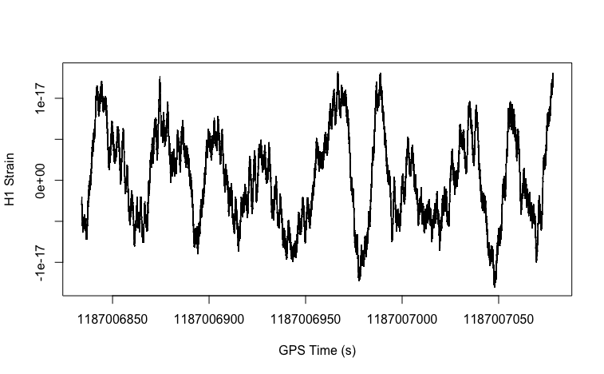

# Big Data Lab 2. Формат HDF5. 
1. Завантажте файл з даними за посиланням
https://dcc.ligo.org/public/0146/P1700337/001/H-H1_LOSC_C00_4_V1-1187006834-4096.hdf5
    ```R
    download.file("https://dcc.ligo.org/public/0146/P1700337/001/H-H1_LOSC_C00_4_V1-1187006834-4096.hdf5","l2.hdf5", "auto", TRUE,"wb")
    ```
   
2. Встановить в R пакет для роботи з HDF5 файлами.
    ```R
    install.packages("BiocManager")
    BiocManager::install("rhdf5")
    library(rhdf5)
    ```
   
3. Виведіть зміст файлу командою h5ls().
    ```R
    h5ls("l2.hdf5")
    ```
    
    ```cmd
                     group            name       otype  dclass      dim
    0                    /            meta   H5I_GROUP                 
    1                /meta     Description H5I_DATASET  STRING    ( 0 )
    2                /meta  DescriptionURL H5I_DATASET  STRING    ( 0 )
    3                /meta        Detector H5I_DATASET  STRING    ( 0 )
    4                /meta        Duration H5I_DATASET INTEGER    ( 0 )
    5                /meta        GPSstart H5I_DATASET INTEGER    ( 0 )
    6                /meta     Observatory H5I_DATASET  STRING    ( 0 )
    7                /meta            Type H5I_DATASET  STRING    ( 0 )
    8                /meta        UTCstart H5I_DATASET  STRING    ( 0 )
    9                    /         quality   H5I_GROUP                 
    10            /quality          detail   H5I_GROUP                 
    11            /quality      injections   H5I_GROUP                 
    12 /quality/injections InjDescriptions H5I_DATASET  STRING        5
    13 /quality/injections   InjShortnames H5I_DATASET  STRING        5
    14 /quality/injections         Injmask H5I_DATASET INTEGER     4096
    15            /quality          simple   H5I_GROUP                 
    16     /quality/simple  DQDescriptions H5I_DATASET  STRING        7
    17     /quality/simple    DQShortnames H5I_DATASET  STRING        7
    18     /quality/simple          DQmask H5I_DATASET INTEGER     4096
    19                   /          strain   H5I_GROUP                 
    20             /strain          Strain H5I_DATASET   FLOAT 16777216
    ```
4. Зчитайте результати вимірів. Для цього зчитайте name Strain з групи strain
в змінну strain. Після зчитування не забувайте закривати файл командою
H5Close().
    ```R
    h5f = H5Fopen("l2.hdf5")
    strain <- h5f$"/strain/Strain"
    H5close()
    strain
    ```
    
    ```cmd
    [1] -2.391646e-18 -2.411660e-18 -2.427382e-18 -2.426351e-18 -2.427996e-18 -2.446291e-18 -2.462962e-18
       [8] -2.463456e-18 -2.464039e-18 -2.481933e-18 -2.499762e-18 -2.499653e-18 -2.499740e-18 -2.514827e-18
      [15] -2.534504e-18 -2.539017e-18 -2.534552e-18 -2.547276e-18 -2.567941e-18 -2.573345e-18 -2.569082e-18
      [22] -2.580038e-18 -2.601175e-18 -2.606781e-18 -2.602693e-18 -2.610871e-18 -2.633490e-18 -2.643470e-18
      [29] -2.636836e-18 -2.644074e-18 -2.664256e-18 -2.672044e-18 -2.668297e-18 -2.674602e-18 -2.694475e-18
      ...
    ```
5. Також з «strain/Strain» зчитайте атрибут (функція h5readAttributes)
Xspacing в змінну st та виведіть її. Це інтервал часу між вимірами.
    ```R
    h5f = H5Fopen("l2.hdf5")
    attrs = h5readAttributes(h5f, "strain/Strain")
    st <- attrs$Xspacing
    H5close()
    st
    
    ```
   
    ```cmd
    
    [1] 0.0002441406
    ```
6. Знайдіть час початку події та її тривалість. Для цього з групи meta зчитайте
в змінну gpsStart name GPSstart та в змінну duration name Duration.
    ```R
    h5f = H5Fopen("l2.hdf5")
    gpsStart <- h5f$"meta/GPSstart"
    duration <- h5f$"meta/Duration"
    H5close()
    ```
    
    ```cmd
    > gpsStart
    [1] 1187006834
    > duration
    [1] 4096
    ```
7. Знайдіть час закінчення події та збережіть його в змінну gpsEnd.
    ```R
    gpsEnd = gpsStart + duration
    ```
    
    ```cmd
    > gpsEnd
    [1] 1187010930
    ```
8. Створіть вектор з часу вимірів і збережіть у змінну myTime. Початок
послідовності – gpsStart, кінець – gpsEnd, крок – st.
    ```R
    myTime <- seq(gpsStart, gpsEnd , st)
    ```
    
    ```cmd
    > myTime
       [1] 1187006834 1187006834 1187006834 1187006834 1187006834 1187006834 1187006834 1187006834 1187006834 1187006834
      [11] 1187006834 1187006834 1187006834 1187006834 1187006834 1187006834 1187006834 1187006834 1187006834 1187006834
      ......

    ```
9. Побудуємо графік тільки для першого мільйону вимірів. Для цього створіть
змінну numSamples, яка дорівнює 1000000.
    ```R
    > numSamples = 1000000
    ```
    
    ```cmd
    > numSamples
    [1] 1e+06
    ```
10. Побудуйте графік за допомогою функції `plot(myTime[0:numSamples], strain[0:numSamples], type = "l", xlab = "GPS Time (s)", ylab = "H1 Strain")`
    ```R
    plot(myTime[0:numSamples], strain[0:numSamples], type = "l", xlab = "GPS Time (s)", ylab = "H1 Strain")
    ```
    
    
 
